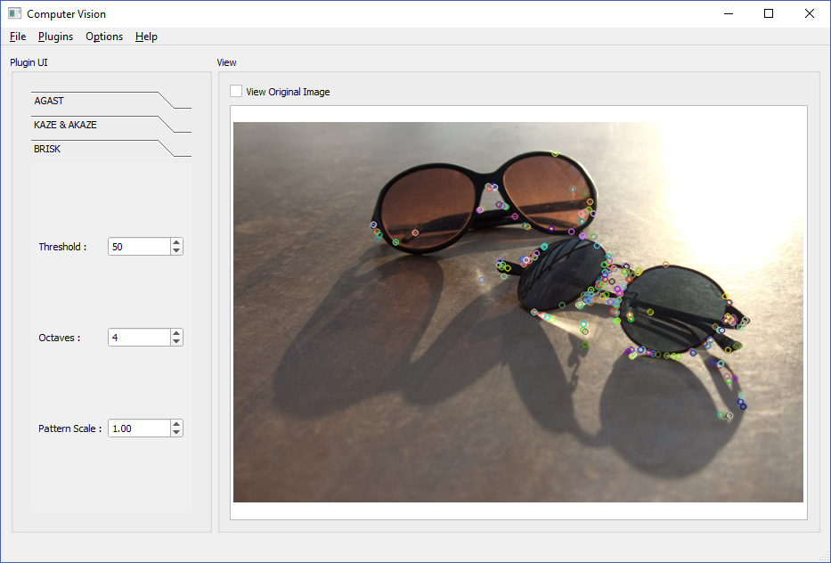

<div align="center">
<p>
 
 <p align="center"><b><font size=6>OpenCV</font></b></p>
 <p align="center"><b>【🔧更新中🔧】基于 Qt 和 OpenCV 的计算机视觉示例实现及教程</b></p>
</p>


[](LICENSE)


<div align="left">
<!-- 顶部至此截止 -->
<!-- SPbSTU 报告起始 -->
> [!note]
>
> **如果你想系统的学习 Qt，可以参考这个仓库：**
>
> 关于 [Qt 无比详细教程及案例实现](https://github.com/NekoSilverFox/Qt)：https://github.com/NekoSilverFox/Qt 其中不仅涵盖了 Qt 基本控件的使用及讲解，还包含了大学和培训机构不会讲到的：插件设计及实现、基于 QTest 的静态动态、动态测试、CI/CD的使用、Qt 函数/方法注意事项、Qt 的神奇技巧等~
>
> 祝你在学习道路上一帆风顺！！


[toc]

> 如果你不了解 Qt 这个框架，建议先学习：
>
> - 关于 Qt 无比详细教程及案例实现：[https://github.com/NekoSilverFox/Qt](https://github.com/NekoSilverFox/Qt)
>     其中不仅涵盖了 Qt 基本控件的使用及讲解，还包含了大学和培训机构不会讲到的：插件设计及实现、基于 QTest 的静态动态、动态测试、CI/CD的使用、Qt 函数/方法注意事项等
>
> 
>
> 如果你对 OpenGL 计算机图形学感兴趣：
>
> - 基于 Qt & OpenGL 的案例实现及详细教程：[https://github.com/NekoSilverFox/OpenGL](https://github.com/NekoSilverFox/OpenGL

# 前言

> 参考：
>
> 原文：[Computer Vision with OpenCV 3 and Qt5](https://1lib.org/book/3427589/3c1476)
>
> https://github.com/apachecn/apachecn-cv-zh/blob/0f2e14ca582d398ba3be22a1fff949077f4c85c0/docs/cv-opencv3-qt5
>
> 
>
> 原文：[Qt 5 and OpenCV 4 Computer Vision Projects](https://1lib.org/book/5220725/d23493)
>
> https://github.com/apachecn/apachecn-cv-zh/tree/0f2e14ca582d398ba3be22a1fff949077f4c85c0/docs/qt5-opencv4-cv-proj

只要环顾四周，就很可能会看到至少两个不同的设备，例如计算机，智能手机，智能手表或平板电脑，上面运行着一些应用，可以帮助您完成各种日常任务或娱乐音乐，看电影 ，视频游戏等。 每年，市场上都会引入数百种新设备，并且需要新版本的操作系统来跟上它们，以便为应用开发人员提供更好的界面，以创建可更好地利用诸如高分辨率等基础资源的软件。 显示器，各种传感器等。 结果，软件开发框架必须适应并支持不断增长的平台。 考虑到这一点，Qt 可能是同时提供功能，速度，灵活性和易用性的最成功的**跨平台**软件开发框架之一，在创建需要以下功能的软件时，它是首选。 在各种平台上都具有吸引力和一致性。

近年来，特别是随着功能更强大的处理器以较低的价格出现，台式计算机及其手持式对等设备的角色已转向执行更苛刻和更复杂的任务，例如计算机视觉。 无论是用于智能电影或照片编辑，保护敏感建筑物，对生产线中的物体计数，还是通过自动驾驶汽车检测交通标志，车道或行人，计算机视觉正越来越多地用于解决此类实时问题。 曾经只能由人类解决的问题。 这是 OpenCV 框架进入现场的地方。 在过去的几年中，OpenCV 已成长为功能完善的跨平台计算机视觉框架，其重点是速度和性能。 在世界各地，开发人员和研究人员都在使用 OpenCV 来实现其计算机视觉应用的思想和算法。

本书旨在帮助您掌握 Qt 和 OpenCV 框架的基本概念，使您轻松地自己继续开发和交付跨多种平台的计算机视觉应用。 能够轻松遵循本书所涵盖主题的唯一假设是，您熟悉并熟悉 C++ 编程概念，例如类，模板，继承等。 即使整本书中涵盖的教程，屏幕截图和示例都是基于 Windows 操作系统的，但仍会在必要时提及 MacOS 和 Linux 操作系统的区别。


**这本书是给谁的**

本书面向有兴趣构建计算机视觉应用的读者。 期望具备 C++ 编程的中级知识。 即使没有 Qt5 和 OpenCV 3 知识，但如果您熟悉这些框架，您也会受益


**本书涵盖的内容**

- **第1章，OpenCV和Qt简介**
    介绍了所有必要的初始化步骤。从在哪里以及如何获取Qt和OpenCV框架开始，本章将描述如何安装、配置，以及确保你的开发环境设置正确。

- **第2章，创建我们的第一个Qt和OpenCV项目**
    带领你通过Qt Creator IDE，我们将使用它开发我们所有的应用程序。在本章中，你将学习如何创建和运行你的应用程序项目。

- **第3章，创建一个全面的Qt+OpenCV项目**
    通过最常见的功能需求，为一个全面的应用程序，包括样式、国际化、支持各种语言、插件等。通过这个过程，我们将自己创建一个全面的计算机视觉应用程序。

- **第4章，Mat和QImage**
    奠定基础并教你编写计算机视觉应用程序所需的基本概念。在这一章中，你将了解所有关于OpenCV Mat类和Qt QImage类，如何在两个框架之间转换和传递它们，以及更多。

- **第5章，图形视图框架**
    教你如何使用Qt Graphics View框架及其底层类，以便在应用程序中轻松高效地显示和操作图形。

- **第6章，OpenCV中的图像处理**
    带你了解OpenCV框架提供的图像处理功能。你将学习关于变换、过滤器、颜色空间、模板匹配等。

- **第7章，特征和描述符**
    全面讲解从图像中检测关键点，从关键点提取描述符，并将它们相互匹配。在本章中，你将学习各种关键点和描述符提取算法，并使用它们来检测和定位图像中的已知对象。

- **第8章，多线程**
    教你Qt框架提供的所有关于多线程的能力。你将学习关于互斥锁、读写锁、信号量和各种线程同步工具。这章还会教你关于Qt中低级（QThread）和高级（QtConcurrent）多线程技术。

- **第9章，视频分析**
    覆盖了使用Qt和OpenCV框架正确处理视频的方法。你将学习使用MeanShift和CAMShift算法进行对象跟踪等视频处理功能。本章还包括视频处理的所有基本和必要概念的综合概述，如直方图和反向投影图像。

- **第10章，调试和测试**
    带你了解Qt Creator IDE的调试功能，以及它是如何配置和设置的。在本章中，你还将学习Qt框架提供的单元测试能力，通过编写示例单元测试，这些测试可以手动或每次项目构建时自动运行。

- **第11章，链接和部署**
    教你动态或静态地构建OpenCV和Qt框架。在这一章中，你还将学习在各种平台上部署Qt和OpenCV应用程序。在本章的最后，我们将使用Qt Installer Framework创建一个安装程序。

- **第12章，Qt Quick应用程序**
    介绍你Qt Quick应用程序和QML语言。在本章中，你将学习QML语言语法，以及如何与Qt Quick Designer一起使用它来为桌面和移动平台创建漂亮的Qt Quick应用程序。你还将学习在本章中整合QML和C++。


**为了充分利用本书**

尽管书的初章已经涵盖了每一个所需的工具和软件、正确的版本，以及它们是如何被安装和配置的，以下是一个可以作为快速参考的列表：

- 一台安装了最新版本Windows、macOS或Linux（例如Ubuntu）操作系统的常规计算机。
- 微软Visual Studio（在Windows上）
- Xcode（在macOS上）
- CMake
- Qt框架
- OpenCV框架


**下载示例代码文件**

你可以从你在www.packtpub.com的账户下载本书的示例代码文件。如果你是在别处购买的这本书，你可以访问www.packtpub.com/support并注册，以直接将文件通过电子邮件发送给你。
你可以按照以下步骤下载代码文件：

1. 在www.packtpub.com登录或注册。
2. 选择SUPPORT标签。
3. 点击Code Downloads & Errata。
4. 在搜索框中输入书名并按照屏幕上的指示操作。

一旦文件下载完成，请确保你使用最新版本的以下软件解压或提取文件夹：

- 对于Windows，使用WinRAR/7-Zip
- 对于Mac，使用Zipeg/iZip/UnRarX
- 对于Linux，使用7-Zip/PeaZip

本书的代码包也托管在GitHub上 https://github.com/PacktPublishing/Computer-Vision-with-OpenCV-3-and-Qt5。我们也在https://github.com/PacktPublishing/ 上提供了我们丰富的图书和视频目录中的其他代码包。去看看吧！


**下载彩色图片**

我们还提供了一个PDF文件，其中包含了本书使用的截图/图表的彩色图片。你可以在这里下载它：[https://www.packtpub.com/sites/default/files/downloads/ComputerVisionwithOpenCV3andQt5_ColorImages.pdf](https://www.packtpub.com/sites/default/files/downloads/ComputerVisionwithOpenCV3andQt5_ColorImages.pdf)


**使用的约定**

本书中使用了多种文本约定。

- `CodeInText`：表示文中的代码词汇、数据库表名、文件夹名称、文件名、文件扩展名、路径名、虚构的URL、用户输入和Twitter句柄。这里有一个例子："`QApplication`类是负责控制应用程序的控制流、设置等的主类。"

- 代码块如下所示：

    ```cpp
    #include "mainwindow.h"
    #include <QApplication>
    int main(int argc, char *argv[])
    {
        QApplication a(argc, argv);
        MainWindow w;
        w.show();
        return a.exec();
    }
    ```

- 当我们希望把你的注意力吸引到代码块的特定部分时，相关的行或项将以**加粗**形式展示：

    ```cpp
    #include "mainwindow.h"
    #include <QApplication>
    int main(int argc, char *argv[])
    {
        QApplication a(argc, argv);
        MainWindow w;
        **w.show();**
        return a.exec();
    }
    ```

- 任何命令行输入或输出如下所写：

    ```
    binarycreator -p packages -c config.xml myinstaller
    ```

- **加粗**：表示一个新术语、一个重要词汇或你在屏幕上看到的词汇。例如，菜单或对话框中的词汇在文本中如此显示。这里有一个例子："点击`Next`按钮将你移动到下一个屏幕。"


# 第一章、OpenCV 和 Qt 简介

在其最基本的形式和结构中，计算机视觉是一个术语，用来识别所有用于赋予数字设备视觉感知能力的方法和算法。这意味着什么？嗯，这确实意味着它听起来的样子。理想情况下，计算机应该能够通过标准摄像机的镜头（或任何其他类型的摄像机）看到世界，并通过应用各种计算机视觉算法，它们应该能够检测到人脸，甚至识别它们，在图像中计数物体，检测视频流中的运动等等，这些起初可能只被期望人类能够做到。因此，要了解计算机视觉真正是什么，最好了解计算机视觉旨在开发实现所提到的理想的方法，赋予数字设备看到和理解周围环境的能力。值得注意的是，大多数情况下，计算机视觉和图像处理是可以互换使用的（尽管，对该主题的历史研究可能证明应该有所不同）。但无论如何，在本书中，我们将坚持使用计算机视觉这个术语，因为这是当今计算机科学社区中更受欢迎和广泛使用的术语，而且正如我们将在本章后面看到的那样，**图像处理是 OpenCV 库的一个模块**，我们将在本章的接下来的页面中介绍它，并且它也将在一个完整的章节中进行详细介绍。

计算机视觉是当今计算机科学中最受欢迎的主题之一，它被应用于各种应用程序中，从检测癌组织的医疗工具到帮助制作所有那些闪亮音乐视频和电影的视频编辑软件，再到军用级别的目标检测器，帮助在地图上找到特定位置，以及帮助无人驾驶汽车找到路线的交通标志检测器。嗯，很明显我们无法列出计算机视觉的所有可能性，但我们可以肯定它是一个有趣的主题，将在很长一段时间内存在。还值得一提的是，计算机视觉领域的工作和职业市场正在迅速扩展，而且正在日益增长。

在计算机视觉开发人员和专家中最受欢迎的工具中，有两个最突出的开源框架，它们也是您手头书籍的标题中的两个框架，即 OpenCV 和 Qt。每天，全世界成千上万的开发人员，从成熟的公司到创新的初创公司，都在使用这两个框架来为各种行业构建应用程序，比如我们提到的那些行业，而这正是您将在本书中学到的内容。

在本章中，我们将涵盖以下主题：

- 介绍 Qt，一个开源的跨平台应用程序开发框架
- 介绍 OpenCV，一个开源的跨平台计算机视觉框架
- 【省略】如何在 Windows、macOS 和 Linux 操作系统上安装 Qt
- 如何从源代码构建 OpenCV 在 Windows、macOS 和 Linux 操作系统上
- 配置您的开发环境以构建使用 Qt 和 OpenCV 框架的应用程序
- 使用 Qt 和 OpenCV 构建您的第一个应用程序


**需要什么：**

这是在本章介绍中提到的最明显的问题，但对它的回答也是我们学习计算机视觉的第一步。本书面向熟悉 C++ 编程语言并希望在不费力气的情况下开发强大且外观优美的计算机视觉应用程序的开发人员。本书旨在通过不同的计算机视觉主题带领您进行一场充满乐趣的旅程，重点放在实践练习和逐步开发您所学内容上。

任何有足够 C++ 经验的人都知道，使用原始的 C++ 代码并依赖于特定于操作系统的 API 来编写视觉丰富的应用程序并不是一件容易的任务。因此，几乎每个 C++ 开发人员（或至少是在 C++ 领域有积极职业生涯的严肃开发人员）都会使用一个或多个框架来简化这个过程。在为 C++ 开发的最广泛知名的框架中，Qt 是其中之一。事实上，如果不是最佳选择，那么它肯定是*其中之一*的最佳选择。另一方面，如果您的目标是开发处理图像或可视化数据集的应用程序，那么 OpenCV 框架可能是您首选的第一个（也许是最受欢迎的）地址。因此，这就是本书专注于 Qt 和 OpenCV 结合使用的原因。开发适用于不同桌面和移动平台的计算机视觉应用程序，以最高可能的性能运行，这是不可能的，而不使用像 Qt 和 OpenCV 这样的强大框架的组合。

总结所说的，确保您至少具有 C++ 编程语言的中级水平知识。如果诸如类、抽象类、继承、模板或指针等术语对您来说听起来很陌生，那么考虑先阅读一本关于 C++ 的书籍。对于所有其他涉及的主题，特别是所有涉及的实践主题，本书承诺为所有包含的示例和教程提供清晰明了的解释（或指向特定文档页面的引用）。当然，要详细深入地了解 Qt 和 OpenCV 中的模块和类是如何实现的，您需要熟悉更多的资源、研究，有时甚至是硬核的数学计算或对计算机或操作系统在现实世界中执行的低级理解，这完全超出了本书的范围。然而，对于本书涵盖的所有算法和方法，您将得到它们是什么，如何以及何时何地使用它们的简要描述，以及足够的指导，让您如果愿意的话可以继续深入挖掘。


## Qt 简介

你可能已经听说过它，甚至在不知情的情况下使用过它。它是许多世界著名的商业和开源应用程序的基础，例如 VLC 播放器、Calibre 等等。Qt 框架被所谓的财富 500 强公司的大多数公司使用，我们甚至无法开始定义它在世界上许多应用程序开发团队和公司中的广泛使用和受欢迎程度。因此，我们将从介绍开始，然后逐步深入。

首先，让我们通过对 Qt 框架的简要介绍来使我们站稳脚跟。没有什么比在脑海中清晰地描绘整个框架更能让您感到舒适的了。所以，我们开始吧，目前由 The Qt Company 构建和管理，Qt 框架是一个开源应用程序开发框架，被广泛用于创建视觉丰富且跨平台的应用程序，这些应用程序可以在不同的操作系统或设备上非常轻松地运行，甚至几乎不需要任何努力。进一步分解，开源是其中最明显的部分。这意味着您可以访问 Qt 的所有源代码。所谓的视觉丰富，是指 Qt 框架中具有足够的资源和功能，可以编写非常漂亮的应用程序。至于最后一部分，跨平台，这基本上意味着，如果您使用 Qt 框架模块和类为 Microsoft Windows 操作系统开发应用程序，那么它可以像原样编译和构建为 macOS 或 Linux，而无需更改一行代码（几乎），前提是您的应用程序不使用任何非 Qt 或特定于平台的库。

在编写本书时，Qt 框架（从现在起简称为 Qt）的版本是 5.9.X，它包含许多模块，几乎可以用于开发应用程序的任何目的。**Qt 将这些模块划分为以下四个主要类别：**

- **Qt Essentials**
- **Qt Add-Ons**
- **Value-Add Modules**
- **Technology Preview Modules**

让我们看看它们是什么以及它们包含了什么，因为我们将在本书中经常处理它们。

### Qt Essentials

这些是 **Qt 所承诺在所有支持的平台上可用的模块**。它们基本上是 **Qt 的基础**，包含了几乎所有 Qt 应用程序使用的大多数类。要真正关注 *通用* 这两个词，因为这正是这些模块的用途。以下是现有模块的快速研究和以后参考的简要列表：

| 模块                                                         | 描述                                                         |
| ------------------------------------------------------------ | ------------------------------------------------------------ |
| [Qt Core](http://doc.qt.io/qt-5/qtcore-index.html)           | 这些是其他模块使用的核心非图形类。                           |
| [Qt GUI](http://doc.qt.io/qt-5/qtgui-index.html)             | 这些是用于图形用户界面 (GUI) 组件的基本类。包括 OpenGL。     |
| [Qt Multimedia](http://doc.qt.io/qt-5/qtmultimedia-index.html) | 这些是用于音频、视频、收音机和摄像头功能的类。               |
| [Qt Multimedia Widgets](http://doc.qt.io/qt-5/qtmultimediawidgets-index.html) | 这些是基于窗口小部件的类，用于实现多媒体功能。               |
| [Qt Network](http://doc.qt.io/qt-5/qtnetwork-index.html)     | 这些是使网络编程更轻松和更可移植的类。                       |
| [Qt QML](http://doc.qt.io/qt-5/qtqml-index.html)             | 这些是用于 QML 和 JavaScript 语言的类。                      |
| [Qt Quick](http://doc.qt.io/qt-5/qtquick-index.html)         | 这是一个声明性框架，用于构建具有自定义用户界面的高度动态的应用程序。 |
| [Qt Quick Controls](http://doc.qt.io/qt-5/qtquickcontrols-index.html) | 这些是基于 Qt Quick 的可重用 UI 控件，用于创建经典的桌面风格用户界面。 |
| [Qt Quick Dialogs](http://doc.qt.io/qt-5/qtquickdialogs-index.html) | 这些是用于从 Qt Quick 应用程序创建和与系统对话框交互的类型。 |
| [Qt Quick Layouts](http://doc.qt.io/qt-5/qtquicklayouts-index.html) | 这些布局是用于在用户界面中排列基于 Qt Quick 2 的项目的项目。 |
| [Qt SQL](http://doc.qt.io/qt-5/qtsql-index.html)             | 这些是用于使用 SQL 进行数据库集成的类。                      |
| [Qt Test](http://doc.qt.io/qt-5/qttest-index.html)           | 这些是用于对 Qt 应用程序和库进行单元测试的类。               |
| [Qt Widgets](http://doc.qt.io/qt-5/qtwidgets-index.html)     | 这些是用于扩展 Qt GUI 的 C++ 窗口小部件类。                  |

要获取更多信息，请参阅 http://doc.qt.io/qt-5/qtmodules.html。

请注意，涵盖本书中的所有模块和所有类可能是不可能的，也许也不是一个好主意。在大多数情况下，我们将坚持使用我们需要的模块和类

### Qt 附加模块

这些模块可能在所有平台上可用，也可能不可用。这意味着它们用于开发特定功能，而不是 Qt Essentials 的通用性质。这些类型模块的一些示例包括 Qt 3D、Qt 打印支持、Qt WebEngine、Qt 蓝牙等等。您始终可以参考 Qt 文档以获取这些模块的完整列表，实际上，它们太多了，无法在此列出。大多数情况下，您只需简单浏览一下，就可以对模块的用途有一个简要的了解。

要获取更多信息，您可以参考 http://doc.qt.io/qt-5/qtmodules.html。

### 价值增值模块

这些模块提供额外的功能，并通过 Qt 提供商提供商业许可证。是的，你猜对了，这些模块只在 Qt 的付费版本中可用，并且不在 Qt 的开源和免费版本中提供，但它们大多数旨在帮助完成本书目的中根本不需要的非常具体的任务。您可以使用 Qt 文档页面获取列表。

要获取更多信息，您可以参考 http://doc.qt.io/qt-5/qtmodules.html。

### 技术预览模块

正如其名称所示，这些模块通常以不保证对所有情况都有效的状态提供；它们可能包含错误或其他问题，而且它们仍在开发中，作为测试和反馈目的的预览提供。一旦模块开发并足够成熟，它就会在前面提到的其他类别中提供，并从技术预览类别中移除。在撰写本书时，这些类型的模块的一个示例是 Qt Speech，它是一个旨在为 Qt 应用程序添加文本到语音支持的模块。如果您希望成为一名完全合格的 Qt 开发人员，随时关注这些模块总是一个好主意。

要获取更多信息，您可以参考 http://doc.qt.io/qt-5/qtmodules.html。

### Qt 支持的平台

当我们谈论开发应用程序时，平台可能有许多不同的含义，包括操作系统类型、操作系统版本、编译器类型、编译器版本和处理器架构（32 位、64 位、Arm 等）。Qt 支持许多（如果不是全部）著名的平台，并且通常在发布新平台时能够迅速跟上。以下是在撰写本书时（Qt 5.9）由 Qt 支持的平台列表。请注意，您可能不会使用这里提到的所有平台，但它让您了解 Qt 真正的强大和跨平台性质：

参考：http://doc.qt.io/qt-5/supported-platforms.html

正如您将在接下来的章节中看到的那样，我们将在 Windows 上使用 Microsoft Visual C++ 2015（或从这里简称为 MSVC 2015）编译器，因为 Qt 和 OpenCV（您将在后面学习到）都高度支持它。我们还将在 Linux 上使用 GCC，在 macOS 操作系统上使用 Clang。所有这些工具要么是免费且开源的，要么是由操作系统提供者提供的。尽管我们的主要开发系统将是 Windows，但在 Windows 和其他版本之间存在差异时，我们将涵盖 Linux 和 macOS 操作系统。因此，本书中的默认截图将是 Windows 的截图，而在 Windows 和其他版本之间存在明显差异而不仅仅是路径、按钮颜色等方面的细微差别时，我们将提供 Linux 和 macOS 的截图。

## Qt Creator

Qt Creator 是用于开发 Qt 应用程序的 **IDE** (**集成开发环境**) 的名称。它也是我们在本书中将用来创建和构建项目的 IDE。值得注意的是，Qt 应用程序可以使用任何其他 IDE（例如 Visual Studio 或 Xcode）来创建，并且 **Qt Creator 不是构建 Qt 应用程序的必需品，但它是一个轻量级且功能强大的 IDE**，默认情况下随 Qt Framework 安装程序一起提供。因此，它最大的优势在于与 Qt 框架的轻松集成。

以下是 Qt Creator 的截图，显示了 IDE 的代码编辑模式。关于如何使用 Qt Creator 的详细信息将在下一章中介绍，尽管我们将在本章稍后的一些测试中尝试使用它，但不会过多地详细介绍它：


## OpenCV 简介

现在，是时候介绍 OpenCV，即**开源计算机视觉库**，或者如果您愿意的话，也可以称之为**框架**，因为 OpenCV 本身会互换使用它们，在本书中也可能会发生这种情况。但是，在大多数情况下，我们将简单地坚持使用 OpenCV。好的，让我们先听听它到底是什么，然后在需要的地方进行详细说明。

OpenCV 是一个**开源跨平台库**，用于开发计算机视觉应用程序。它**专注于速度和性能**，并包含了许多算法在各种模块中。这些模块也分为两种类型：主要模块和额外模块。主要的 OpenCV 模块简单地是指 OpenCV 社区内建立和维护的所有模块，它们是 OpenCV 提供的默认包的一部分。

这与 OpenCV 的额外模块形成对比，后者多多少少是第三方库的包装器和接口，用于将它们集成到 OpenCV 构建中。以下是一些不同模块类型的示例，并附有简要说明。值得注意的是，随着时间的推移，OpenCV 中的模块数量（有时甚至顺序）可能会发生变化，因此要牢记的关于这一点的最佳方法就是只需访问 OpenCV 文档页面，每当有些事情似乎不合时宜时，或者如果某些东西不在原来的位置时。

### 主要模块

以下是一些 OpenCV 主要模块的示例。请注意，它们只是 OpenCV 中的一小部分（可能是最常用的部分），覆盖所有模块超出了本书的范围，但了解 OpenCV 包含的内容是有意义的，就像本章前面看到的 Qt 一样。这里它们是：

- **核心功能或简称为`core`模块**包含所有其他 OpenCV 模块使用的所有基本结构，常量和函数。 例如，在此模块中定义 OpenCV `Mat`类，在本书的其余部分中，我们几乎将在每个 OpenCV 示例中使用该类。 第 4 章，“`Mat`和`QImage`”将涵盖这个模块以及与之密切相关的 OpenCV 模块以及 Qt 框架的相应部分。
- **图像处理或`imgproc`模块**包含许多用于图像过滤，图像转换的算法，顾名思义，它用于**一般图像处理**。 我们将在第 6 章，“OpenCV 中的图像处理”中介绍此模块及其功能。
- **2D 特征框架模块或`features2d`包含用于特征提取和匹配的类和方法**。 它们将在第 7 章，“特征和描述符”中进行详细介绍。
- **视频模块**包含用于主题的算法，例如运动估计，背景减法和跟踪。 该模块以及 OpenCV 的其他类似模块，将在第 9 章，“视频分析”中介绍。

### 额外模块

正如之前提到的，**额外模块**主要是第三方库的包装器，这意味着它们只包含用于集成这些模块的接口或方法。一个例子是文本模块。该模块包含用于在图像中使用文本检测或 **OCR** (**光学字符识别**) 的接口，您还将需要这些第三方模块，它们不作为本书的一部分进行涵盖，但您可以随时查看 OpenCV 文档以获取更新的额外模块列表以及它们的使用方法。

有关更多信息，请参阅 http://docs.opencv.org/master/index.html。

**OpenCV 支持的平台**：如前所述，在应用程序开发中，平台不仅仅是操作系统。因此，我们需要知道 OpenCV 支持哪些操作系统、处理器架构和编译器。OpenCV 是高度跨平台的，几乎与 Qt 类似，您可以为所有主要操作系统（包括 Windows、Linux、macOS、Android 和 iOS）开发 OpenCV 应用程序。稍后我们将看到，我们将在 Windows 上使用 MSVC 2015 (32 位) 编译器，在 Linux 上使用 GCC，在 macOS 上使用 Clang。还要注意，我们将需要自己使用其源代码构建 OpenCV，因为目前并没有为上述编译器提供预构建的二进制文件。然而，稍后您将看到，如果您有正确的工具和说明，OpenCV 对于任何操作系统都相当容易构建。

## 安装 OpenCV

在本章的这一部分，您将学习如何使用其源代码构建 OpenCV。正如您稍后将看到的，并与本节的标题相反，我们并没有像在Qt安装中那样真正“安装”OpenCV。这是因为 **OpenCV 通常不提供针对所有编译器和平台的预构建二进制文件**，事实上，它根本不为 macOS 和 Linux 提供预构建二进制文件。在最新的 OpenCV Win 包中，只包含了针对 MSVC 2015 64 位的预构建二进制文件，这与我们将要使用的 32 位版本不兼容，因此学习如何自己构建 OpenCV 是一个非常好的主意。这也有利于构建适合您需求的 OpenCV 框架库。您可能希望排除一些选项以使您的 OpenCV 安装更轻量化，或者您可能希望为其他编译器（如 MSVC 2013）构建。因此，有很多理由自己从源代码构建 OpenCV。

### 准备构建 OpenCV

互联网上大多数开源框架和库，或者至少那些希望保持 IDE 中立的项目（这意味着可以使用任何 IDE 配置和构建的项目，不依赖于特定 IDE 即可工作的项目），使用 CMake 或类似的所谓“构建”系统。我想这也回答了诸如“我为什么需要 CMake？”、“他们为什么不直接给出库并完成呢？”或类似这样的问题。因此，我们需要 CMake 能够使用源代码配置和构建 OpenCV。CMake 是一个开源的跨平台应用程序，允许配置和构建开源项目（或应用程序、库等），您可以在之前的章节中提到的所有操作系统上下载和使用它。在撰写本书的时候，CMake 版本 3.9.1 可以从 CMake 网站下载页面 ([https://cmake.org/download/](https://cmake.org/download/)) 下载。

在继续之前，请确保在计算机上下载并安装它。CMake 安装没有特别需要注意的地方，除了您应该确保安装 GUI 版本，因为这是我们将在下一节中使用的版本，也是提供的链接中的默认选项。

### 获取 OpenCV？

OpenCV 在其网站的 Releases 页面维护其官方和稳定的发布版本 ([http://opencv.org/releases.html](http://opencv.org/releases.html))：


在这里，您始终可以找到适用于 Windows，Android 和 iOS 的最新版本的 OpenCV 源代码，文档和预构建的二进制文件。 随着新版本的发布，它们会添加到页面顶部。 在撰写本书时，版本 3.3.0 是 OpenCV 的最新版本，这就是我们将使用的版本。 因此，事不宜迟，您应该继续进行操作，并通过单击 3.3.0 版的“源”链接来下载源。 将`source zip`文件下载到您选择的文件夹中，将其提取出来，并记下提取的路径，因为稍后我们将使用它。

### 如何构建？

现在，我们拥有构建 OpenCV 所需的所有工具和文件，我们可以通过运行 CMake GUI 应用来启动该过程。 如果正确安装了 CMake，则应该能够从桌面，开始菜单或扩展坞运行它，具体取决于您的操作系统。

Linux 用户应在终端中运行以下命令，然后再继续进行 OpenCV 构建。 这些基本上是 OpenCV 本身的依赖关系，需要在配置和构建它之前就位：

```cpp
sudo apt-get install libgtk2.0-dev and pkg-config 
```

**运行 CMake GUI 应用后，需要设置以下两个文件夹：**

*   “源代码在哪里”文件夹应设置为您下载和提取 OpenCV 源代码的位置
*   可以将“生成二进制文件的位置”文件夹设置为任何文件夹，但是通常在源代码文件夹下创建一个名为`build`的子文件夹并将其选择为二进制文件文件夹

设置这两个文件夹后，您可以通过单击“配置”按钮继续前进，如以下屏幕截图所示：


单击配置按钮将启动配置过程。 如果构建文件夹尚不存在，可能会要求您创建该文件夹，您需要通过单击“是”按钮来对其进行回答。 如果您仍然觉得自己只是在重复书中的内容，请不要担心。 当您继续阅读本书和说明时，所有这些都会陷入。 现在，让我们仅关注在计算机上构建和安装 OpenCV。 考虑到此安装过程并不像单击几个“下一步”按钮那样简单，并且一旦开始使用 OpenCV，一切都会变得有意义。 因此，在接下来出现的窗口中，选择正确的生成器，然后单击“完成”。 

---

有关每个操作系统上正确的生成器类型，请参阅以下说明：

**Windows 用户**：您需要选择`Visual Studio 142015`。请确保您未选择 ARM 或 Win64 版本或其他 Visual Studio 版本。

---

**MacOS 和 Linux 用户**：您需要选择`Unix Makefile`。

您将在 CMake 中看到一个简短的过程，完成后，您将能够设置各种参数来配置您的 OpenCV 构建。 有许多参数需要配置，因此我们将直接影响那些直接影响我们的参数。

**确保选中`BUILD_opencv_world`选项旁边的复选框。 这将允许将所有 OpenCV 模块构建到单个库中。** 因此，如果您使用的是 Windows，则只有一个包含所有 OpenCV 功能的 DLL 文件。 正如您将在后面看到的那样，当您要部署计算机视觉应用时，这样做的好处是仅使用一个 DLL 文件即可。 当然，这样做的明显缺点是您的应用安装程序的大小会稍大一些。 但是同样，易于部署将在以后证明更加有用。

更改构建参数后，您需要再次单击“配置”按钮。 等待重新配置完成，最后单击“生成”按钮。 这将使您的 OpenCV 内部版本可以编译。 


在下一部分中，如果使用 Windows，MacOS 或 Linux 操作系统，则需要执行一些不同的命令。 因此，它们是：

---

**Windows 用户**：转到您先前在 CMake 中设置的 OpenCV 构建文件夹（在我们的示例中为`c:\dev\opencv\build`）。 应该有一个 Visual Studio 2015 解决方案（即 MSVC 项目的类型），您可以轻松地执行和构建 OpenCV。 您也可以立即单击 CMake 上“生成”按钮旁边的“打开项目”按钮。 您也可以只运行 Visual Studio 2015 并打开您刚为 OpenCV 创建的解决方案文件。

打开 Visual Studio 之后，需要从 Visual Studio 主菜单中选择“批量生成”。 就在`Build`下：


确保在`Build`列中为`ALL_BUILD`和`INSTALL`启用了复选框，如以下屏幕截图所示：


---

**对于 MacOS 和 Linux 用户**：在切换到在 CMake 中选择的`Binaries`文件夹后（ `build`  文件夹），运行终端实例并执行以下命令。 要切换到特定文件夹，您需要使用`cd`命令。 进入 OpenCV 构建文件夹（应该是打开 CMake 时选择的主文件夹）之后，需要执行以下命令。 系统将要求您提供管理密码，只需提供密码，然后按`Enter`即可继续构建 OpenCV：

```cpp
 sudo make
```

这将触发构建过程，并且可能需要花费一些时间，具体取决于您的计算机速度。 等到所有库的构建完成后，进度将达到 100%。

**在漫长的等待之后，对于 MacOS 和 Linux 用户来说，只剩下一条命令需要执行了。如果您使用的是 Windows 系统，则可以关闭 Visual Studio IDE 并继续下一步。**

构建完成后，在关闭终端实例之前，请在仍位于 OpenCV `build`文件夹中的情况下执行以下命令：

```cpp
sudo make install
```

对于非 Windows 用户，这最后一个命令将确保您的计算机上已安装 OpenCV，并且可以完全使用。 如果您没有错过本节中的任何命令，则可以继续进行。 您已经准备好使用 OpenCV 框架来构建计算机视觉应用。


### 配置 OpenCV 的安装

记得我们提到过 OpenCV 是一个框架，你将学习如何在 Qt 中使用它吗？好吧，Qt 提供了一种非常易于使用的方法来包含任何第三方库，比如 OpenCV，在你的 Qt 项目中。**要在 Qt 中使用 OpenCV，您需要使用一种特殊的文件，称为 PRI 文件。PRI 文件用于添加第三方模块并将它们包含到您的 Qt 项目中。请注意，您只需要执行此操作一次，在本书的其余部分中，您将在所有项目中使用此文件，因此这是 Qt 配置中非常关键（但非常容易）的一部分。**

首先，在您选择的文件夹中创建一个文本文件。我建议使用与 OpenCV 构建相同的（build）文件夹，因为这可以确保您的所有与 OpenCV 相关的文件都在一个文件夹中。但从技术上讲，这个文件可以位于计算机上的任何位置。将文件重命名为`opencv.pri`，并使用任何文本编辑器打开它，然后在此 PRI 文件中写入以下内容：

---

**Windows 用户**：到目前为止，您的 OpenCV 库文件应该位于您先前在 CMake 上设置的 OpenCV 构建文件夹中。 `build`文件夹中应该有一个名为`install`的子文件夹，其中包含所有必需的 OpenCV 文件。 实际上，现在您可以删除所有其他内容，如果需要在计算机上保留一些空间，则只保留这些文件，但是将 OpenCV 源代码保留在计算机上始终是一个好主意，我们将在最后几章中特别需要它，并且将涵盖更高级的 OpenCV 主题。 因此，这是 PRI 文件中需要的内容（请注意路径分隔符，无论使用什么操作系统，都始终需要在 PRI 文件中使用`/`）：

```cpp
INCLUDEPATH += c:/dev/opencv/build/install/include 
Debug: { 
LIBS += -lc:/dev/opencv/build/install/x86/vc14/lib/opencv_world330d 
} 
Release: { 
LIBS += -lc:/dev/opencv/build/install/x86/vc14/lib/opencv_world330 
} 
```

无需说明，在前面的代码中，如果在 CMake 配置期间使用了其他文件夹，则需要替换路径。

Windows 用户还有一件事，那就是将 OpenCV `DLLs`文件夹添加到`PATH`环境变量中。 只需打开“系统属性”窗口，然后在`PATH`中添加一个新条目。 它们通常用`;`隔开，因此之后只需添加一个新的即可。 请注意，此路径仅与 Windows 操作系统相关，并且可以在其中找到 OpenCV 的`DLL`文件，从而简化了构建过程。 Linux 和 MacOS 的用户不需要为此做任何事情。

---

**MacOS 和 Linux 用户**：只需将以下内容放入`opencv.pri`文件中：

```cpp
 INCLUDEPATH += /usr/local/include 
 LIBS += -L/usr/local/lib \ 
    -lopencv_world 
```


### 测试 OpenCV 的安装

如果您按照描述的一切操作，并按照正确的顺序执行了所有说明，那么到现在为止，您不应该担心任何事情，但最好是进行*验证*，这就是我们现在要做的。 因此，我们将使用一个非常简单的应用来验证我们的 OpenCV 安装，该应用将从硬盘读取图像文件并仅显示它。 


首先运行 Qt Creator，然后创建一个新的控制台应用。 在测试 Qt 安装之前，您已经完成了非常相似的任务。 您需要遵循完全相同的说明，除了必须使用 Qt Widget 之外，还必须确保选择`Qt Console Application`。 像以前一样重复所有类似的步骤，直到最终进入 Qt Creator 编辑模式。 

如果询问您有关构建系统的信息，请选择`qmake`，默认情况下应选择`qmake`，因此您只需要继续前进即可。 确保为您的项目命名，例如`QtCvTest`。 这次，不用单击“运行”按钮，而是双击项目的  `.pro`  文件，您可以在 Qt Creator 屏幕左侧的资源管理器中找到该文件，然后**在项目的  `.pro`  文件末尾添加以下行 ：**

```cpp
include(c:/dev/opencv/opencv.pri) 
```

请注意，实际上，这是应始终避免的*硬编码*类型，正如我们将在后面的章节中看到的那样，我们将编写适用于所有操作系统的更复杂的 PRO 文件。 无需更改任何一行； 但是，由于我们只是在测试我们的 OpenCV 安装，因此现在可以进行一些硬编码来简化一些事情，而不会因更多配置细节而使您不知所措。

因此，回到我们正在做的事情，当您通过按`Ctrl + S`保存 `.pro` 文件时，您会注意到快速的过程并在项目浏览器和`opencv.pri`文件将出现在资源管理器中。 您可以随时从此处更改`opencv.pri`的内容，但是您可能永远不需要这样做。 忽略类似注释的行，并确保您的 `.pro` 文件与我在此处的文件相似：

```cpp
 QT += core 
 QT -= gui 
 CONFIG += c++11 
 TARGET = QtCvTest 
 CONFIG += console 
 CONFIG -= app_bundle 
 TEMPLATE = app 
 SOURCES += main.cpp 
 DEFINES += QT_DEPRECATED_WARNINGS 
 include(c:/dev/opencv/opencv.pri) 
```


现在，您实际上可以编写一些 OpenCV 代码。 打开您的`main.cpp`文件并更改其内容，使其与此类似：

```cpp
 #include <QCoreApplication> 
 #include "opencv2/opencv.hpp" 
 int main(int argc, char *argv[]) 
 { 
    QCoreApplication a(argc, argv); 
   
    using namespace cv; 
    Mat image = imread("c:/dev/test.jpg"); 
    imshow("Output", image); 
   
    return a.exec(); 
 } 
```

 您应该在计算机上看到类似于以下屏幕截图的内容：


## 总结

在本章中，向您介绍了计算机视觉的一般概念以及 Qt 和 OpenCV 框架，并了解了它们的整体模块化结构，还简要了解了它们在所有平台上跨平台的重要性。 两者都支持。 您还学习了如何在计算机上安装 Qt 以及如何使用其源代码构建 OpenCV。 到目前为止，除了本章中提到的标准构建之外，您应该有足够的信心甚至可以尝试一些其他配置来构建 OpenCV。 通过简单地查看它们包含的文件夹和文件，探索这些巨大框架的一些未知而又深入的部分总是一个好主意。 最后，您学习了如何配置开发计算机以使用 Qt 和 OpenCV 构建应用，甚至还构建了第一个应用。 在下一章中，您将首先构建控制台应用，然后继续构建 Qt 小部件应用，以了解有关 Qt Creator 的更多信息。 您还将了解 Qt 项目的结构以及如何在 Qt 和 OpenCV 框架之间创建跨平台集成。 下一章将是本书中实际计算机视觉开发和编程示例的开始，并将为整本书中的动手示例奠定基础。


# 第二章、Qt 控件介绍

> Qt 详细的介绍请参考：https://github.com/NekoSilverFox/opencv

在本章中，我们将通过学习有关 Qt Creator IDE 的所有内容并学习如何使用它来开始我们的实践工作，因为我们在整本书中都会直接使用 Qt Creator 来构建任何项目。您将了解到它提供的所有优势，并了解为什么它在所有的简洁、外观和感觉上都是一个非常强大的 IDE。您将了解 Qt Creator 的设置和详细信息以及如何更改它们以满足您的需求。您还将了解 Qt 项目文件、源代码、用户界面等等。

您应该注意，本章中学到的内容将帮助您在未来节省大量时间，但只有当您真正在您的计算机上重复执行所有内容并尝试始终使用它来进行使用 Qt Creator 进行 C++ 编程时，才会如此。

最后，我们将通过创建一个实际的计算机视觉应用程序并对图像应用一些基本的图像处理算法来结束本章。**本章的目标是为您准备好本书的其余部分，并使您熟悉您在整本书中将遇到的一些关键字，如信号、槽、小部件等。**

在本章中，我们将涵盖以下主题：

- 配置和使用 Qt Creator IDE
- 创建 Qt 项目
- Qt Creator 中的小部件
- 创建跨平台的 Qt+OpenCV 项目文件
- 使用 Qt Creator 设计用户界面
- 使用 Qt Creator 为用户界面编写代码

## 什么是 Qt Creator？

**Qt Creator 与 Qt 框架不是一回事，它只是由 Qt 框架创建的一个 IDE**。以下是 Qt Creator 的欢迎模式的屏幕截图：


请注意，我们并不一定会使用 Qt Creator 的所有功能，但在更深入地了解之前了解它的功能是个好主意。以下是 Qt Creator 的一些最重要的特性：

- 使用会话管理多个 IDE 状态
- 管理多个 Qt 项目
- 设计用户界面
- 编辑代码
- 在所有 Qt 支持的平台上构建和运行应用程序
- 调试应用程序
- 上下文相关帮助

根据您认为重要的内容，您可能可以将此列表扩展为更多项目，但在上述列表中提到的内容本质上是 IDE（集成开发环境）的定义，它应该是一个提供应用程序开发所需的所有必要工具的应用程序。此外，您还可以随时查看 Qt Creator 的额外功能的 Qt 文档。

**Qt 框架对标准 C++ 编程的最重要添加是信号和插槽机制**，这也是使 Qt 如此易于学习且功能强大的原因。 这绝对也是 Qt 与其他框架之间最重要的区别。 **可以将它视为 Qt 对象和类之间的消息传递方法（或顾名思义，只是发出信号）。 每个 Qt 对象都可以发出可以连接到另一个（或相同）对象中的插槽的信号。** 让我们通过一个简单的例子进一步分解它。 `QPushButton`是一个 Qt 小部件类，您可以将其添加到 Qt 用户界面中以创建按钮。 它包含许多信号，包括明显的按下信号。 另一方面，在我们创建`Hello_Qt_OpenCV`项目时自动创建的`MainWindow`（以及所有 Qt 窗口）包含一个名为`close`的插槽，可用于简单地关闭项目的主窗口。我相信您可以想象如果将按钮的按下信号连接到窗口的关闭插槽会发生什么。 有很多方法可以将信号连接到插槽，因此，从现在开始，在本书的其余部分中，只要需要在示例中使用它们，我们就会学习它们的每一种。

## 设计用户界面

> ！！！！关于设计用户界面，更多和更详细的说明请参考这里：https://github.com/NekoSilverFox/Qt ！！！！

从这里开始学习如何将 Qt 小部件添加到用户界面，并使它们对用户输入和其他事件做出反应。 Qt Creator 提供了非常简单的工具来设计用户界面并为其编写代码。您已经看到了设计模式下可用的不同窗格和工具，因此我们可以从示例开始。 通过选择`mainwindow.ui`文件（这是我们从编辑模式进入主窗口的用户界面文件），确保首先切换到设计模式（如果尚未进入设计模式）。

在设计模式下，您可以在用户界面上查看可使用的 Qt 小部件列表。从这些图标和名称可以立即识别出大多数这些小部件的用途，但是仍然有一些特定于 Qt 的小部件。 这是默认情况下 Qt Creator 中代表所有可用布局和小部件的屏幕截图：


---

Qt 窗口共有 3 种不同类型的条（实际上，一般来说是 Windows），它们在小部件工具箱中不可用，但是可以通过右键单击 Windows 中的窗口来创建，添加或删除它们。 设计器模式，然后从右键菜单中选择相关项目。 它们是：


1. 菜单栏（`QMenuBar`）**菜单栏**是显示在窗口顶部的典型水平主菜单栏。 菜单中可以有任意数量的项目和子项目，每个项目和子项目都可以触发一个动作（`QAction`）。 您将在接下来的章节中了解有关操作的更多信息。 以下是菜单栏示例：


2. 工具栏（`QToolBar`）**工具栏**是一个**可移动面板**，其中可以包含与特定任务相对应的工具按钮。 这是一个示例工具栏。 请注意，它们可以在 Qt 窗口内移动甚至移出：


3. 状态栏（`QStatusBar`) 状态栏**是底部的一个简单的水平信息栏，对于大多数基于窗口的应用是通用的。 **

**每当在 Qt 中创建一个新的主窗口时，这三种类型的条形都将添加到该窗口中。 **请注意，一个窗口上只能有一个菜单栏和一个状态栏，但是可以有任意数量的状态栏。 如果不需要它们，则需要将它们从“设计器”窗口右侧的对象层次结构中删除。** 现在您已经熟悉了 Qt 中的三个不同的条形，可以从“Qt 欢迎”模式中的示例中搜索`Application Example`，以进一步了解它们，以及是否可以进一步自定义它们。

---

以下是对 Qt Creator 设计模式（或从现在开始简称为 Designer）中可用小部件的简要说明，如前面的屏幕快照所示。 在设计器模式下，小部件基于其行为的相似性进行分组。 在继续进行列表操作时，请自己亲自尝试设计器中的每个功能，以感觉到将它们放置在用户界面上时的外观。 为此，您可以使用设计器模式将每个窗口小部件拖放到窗口上：

* **Layouts - 布局**：这些布局用于管理窗口小部件的显示方式。在外观上，它们是不可见的（因为它们不是`QWidget`子类），并且它们仅影响添加到它们的小部件。 请注意，布局根本不是小部件，它们是用来管理小部件的显示方式的逻辑类。 尝试在用户界面上放置任何布局小部件，然后在其中添加一些按钮或显示小部件，以查看其布局如何根据布局类型进行更改。 查看每个示例图片以了解它们的行为。

    

    | 布局（英）        | 布局（中） | 说明                                                         | 效果                                                         | Qt等价类（相当于哪个类） |
    | ----------------- | ---------- | ------------------------------------------------------------ | ------------------------------------------------------------ | ------------------------ |
    | Vertical Layout   | 垂直布局   | 它们用于具有垂直布局，即一列小部件                           |  | `QVBoxLayout`            |
    | Horizontal Layout | 水平布局   | 用于水平排列小部件                                           |  | `QHBoxLayout`            |
    | Grid Layout       | 网格布     | 可用于创建具有任意行和列数的小部件网格                       |  | `QGridLayout`            |
    | Form Layout       | 表单布局   | 可用于使用一些标签和它们对应的输入小部件呈现类似**表单的外观**（2列n行，并且其中某一行可以对应多个列）。想象一下填写表单，您就会明白 |  | `QFormLayout`            |

       

* **Spacers - 分隔符**：类似于弹簧，它们在视觉上不可见，但会影响将其他窗口小部件添加到布局时的显示方式。在用户更改窗口大小时候小控件间隙可以动态缩放。间隔符的类型为`QSpacerItem`，但是通常，它们绝不能直接在代码中使用。

    | 分隔符（英）      | 分隔符（中） | 效果                                                         |
    | ----------------- | ------------ | ------------------------------------------------------------ |
    | Horizontal Spacer | 水平分隔符   |  |
    | Vertical Spacer   | 垂直分隔符   |  |

    ---

    

* **Buttons - 按钮**：这些只是按钮。 它们用于提示操作。 您可能会注意到，单选按钮和复选框也在该组中，这是因为它们都继承自`QAbstractButton`类，该类是一个抽象类，提供了类按钮小部件所需的所有接口。

    | 控件                                                         | 效果                                                         | 说明                                                         |
    | ------------------------------------------------------------ | ------------------------------------------------------------ | ------------------------------------------------------------ |
    | 文字按钮 [](https://github.com/NekoSilverFox/Qt/blob/main/doc/pic/README/image-20221130164311887.png) | [](https://github.com/NekoSilverFox/Qt/blob/main/doc/pic/README/image-20221130164629710.png) | 文字按钮（可设置图标）                                       |
    | 图标按钮 [](https://github.com/NekoSilverFox/Qt/blob/main/doc/pic/README/image-20221130164712179.png) | [](https://github.com/NekoSilverFox/Qt/blob/main/doc/pic/README/image-20221130165040902.png) | 多用于**只显示图标**的按钮，可配置是否是透明风格或者显示按钮文字 [](https://github.com/NekoSilverFox/Qt/blob/main/doc/pic/README/image-20221130165149890.png) |
    | 单选框 [](https://github.com/NekoSilverFox/Qt/blob/main/doc/pic/README/image-20221130165204798.png) | [](https://github.com/NekoSilverFox/Qt/blob/main/doc/pic/README/image-20221130165733293.png) | 可与 Group Box 搭配使用进行分组，避免交叉 可使用代码设置默认选中那个 `ui->rBtnMan->setChecked(true)` （此小部件的等效 Qt 类称为`QCommandLinkButton`） |
    | 多选框、复选框 [](https://github.com/NekoSilverFox/Qt/blob/main/doc/pic/README/image-20221130165745758.png) | [](https://github.com/NekoSilverFox/Qt/blob/main/doc/pic/README/image-20221130233207709.png) | 可与 Group Box 搭配使用进行分组，根据是否选中有不同的状态（State） `0 - 未选中`，`1 - 半选中`，`2 - 全选中`。可作为 `Qt::QCheckBox::stateChanged` 进行监听，但是要想让复选框支持半选中需要开启以下选项： [](https://github.com/NekoSilverFox/Qt/blob/main/doc/pic/README/image-20221130230942923.png) |
    | 命令链接按钮 [](https://github.com/NekoSilverFox/Qt/blob/main/doc/img/image-20240325002753950.png) |                                                              | 【不常用】这是一个 Windows Vista 风格的命令链接按钮。它们基本上是推按钮，旨在替代向导中的单选按钮，因此，当按下命令链接按钮时，它类似于在向导对话框上使用单选框选择选项，然后单击“下一步”（相当于 Qt 中的 QCommandLinkButton 类）。 |
    | 对话框按钮框 [](https://github.com/NekoSilverFox/Qt/blob/main/doc/img/image-20240325003038151.png) | [](https://github.com/NekoSilverFox/Qt/blob/main/doc/img/image-20240325003017933.png) | 如果您希望您的按钮在对话框中适应操作系统的样式，那么这个功能非常有用。它有助于以更适合当前系统样式的方式在对话框上呈现按钮（相当于 Qt 中的 `QDialogButtonBox` 类）。 |

---

> https://cloud.tencent.com/developer/article/1845045
>
> Item Views（表项视图）和Item Widgets（部件）区别
>
> - **两者的关系**：Item Views（Model-Based）类内的控件是Item Widgets（Item-Based）内对应控件的父类，如QTreeWidget是从QTreeView派生的。
> - **两者的区别**：
>     - Item Views（Model-Based）的对象进行数据操作相对比较复杂，但**处理及展示[大数据](https://cloud.tencent.com/solution/bigdata?from_column=20065&from=20065)量时性能高**；
>     - Item Widgets的数据操作比较简单，但处理及展示大数据量时性能相对低。Item Widgets在开发中没有Item Views灵活，实际上Item Widgets就是在Item Views的基础上绑定了一个默认的存储并提供了相关方法。

* **项目==视图==（基于模型）Item Views (Model-based)**：这基于**模型-视图-控制器（MVC, Model-view-controller）设计模式**； 它们可用于表示不同类型容器中的模型数据。

    如果您完全不熟悉 MVC 设计模式，那么我建议您在这里停顿一下，首先通读一本综合性的文章，以确保至少对它是什么以及如何使用 MVC（尤其是 Qt）有一个基本的了解。 **阅读 Qt 文档中名为“[模型/视图编程（Model/View Programming）](https://doc.qt.io/qt-6/model-view-programming.html)”的文章**。 出于本书的目的，我们不需要非常详细的信息和对 MVC 模式的理解。 但是，由于它是非常重要的架构，您肯定会在以后的项目中遇到它，因此我建议您花一些时间来学习它。 不过，在第 3 章，“创建全面的 Qt + OpenCV 项目”中，我们将介绍 Qt 和 OpenCV 中使用的不同设计模式。

    - **列表视图 - List View**：这以一个简单的列表形式展示模型中的项，没有任何层次结构（对应的Qt类为`QListView`）。
    - **树视图 - Tree View**：这以层次化的树视图展示模型中的项。（对应的Qt类为`QTreeView`）。
    - **表视图 - Table View**：这用于以表格形式展示模型中的数据，可以有任意数量的行和列。这在展示SQL数据库或查询的表格时特别有用（对应的Qt类为`QTableView`）。
    - **列视图 - Column View**：这与列表视图相似，不同之处在于列视图还展示存储在模型中的层次化数据（对应的Qt类为`QColumnView`）。
    - **撤销视图 - Undo View**：`QUndoView` 是一个展示撤销堆栈内容的Qt小部件。通过点击视图中的命令，可以使文档的状态向前或向后回滚到该命令。这提供了一个直观的方式，让用户可以轻松地浏览并选择撤销或重做的操作。更多详情，请访问[官方文档](https://doc.qt.io/qt-6/qundoview.html#details)。

---

*   **项目小部件（基于项目）Item Widgets (Item-Based)**：这类似于基于模型的项目视图，不同之处在于它们不是基于 MVC 设计模式，并且它们提供了简单的 API 来添加，删除或修改他们的项目
    *   **列表小部件 - List Widget**：类似于列表视图，但是具有基于项目的 API，可以添加，删除和修改其项目（此小部件的等效 Qt 类称为`QListWidget`）
    *   **树形小部件 - Tree Widget**：这类似于树形视图，但具有基于项目的 API，可以添加，删除和修改其项目（此小部件的等效 Qt 类称为`QTreeWidget`）
    *   **表格小部件 - Table Widget**：这类似于表视图，但是具有基于项目的 API，用于添加，删除和修改其项目（此窗口小部件的等效 Qt 类称为`QTableWidget`）

---


*   **输入小部件**：听起来完全一样。 您可以使用以下小部件获取用户输入数据。
    *   **组合框**：有时称为下拉列表； 它可以用来选择列表中的选项，而屏幕上的空间却很少。 任何时候，只有选定的选项可见。 用户甚至可以输入自己的输入值，具体取决于其配置。 （此小部件的等效 Qt 类称为`QComboBox`）：
    *   **字体组合框**：类似于组合框，但可用于选择字体系列。 字体列表是使用计算机上的可用字体创建的。
    *   **行编辑**：可用于输入和显示单行文本（此小部件的等效 Qt 类称为`QLineEdit`）。
    *   **文本编辑**：可用于输入和显示多行富文本格式。 重要的是要注意，这个小部件实际上是成熟的 WYIWYG 富文本编辑器（此小部件的等效 Qt 类称为`QTextEdit`）。
    *   **纯文本编辑**：可用于查看和编辑多行文本。 可以将其视为类似于记事本的简单小部件（此小部件的等效 Qt 类称为`QPlainTextEdit`）。
    *   **旋转框**：用于输入整数或离散的值集，例如月份名称（此小部件的等效 Qt 类称为`QSpinBox`）。
    *   **双重旋转框**：类似于旋转框，但是它接受双精度值（此小部件的等效 Qt 类称为`QDoubleSpinBox`）。
    *   **时间编辑**：可用于输入时间值。（此小部件的等效 Qt 类称为`QTimeEdit`）。
    *   **日期编辑**：可用于输入日期值（此小部件的等效 Qt 类称为`QDateEdit`）。
    *   **日期/时间编辑**：可用于输入日期和时间值（此小部件的等效 Qt 类称为`QDateTimeEdit`）。
    *   **拨盘**：类似于滑块，但具有圆形和类似拨盘的形状。 它可用于输入指定范围内的整数值（此小部件的等效 Qt 类称为`QDial`）。
    *   **水平/垂直条**：可用于添加水平和垂直滚动功能（此小部件的等效 Qt 类称为`QScrollBar`）。
    *   **水平/垂直滑块**：可用于输入指定范围内的整数值（此小部件的等效 Qt 类称为`QSlider`）。
    *   **按键序列编辑**：可用于输入键盘快捷键（此小部件的等效 Qt 类称为`QKeySequenceEdit`）。

不应将此与`QKeySequence`类混淆，该类根本不是小部件。 `QKeySequenceEdit`用于从用户那里获取`QKeySequence`。 在拥有`QKeySequence`之后，我们可以将其与`QShortcut`或`QAction`类结合使用以触发不同的函数/插槽。 本章稍后将介绍信号/插槽的介绍。

---

- **显示小部件**：可用于显示输出数据，如数字、文本、图片、日期等：
    - **标签**：可用于显示数字、文本、图片或电影（此小部件对应的 Qt 类称为 `QLabel`）。
    - **文本浏览器**：与文本编辑小部件几乎相同，但增加了在链接之间导航的功能（此小部件对应的 Qt 类称为 `QTextBrowser`）。
    - **图形视图**：可用于显示图形场景的内容（此小部件对应的 Qt 类称为 `QGraphicsView`）。

我们在本书中将会使用到的最重要的小部件可能是图形场景（或 `QGraphicsScene`），并且将在[第5章](#23154d9b-43b1-411a-874a-d82e2a904927.xhtml)，*图形视图框架*中进行介绍。

- **日历小部件**：可用于从月历中查看和选择日期（此小部件对应的 Qt 类称为 `QCalendarWidget`）。
    - **LCD数字**：可用于在类似LCD的显示屏上显示数字（此小部件对应的 Qt 类称为 `QLCDNumber`）。
    - **进度条**：可用于显示垂直或水平的进度指示器（此小部件对应的 Qt 类称为 `QProgressBar`）。
    - **水平/垂直线**：可用于绘制简单的垂直或水平线。特别适用于不同小部件组之间的分隔线。
    - **OpenGL小部件**：此类可用作渲染OpenGL输出的表面（此小部件对应的 Qt 类称为 `QOpenGLWidget`）。

请注意，OpenGL是计算机图形学中一个完全独立和高级的主题，完全超出了本书的范围；然而，如前所述，了解Qt中存在的工具和小部件对于可能的进一步学习是一个好主意。

- **QQuickWidget**：此小部件可用于显示Qt Quick用户界面。Qt Quick界面使用QML语言来设计用户界面（此小部件对应的 Qt 类称为 `QQuickWidget`）。

[第12章](#b9aca949-902f-4857-bcd8-10e894b060f1.xhtml)，*Qt Quick应用程序*中将介绍QML。现在，让我们确保我们的用户界面中不添加任何QQuickWidget小部件，因为我们需要向项目中添加额外的模块才能使其工作。如何向Qt项目中添加模块将在本章中介绍。


# 第三章、创建第一个 Qt 和 OpenCV 项目

## 创建工程

现在，我们可以开始为我们的 Hello_Qt_OpenCV 项目设计用户界面了。对于一个项目来说，拥有一份清晰的规格说明书总是一个好主意，然后根据需求设计一个用户友好的UI，先在一张纸上（或者如果项目不大的话，在你的脑海中）画出用户界面，最后开始使用 Designer 创建它。当然，这个过程需要对现有的 Qt 小部件有经验，同时也需要足够的经验来创建你自己的小部件，但这是最终会发生的事情，你只需要继续练习就可以了。

因此，首先，让我们来看看我们**需要开发的应用程序的规格说明**。比如说：

- 这个应用程序必须能够接受图像作为输入（接受的图像类型至少应该包括 *.jpg、*.png 和 *.bmp 文件）。
- 这个应用程序必须能够应用模糊滤镜。用户必须能够选择中值模糊或高斯模糊类型来过滤输入图像（使用默认的参数集）。
- 这个应用程序必须能够保存输出图像，而且输出图像的文件类型（或者换句话说，扩展名）必须可以由用户选择（*.jpg、*.png 或 *.bmp）。
- 用户应该能够在保存时可选地查看输出图像。
- 用户界面上设置的所有选项，包括模糊滤镜类型和最后打开和保存图像文件，应该在应用程序重新启动时被保留和重新加载。
- 当用户想要关闭应用程序时，应该提示用户。

这对我们的案例来说应该足够了。通常，你不应该超出或不满足需求。这是设计用户界面时的一个重要规则。这意味着你应该确保所有需求都被成功满足，同时，你没有添加任何不需要的东西（或者在需求列表中不需要的东西）。

对于这样一份需求列表（或规格说明），可以有无数种用户界面设计；然而，这里是我们将要创建的一个。请注意，这是我们的程序执行时的外观。显然，标题栏和样式可能因操作系统而异，但基本上就是这样：


尽管它看起来可能很简单，但它包含了这样一个任务所需的所有必要组件，界面几乎是不言自明的。因此，打算使用这个应用程序的人实际上不需要知道很多关于它的功能，他们可以简单地猜测所有输入框、单选按钮、复选框等的用途。

这是在 Designer 中查看同一UI时的样子：


是时候为我们的项目创建用户界面了：

1. 创建这个用户界面，你需要首先从主窗口中移除菜单栏、状态栏和工具栏，因为我们不需要它们。右键点击顶部的菜单栏并选择移除菜单栏。接下来，在窗口的任何位置右键点击并选择移除状态栏。最后，右键点击顶部的工具栏并点击移除工具栏。
2. 现在，在你的窗口中添加一个水平布局；这就是前面图片顶部可见的布局。然后，在其中添加一个标签、行编辑和推送按钮，如前图所示。

3. 通过双击标签并输入`Input Image :`来更改标签的文本。 （这与选择标签并使用屏幕右侧的属性编辑器将文本属性值设置为`Input Image :`相同。）

几乎所有具有`text`属性的 Qt 小部件都允许使用其文本进行这种类型的编辑。 因此，从现在开始，当我们说`Change the text of the widget X to Y`时，这意味着双击并设置文本或使用设计器中的属性编辑器。 我们可以很容易地将此​​规则扩展到属性编辑器中可见的窗口小部件的所有属性，并说`Change the W of X to Y`。 在这里，显然，`W`是设计者的属性编辑器中的属性名称，`X`是小部件名称，`Y`是需要设置的值。 这将在设计 UI 时为我们节省大量时间。

4.  添加一个组框，然后添加两个单选按钮，类似于上图所示。
5.  接下来，添加另一个水平布局，然后在其中添加`Label`，`Line Edit`和`Push Button`。 这将是在复选框正上方的底部看到的布局。

6.  最后，在窗口中添加一个复选框。这是底部的复选框。
7.  现在，根据前面的图片更改窗口上所有小部件的文本。你的 UI 几乎准备好了。你现在可以通过点击屏幕左下角的运行按钮来尝试运行它。确保你没有按带有错误的运行按钮。这是按钮：


这将产生与您之前看到的相同的用户界面。现在，如果您尝试调整窗口的大小，您会注意到在调整窗口大小或最大化窗口时，所有内容都保持原样，并且它不会响应应用大小的更改。 要使您的应用窗口响应大小更改，您需要为`centralWidget`设置布局。 还需要对屏幕上的分组框执行此操作。

Qt 小部件均具有`centralWidget`属性。 这是 Qt 设计器中特别用于 Windows 和容器小部件的东西。 使用它，您可以设置容器或窗口的布局，而无需在中央窗口小部件上拖放布局窗口小部件，只需使用设计器顶部的工具栏即可：


您可能已经注意到工具栏中的四个小按钮（如前面的屏幕快照所示），它们看起来与左侧小部件工具箱中的布局完全一样（如下所示）：


因此，让我们就整本书中的简单快速解释达成另一条规则。 每当我们说`Set the Layout of X to Y`时，我们的意思是首先选择小部件（实际上是容器小部件或窗口），然后使用顶部工具栏上的布局按钮选择正确的布局类型。

8.  根据前面信息框中的描述，选择窗口（这意味着，单击窗口上的空白而不是任何小部件上的空白）并将其布局设置为`Vertical`。
9.  对组框执行相同操作； 但是，这一次，将布局设置为水平。 现在，您可以尝试再次运行程序。 如您现在所见，它会调整其所有小部件的大小，并在需要时移动它们，以防更改窗口大小。 窗口内的组框也发生了同样的情况。

10.  接下来需要更改的是小部件的`objectName`属性。 这些名称非常重要，因为在 C++ 代码中使用它们来访问窗口上的小部件并与其进行交互。 对于每个小部件，请使用以下屏幕截图中显示的名称。 请注意，该图像显示了对象层次结构。 您还可以通过双击对象层次结构窗格中的小部件来更改`objectName`属性：


从理论上讲，您可以为`objectName`属性使用任何 C++ 有效的变量名，但实际上，最好始终使用有意义的名称。考虑对本书中使用的变量或小部件名称遵循相同或相似的命名约定。它基本上是 Qt 开发人员遵循的命名约定，它还有助于提高代码的可读性。


## 编写 Qt 项目的代码

现在我们的用户界面已经完全设计好了，我们可以开始为我们的应用程序编写代码了。目前，我们的应用程序基本上只不过是一个用户界面，并且实际上什么也做不了。我们需要从将 OpenCV 添加到我们的项目开始。在*第1章 OpenCV 和 Qt 的介绍*中，你已经简要了解了如何将 OpenCV 添加到 Qt 项目中。现在，我们将更进一步，**确保我们的项目可以在三大主流操作系统上编译和构建。**

因此，首先在代码编辑器中打开项目的 `.pro` 文件。将以下代码添加到这个文件的末尾：

```cpp
 win32: { 
    include("c:/dev/opencv/opencv.pri") 
 } 

 unix: !macx { 
    CONFIG += link_pkgconfig 
    PKGCONFIG += opencv 
 } 

 unix: macx { 
   INCLUDEPATH += "/usr/local/include" 
   LIBS += -L"/usr/local/lib" \ 
    -lopencv_world 
 } 
```

注意右括号前的代码； `win32`表示 Windows 操作系统（仅适用于桌面应用，不适用于 Windows 8、8.1 或 10 特定应用），`unix: !macx`表示 Linux 操作系统，`unix: macx`表示 MacOS 操作系统。

您的`PRO`文件中的这段代码允许 OpenCV 包含在内并在您的 Qt 项目中可用。 还记得我们在第 1 章，“OpenCV 和 Qt 简介”中创建了一个`PRI`文件吗？ Linux 和 MacOS 用户可以将其删除，因为在那些操作系统中不再需要该文件。 只有 Windows 用户可以保留它。

请注意，在 Windows OS 中，您可以将前面的`include`行替换为 `PRO` 文件的内容，但这在实践中并不常见。 另外，值得提醒的是，您需要在`PATH`中包含 OpenCV DLLs 文件夹，否则当您尝试运行它时，应用将崩溃。 但是，它仍然可以正确编译和构建。 要更加熟悉 Qt `PRO` 文件的内容，可以在 Qt 文档中搜索`qmake`并阅读有关内容。 不过，我们还将在第 3 章，“创建综合的 Qt + OpenCV 项目”中进行简要介绍。

我们不会讨论这些代码行在每个操作系统上的确切含义，因为这不在本书的讨论范围之内，但是值得注意并足以知道何时构建应用（换句话说，编译、编译、链接），这些行将转换为所有 OpenCV 头文件，库和二进制文件，并包含在您的项目中，以便您可以轻松地在代码中使用 OpenCV 函数。


现在我们已经完成了配置工作，让我们开始为用户界面上的每个需求及其相关的小部件编写代码。 让我们从`inputPushButton`开始。

从现在开始，我们将使用其唯一的`objectName`属性值引用用户界面上的任何窗口小部件。 将它们视为可以在代码中使用以访问这些小部件的变量名。

这是我们项目的编码部分所需的步骤：

1.  再次切换到设计器，然后右键单击`inputPushButton`。 然后，从出现的菜单中选择“转到插槽...”。 将显示的窗口包括此小部件发出的所有信号。 选择`pressed()`，然后单击确定：


2.  您会注意到，您是从设计器自动转到代码编辑器的。 另外，现在`mainwindow.h`文件中添加了新函数。
3.  在`mainwindow.h`中，添加了以下内容：

```cpp
private slots: 
  void on_inputPushButton_clicked(); 
```

这是自动添加到`mainwindow.cpp`的代码：

```cpp
void MainWindow::on_inputPushButton_clicked() 
{ } 
```

因此，显然需要在刚刚创建的`on_inputPushButton_pressed()`函数中编写负责`inputPushButton`的代码。 如本章前面所述，这是将信号从小部件连接到另一个小部件上的插槽的多种方法之一。 让我们退后一步，看看发生了什么。 同时，请注意刚刚创建的函数的名称。 `inputPushButton`小部件具有一个称为**被按下的信号 signal**（因为它是一个按钮），该信号仅在被按下时才发出。 在我们的单个窗口小部件（`MainWindow`）中创建了一个新插槽，称为`on_inputPushButton_clicked`。总而言之，每当`inputPushButton`小部件发出按下信号时，Qt 都会自动理解它需要在`on_inputPushButton_clicked()`中执行代码。 

在 Qt 开发中，这被称为**按名称**连接插槽slots，它仅遵循以下约定**自动**将信号连接至插槽`on_OBJECTNAME_SIGNAL(PARAMETERS)`。

在此，`OBJECTNAME`应该替换为发送信号的小部件的`OBJECTNAME`属性的值，`SIGNAL`替换为信号名称，`PARAMETERS`替换为确切的信号编号和参数类型。


> 但是注意，这种创建方式是不推荐的，因为这是使用 **Qt 的==自动连接机制==**：
>
> 在Qt中，存在一种自动连接信号和槽的机制，这是通过QObject的`QMetaObject::connectSlotsByName()`函数实现的。当一个QWidget（包括其子类）对象被创建时，Qt会自动查找该对象中==**所有**==的槽函数，**如果槽函数的命名遵循`on_<objectName>_<signalName>`的模式，Qt将==自动==将这些槽连接到名称为`<objectName>`的对象发出的名为`<signalName>`的信号（也就是不通过写 `connect` 他就自动连接上了）。**
>
> 
>
> **为什么是错误倾向的？**
>
> 虽然这个特性可以简化某些情况下的信号与槽的连接过程，减少编码工作量，但它也带来了一些潜在的问题，这就是为什么Clazy（一个静态代码分析器）会发出警告：
>
> 1. **隐式行为可能导致错误**：自动连接是一个**隐式过程**，开发者可能不清楚某个槽函数是否被自动连接，或者错误地认为某个槽函数会被自动连接。这可能导致调试困难，因为行为的预期与实际可能不符。
> 2. **重构风险**：**如果对象名称或信号名称在未来发生变化，与之相关的自动连接也会受到影响**，可能会导致槽不再被正确连接，而编译器不会报错，因为这些连接是在运行时解析的。
> 3. **代码可读性降低**：对于不熟悉Qt自动连接机制的开发者来说，可能会对这种隐式的连接方式感到困惑，这影响了代码的清晰度和可维护性。


根据应用的要求，我们需要确保用户可以打开图像文件。 成功打开图像文件后，我们会将路径写入`inputLineEdit`小部件的`text`属性，以便用户可以看到他们选择的完整文件名和路径。 首先让我们看一下代码的外观，然后逐步介绍它：

```cpp
void MainWindow::on_inputPushButton_clicked() 
{ 
  QString fileName = QFileDialog::getOpenFileName(
    this, 
    "Open Input Image", 
    QDir::currentPath(), 
    "Images (*.jpg *.png *.bmp)"); 

   if(QFile::exists(fileName)) 
   { 
     ui->inputLineEdit->setText(fileName); 
   } 
} 
```

要访问用户界面上的小部件或其他元素，只需使用`ui`对象。例如，可以通过`ui`类并通过编写以下行来简单地访问用户界面中的`inputLineEdit`小部件：

`ui->inputLineEdit`

第一行实际上是大代码的简化版本。 正如您将在本书中学习的那样，Qt 提供了许多方便的函数和类来满足日常编程需求，例如将它们打包成非常短的函数。 首先让我们看看我们刚刚使用了哪些 Qt 类：

*   `QString`：这可能是 Qt 最重要和广泛使用的类别之一。 它代表 **Unicode 字符串**。 您可以使用它来存储，转换，修改字符串以及对字符串进行无数其他操作。 在此示例中，我们仅使用它来存储`QFileDialog`类读取的文件名。
*   `QFileDialog`：可以用来选择计算机上的文件或文件夹。**它使用底层操作系统 API，因此对话框的外观可能有所不同，具体取决于操作系统。**
*   `QDir`：此类可用于访问计算机上的文件夹并获取有关它们的各种信息。
*   `QFile`：可用于访问文件以及从文件中读取或写入文件。

前面提到的将是对每个类的非常简短的描述，并且如您从前面的代码中所见，它们每个都提供了更多的功能。 例如，我们仅在`QFile`中使用了静态函数来检查文件是否存在。 我们还使用了`QDir`类来获取当前路径（通常是应用从中运行的路径）。 代码中唯一需要更多说明的是`getOpenFileName`函数。 第一个参数应该是`parent`小部件。 这在 Qt 中非常重要，它用于自动清除内存，如果出现对话框和窗口，则要确定父窗口。 这意味着每个对象在销毁子对象时也应负责清理其子对象，如果是窗户，则由其父窗口打开它们。 因此，通过将`this`设置为第一个参数，我们告诉编译器（当然还有 Qt）此类负责`QFileDialog`类实例。 `getOpenFileName`函数的第二个参数显然是文件选择对话框窗口的标题，下一个参数是当前路径。 我们提供的最后一个参数可确保仅显示应用需求中的三种文件类型：`*.jpg`，`*.png`和`*.bmp`文件。

仅当首先将其模块添加到您的项目中，然后将其头文件包含在您的源文件中时，才可以使用任何 Qt 类。 要将 Qt 模块添加到 Qt 项目，您需要在项目的`PRO`文件中添加类似于以下内容的行：

`QT += module_name1 module_name2 module_name3 ...`

`module_name1`等可以替换为可以在 Qt 文档中找到的每个类的实际 Qt 模块名称。
您可能已经注意到项目的 PRO 文件中已经存在以下代码行：

`QT += core gui`
`greaterThan(QT_MAJOR_VERSION, 4): QT += widgets`

这仅表示`core`和`gui`模块应包含在您的项目中。 它们是两个最基本的 Qt 模块，包括许多 Qt 基础类。第二行表示，如果您使用的 Qt 框架的主要版本号高于4，则还应包含`widgets`模块。 这是因为以下事实：在 Qt 5 之前，`widgets`模块是`gui`模块的一部分，因此无需将其包含在`PRO`文件中。
至于头文件，它始终与类名本身相同。 因此，在我们的情况下，我们需要在源代码中添加以下类，以使前面的代码起作用。最好的位置通常是头文件的顶部，因此在我们的例子中就是`mainwindow.h`文件。 确保在顶部具有以下类别：

`#include <QMainWindow>`
`#include <QFileDialog>`
`#include <QDir>`
`#include <QFile>`

尝试一下，然后运行程序以查看结果。然后，将其关闭并再次返回到设计器。现在，我们需要将代码添加到`outputPushButton`小部件。只需重复与`inputPushButton`相同的过程，但是这次，在`outputPushButton`上进行此操作，并为其编写以下代码：

```cpp
void MainWindow::on_outputPushButton_clicked() 
{ 
    QString fileName = QFileDialog::getSaveFileName(this, "Select output image", QDir::currentPath(), "*.jpg *.png *.bmp");

    if (!fileName.isEmpty())
    {
        ui->leOutput->setText(fileName);
        cv::Mat img_in = cv::imread(ui->leInput->text().toStdString());

        cv::Mat img_out;
        if (ui->rbtnMedianBlur->isChecked())
        {
            cv::medianBlur(img_in, img_out, 5);
        }
        else if (ui->rbtnGaussianBlur->isChecked())
        {
            cv::GaussianBlur(img_in, img_out, cv::Size(5, 5), 1.25);
        }

        cv::imwrite(fileName.toStdString(), img_out);
        if (ui->cbDisplayAfterSave->isChecked())
        {
            cv::imshow("Output image", img_out);
        }
    }
} 
```

您还需要向项目添加`OpenCV`标头。 将它们添加到`mainwindow.h`文件顶部的添加 Qt 类头的位置，如下所示：

```cpp
#include "opencv2/opencv.hpp"  
```

现在，让我们回顾一下我们刚刚编写的代码。这一次，我们在`QFileDialog`类和标题中使用了`getSaveFileName`函数，并且过滤器也有所不同。 这是必需的，以便用户在要保存输出图像时分别选择每种图像类型，而不是在打开它们时看到所有图像。 这次，**我们也没有检查文件的存在，因为这将由`QFileDialog`自动完成，**因此仅检查用户是否确实选择了某项就足够了。 在以下几行中，我们编写了一些特定于 OpenCV 的代码，在接下来的章节中，我们将越来越多地了解这些功能。我们将再次简短地讨论它们，并继续介绍 IDE 和`Hello_Qt_OpenCV`应用。

1. **所有`OpenCV`函数都包含在`cv`名称空间中**，因此我们确保我们是 OpenCV `namespace cv`的`using`。 
2. 然后，为了读取输入图像，我们使用了`imread`函数。这里要注意的重要一点是 **OpenCV 使用 C++ `std::string`类，而 Qt 的`QString`应该转换为该格式，否则，当您尝试运行该程序时会遇到错误。** 只需使用`QString`的`toStdString`函数即可完成。注意，在这种情况下，`QString`是`inputLineEdit`小部件的`text()`函数返回的值。
3. 接下来，根据选择的过滤器类型，我们使用`medianBlur`或`gaussianBlur`函数进行简单的 OpenCV 过滤。*请注意，在这种情况下，我们为这些 OpenCV 函数使用了一些默认参数，但是如果我们使用小部件从用户那里获得它们，那就更好了。您将在章节“创建全面的 Qt + OpenCV 项目”中学习如何使用更多小部件，甚至创建自己的小部件。*
4. 最后，已过滤的输出图像`img_out`被写入所选文件。 根据`displayImageCheckBox`小部件设置的条件也会显示它。


到这个时候，我们还有两个要求：

- 首先是，在关闭程序时将所有小部件的**状态保存在窗口中**，**并在重新打开程序时将其重新加载**。 
- 另一个要求是在用户想要关闭程序时提示他们。 

让我们从最后一个要求开始，因为这意味着我们需要知道如何编写在关闭窗口时需要执行的代码。这非常简单，因为 Qt 的`QMainWindow`类（我们的窗口所基于的类）是`QWidget`，并且它已经具有一个**虚函数**，我们可以覆盖和使用它。 只需将以下代码行添加到您的`MainWindow`类中：

```cpp
#include <QCloseEvent>  // 如果报错 `Member access into incomplete type 'QCloseEvent'` 可以添加头文件来解决

...

protected:
	virtual void closeEvent(QCloseEvent* event); 
```


现在，切换到`mainwindow.cpp`并将以下代码段添加到文件末尾：

```cpp
void Hello_Qt_OpenCV::closeEvent(QCloseEvent* event)
{
    QMessageBox::StandardButton result =
        QMessageBox::warning(this,
                            "Exit",
                            "Are you sure you want to close this program?",
                            QMessageBox::No | QMessageBox::Yes,
                            QMessageBox::No);

    if (QMessageBox::No == result) event->accept();
    else event->ignore();

    QWidget::closeEvent(event);  // 向上传递
}
```

我想您已经注意到我们现在又引入了两个 Qt 类，这意味着我们也需要将它们的包含标头添加到`mainwindow.h`。 考虑以下：

*   `QMessageBox`：根据消息的目的，它可以用于显示带有简单图标，文本和按钮的消息
*   `QCloseEvent`：这是许多 Qt 事件（`QEvent`）类之一，其目的是传递有关窗口关闭事件

该代码几乎是不言自明的，因为您已经知道警告函数的第一个参数是什么。这是用来告诉 Qt 我们的`MainWindow`类负责此消息框。记录用户选择的结果，然后，基于此结果，关闭事件被接受或忽略。


除此之外，我们仍然**需要保存设置**（小部件上的文本以及复选框和单选框的状态）并加载它们。如您所知，保存设置的最佳位置是`closeEvent`函数。 在代码的`event->accept();`行之前怎么样？让我们向`MainWindow`类添加两个私有函数，一个私有函数加载名为`loadSettings`的设置，另一个私有函数保存名为`saveSettings`的设置。

在本章中，我们将学习最后一个 Qt 类，它称为`QSettings`。因此，首先将其包含行添加到`mainwindow.h`中，然后将以下两个函数定义添加到`MainWindow`类中，再次在`Ui::MainWindow *ui;`行正下方的`mainwindow.h`中，在私有成员中：

```cpp
void loadSettings(); 
void saveSettings(); 
```

这是给`saveSettings`的：

```cpp
void Hello_Qt_OpenCV::saveSettings()
{
    QSettings settings("Packt", "Hello_OpenCV_Qt", this);

    settings.setValue("leInput", ui->leInput->text());
    settings.setValue("leOutput", ui->leOutput->text());
    settings.setValue("rbtnMedianBlur", ui->rbtnMedianBlur->isChecked());
    settings.setValue("rbtnGaussianBlur", ui->rbtnGaussianBlur->isChecked());
    settings.setValue("cbDisplayAfterSave", ui->cbDisplayAfterSave->isChecked());
}
```

这是`loadSettings`函数所需的代码：

```cpp
void Hello_Qt_OpenCV::loadSettings()
{
    QSettings settings("Packt", "Hello_OpenCV_Qt", this);
    ui->leInput->setText(settings.value("leInput", "").toString());
    ui->leOutput->setText(settings.value("leOutput", "").toString());
    ui->rbtnMedianBlur->setChecked(settings.value("rbtnMedianBlur", true).toBool());
    ui->rbtnGaussianBlur->setChecked(settings.value("rbtnGaussianBlur", false).toBool());
    ui->cbDisplayAfterSave->setChecked(settings.value("cbDisplayAfterSave", false).toBool());
}
```


在构建 `QSettings` 类时，你需要提供一个组织名称（仅作为示例，我们使用了“Packt”）和一个应用程序名称（在我们的例子中是“Hello_Qt_OpenCV”）。然后，它会记录你传递给 `setValue` 函数的任何内容，并通过 `value` 函数返回它。我们所做的就是简单地将我们想要保存的所有内容传递给 `setValue` 函数，例如 Line Edit 控件中的文本等等，需要时再重新加载它。**请注意，像这样使用 `QSettings` 时，它会自己处理存储位置，并使用每个操作系统的默认位置来保持应用程序特定的配置。**

现在，只需将 `loadSettings` 函数添加到 `MainWindow` 类的构造函数中。你应该有一个看起来像这样的构造函数：

```cpp
ui->setupUi(this);
loadSettings();
```

在 `closeEvent` 中，紧接在 `event->accept()` 之前添加 `saveSettings` 函数，就是这样。我们现在可以尝试运行我们的第一个应用程序了。让我们尝试运行并过滤一个图像。选择两种滤镜中的每一种，并查看它们之间的区别。尝试玩转应用程序并找出其问题。尝试通过添加更多参数来改进它，等等。以下是应用程序运行时的屏幕截图：


尝试关闭它，并使用我们的退出确认代码查看一切是否正常。


我们编写的程序显然并不完美，但是它列出了您从 Qt Creator IDE 入门到本书各章所需要了解的几乎所有内容。 Qt Creator 中还有另外三个`Modes`尚未见过，我们将把调试模式和项目模式留给第 12 章，“Qt Quick 应用”，其中我们将深入研究构建，测试和调试计算机视觉应用的概念。 因此，让我们简要地通过 Qt Creator 的非常重要的“帮助”模式以及`Options`之后，结束我们的 IDE 之旅。


## 帮助模式

使用 Qt Creator 左侧的帮助按钮切换到帮助模式：


 关于 Qt Creator 帮助模式最重要的一点，除了你可以字面上搜索与 Qt 相关的一切内容，并且能看到每个类和模块的无数示例外，就是你必须使用它来找出每个类所需的正确模块。要做到这一点，只需切换到索引模式并搜索你想在应用程序中使用的 Qt 类。这里有一个示例： 


如你所见，可以使用索引并搜索它来轻松访问 `QMessageBox` 类的文档页面。注意描述之后的前两行：

```cpp
#include <QMessageBox> 
QT += widgets 
```

这基本上意味着，为了在项目中使用`QMessageBox`，必须在源文件中包含`QMessageBox`头文件，并将小部件模块添加到`PRO`文件中。 尝试搜索本章中使用的所有类，然后在文档中查看其示例。 Qt Creator 还提供了非常强大的上下文相关帮助。 您只需在任何 Qt 类上用鼠标单击`F1`，它的文档页面都将在编辑模式下的代码编辑器中获取：


## Qt Creator 选项窗口设置

您可以通过点击主菜单中的“工具(Tools)”然后选择“选项(Options)”来访问 Qt Creator 的选项窗口。Qt Creator 允许非常高级别的自定义，因此您会发现其选项页面和标签页中有相当多的参数可以配置。对于大多数人（包括我自己）而言，Qt Creator 的默认选项几乎足以满足他们需要做的所有事情，但有些任务如果不知道如何配置 IDE，您将无法完成。请参考下面的截图：


您可以使用左侧的按钮在页面之间切换。每个页面包含多个标签，但它们都属于同一组。以下是每组选项主要用途：

- 环境(Environment)：这包含了与 Qt Creator 的整体外观和感觉相关的设置。在这里您可以更改主题（这在本章开头提到过）、字体和文字大小、语言及其所有设置。
- 文本编辑器(Text Editor)：这组设置包括所有与代码编辑器相关的内容。这里您可以更改诸如代码高亮、代码补全等设置。
- FakeVim：这是针对熟悉 Vim 编辑器的人的。在这里，他们可以在 Qt Creator 中启用 Vim 风格的代码编辑并进行配置。
- 帮助(Help)：正如可以猜测的，这包含了与 Qt Creator 的帮助模式和上下文敏感帮助功能相关的所有选项。
- C++：在这里，您可以找到与 C++ 编码和代码编辑相关的设置。
- Qt Quick：影响 Qt Quick 设计师和 QML 代码编辑的选项可以在这里找到。我们将在[第12章](https://chat.openai.com/g/g-5bNPpaVZy-translate-gpt/c/404a8935-fdf1-49ee-ae89-e736013318ee#b9aca949-902f-4857-bcd8-10e894b060f1.xhtml)，*Qt Quick 应用程序*中了解更多关于 QML 的信息。
- 构建与运行(Build & Run)：这可能是 Qt Creator 中最重要的选项页面。这里的设置直接影响您的应用程序构建和运行体验。我们将在[第11章](https://chat.openai.com/g/g-5bNPpaVZy-translate-gpt/c/404a8935-fdf1-49ee-ae89-e736013318ee)，*链接和部署*中配置一些设置，届时您将学习到 Qt 的静态链接。
- 调试器(Debugger)：这包含了与 Qt Creator 的调试模式相关的设置。您将在[第10章](https://chat.openai.com/g/g-5bNPpaVZy-translate-gpt/c/404a8935-fdf1-49ee-ae89-e736013318ee#b9aca949-902f-4857-bcd8-10e894b060f1.xhtml)，*调试和测试*中了解更多此内容。
- 设计师(Designer)：这可以用来配置 Qt Creator 模板项目和与设计模式相关的其他设置。
- 分析器(Analyzer)：这包括与 Clang 代码分析器、QML 分析器等相关的设置。覆盖它们超出了本书的范围。
- 版本控制(Version Control)：Qt 提供了与许多版本控制系统（如 Git 和 SVN）的非常可靠的集成。在这里，您可以配置 Qt Creator 中所有与版本控制相关的设置。
- 设备(Devices)：正如您将在[第12章](https://chat.openai.com/g/g-5bNPpaVZy-translate-gpt/c/404a8935-fdf1-49ee-ae89-e736013318ee#b9aca949-902f-4857-bcd8-10e894b060f1.xhtml)，*Qt Quick 应用程序*中看到的，您将使用它来为 Android 开发配置 Qt Creator，包括与设备相关的所有设置。
- 代码粘贴(Code Pasting)：这可以用来配置 Qt Creator 用于诸如代码共享等任务的一些第三方服务。

- Qbs：完全超出了我们书籍的范围，我们不需要它。
- 测试设置(Test Settings)：这包含与 Qt Test 等相关的设置。我们将在[第10章](https://chat.openai.com/g/g-5bNPpaVZy-translate-gpt/c/404a8935-fdf1-49ee-ae89-e736013318ee#f0a54017-431b-4ae5-acf3-f19f15133025.xhtml)，*调试和测试*中介绍 Qt Test，在那里您将学习如何为我们的 Qt 应用程序编写单元测试。

除此之外，您始终可以使用 Qt Creator 的过滤工具(Filter tool)立即定位到您在选项窗口中需要的设置：


## 总结

本章更多的是对 Qt Creator 的介绍，而这正是我们为了能够舒适地继续进行下一章节所需要的，集中精力构建东西，而不是重复的指令和配置技巧和提示。我们学习了如何使用 Qt Creator 设计用户界面和为用户界面编写代码。我们被介绍到了一些最广泛使用的 Qt 类以及它们是如何在不同模块中打包的。通过学习不同的 Qt Creator 模式并同时构建一个应用程序，我们现在可以通过自己的练习来提升，甚至改进我们写的应用程序。下一章将是我们构建一个可扩展的插件式计算机视觉应用程序骨架的章节，这将几乎持续到本书的最后几章。在下一章中，我们将学习 Qt 和 OpenCV 中不同的设计模式，以及我们如何使用类似的模式来构建易于维护和扩展的应用程序。


# 第四章、创建一个全面的 Qt+OpenCV 项目

专业的应用程序之所以专业，并不是因为一些随机的情况，而是从一开始就是这样设计的。当然，说起来容易做起来难，但如果你已经知道了如何创建可以轻松扩展、维护、扩大规模和自定义的应用程序的黄金法则，那么这实际上还是相当容易的。这里的黄金法则只有一个简单的概念，幸运的是，Qt 框架已经有了实现它的手段，那就是以模块化的方式构建应用程序。请注意，在这里模块化不仅仅意味着库或不同的源代码模块，而是意味着应用程序的每个职责和能力都是独立于其他职责和能力创建和构建的。这实际上正是 Qt 和 OpenCV 本身创建的方式。一个模块化的应用程序可以很容易地扩展，即使是不同背景的不同开发者也是如此。一个模块化的应用程序可以扩展以支持许多不同的语言、主题（样式或外观），或者更好的是，许多不同的功能。

在本章中，我们将承担一个非常重要和关键的任务，即为使用 Qt 和 OpenCV 框架的全面计算机视觉应用程序构建基础设施（或架构）。**你将学习如何创建即使在部署后（交付给用户）也可以扩展的 Qt 应用程序。这实际上意味着许多事情，包括如何向应用程序添加新语言、如何向应用程序添加新样式，最重要的是，如何构建一个基于插件的 Qt 应用程序，通过添加新插件来扩展它。**

我们将从了解构建 Qt 应用程序时一般背后的情况开始，通过浏览 Qt 项目的结构和包含的文件。然后，我们将了解 Qt 和 OpenCV 中最广泛使用的设计模式，以及这两个框架如何享受使用这些设计模式的优势。然后，**我们将学习如何创建一个可以通过插件扩展的应用程序**。我们还将学习如何向我们的应用程序添加新样式和新语言。到本章结束时，我们将能够创建一个全面的计算机视觉应用程序的基础，该应用程序是跨平台的、多语言的、基于插件的，并具有可定制的外观和感觉。这个基础应用程序将在接下来的两章中扩展，第5章 Mat 和 QImage，以及第6章 图形视图框架，并在之后使用插件扩展本书的其余部分，特别是在第7章 OpenCV 中的图像处理之后，当我们开始真正深入计算机视觉主题和 OpenCV 库时。

在本章中，我们将覆盖以下主题：

- Qt 项目的结构和 Qt 构建过程
- Qt 和 OpenCV 中的设计模式
- Qt 应用程序中的样式
- Qt 应用程序中的语言
- 如何使用 Qt Linguist 工具
- 如何在 Qt 中创建和使用插件

## 背景

在*创建我们的第一个 Qt 和 OpenCV 项目*中，你学习了如何创建一个简单的 Qt+OpenCV 应用程序，名为 `Hello_Qt_OpenCV`。这个项目包含了 Qt 提供的几乎所有基本功能，尽管我们没有详细讨论我们的项目是如何构建成一个具有用户界面和（几乎可以接受的）行为的应用程序的。**在本节中，你将了解当我们点击运行按钮时背后发生了什么。**这将帮助我们更好地了解 Qt 项目的结构和项目文件夹中每个文件的用途。让我们开始打开项目文件夹，逐个查看几个文件。因此，我们在 Hello_Qt_OpenCV 文件夹中有以下内容：

```bash
Hello_Qt_OpenCV.pro
Hello_Qt_OpenCV.pro.user
main.cpp
mainwindow.cpp
mainwindow.h
mainwindow.ui
```

`Hello_Qt_OpenCV.pro` 文件基本上是 Qt 在构建我们的项目时首先处理的文件。这称为**Qt 项目文件**，**一个名为 qmake 的内部 Qt 程序负责处理它**。让我们看看它是什么。

## qmake 工具

**`qmake` 工具是一个帮助使用 `*.pro` 文件中的信息创建 `makefile` 的程序。这简单地意味着，使用非常简单的语法（与其他 `make` 系统中的更复杂语法相比），`qmake` 生成了编译和构建应用程序所需的所有必要命令，并将所有这些生成的文件放在 `Build` 文件夹中。**

当构建 Qt 项目时，它首先创建一个新的构建文件夹，默认情况下，该文件夹与项目文件夹位于同一级别。在我们的例子中，这个文件夹应该有一个类似于 `build-Hello_Qt_OpenCV-Desktop_Qt_5_9_1_*-Debug` 的名称，其中 `*` 可能会有所不同，取决于平台，你可以在项目文件夹所在的同一个文件夹中找到它。Qt（使用 `qmake` 和本章中您将了解到的一些其他工具）和 C++ 编译器生成的所有文件位于此文件夹及其子文件夹中。这称为项目的构建文件夹。这也是您的应用程序被创建和执行的地方。例如，如果您使用的是 Windows，您可以在 `Build` 文件夹的 `debug` 或 `release` 子文件夹中找到 `Hello_Qt_OpenCV.exe` 文件（以及许多其他文件）。因此，从现在开始我们将称这个文件夹（及其子文件夹）为**构建文件夹**。

例如，我们已经知道在我们的 Qt 项目文件中包含以下行会导致将 Qt 的 `core` 和 `gui` 模块添加到我们的应用程序中：

```makefile
QT += core gui
```


让我们进一步查看 `Hello_Qt_OpenCV.pro` 文件；以下几行立即引人注意：

```makefile
TARGET = Hello_Qt_OpenCV
TEMPLATE = app
```

这几行简单地意味着 `TARGET` 名称是 `Hello_Qt_OpenCV`，这是我们项目的名称，`TEMPLATE` 类型 `app` 意味着我们的项目是一个**应用程序**。我们还有以下内容：

```makefile
SOURCES += \
    main.cpp \
    mainwindow.cpp
HEADERS += \
    mainwindow.h
FORMS += \
    mainwindow.ui
```

很明显，这就是头文件、源文件和用户界面文件（表单）如何包含在我们的项目中的方式。我们甚至向项目文件中添加了我们自己的代码，如下所示：

```
win32: {
  include("c:/dev/opencv/opencv.pri")
}
unix: !macx{
  CONFIG += link_pkgconfig
  PKGCONFIG += opencv
}
unix: macx{
  INCLUDEPATH += "/usr/local/include"
  LIBS += -L"/usr/local/lib" \
-lopencv_world
}
```

你已经学会了这是 Qt 如何看到 OpenCV 并在 Qt 项目中使用它的方式。搜索 Qt 帮助索引中的 `qmake` 手册以获取有关 `qmake` 中所有可能的命令和函数以及更详细的工作方式的更多信息。

在 `qmake` 处理了我们的 Qt 项目文件后，它开始寻找项目中提到的源文件。自然地，每个 C++ 程序在其源文件中都有一个 `main` 函数（一个单一且唯一的 `main` 函数）（不在头文件中），我们的应用程序也不例外。我们应用程序的 `main` 函数由 Qt Creator 自动生成，它位于 `main.cpp` 文件中。让我们打开 `main.cpp 文件`，看看它包含什么：

```cpp
#include "mainwindow.h"
#include <QApplication>
int main(int argc, char *argv[])
{
  QApplication a(argc, argv); // 应用程序对象 a，在 Qt 中有且仅有一个
  MainWindow w;  // 窗口对象
  w.show();  // 弹出窗口，以新窗口的的方式弹出（窗口默认不会弹出）
  return a.exec(); // a.exec() 进入消息循环机制，避免程序一闪而过，类似死循环
}
```

前两行用于包含我们当前的 `mainwindow.h` 头文件和 `QApplication` 头文件。**`QApplication` 类是负责控制应用程序的控制流、设置等的主类。**您在 `main` 函数中看到的，是 Qt 创建事件循环以及其底层信号/槽机制和事件处理系统工作方式的基础：

```cpp
QApplication a(argc, argv); // 应用程序对象 a，在 Qt 中有且仅有一个
MainWindow w;  // 窗口对象
w.show();  // 弹出窗口，以新窗口的的方式弹出（窗口默认不会弹出）
return a.exec(); // a.exec() 进入消息循环机制，避免程序一闪而过，类似死循环
```

最简单地描述：

1. 就是创建了 `QApplication` 类的一个实例，并将应用程序参数（通常通过命令行或终端传递）传递给名为 `a` 的新实例。
2. 然后，创建了我们的 `MainWindow` 类的一个实例 `w`，然后通过 `.show()` 显示它。
3. 最后，调用 `QApplication` 类的 `.exec()` 函数，以便应用程序进入主循环，并保持打开状态，直到窗口关闭。


要了解事件循环的真正工作方式，请尝试删除最后一行，看看会发生什么。当你运行你的应用程序时，你可能会注意到窗口实际上显示了非常短暂的时间，然后立即关闭。这是因为我们的应用程序不再有**事件循环**，它立即到达应用程序的结尾，内存中的所有内容都被清除了，因此窗口被关闭。现在，重新写回那行代码，正如你所期待的，窗口保持打开状态，因为 `.exec()` 函数只有在代码中某处（任何地方）调用了 `.exit()` 函数时才返回，并且它返回 `.exit()` 设置的值。

现在，让我们继续讨论具有相同名称但扩展名不同的接下来的三个文件。它们是 `mainwindow` 头文件、源文件和用户界面文件。您现在将了解负责我们在*创建第一个 Qt 和 OpenCV 项目*中创建的应用程序的代码和用户界面的实际文件。这使我们了解到另外两个 Qt 内部工具，称为**元对象编译器(moc)**和**用户界面编译器(uic)**。

## 元对象编译器（moc）

> 元对象编译器（moc, **Meta-Object Compiler**）

我们已经知道，在标准 C++ 代码中并不存在信号和槽这样的东西。那么，使用 Qt，我们是如何在 C++ 代码中拥有这些额外能力的呢？而且这还不是全部。正如你稍后将学到的，你甚至可以向 Qt 对象添加新属性（称为**动态属性**）并执行许多类似的操作，这些都不是标准 C++ 编程的能力。嗯，这些是通过使用一个名为 `moc` 的 Qt 内部编译器实现的。**在你的 Qt 代码实际传递给真正的 C++ 编译器之前，`moc` 工具会处理你的类头文件**（在我们的案例中是 `mainwindow.h` 文件），以生成启用刚刚提到的 Qt 特定能力所需的代码。你可以在构建文件夹中找到这些生成的源文件。它们的名称以 `moc_` 开头。


你可以在 Qt 文档中阅读关于 `moc` 工具的所有信息，但值得一提的是，`moc` 会搜索**所有**包含 `Q_OBJECT 宏`的 Qt 类定义的头文件。**这个宏必须始终包含在希望支持信号、槽和其他 Qt 支持功能的 Qt 类中。**

这是我们在 `mainwindow.h` 文件中的内容：

```cpp
...
class MainWindow : public QMainWindow
{
  Q_OBJECT // <-- 这里
    
  public:
   explicit MainWindow(QWidget *parent = 0);
 ~MainWindow();
...
```

如你所见，我们自动生成的类头文件已经在其私有部分包含了 `Q_OBJECT` 宏。因此，这基本上是创建类的标准方式（不仅仅是窗口类，而是一般的任何 Qt 类），这些类是 `QObject`（或任何其他 Qt 对象）的子类，将支持 Qt 支持的功能，如信号和槽。

现在，让我们继续看看我们是**如何通过 C++ 代码访问 Qt 用户界面文件中的小部件的**。如果你尝试在编辑模式或任何其他文本编辑器中查看 `mainwindow.ui` 文件，你会注意到它们实际上是 `XML` 文件，只包括属性和一些其他仅与小部件显示方式相关的信息。答案在于你将在本章中了解的最后一个 Qt 内部编译器。

## 用户界面编译器（uic）

> [!note]
>
> 用户界面编译器（uic， User Interface Compiler）

每当构建具有用户界面的 Qt 应用程序时，都会执行一个名为 `uic` 的 Qt 内部工具来处理和转换 `*.ui` 文件，使其成为 C++ 代码中可用的类和源代码。在我们的案例中，`mainwindow.h `被转换为 `ui_mainwindow.h` 文件，同样，你可以在构建文件夹中找到它。你可能已经注意到了这一点，但让我们提一下，你的 `mainwindow.cpp` 文件已经包含了这个头文件。检查文件的最顶部部分，你会找到以下两个 `include` 行：

```cpp
#include "mainwindow.h"
#include "ui_mainwindow.h"
```

你已经知道 `mainwindow.h` 文件是什么以及在哪里（在你的项目文件夹中），现在你刚刚了解到 `ui_mainwindow.h` 实际上是位于构建文件夹内的生成的源文件。

如果你查看 `ui_mainwindow.h` 文件的内容，你会注意到一个名为 `Ui_MainWindow` 的类，其中有两个函数：`setupUi` 和 `retranslateUi`。

- `setupUi` 函数被自动添加到 `mainwindow.h` 中的 `MainWindow` 类**构造函数**中。该函数主要负责根据 `mainwindow.ui` 文件中的设置来设置用户界面上的所有内容。
- 本章稍后将介绍 `retranslateUi` 函数，以及在制作多语言 Qt 应用程序时如何使用该函数。

当所有 Qt 生成的文件都放入 `Build` 文件夹后，它们就会像其他 C++ 程序一样，被传递给 C++ 编译器进行编译，然后链接到 `Build` 文件夹中创建我们的应用程序。Windows 用户应注意，当你使用 Qt Creator 运行应用程序时，所有 `DLL` 文件（**动态链接库（Dynamic Link Library）文件**）路径都会被 Qt Creator 解析，但如果你试图从 `Build` 文件夹内运行程序，你将会看到多个错误信息，应用程序会崩溃或根本无法启动。你将在"调试和测试*"中学习如何解决这个问题，在那里你将学习如何正确地将你的应用程序交付给你的用户。

---

**总结：**

Qt中的`moc`（**Meta-Object Compiler**）和`uic`（**User Interface Compiler**）是特定的工具，它们在Qt应用程序的构建过程中起着重要的角色。

1. **moc (Meta-Object Compiler)**：
    - `moc`是Qt的一个元对象编译器。它用于处理Qt的信号和槽机制，以及Qt中的一些其他元编程机制如属性系统、运行时类型信息和动态对象通信。
    - 当你在类声明中使用`Q_OBJECT`宏时，`moc` 会处理这个类，并生成一个附加的C++源文件，这个源文件包含了实现元对象所需的元信息和标准的信号和槽机制。
2. **uic (User Interface Compiler)**：
    - `uic`是用于转换由Qt Designer创建的用户界面文件（`.ui`文件）为C++代码的工具。
    - 当你设计一个界面并保存为`.ui`文件时，`uic`会将这个文件转换成一个或多个头文件，这些文件将在编译时包含在你的应用程序中。


编译成最终应用程序的流程通常如下：

1. **编写源代码**：你写好 C++ 源代码和 Qt 特有的标记（如`Q_OBJECT`）。
2. **预处理**：运行`moc`来处理所有定义了`Q_OBJECT`宏的类，生成含有元信息的 C++ 源文件。
3. **设计UI**：在 Qt Designer 中创建 GUI，并保存为 `.ui` 文件。
4. **UI编译**：运行`uic`将`.ui`文件转换为C++头文件。
5. **资源编译**：如果你使用了Qt资源系统，`rcc`（Qt Resource Compiler）会被用来将资源文件（如图片、翻译文件）编译成为应用程序可用的二进制形式。
6. **编译**：编译器（如g++, clang++）编译`源代码`和由`moc`和`uic`生成的代码。
7. **链接**：链接器将编译后的代码和所有相关的库（包括Qt库）链接在一起，生成最终的可执行文件。


## 设计模式

> 设计模式 - Design pattern

非常有必要提醒我们自己设计模式存在的原因，以及为什么像 Qt 这样成功的框架会广泛使用不同的设计模式。首先，**设计模式只是软件开发任务的众多解决方案之一，它不是唯一的解决方案**；事实上，大多数时候它甚至不是最快的解决方案。然而，设计模式绝对是解决软件开发问题最有结构的方式，它有助于确保你对程序中添加的每件事都使用一些预定义的模板式结构。

设计模式有不同种类的问题的名称，例如创建对象、它们的运行方式、它们如何处理数据等。Eric Gamma、Richard Helm、Ralph E. Johnson 和 John Vlissides（被称为 *四人帮*）在他们的书 *设计模式：可复用面向对象软件的基础* 中描述了许多最广泛使用的设计模式，这本书被认为是计算机科学中设计模式的事实上的参考书。如果你不熟悉设计模式，你绝对应该花一些时间了解这个主题。学习软件开发中的**反模式（Anti-Pattern）**也是一个好主意。如果你是这个话题的新手，你可能会惊讶地发现一些反模式有多常见，确保你始终避免它们是至关重要的。

> “反模式”（Anti-Pattern）是一种**常见的但低效或有问题的设计、编程或管理实践**，这些实践表面上看似提供了一个解决方案，但实际上可能会引入更多的问题。反模式通常是因为缺乏经验或对现有问题理解不足而产生的，而且它们可能会在团队或项目中不知不觉地得到推广。
>
> 反模式的关键特征包括：
>
> 1. **反生产性**：它们可能会阻碍过程的效率，导致产出质量下降。
> 2. **反直觉**：虽然表面上解决了问题，但实际上可能会掩盖根本问题，使得问题更加难以解决。
> 3. **重复性**：它们往往会在不同的项目或团队中重复出现，因为人们可能不认识到它们的负面影响。
> 4. **教训性**：识别和理解反模式可以作为学习工具，帮助人们避免在未来犯同样的错误。
>
> 一些常见的反模式例子包括：
>
> - **金锤子（Golden Hammer）**：对某一技术或工具有过度的依赖，认为它可以解决所有问题。
> - **货物崇拜（Cargo Cult Programming）**：程序员盲目地复制某些代码或做法，而没有理解其背后的原理。
> - **剪贴板编程（Copy-Paste Programming）**：频繁地复制和粘贴代码，而不是理解代码的功能或考虑代码重用。
> - **神对象（God Object）**：创建一个过分庞大和复杂的对象，它几乎控制了程序中的所有过程。
> - **过早优化（Premature Optimization）**：在理解性能瓶颈之前过分关注优化。
>
> 反模式的提出目的是为了帮助开发者识别和避免这些常见的错误做法，从而改进他们的软件设计和开发过程。了解反模式同样重要，因为它们提供了不良实践的有力例子，从而使开发者能够学习如何采取更好的策略。

以下是 Qt 和 OpenCV 框架中使用的一些最重要的设计模式（按字母顺序排列），以及对这些设计模式的简要描述和实现这些设计模式的一些类或函数的示例。请仔细注意以下表格中的示例案例，以了解与每种设计模式相关的一些类或函数的概述。然而，在本书的过程中，通过各种示例，你将通过实践经验了解到使用的类。

由于 OpenCV 框架的性质，以及它不是用于构建日常应用程序、复杂用户界面等的通用框架的事实，它没有实现 Qt 使用的所有设计模式，相比之下，只有很小一部分这些模式在 OpenCV 中实现。特别是由于 OpenCV 的速度和效率目标，大多数时间更倾向于使用全局函数和低级别的实现。尽管如此，有一些 OpenCV 类实现了设计模式，例如当速度和效率不是目标时的抽象工厂。请参阅下一个示例案例列以获取示例：

| 设计模式                     | 英文名                                          | 描述                                                         | 示例案例                                                     |
| ---------------------------- | ----------------------------------------------- | ------------------------------------------------------------ | ------------------------------------------------------------ |
| 抽象工厂模式                 | Abstract Factory                                | 用来创建所谓的工厂类，这些类可以创建各种对象，并控制新对象的创建，如**防止创建一个对象的多个实例。** | 我们将学习如何使用此设计模式来编写**基于插件**的 Qt 应用程序 |
| 命令模式                     | Command                                         | 使用此设计模式，动作可以表示为对象。这些对象的功能包括组织动作的顺序、记录日志、撤销动作等。 | `QAction`：这个类允许创建特定动作并将它们分配给小部件。例如，`QAction` 类可以用来创建一个带有图标和文本的打开文件动作，并且可以分配主菜单项和键盘快捷键（如 Ctrl+O 等） |
| 组合模式                     | Composite                                       | 此模式用来创建由子对象组成的对象。这对于管理复杂对象非常有用，这些复杂对象本身可以由许多更简单的对象构成。 | `QObject`：这是所有 Qt 类的基础。`QWidget`：这是所有 Qt 小部件的基类。任何具有树状设计架构的 Qt 类都是组合模式的示例。（Qt 中对象树的概念） |
| 门面模式/外观模式            | Facade                                          | 可用于**封装较低级别的功能**，如操作系统或任何系统的接口，提供更简单的接口。外观和适配器设计模式通常被认为在定义上是相似的。 | `QFile`：这些可用于读取/写入文件。基本上，所有 Qt 类中作为包装器围绕较低级别的 API 的类都是外观设计模式的例子 |
| 享元模式（或桥接或私有实现） | Flyweight (or Bridge or Private-Implementation) | 设计模式的目标是**避免数据复制**并使用共享数据之间的相关对象（除非另有需要）。 | `QString`：这个类可以用来存储和操作 Unicode 字符串。实际上，许多 Qt 类享有这些设计模式，帮助将指针指向共享数据，以便在不需要复制对象时进行更快的复制并减少内存使用。当然，具有更复杂的代码 |
| 备忘录模式                   | Memento                                         | 这可以用来保存和（稍后）加载对象的状态。                     | 这个设计模式会保存涉及对象的所有属性的类的元信息，以便恢复它们以创建一个新的 |
| 元对象（或反射）             | MetaObject (or Reflection)                      | 在这个设计模式中，所谓的元对象用来描述对象，以获得更强大的访问权限。 | `QMetaObject`：这可能是包含有关 Qt 类的元信息的类。每个 Qt 程序都首先使用 Qt 元对象编译器（`MOC`）进行编译以生成所需的元对象，然后再由实际的C++ 编译器进行编译 |
| 单状态                       | Monostate                                       | 这允许同一类的多个实例以相同的方式行为，比如**访问相同的数据或执行相同的函数**。 | `QSettings`：这用于提供应用程序设置的保存/加载。             |
| MVC（模型-视图-控制器）      | MVC (Model-view-controller)                     | 这是一个广泛使用的设计模式，用于将应用程序或数据存储机制（模型）从用户界面（视图）和数据操纵（控制器）分离。 | `QTreeView`：这是一个树形实现的模型-视图。`QFileSystemModel`：用于基于本地文件系统的内容获取数据模型。`QFileSystemModel`（或任何其他`QAbstractItemModel`）与`QTreeView`（或任何其他`QAbstractItemView`）的组合可以是 MVC 设计模式的实现。 |
| 观察者（或发布/订阅）        | Observer (or Publish/Subscribe)                 | 此设计模式用于使对象能够**监听**（或观察）其他对象中的变化并相应地做出反应。 | `QEvent`：这是所有 Qt 事件类的基础（信号和槽的实现机制）。将`QEvent`（及其所有众多子类）视为观察者设计模式的低级实现。 另一方面，Qt 支持`signal`和`slot`机制，这是使用观察者设计模式的更方便，更高级的方法。 |
| 序列化                       | Serializer                                      | 当创建类（或对象）时，可以使用此模式，用于读取或写入其他对象。 | `QTextStream`：可用于在文件或其他 IO 设备中读取和写入**文本**。`QDataStream`：可用于从 IO 设备和文件读取或写入**二进制**数据。 |
| 单例模式                     | Singleton                                       | 可以用来限制一个类只有一个实例。                             | `QApplication`：可用于以各种方式处理 Qt 小部件应用。确切地说，`QApplication`中的`instance()`函数（或全局`qApp`指针）是单例设计模式的示例。<br />OpenCV 中的`cv::theRNG()`函数（用于获取默认的**随机数生成器**（**RNG**））是单例实现的示例。 请注意，RNG 类本身不是单例。 |

参考文献：

```cpp
Design Patterns: Elements of Reusable Object-Oriented Software, by Eric Gamma, Richard Helm, Ralph E. Johnson and John Vlissides (referred to as the Gang of Four)

An Introduction to Design Patterns in C++ with Qt, second Edition, by Alan Ezust and Paul Ezust
```

通常，前面的列表不应该被视为设计模式的完整列表，因为它仅关注 Qt 和 OpenCV 设计模式，而仅针对本书而言就足够了。 如果您对该主题感兴趣，请考虑阅读提到的参考书，但是正如前面所提到的，就本书而言，您只需要上述清单即可。

检查上一个列表中提到的每个类的文档页面是一个很好的主意。 您可以为此使用 Qt Creator 帮助模式，并在索引中搜索每个类，查看每个类的代码示例，甚至尝试自己使用它们。 这不仅是学习 Qt 的最佳方法，而且是学习不同设计模式的实际实现和行为的最佳方法之一。

## Qt 资源系统

在接下来的部分中，您将学习如何为我们的应用程序添加样式和多语言支持，但在此之前，我们必须熟悉 Qt 资源系统。简单来说，它是 Qt 中添加资源文件（如字体、图标、图片、翻译文件、样式表文件等）到我们的应用程序（和库）的一种方式。

Qt 通过使用 `*.qrc` 文件（资源集合文件）来支持资源管理，这些文件实际上是包含了需要包含在我们应用程序中的资源文件信息的 `XML` 文件。让我们通过一个简单的例子来了解 Qt 资源系统的工作原理，我们将在我们的 `Hello_Qt_openCV` 应用程序中包含一个图标：

1. 确保您已经在 Qt Creator 中打开了 `Hello_Qt_OpenCV` 项目。选择文件，然后新建文件或项目。在`新文件窗口`中，确保您从左侧第二个列表中选择了 Qt，然后选择 Qt 资源文件。参考以下截图：


2. 点击 `Choose...` 按钮，在下一个屏幕中，设置名称为 `resources`。路径默认应设置为您的项目文件夹，因此保持原样即可。点击下一步，然后完成。您将得到一个名为 `resources.qrc` 的新文件添加到您的项目中。如果您在 Qt Creator 中打开这个文件（通过右键点击并选择在编辑器中打开），您将看到 Qt Creator 中的资源编辑器。
3. 在这里，您可以使用 `Add` 按钮打开以下两个选项：

    - 添加文件

    - 添加前缀

在这里，文件仅仅是您想要添加到项目中的任何文件。然而，前缀基本上是一个**伪文件夹**（或者您可以称之为容器），它包含了许多文件。**注意，这并不一定代表您项目文件夹中的文件夹或子文件夹，而仅仅是一种表示方式和分组您的资源文件的方式。**

4. 首先点击 `Add Prefix` 然后在前缀字段中输入 images。
5. 然后，点击 `Add Files` 并选择您选择的图片文件（任何计算机上的 `*.jpg` 文件对我们的示例来说都是可以的）：


在这个例子中，我们使用了与[第一章](#b102dae1-149d-400f-ab49-59e1210962d0.xhtml) *介绍 Qt 和 OpenCV*，和[第二章](#9009a91a-b569-44fc-b9b4-a5f6a8421ba8.xhtml) *创建我们的第一个 Qt 和 OpenCV 项目*中相同的示例 test.jpg 文件。请注意，您的资源文件应该在您的项目文件夹或其内部的子文件夹中。否则，您将如下图所示得到一个确认；如果是这种情况，请点击复制并将资源文件保存在您的项目文件夹中：


就是这样。现在，当您构建并运行您的 `Hello_Qt_OpenCV` 应用程序时，图片文件将包含在您的应用程序中，并可以像存在于操作系统上的文件一样访问。路径与常规文件路径有些许不同。在我们的示例中，test.jpg 文件的路径如下：

    :/images/test.jpg 

您可以在 Qt Creator 中展开您的 `\*.qrc` 文件，并右键点击每个资源文件，然后选择 `Copy Path ***` 或 `Copy URL ***` 选项来复制每个文件的路径或URL。当需要常规路径时可以使用这个路径，而当需要资源文件的 URL（Qt 中的 QUrl 类）时可以使用这个 URL。**重要的是要注意，由于 Qt 资源系统是 Qt 的内部能力，OpenCV 可能无法使用这些路径和访问资源文件。然而，这些文件通常仅供应用程序本身使用（通常在与用户界面相关的任务中），因此您可能永远不需要在 OpenCV 中使用它们。**

现在，您可以尝试通过将新的图片文件设置为按钮的图标来试用它。例如，尝试选择用户界面上的任何一个按钮，然后在属性编辑器中找到图标属性，然后按下旁边的小下拉按钮选择 `Choose Resource`。现在，您可以简单地选择您添加的图片作为按钮的图标：


这基本上是一个关于如何为支持图标的 Qt 小部件设置图标的教程。当您想要在应用程序中包含任何其他类型的资源并在运行时使用它时，逻辑完全相同。您只需假设 Qt 资源系统是某种次级文件系统，并像使用文件系统上的常规文件一样使用其中的文件。

## 应用程序的样式设置

Qt 使用 `QStyle` 类和 Qt 样式表支持应用程序的样式设置。`QStyle` 是 Qt 中所有样式的基类，它封装了 Qt 用户界面的样式。虽然本书不涵盖 `QStyle` 类，但仍应注意，创建一个 `QStyle` 的子类并在其中实现不同的样式能力，最终是改变 Qt 应用程序外观和感觉的最强大方法。然而，Qt 也提供了样式表来设置应用程序的样式。Qt 样式表在语法上几乎与 HTML **CSS**（**层叠样式表**）相同，CSS 是网页样式设置中不可分割的一部分。

CSS 是一种样式语言，可以用来定义用户界面上对象的外观。通常，**使用 CSS 文件有助于将网页的样式与底层实现分离**。Qt 使用非常相似的方法在其样式表中描述小部件的外观。如果您熟悉 CSS 文件，那么 Qt 样式表对您来说将是小菜一碟；然而，即使您是第一次被介绍到这个概念，也请放心，这是一种旨在简单、易学的方法。

让我们看看什么是样式表，以及在 Qt 中如何使用样式表的一个简单示例。让我们再次回到我们的 `Hello_Qt_OpenCV` 项目。打开项目并转到设计器。选择窗口上的任何小部件，或点击一个空白处以选择窗口小部件本身，您会找到一个叫做 `styleSheet` 的属性。基本上，每个 Qt 小部件（或换句话说，`QWidget` 子类）都包含一个可以设置的 `styleSheet` 属性，以定义每个小部件的外观和感觉。

点击 `inputPushButton` 小部件，并将其 `styleSheet` 属性设置为以下内容：

```css
border: 2px solid #222222; 
border-radius: 10px; 
background-color: #9999ff; 
min-width: 80px; 
min-height: 35px; 
```

对 `outputPushButton` 做同样的设置；然而，这次在 styleSheet 属性中使用以下内容：

```css
border: 2px solid #222222; 
border-radius: 10px; 
background-color: #99ff99; 
min-width: 80px; 
min-height: 35px; 
```

当您在设计器中设置这些样式表时，您会看到两个按钮的新外观。这就是 Qt 中的简单样式设置。唯一需要的是知道可以对任何特定小部件类型应用哪些样式更改。在我们之前的示例中，我们能够改变 `QPushButton` 的边框、背景颜色和最小接受尺寸。要获取可以应用于任何小部件的样式概述，您可以在 Qt 帮助模式下阅读 Qt 样式表参考。它应该已经在您的计算机上，并且您可以随时从帮助索引中离线访问它。在那里，您将找到所有可能的 Qt 小部件样式，配有您可以复制和修改以适应自己需要的清晰示例，以及您希望在应用程序中拥有的外观和感觉。以下是我们刚刚使用的两个简单样式表的结果。如您所见，我们的浏览按钮现在有了不同的外观：


在前面的示例中，我们还避免设置适当的样式规则。**Qt 样式表中的样式规则由选择器和声明组成。**选择器指定将使用样式的小部件，声明简单地是样式本身。再次，在我们之前的示例中，我们只使用了声明，选择器是（隐式地）获取样式表的小部件。这里是一个示例：

```css
QPushButton 
{ 
  border: 2px solid #222222; 
  border-radius: 10px; 
  background-color: #99ff99; 
  min-width: 80px; 
  min-height: 35px; 
}
```

这里，`QPushButton`（或实际上，`{`之前的所有内容）是选择器，`{` 和 `}` 之间的代码部分是声明。

现在，让我们了解在 Qt 中设置样式表时一些重要的概念。

### 选择器类型

以下是你可以在 Qt 样式表中使用的选择器类型。明智且高效地使用它们可以极大地减少样式表所需的代码量，并改变 Qt 应用程序的外观和感觉：

| **选择器类型** | **示例**                       | **描述**                       |
| -------------- | ------------------------------ | ------------------------------ |
| 通用           | `*`                            | 所有的小部件                   |
| 类型           | `QPushButton`                  | 指定类型及其子类的小部件       |
| 属性           | `QPushButton[text='Browse']`   | 设置了特定属性为特定值的小部件 |
| 类             | `.QPushButton`                 | 指定类型但不包括其子类的小部件 |
| ID             | `QPushButton# inputPushButton` | 指定类型及`objectName`的小部件 |
| 后代           | `QDialog QPushButton`          | 另一小部件的后代（子部件）     |
| 子部件         | `QDialog > QPushButton`        | 另一小部件的直接子部件         |

### 子控件

或者更好的说法是，子控件是复杂小部件内部的子小部件。一个例子是 `QPinBox` 小部件上的向下和向上箭头按钮。它们可以使用 `::` 运算符选择，如下例所示：

```cpp
QSpinBox::down-button 
```

始终记得参考 Qt Creator 帮助模式中可用的 Qt 样式表参考文章，以获得每个小部件的子控件的（或多或少）完整列表。Qt 是一个不断发展的框架，定期添加新功能，因此没有比它自己的文档更好的参考资料了。

### 伪状态

每个小部件都可以有一些伪状态，例如 `hover`（悬停）、`pressed`（按下）等。它们可以使用 `:` 运算符在样式表中选择，如下例所示：

```css
QRadioButton:!hover { color: black } 
```

就像子控件一样，始终参考 Qt Creator 帮助模式中的 Qt 样式表参考，以获取每个小部件适用的伪状态列表。

### 层叠

你可以为整个应用程序、父小部件或子小部件设置样式表。在我们前面的例子中，我们简单地为两个子小部件设置了样式表。每个小部件的样式将根据层叠规则决定，这简单**意味着如果为父小部件或应用程序设置了样式表，每个小部件也将获得在父小部件或应用程序中设置的样式规则**。我们可以利用这一事实，避免反复在每个小部件中设置整个应用程序或特定窗口共有的样式规则。

现在，让我们在 `MainWindow` 中尝试以下样式表，这将结合你所学的所有内容，提供一个简单的示例。确保删除所有之前设置的样式表（对于两个浏览按钮），只需在窗口小部件的 `stylesheet` 属性中使用以下内容：

```css
* 
{ 
  font: 75 11pt; 
  background-color: rgb(220, 220, 220); 
} 
QPushButton, QLineEdit, QGroupBox 
{ 
  border: 2px solid rgb(0, 0, 0); 
  border-radius: 10px; 
  min-width: 80px; 
  min-height: 35px; 
} 
QPushButton 
{ 
  background-color: rgb(0, 255, 0); 
} 
QLineEdit 
{ 
  background-color: rgb(0, 170, 255); 
} 
  QPushButton:hover, QRadioButton:hover, QCheckBox:hover 
{ 
   color: red; 
} 
QPushButton:!hover, QRadioButton:!hover, QCheckBox:!hover 
{ 
  color: black; 
} 
```

如果你现在运行你的应用程序，你可以看到外观的变化。你还会注意到，即使关闭确认对话框小部件的样式也发生了变化，原因很简单，我们在其父窗口中设置了样式表。这里有一个截图：


不用说，你也可以通过保存样式表到一个文本文件中，并在运行时加载和设置它，正如我们将在本章后面构建我们的综合计算机视觉应用程序的基础时所做的那样。**你甚至可以存储一个默认样式表在应用程序内部，正如你在本章早些时候学到的（参考 Qt 资源系统），并默认加载它，也许如果计算机的特定位置存储了一个自定义文件则跳过它。**这样，你可以轻松地拥有可定制的应用程序。你甚至可以分担任务，要求专业设计师简单地为你提供一个样式表，以便你在你的应用程序中使用。这基本上展示了在 Qt 应用程序中样式设计的简便性。

为了获取更多关于样式表特定语法和帮助，始终最好关注 Qt Creator 帮助模式中的样式表语法文章，因为 Qt 样式表基本上是特定于 Qt 的，并且在某些情况下与标准 CSS 有所不同。

## 多语言支持

在本节中，你将学习如何使用 Qt 框架创建支持多种语言的应用程序。实际上，这一切都归结为一个非常易于使用的类。`QTranslator` 类是 Qt 主要负责处理输出（显示）文本国际化的类。你只需要确保以下几点：

1. **在构建项目时使用默认语言（例如英语）**。这意味着，对于显示的所有内容，简单地使用默认语言中的句子和单词。

2. **确保==代码==中的所有字面句子，或者更具体地说，所有在选择不同语言时需要翻译的字面句子都用 `tr()` 函数包围起来**

    - 例如，在==代码==中，原本一个 Dialog 的提示是 `"Are you sure you want to close this program?"`，只需将其传递给 `tr()` 函数并改写为 `tr("Are you sure you want to close this program?")`。**再次注意：这不适用于UI设计器，只适用于代码中的字面字符串**。

        比如我们使用了代码设置一个按钮的文字：

        ```c++
        QMessageBox::warning(this,
                            "Exit",
                            "Are you sure you want to close this program?",
                            QMessageBox::No | QMessageBox::Yes,
                            QMessageBox::No);
        
        如果想让他支持多语言，要改为：
        QMessageBox::warning(this,
                            tr("Exit"),
                            tr("Are you sure you want to close this program?"),
                            QMessageBox::No | QMessageBox::Yes,
                            QMessageBox::No);
        ```

    - 当在设计器中设置属性时，只需使用字面字符串，Qt 会自动检测。

3. **在`*.pro`文件中指定你的翻译文件的文件名**。为此，你需要用 `TRANSLATIONS = translation_XX.ts` 指定它们，就像在项目文件中的 `SOURCES` 和 `HEADERS` 一样。

    例如，如果你想在应用程序中添加俄语（`ru`）和中文（`zh_CN`）翻译，将以下内容添加到你的项目（`*.pro`）文件中：

    ```properties
    TRANSLATIONS = translation_ru.ts translation_zh_CN.ts
    ```

    确保为每个翻译文件使用清晰的名称。尽管你可以随意命名它们，但最好是包含语言代码（`zh_CN` 代表中文，`de` 代表德语等），如前面的示例所示。这也帮助 `Qt Linguist` 工具（正如你稍后将学习的）知道翻译的目标语言。

    

4. 使用 Qt Creater 内置的 `lupdate` 工具创建刚刚在 `.pro` 文件中指定的 `.ts` 文件（或如果它们已经存在，则更新它们）。为此需要点击主菜单中的 `Tools / External / Linguist / Update Translations (lupdate) `从 Qt Creator 中执行 `lupdate`。

    

    运行此命令后，如果你进入你的项目文件夹，你会注意到项目文件中之前指定的 `.ts` 文件现在已经创建。

    

    随着你的应用程序越来越大，定期运行 `lupdate` 是很重要的，以提取需要翻译的新字符串，并进一步扩展多语言支持。

    > `lupdate` 是一个 Qt 工具，它搜索所有源代码和 UI 文件中的可翻译文本，然后创建或更新上一步中提到的 `.ts` 文件。负责翻译应用程序的人可以简单地使用 `Qt Linguist` 工具打开 `.ts` 文件，并简单地使用简单的用户界面专注于翻译应用程序。
    >
    > lupdate 位于 Qt 安装的 bin 文件夹内。例如，在 Windows 操作系统上，它的路径类似于此：
    >
    > ```properties
    > C:\Qt\Qt5.9.1\5.9.1\msvc2015\bin 
    > ```
    >
    > 对于 Windows 用户的重要说明：如果在运行 `lupdate` 后遇到任何问题，可能是因为 Qt 安装不正常。为了解决它，只需使用开发环境的命令提示符运行 lupdate。
    >
    > ```properties
    > C:\Qt\Qt5.9.1\5.9.1\msvc2015\bin\lrelease.exe Hello_Qt_OpenCV.pro 
    > ```

    

5. 使用 `Qt Linguist` 工具翻译所有必需的字符串。它已经安装在你的计算机上，因为它是默认 Qt 安装的一部分。

    

    简单地选择 `File / Open` 并从你的项目文件夹中选择**所有**刚刚创建的 `.ts` 文件并打开它们。如果你已经按照所有指示操作到现在，那么在 Qt Linguist 中打开 `.ts` 文件后，你应该会看到以下界面：

    

    Qt Linguist 允许快速轻松地翻译你项目中的所有可翻译元素。只需为所有显示的语言编写每个项目的翻译，**并使用顶部的工具栏将它们标记为`Done`**。确保在退出 Qt Linguist 工具之前保存。

6. 使用翻译好的 `.ts` 文件创建 `.qm` 文件，这些文件是压缩的**二进制 Qt 语言文件**。为此，你需要**回到** Qt Creater，运行 `lrelease` 工具。使用 `lrelease` 与你在前面步骤中学到的 `lupdate` 类似：

    

7. 将 `.qm` 文件（二进制语言文件）添加到你的应用程序资源中。

    你已经学习了如何使用 Qt 资源系统。简单地创建一个名为 `translations` 的新前缀，并在该前缀下添加新创建的 `.qm` 文件。如果正确完成，你的项目中应该有以下内容：

    

8. 你现在可以开始使用 `QTranslator` 类在你的应用程序中拥有多种语言，并且在运行时切换语言。

    让我们再次回到我们的示例项目 `Hello_Qt_OpenCV`。在应用程序中使用翻译器有不同的方法，但现在我们将从最简单的方法开始。在你的 `mainwindow.h` 文件中添加 `#include <QTranslator>` 头文件，并在 `MainWindow` 类中定义两个私有的 `QTranslator` 对象，如下所示：

    ```cpp
    #include <QTranslator>
    
    ...
    private:  
    QTranslator* translator_ru;
    QTranslator* translator_zh_CN;
    ```

9. 在 `MainWindow` 构造函数代码中，紧接着对 `loadSettings` 函数的调用之后，添加以下内容：

    ```cpp
    translator_ru = new QTranslator(this);
    translator_ru->load(":/translations/translation_tr.qm"); 
    
    translator_zh_CN = new QTranslator(this);
    translator_zh_CN->load(":/translations/translation_de.qm"); 
    ```

    > 可也以通过不使用指针的形式（直接在 `main.h` 加载）：
    >
    > ```cpp
    > QTranslator language;
    > language.load(":/language/language_zh_CN.qm");
    > qApp->installTranslator(&language); // 全局对象指针是宏 qApp
    > ```


10. 现在，是时候在我们的项目中添加一个主菜单，并允许用户切换语言了。你可以通过在 Qt Creator 设计模式下右键点击窗口并选择创建菜单栏来做到这一点。然后，在顶部菜单栏中添加一个名为 `Language` 的项目。通过简单地点击并输入以下内容来添加三个子项目：

    

    在设计器的底部，你可以找到操作编辑器。显然，你现在在这里有三个条目，这些条目是当你创建主菜单时自动创建的。它们中的每一个都对应于你在主菜单中输入的每一个语言名称。

11. **通过信号和槽实现语言配置安装（注意 `qApp->installTranslator` 后，界面是不会变化的。还需要在 13 步中刷新界面）**

    右键点击中文并选择转到槽，然后从列表中选择 `trigger()` 并点击 `OK`。为 `actionChinese` 和 `actionRussia` 对象的触发槽编写以下代码行：

    ```cpp
    void Hello_Qt_OpenCV::on_actionChinese_triggered()
    {
        qApp->installTranslator(this->translator_zh_CN);
    }
    
    void Hello_Qt_OpenCV::on_actionRussia_triggered()
    {
        qApp->installTranslator(this->translator_ru);
    }
    ```

12. **回到默认语言**。对 `actionEnglish` 对象做同样的处理。这次，你需要从你的应用程序中移除翻译器，因为英语是我们应用程序的默认语言：

    ```cpp
    void Hello_Qt_OpenCV::on_actionEnglish_triggered()
    {
        qApp->removeTranslator(this->translator_zh_CN);
        qApp->removeTranslator(this->translator_ru);
    }
    ```

    但是这不是一个合理的解决方案，以下是两种更好地解决方案：

    - **重新加载默认翻译文件**：如果你有默认语言的翻译文件（即使它可能只是原始文本的直接复制），你可以通过加载这个默认语言的翻译文件来恢复默认语言。这类似于加载任何其他语言，只不过翻译文件中的文本是你的默认文本
    - **使用空的翻译文件**：理论上，你可以创建一个没有任何翻译条目的翻译文件，并加载它，这样由于没有任何翻译应用，应用程序将显示源代码中的文本，即默认语言


14. 好吧，我们现在已经将翻译放到（install）我们的 Qt 应用程序中了，我们还需要在**更改语言的时候刷新 UI**。为此，我们需要使用 `QMainWindow` 类的 `changeEvent`。每次使用前面的 `installTranslator` 和 `removeTranslator` 函数安装或移除翻译器时，都会向应用程序中的所有窗口发送语言更改事件。要捕获此事件，并确保我们的窗口在语言更改时重新加载，我们需要在程序中重写 `changeEvent()` 函数。

    ```cpp
    protected:
        virtual void changeEvent(QEvent *event);
    
    ---
      
    void Hello_Qt_OpenCV::changeEvent(QEvent *event)
    {
        if (event->type() == QEvent::LanguageChange)
        {
            ui->retranslateUi(this);
        }
        else
        {
            QMainWindow::changeEvent(event); // 否则，一切应该像平时一样进行
        }
    }
    ```

    上述代码简单地意味着，如果更改事件是语言更改，则重新翻译窗口，否则，一切应该像平时一样进行。`retranslateUi` 函数是使用 `uic` 生成的（参考 `uic` 部分），它简单地负责根据应用程序中最新安装的 `QTranslator` 对象设置正确的翻译字符串。

就是这样。你现在可以运行你的应用程序并尝试切换语言了。重要的是要注意，你在本节中学到的基本上适用于每个 Qt 应用程序，并且是制作多语言应用程序的标准方式。在应用程序中拥有不同语言的更定制化方式几乎会遵循相同的一套指令，**但与其使用资源文件将语言文件内置到应用程序中，不如从磁盘上的位置加载语言会更好。这样做的优势是可以更新翻译甚至添加新语言（需要一点更多的代码）而无需重新构建应用程序本身。**


# 创建和使用插件

在应用程序中使用插件是扩展应用程序最强大的方法之一，许多人日常使用的应用程序都从插件的强大功能中受益。**插件仅仅是一个库（在Windows上是`*.dll`，在Linux上是`*.so`等），它可以在运行时加载和使用，以处理特定任务，但当然，它不能像独立应用程序那样执行，并且它依赖于使用它的应用程序。**在本书中，我们也将使用插件来扩展我们的计算机视觉应用程序。

在本节中，我们将学习如何创建一个示例应用程序（称为`Image_Filter`），**该应用程序仅仅加载和使用计算机上指定文件夹中的插件**。然而，在此之前，我们将学习如何在Qt中创建一个插件，该插件同时使用Qt和OpenCV框架，因为我们的插件很可能需要使用OpenCV库来执行一些计算机视觉魔法。那么，让我们开始吧。

**首先，我们需要定义一组接口，这些接口是我们的应用程序与插件通信所需的。==在C++中，接口的等效物是具有纯虚函数的类==。**因此，我们基本上需要一个接口，其中包含我们期望插件中存在的所有函数。这就是一般创建插件的方式，也是第三方开发者为其他人开发的应用程序编写插件的方式。是的，他们知道插件的接口，并且只需要用真正做某事的实际代码来填充它。

## 插件接口

接口比它乍一看时更重要。是的，**它基本上是一个什么都不做的类**，但是，它为我们的应用程序所需的所有插件勾勒出了草图（框架），这一点将持续很长时间。因此，**我们需要确保从一开始就在插件接口中包含所有必需的函数，否则，之后添加、删除或修改函数可能几乎不可能。虽然目前我们正在处理一个示例项目，这看起来可能不那么严重，但在现实生活中的项目中，这些通常是决定应用程序扩展性的一些关键因素。**所以，现在我们知道了接口的重要性，我们可以开始为我们的示例项目创建一个接口了。

打开 Qt Creator 创建一个 Qt Console Application 项目，然后添加头文件，


然后添加`C++头文件`，输入`CvPluginInterface`作为文件的名称，并继续直到您处于代码编辑模式。将代码更改为以下内容：


```cpp
/**
 * 插件接口 Interface
 */

#ifndef CVPLUGININTERFACE_H
#define CVPLUGININTERFACE_H

#include <QObject>
#include <QString>
#include "opencv2/opencv.hpp"

class CvPluginInterface
{
public:
    virtual ~CvPluginInterface() {}

    virtual QString description() = 0;  // 返回插件说明
    virtual void processImage(const cv::Mat &inputImage, cv::Mat &outputImage) = 0;
};

#define CVPLUGININTERFACE_IID "com.amin.cvplugininterface"  // 一个独一无二的字符串，采用类似包名格式
Q_DECLARE_INTERFACE(CvPluginInterface, CVPLUGININTERFACE_IID)  // 宏将我们的类定义为接口。不包含这个宏，Qt将无法将我们的类识别为插件接口

#endif // CVPLUGININTERFACE_H
```

您可能已经注意到，使用Qt Creator创建的任何**头文件**都会自动添加类似于以下的代码行：

```cpp
#ifndef CVPLUGININTERFACE_H 
#define CVPLUGININTERFACE_H 
... 
#endif // CVPLUGININTERFACE_H 
```

这些代码简单地确保在应用程序编译期间，每个头文件只被包含/处理一次（防止重定义，也就是 vs studio 中的 `#promgramm once`）。在C++中，基本上有许多其他方法可以达到同样的目的，但这是最广泛接受和使用的方法，尤其是由Qt和OpenCV框架采用，以实现最高程度的跨平台支持。当使用Qt Creator工作时，它总是自动添加到头文件中，不需要额外工作。

上述代码基本上是Qt中插件接口所需的全部内容。在我们的示例接口中，我们只需要插件支持两种简单的函数类型，但正如我们稍后将看到的，为了支持参数、语言等，我们需要的远不止这些。然而，对于我们的示例来说，这应该就足够了。

【重点】对于C++开发者来说，一个非常重要的注意事项是，前面接口中的第一个公共成员 `virtual ~CvPluginInterface() {} `，它在C++中被称为**虚析构函数**，**是许多人忘记包含并且不太注意的最重要的方法之一，所以了解它的真正含义并记住==它以避免内存泄漏==是个好主意**，特别是在使用Qt插件时。

**基本上，任何具有虚拟方法并且意图以==多态==方式使用的C++基类都必须包含==虚析构函数==。这有助于确保即使使用基类的指针访问它们（多态性）时，也能调用子类中的析构函数。不幸的是，使用大多数C++编译器时，当犯这种常见的C++编程错误时，你甚至不会收到警告。**

> 1. **虚析构函数**的作用：当你有一个基类指针指向一个派生类对象时，如果基类的析构函数**不是**虚函数，那么当通过基类指针删除对象时，只有基类的析构函数会被调用。这将导致派生类中为释放资源而定义的析构逻辑不会执行，可能导致资源泄露。而**将基类的析构函数声明为虚函数后，删除对象时会首先调用派生类的析构函数，然后再调用基类的析构函数，从而保证了资源的正确释放。**
>
>     让我给你举一个具体的例子来展示如果基类的析构函数不是虚的，可能会导致什么样的问题。
>
>     假设我们有一个基类`Base`和一个从`Base`继承的派生类`Derived`。`Derived`类有自己的资源管理，比如动态分配的内存。如果`Base`的析构函数不是虚的，那么当我们通过`Base`类型的指针来删除一个`Derived`类型的对象时，只有`Base`的析构函数会被调用，而`Derived`的析构函数不会被调用。这可能会导致`Derived`分配的资源没有被释放，从而引发内存泄露。
>
>     下面是一个示例代码：
>
>     ```cpp
>     #include <iostream>
>     
>     class Base {
>     public:
>         Base() { std::cout << "Base Constructor\n"; }
>         ~Base() { std::cout << "Base Destructor\n"; }
>     };
>     
>     class Derived : public Base {
>     public:
>         Derived() { std::cout << "Derived Constructor\n"; }
>         ~Derived() { std::cout << "Derived Destructor\n"; }
>     };
>     
>     int main() {
>         Base* b = new Derived();  // 基类指针指向子类
>         delete b; // 这里只会调用 Base 的析构函数
>         return 0;
>     }
>     
>     ---
>     输出：
>     Base Constructor
>     Derived Constructor
>     Base Destructor
>     
>     进程已结束，退出代码为 0
>     ```
>
>     在这个例子中，`main`函数中我们创建了一个`Derived`类型的对象，但是用`Base`类型的指针来引用它。当我们删除这个对象时，由于`Base`的析构函数不是虚的，所以只有`Base`的析构函数被调用，`Derived`的析构函数不会被执行。这意味着如果`Derived`类中有特殊的资源释放逻辑（比如删除动态分配的内存），那么这些逻辑不会被执行，可能会导致资源泄露。
>
>     要修正这个问题，我们需要将`Base`类的析构函数声明为虚：
>
>     ```cpp
>     class Base {
>     public:
>         Base() { std::cout << "Base Constructor\n"; }
>         virtual ~Base() { std::cout << "Base Destructor\n"; } // 现在是虚的
>     };
>     
>     ---
>     输出：
>     Base Constructor
>     Derived Constructor
>     Derived Destructor  // 可以看到子类的析构函数被执行了
>     Base Destructor
>     
>     进程已结束，退出代码为 0
>     ```
>
>     这样，当我们通过基类指针删除派生类对象时，析构函数的调用会遵循动态绑定，即先调用`Derived`的析构函数，然后调用`Base`的析构函数（构造-爸爸盖房子，析构-孩子拆房子），从而确保所有资源都被正确管理和释放。
>
> 2. **多态**的重要性：在C++中，多态允许我们通过基类的指针或引用来调用派生类的方法。如果基类将要被用作多态基类（即通过基类的指针或引用来访问派生类对象），则必须为这个基类提供虚析构函数。这样做确保了当通过基类的指针删除派生类对象时，能够正确地调用派生类的析构函数，避免内存泄漏。

因此，我们的插件接口包括：

- 一个名为`description()`的函数，旨在返回任何插件的描述和有关它的有用信息
- 一个名为`processImage()`的函数，该函数将OpenCV的`Mat`类作为输入并返回一个作为输出。显然，在这个函数中，我们期望每个插件执行某种图像处理、滤镜等，并给出结果。

之后，我们**使用`Q_DECLARE_INTERFACE`宏将我们的类定义为接口。不包含这个宏，Qt将无法将我们的类识别为插件接口。**`CVPLUGININTERFACE_IID`应该是一个独一无二的字符串，采用类似包名格式，但你基本上可以根据自己的偏好进行更改。


确保将`cvplugininterface.h`文件保存到您选择的任何位置，然后关闭它。我们现在将创建一个使用此接口的插件。让我们使用我们之前在第3章*创建我们的第一个Qt和OpenCV项目*中看到的OpenCV函数之一：`medianBlur`。


## 插件

我们现在将创建一个名为`median_filter_plugin`的插件，该插件使用我们的`CvPluginInterface`接口类。首先从主菜单中选择`文件`，然后`新建文件或项目`。然后，选择`库`和`C++库`，如下图所示：


确保选择了`共享库 （Shared Lihrary）`作为类型，然后输入`MedianFilterPlugin`作为名称并点击`下一步`。选择桌面作为套件类型并点击前进。在`选择所需模块`页面，确保只选中了`QtCore`并继续点击`下一步`（最终点击`完成`），直到你进入Qt Creator的代码编辑器。


我们基本上创建了一个Qt插件项目，正如你可能已经注意到的，插件项目的结构与我们到目前为止尝试的所有应用程序项目非常相似（除了它没有UI文件），这是因为插件实际上与应用程序没有什么不同，除了它不能自己运行。

现在，将我们在上一步中创建的`cvplugininterface.h`文件**复制到新创建的插件项目文件夹中**。然后，通过在`项目`窗格中的项目文件夹上简单地右键点击并从弹出菜单中选择`添加现有文件`来将其添加到项目中，如下所示：


我们需要告诉Qt这是一个插件而不仅仅是任何库。为此，我们需要在我们的`*.pro`文件中添加以下内容

```plaintext
CONFIG += plugin 
```

现在，我们需要将OpenCV添加到我们的插件项目中。到目前为止，这对你来说应该是小菜一碟。只需像之前在`Hello_Qt_OpenCV`项目中所做的那样，将以下内容添加到你的插件的`*.pro`文件中：

```cpp
win32: {
   include("c:/dev/opencv/opencv.pri")
}

unix: !macx {
   CONFIG += link_pkgconfig
   PKGCONFIG += opencv
}

unix: macx {
  include(/Users/fox/AppInstall/opencv-4.9.0/build/opencv.pri)
  INCLUDEPATH += "/usr/local/include"
  LIBS += -L"/usr/local/lib" \
   -lopencv_world
}
```

当你在`*.pro`文件中添加一些代码，或者使用Qt Creator主菜单（和其他用户界面快捷方式）添加新类或Qt资源文件时，手动运行`qmake`是一个非常好的习惯，特别是如果你注意到Qt Creator与你的项目内容不同步。你可以通过选择`项目`窗格的右键菜单中的`运行qmake`来轻松做到这一点，如下图所示：


好的，场景已经设置好，我们可以开始编写我们的第一个 Qt+OpenCV 插件的代码了。正如你将在接下来的章节中看到的，我们将通过插件为我们的应用程序添加类似的功能；这样，我们将只关注开发插件，而不是为我们添加的每一个单独的功能修改整个应用程序。所以，熟悉并舒适地进行这一步骤非常重要。

首先打开`median_filter_plugin.h`文件并按如下修改：

```cpp
#ifndef MEDIANFILTERPLUGIN_H
#define MEDIANFILTERPLUGIN_H

#include "MedianFilterPlugin_global.h"
#include "../CvPluginInterface/CvPluginInterface.h"

class MEDIANFILTERPLUGIN_EXPORT MedianFilterPlugin :
    public QObject, public CvPluginInterface
{
    Q_OBJECT  // 支持信号和槽
    Q_PLUGIN_METADATA(IID "com.amin.cvplugininterface")  // 用于在插件类定义中声明元数据，IID（Interface Identifier 接口标识符）
    Q_INTERFACES(CvPluginInterface)  // 声明插件中实现的接口

public:
    MedianFilterPlugin();
    ~MedianFilterPlugin() override;

    QString description() override;  // 可以增加 override 标识符，表明为重写
    void processImage(const cv::Mat &inputImage, cv::Mat &outputImage) override;
};

#endif // MEDIANFILTERPLUGIN_H
```

前面的代码大部分是当你创建`median_filter_plugin`项目时自动生成的。这就是基本的Qt库类定义的样子。然而，正是我们的添加使它变成了一个有趣的插件。让我们回顾前面的代码，看看实际上添加了什么：

1. 首先，我们包含了`cvplugininterface.h`头文件。

2. 然后，我们确保`Median_filter_plugin`类继承了`QObject`和`CvPluginInterface`。

3. 之后，我们**添加了Qt所必须的宏，以便我们的库被识别为插件**。这意味着以下三行代码，

    ```cpp
    // 支持信号和槽
    Q_OBJECT 
      
    // 在插件类定义中声明元数据，IID（Interface Identifier 接口标识符）
    Q_PLUGIN_METADATA(IID "com.amin.cvplugininterface") 
      
    // 声明插件中实现的接口
    Q_INTERFACES(CvPluginInterface)  
    ```

    - 首先是`Q_OBJECT`宏，你在本章前面已经了解过，任何Qt类默认都应该存在，以允许Qt特定的能力（如信号和槽）；并且元对象处理器 `moc` 将会解析它
    - 下一个是`Q_PLUGIN_METADATA(IDD "XXX.XXX.XXX")`，**它需要在插件的源代码中恰好出现一次，用于添加关于插件的元数据**。**`IID`** - **Interface Identifier** 的缩写，即**接口标识符**。在Qt插件系统中，每个插件都需要实现一个或多个接口，而IID就是用来唯一标识这些接口的。它通常是一个字符串，采用反向域名（包）表示法来保证全球唯一性。这样，Qt的插件加载器（`QPluginLoader`）就能通过IID来找到并加载提供了特定接口的插件。
        **用途**：当你使用`QPluginLoader`加载一个插件时，插件加载器会检查插件提供的`IID`是否与加载器请求的`IID`相匹配。**只有当两者匹配时，插件才能被成功加载。这个机制确保了应用程序能够找到并仅加载那些提供了需要接口的插件。**
    - 最后一个`Q_INTERFACES()`，需要声明插件中实现的接口

    

4. 然后，我们为我们的类添加了`description`和`processImage`函数的定义。这是我们真正定义插件做什么的地方，与仅仅有声明而没有实现的接口类相反。

5. 最后，我们可以添加必要的更改和实际实现到`median_filter_plugin.cpp`文件。

    ```cpp
    Median_filter_plugin::~Median_filter_plugin() 
    {} 
    
    QString Median_filter_plugin::description() 
    { 
      return "This plugin applies median blur filters to any image." 
      " This plugin's goal is to make us more familiar with the" 
      " concept of plugins in general."; 
    } 
    void Median_filter_plugin::processImage(const cv::Mat &inputImage, 
      cv::Mat &outputImage) 
    { 
      cv::medianBlur(inputImage, outputImage, 5); 
    }
    ```

    我们刚刚添加了类析构函数、`description`和`processImage`函数的实现。如你所见，

    - `description`函数返回有关插件的有用信息，在这种情况下没有复杂的帮助页面，只是几句话；
    - `processImage`函数简单地将`medianBlur`应用于图像

现在你可以在项目上右键点击并选择`重新构建`，或者从主菜单的`构建`项中选择。这将创建一个插件文件，我们将在下一节中使用，通常位于与项目同级的 `build-*` 文件夹下。


插件文件的扩展名可能因操作系统而异。例如，在Windows上应该是`.dll`，在macOS和Linux上是`.dylib`或`.so`等。


## 插件加载器和用户

现在，我们将使用上一节中创建的插件。首先，创建一个新的 Qt Widgets Application 项目。我们将其命名为 `Plugin_User`。项目创建后，首先将 OpenCV 框架添加到 \*.pro 文件中（你已经见过很多次了），然后开始创建类似于下面的用户界面：

1. 显然，你需要修改 `mainwindow.ui` 文件，设计它使其看起来像下图，并设置所有对象名称，如下图所示：


确保使用与前图中相同类型的布局。

2. 接下来，将 `cvplugininterface.h` 文件添加到此项目的文件夹中，然后，使用“添加现有文件”选项，像你创建插件时那样将其添加到项目中。

3. 现在，我们可以开始编写我们的用户界面代码以及加载、检查和使用插件所需的代码。首先，向 `mainwindow.h` 文件添加所需的头文件，如下所示：

    ```cpp
    #include <QDir>
    #include <QFileDialog>
    #include <QMessageBox>
    #include <QPluginLoader>
    #include <QFileInfoList>
    #include "opencv2/opencv.hpp"
    #include "cvplugininterface.h"
    ```

4. 然后，在 MainWindow 类的 private 成员中，就在 `};` 之前，添加一个私有方法：

    ```cpp
    void getPluginsList();
    ```

    

5. 接下来，切换到 `mainwindow.cpp` 并在文件顶部添加以下定义，紧跟在任何现有的 #include 行之后：

    ```cpp
    void getPluginsList();
    ```

    

6. 然后，在 `mainwindow.cpp` 中添加以下函数，这基本上是 `getPluginsList` 函数的实现：

    ```cpp
    void MainWindow::getPluginsList()
    {
        QString findDir = qApp->applicationDirPath() + FILTERS_SUBFOLDER;
        qDebug() << "Search plugin in dir:" << findDir;
    
        QDir filtersDir(findDir);
        QFileInfoList filters = filtersDir.entryInfoList( QDir::NoDotAndDotDot | QDir::Files, QDir::Name);
        foreach(QFileInfo filter, filters)
        {
            if(QLibrary::isLibrary(filter.absoluteFilePath()))
            {
                QPluginLoader pluginLoader(filter.absoluteFilePath(), this);
                if(dynamic_cast<CvPluginInterface*>(pluginLoader.instance()))
                {
                    ui->lwFilters->addItem( filter.fileName());
                    pluginLoader.unload(); // we can unload for now
                }
                else
                {
                    QMessageBox::warning(
                        this, tr("Warning"),
                        QString(tr("Make sure %1 is a correct"
                                   " plugin for this application<br>"
                                   "and it's not in use by some other"
                                   " application!"))
                            .arg(filter.fileName()));
                }
            }
            else
            {
                QMessageBox::warning(this, tr("Warning"),
                                     QString(tr("Make sure only plugins"
                                                " exist in plugins folder.<br>"
                                                "%1 is not a plugin."))
                                         .arg(filter.fileName()));
            }
        }
    
        if(ui->lwFilters->count() <= 0)
        {
            QMessageBox::critical(this, tr("No Plugins"),
                                  tr("This application cannot work without plugins!"
                                     "<br>Make sure that filter_plugins folder exists "
                                     "in the same folder as the application<br>and that "
                                     "there are some filter plugins inside it"));
            this->setEnabled(false);  // 仅禁用了当前窗口所有控件
        }
    }
    
    ```

     让我们首先看看这个函数做了什么。上述函数，我们将在 MainWindow 类的构造函数中调用：

      - 首先，假设在一个名为 filter_plugins 的子文件夹中存在插件，这个子文件夹与应用程序可执行文件在同一文件夹中。（稍后，我们需要在此项目的构建文件夹内手动创建此文件夹，然后将之前步骤中构建的插件复制到这个新创建的文件夹中。）使用以下内容获取指向过滤器插件子文件夹的直接路径：

        ```cpp
        qApp->applicationDirPath() + FILTERS_SUBFOLDER
        ```

        

      - 接下来，它使用 QDir 类的 `entryInfoList` 函数从文件夹中提取 `QFileInfoList`。`QFileInfoList` 类本身基本上是一个包含 QFileInfo 项的 QList 类（`QList<QFileInfo>`），每个 QFileInfo 项提供有关磁盘上文件的信息。在这种情况下，每个文件将是一个插件。

      - 之后，通过在 foreach 循环中迭代文件列表，它检查插件文件夹中的每个文件，以确保只接受插件（库）文件，使用以下函数：

        ```
        QLibrary::isLibrary
        ```

      - 每个通过前一步骤的库文件接着被检查以**确保它与我们的插件接口兼容**。我们不会仅仅让任何库文件被接受为插件，因此我们使用以下代码进行此目的：

        ```
        dynamic_cast<CvPluginInterface*>(pluginLoader.instance())
        ```

        

      - 如果一个库通过了上一步的测试，则被视为正确的插件（与 CvPluginInterface 兼容），添加到我们窗口中的列表小部件中，然后卸载。我们可以简单地重新加载并在需要时使用它。

      - 在每一步，如果有问题，使用 QMessageBox 向用户显示有用的信息。此外，如果列表为空，意味着没有可用的插件，窗口上的小部件被禁用，应用程序不可用。

1. 不要忘记从 MainWindow 构造函数中调用此函数，紧跟在 `setupUi` 调用之后。
2. 我们还需要为 `inputImgButton` 编写代码，该按钮用于打开图像文件。代码如下：

```cpp
void MainWindow::on_inputImgButton_pressed()
{
  QString fileName =
     QFileDialog::getOpenFileName(
     this,
     tr("Open Input Image"),
     QDir::currentPath(),
     tr("Images") + " (*.jpg *.png *.bmp)");
     if(QFile::exists(fileName))
    {
     ui->inputImgEdit->setText(fileName);
    }
}
```

我们之前已经见过这段代码，它不需要解释。它简单地允许你打开一个图像文件，并确保它被正确选择。

9. 现在，我们将编写 `helpButton` 的代码，该按钮将显示插件中 `description` 函数的结果。

```cpp
void MainWindow::showPluginDescription()
{
   if(ui->lwFilters->currentRow() <= 0)
  {
    QMessageBox::warning(this, tr("Warning"), QString(tr("First select a filter plugin from the list.")));
       return;
  }

  QString pluginPath = qApp->applicationDirPath() + FILTERS_SUBFOLDER + ui->lwFilters->currentItem()->text();
  qDebug() << "Plugin path" << pluginPath;

  QPluginLoader pluginLoader(pluginPath);
  CvPluginInterface *plugin = dynamic_cast<CvPluginInterface*>(pluginLoader.instance());

  if(plugin)
  {
      QMessageBox::information(this, tr("Plugin Description"),
                               plugin->description());
  }
  else
  {
      QMessageBox::warning(this, tr("Warning"),
                           QString(tr("Make sure plugin %1 exists and is usable.")) .arg(ui->lwFilters->currentItem()->text()));
  }
}
```

我们使用 `QPluginLoader` 类从列表中正确加载插件，然后使用 `instance` 函数获取其实例，最后，我们将通过接口调用插件中的函数。

10. 同样的逻辑也适用于 `filterButton`。唯一不同的是，这次我们将调用实际的过滤函数：

    ```cpp
    void MainWindow::useFilterOnImage()
    {
        if(ui->lwFilters->currentRow() < 0 || ui->leInputImage->text().isEmpty())
        {
            QMessageBox::warning(this,
                                 tr("Warning"),
                                 QString(tr( "First select a filter plugin from the list." )));
            return;
        }
    
        QPluginLoader pluginLoader(qApp->applicationDirPath() + FILTERS_SUBFOLDER + ui->lwFilters->currentItem()->text());
        CvPluginInterface *plugin = dynamic_cast<CvPluginInterface*>(pluginLoader.instance());
        if(nullptr == plugin)
        {
            QMessageBox::warning(this, tr("Warning"),
                                 QString(tr("Make sure plugin %1 exists and is usable.")).arg(ui->lwFilters->currentItem()->text()));
        }
    
        if(QFile::exists(ui->leInputImage->text()))
        {
            using namespace cv;
            Mat inputImage, outputImage;
            inputImage = imread(ui->leInputImage-> text().toStdString());
            plugin->processImage(inputImage, outputImage);
            imshow(tr("Filtered Image").toStdString(), outputImage);
        }
        else
        {
            QMessageBox::warning(this,
                                 tr("Warning"),
                                 QString(tr("Make sure %1 exists.")).arg(ui->leInputImage->text()));
        }
    }
    ```

    > [!note]
    >
    > 务必始终通过 `QMessageBox` 或其他信息提示机制让用户知晓当前状态及可能发生的问题。如你所见，这些提示代码通常比实际功能代码还要多，但这对于避免应用程序崩溃至关重要。默认情况下，Qt 不支持异常处理，它信任开发者会通过足够的 `if` 和 `else` 指令来处理所有可能的崩溃场景。前述代码示例中另一个重要注意事项是 `tr` 函数——请始终对字面量字符串使用它，这将便于后续实现多语言支持。即使你不打算支持多语言，养成在字面量字符串中添加 `tr` 函数的习惯也大有裨益，且不会有任何副作用。

    现在我们可以运行 `Plugin_User` 应用程序了。若立即运行，会看到我们预设的错误提示，警告当前没有可用插件。要使 `Plugin_User` 正常工作，需执行以下步骤：

    1. 在 `Plugin_User` 项目的构建目录（即生成可执行文件的目录）中创建名为 `filter_plugins` 的文件夹
    2. 复制已构建的插件文件（即 `median_filter_plugin` 项目构建目录中的库文件）到上一步创建的 `filter_plugins` 文件夹。如前所述，插件文件与可执行程序类似，其扩展名取决于操作系统。

    此时再次运行 `Plugin_User`，一切应正常工作：你将在列表中看到该插件，可选中它后点击帮助按钮查看信息，或点击过滤按钮对图像应用插件中的滤波器。效果如下图所示：

    

    尝试创建另一个名为 `gaussian_filter_plugin` 的插件，完全遵循 `median_filter_plugin` 的创建流程，但这次需使用[第2章](#9009a91a-b569-44fc-b9b4-a5f6a8421ba8.xhtml)《创建首个Qt与OpenCV项目》中介绍的 `gaussianBlur` 函数。构建后将其放入 `filter_plugins` 文件夹并重新运行 `Plugin_User`。你还可以放入随机库文件（及其他非库文件）来测试应用程序在这些场景下的表现。

    需特别注意：**切勿将Debug模式构建的插件用于Release模式构建的应用程序，反之亦然**。插件加载还有其他重要规则：  

    - 高版本Qt构建的插件不能用于低版本Qt构建的应用程序  
    - 低主版本号Qt构建的插件不能用于高主版本号Qt构建的应用程序  

    关于插件使用的最新信息，请始终参考Qt文档中的《部署插件》文章或Qt Creator帮助模式。

---

本章所学的一切都是为了让你能够开始构建一个功能全面的计算机视觉应用程序，该程序将具备以下特性：

- 通过插件扩展功能
- 使用Qt样式表自定义界面风格
- 支持多语言

从现在开始，我们将综合本章及前几章的知识点来构建应用程序的基础框架：

- **用户偏好设置持久化**：通过已学习的 `QSettings` 类实现配置的保存与加载
- **动态主题加载**：默认采用系统原生风格，允许用户在设置页面选择主题。主题实际上是存储在应用程序同级 `themes` 文件夹中的Qt样式表文件（扩展名为 `.thm`），运行时动态加载
- **多语言支持**：将Qt二进制语言文件存放在应用程序同级的 `languages` 文件夹中。优先加载系统默认语言（若有对应翻译文件），否则回退到默认英语。用户可在运行时通过设置页面切换语言
- **图像处理核心能力**：构建支持单幅图像和视频帧处理的计算机视觉应用。插件接口设计类似本章的 `CvPluginInterface`，要求插件存放在 `cvplugins` 文件夹中

在构建过程中还需前瞻性考虑以下技术挑战：

- **多媒体输入处理**：需处理来自文件、摄像头、网络流等多种图像/视频源（详见[第4章](#f36fb509-ba51-4ed5-8896-8ee2c5027910.xhtml)《Mat与QImage》）
- **可视化交互工具**：计算机视觉应用离不开强大的图像查看与操作工具（详见[第5章](#23154d9b-43b1-411a-874a-d82e2a904927.xhtml)《图形视图框架》）
- **视频处理扩展**：当前插件接口无法满足连续帧处理需求，需在[第8章](#b9aca949-902f-4857-bcd8-10e894b060f1.xhtml)《多线程》)学习Qt并行处理机制后，开发支持多线程的视频处理插件接口（最终应用于[第9章](#b9aca949-902f-4857-bcd8-10e894b060f1.xhtml)《视频分析》）

现在请按以下步骤开始构建：

1. 使用Qt Creator创建名为 `Computer_Vision` 的Qt Widgets Application项目
2. 建议先自行实现基础功能（主题/语言/插件支持），这将是很好的练习
3. 后续章节将逐步扩展该应用，到[第5章](#23154d9b-43b1-411a-874a-d82e2a904927.xhtml)结束时，可下载完整基础项目代码

基础项目将包含以下增强功能：

- 能加载/显示带GUI插件的 `MainWindow` 类

- 扩展版插件接口（在原有基础上新增）：

    ```cpp
    QString getTitle() const;          // 获取插件标题
    QString getHelp() const;           // 获取帮助信息
    QWidget* getGUI() const;           // 获取插件专属GUI容器
    int getType() const;               // 判断插件类型（图像处理型/GUI信息型）
    void processImage(cv::Mat& in, cv::Mat& out); // 图像处理接口
    ```


**本章总结**

在开发者职业生涯或学术研究中，"**可持续性**"将成为高频关键词。本章旨在传授构建可持续应用程序的基础理念，特别是基于Qt和OpenCV的计算机视觉应用。你现在已经掌握了：

- **插件化开发**：能够创建可通过第三方插件（或自主开发）扩展功能的应用，且无需重新编译主程序
- **界面定制**：使用Qt样式表灵活定制应用视觉风格
- **多语言支持**：构建支持国际化部署的Qt应用

虽然本章内容密集，但付出必有回报。若你完成了所有示例实践，现在应该已经掌握Qt跨平台开发的核心技术：

1. **Qt样式系统**：通过样式表开发美观界面
2. **国际化必备技能**：在应用商店全球分发的时代，多语言支持已成为刚需而非可选功能
3. **插件体系实战**：通过完整案例掌握了插件开发与集成的全流程

在[第4章](#f36fb509-ba51-4ed5-8896-8ee2c5027910.xhtml)《Mat与QImage》中，你将深入学习：

- OpenCV `Mat` 与Qt `QImage` 这两个核心图像处理类
- 多种图像读写方式（文件/摄像头等输入源）
- 图像格式相互转换技术
- 在Qt控件中优雅显示图像（告别OpenCV简陋的 `imshow` 窗口）

---


# 第五章、Mat 与 QImage

在[第3章](#a8eea629-92d7-43eb-bce6-65057bf1b9b2.xhtml)《创建全面的 Qt+OpenCV 项目》中，我们学习了创建全面可持续应用程序的基本规则，该程序可以通过 Qt 的插件系统实现美观界面、多语言支持和轻松扩展。现在我们将通过了解负责处理计算机视觉数据类型的类和结构，进一步扩展对计算机视觉应用基础知识的理解。学习 OpenCV 和 Qt 框架所需的基本结构和数据类型，是理解底层计算机视觉函数在应用程序中执行时如何处理这些数据的第一步。OpenCV 是追求速度和性能的计算机视觉框架，而 Qt 则是拥有大量类和功能的应用程序开发框架。因此它们都需要定义良好的类和结构来处理计算机视觉应用中需要被处理、显示甚至保存或打印的图像数据。保持对 Qt 和 OpenCV 现有结构的细节了解始终是良好实践。

您已经使用过 OpenCV 的 `Mat` 类来快速读取和处理图像。正如本章将学习的，尽管 `Mat` 是 OpenCV 中负责处理图像数据的主要类（至少传统上是这样），但 `Mat` 类有几个变体非常有用，其中一些甚至是后续章节中特定函数所必需的。在 Qt 框架中情况类似，虽然 `QImage` 是 Qt 中处理图像数据的主要类，但还有一些其他类（有些名称非常相似）被用来支持计算机视觉和图像数据、视频等的处理。

本章我们将从最重要的 OpenCV 类 `Mat` 开始，然后介绍其不同变体（有些是 `Mat` 的子类），最后介绍 OpenCV 3 新增的 `UMat` 类。我们将学习使用新的 `UMat` 类（实际上与 `Mat` 兼容）相比 `Mat` 类的优势。接着我们将转向 Qt 的 `QImage` 类，学习如何通过在这两种数据类型之间转换来传递图像数据。我们还将学习 `QPixmap`、`QPainter` 和其他几个 Qt 类，这些是所有进入计算机视觉领域开发者必须掌握的类。

最后，我们将学习 OpenCV 和 Qt 框架从文件、摄像头、网络源等读取、写入和显示图像及视频的多种方式。到本章结束时您将明白，根据所需的计算机视觉任务选择最合适的类始终是最佳实践，因此我们应该充分了解处理图像数据输入/输出时的不同选项。

本章涵盖的主题包括：

-   `Mat` 类及其子类和新的 `UMat` 类介绍
-   `QImage` 和计算机视觉中主要 Qt 类的介绍
-   如何读取、写入和显示图像及视频
-   如何在 Qt 和 OpenCV 框架之间传递图像数据
-   如何在 Qt 中创建自定义控件并使用 `QPainter` 进行绘制

## 深入解析 Mat 类

在前几章中您已简要接触过 OpenCV 框架的 `Mat` 类，现在我们将进行更深入的探讨。`Mat` 类（其名称源于矩阵）是一个 **_n_ 维数组**，能够存储和处理单通道或多通道的不同数学数据类型。为简化理解，让我们从计算机视觉的角度看看图像的本质：计算机视觉中的图像是一个由像素组成的矩阵（即二维数组），具有特定的宽度（矩阵列数）和高度（矩阵行数）。此外：

### 灰度图像的像素表示

- **单通道数值**：灰度图像中的每个像素用单个数字表示（单通道）
- **数值范围**：最小值（通常为 0）代表黑色，最大值（通常为 255，即单字节最大值）代表白色，中间值对应不同灰度等级

下图为放大后的灰度图像局部，每个像素标注了对应的灰度值：


### 彩色图像的像素表示

- **三通道结构**：标准 RGB 彩色图像中每个像素包含红、绿、蓝三个分量（三通道）
- **通道组合**：三个通道的数值组合决定最终颜色

下图展示了放大后的彩色图像局部，每个像素标注了对应的 RGB 分量值：


一般来说，介绍 Mat 类和 OpenCV 函数的数学细节并不是我们目前最感兴趣的内容，因此我们只需进行介绍即可，接下来我们将更多地关注 OpenCV 中 Mat 类及其底层方法的使用。


## 构造函数、属性与方法

构造 `Mat` 类可以通过多种方式实现。截至本书撰写时，`Mat` 类拥有超过二十种不同的构造函数。其中一些是便捷构造方法，另一些则是为了创建三维及更高维数组而设计的。以下是使用最广泛的部分构造函数及示例：

创建一个 10x10 矩阵，每个元素为单通道 8 位无符号整型（即字节）：

```cpp
Mat matrix(10, 10, CV_8UC(1));
```


创建相同矩阵并将所有元素初始化为 0：

```cpp
Mat matrix(10, 10, CV_8UC(1), Scalar(0));
```

上述代码中构造函数的第一个参数是矩阵的行数，第二个参数是列数。**第三个参数（极为重要）将类型、位深和通道数整合为一个宏。该宏的格式及可用值如下：**

```cpp
CV_<bits><type>C(<channels>)
```

宏的各个部分含义如下：

`<bits>` 可替换为：

- **8**：用于无符号/有符号整型
- **16**：用于无符号/有符号整型
- **32**：用于无符号/有符号整型及浮点型
- **64**：用于无符号/有符号浮点型

`<type>` 可替换为：

- **U**：无符号整型
- **S**：有符号整型
- **F**：有符号浮点型

理论上 `<channels>` 可为任意值，但常规计算机视觉函数/算法中通道数通常不超过四。

若通道数 ≤4 时可省略括号。当通道数为 1 时，可省略 `C` 及通道数。建议始终使用标准格式以保持代码可读性和一致性。

创建边长为 10 的立方体（三维数组），元素为双精度浮点型（64 位）双通道，所有值初始化为 1.0：

```cpp
int sizes[] = {10, 10, 10}; 
Mat cube(3, sizes, CV_64FC(2), Scalar::all(1.0)); 
```

可通过 `create` 方法修改 `Mat` 的尺寸和类型：

```cpp
Mat matrix; 
// ... 
matrix.create(10, 10, CV_8UC(1)); 
```

原 `Mat` 内容将被完全清除（内存安全释放回操作系统），新建空白矩阵。

可创建作为其他 `Mat` 子集的 **感兴趣区域（ROI, region of interest）**，常用于对图像局部进行独立操作（如滤波）。以下示例创建从图像 (25,25) 坐标起始的 50x50 像素 ROI：

```cpp
Mat roi(image, Rect(25,25,50,50)); 
```

在 OpenCV 中指定 `Mat` 尺寸时通常采用 (行,列)/(高,宽) 顺序，这与许多框架的 (宽,高) 习惯不同。若需使用后者格式，可通过 `Size` 类创建 `Mat`。

本节示例中除非特别说明，均假设 `image` 变量（`Mat` 类型）通过 `imread` 函数从之前章节的测试图像加载。这将确保 `Mat` 类的信息完整性，`imread` 等函数将在本章后续详细讲解。


## ROI、尺寸与位置概念解析

通过下图可以更直观理解 OpenCV 中 `Mat` 类的 ROI、尺寸与坐标系统：


### 坐标系说明

- **原点位置**：图像左上角坐标为 (0,0)
- **右下角坐标**：若图像宽度为 `cols`，高度为 `rows`，则右下角坐标为 (`cols-1`, `rows-1`)

### ROI 操作注意事项

使用 `Rect` 类创建 ROI 时需提供左上角坐标及宽度/高度。注意：**ROI 是浅拷贝**，修改 ROI 内容将直接影响原图像。如需独立副本需使用 `clone()` 方法：

```cpp
Mat imageCopy = image.clone(); 
```

以下代码示例选择图中 ROI 区域（假设原图已通过 `imread` 加载到 `image`），并将该区域像素设为黑色：

```cpp
Mat roi(image, Rect(500, 138, 65, 65)); 
roi = Scalar(0);
```

### 行/列选择方法

通过以下函数可提取特定行/列（操作方式与 ROI 类似）：

```cpp
Mat r = image.row(0);    // 提取第 0 行
Mat c = image.col(0);    // 提取第 0 列
```

使用 `rowRange`/`colRange` 可提取行/列范围。以下代码在图像中心生成 20 像素宽的十字线：

```cpp
Mat centralRows = image.rowRange(image.rows/2 - 10, image.rows/2 + 10); 
Mat centralColumns = image.colRange(image.cols/2 - 10, image.cols/2 + 10); 
centralRows = Scalar(0); 
centralColumns = Scalar(0); 
```

执行结果示例：


### ROI 定位功能

使用 `locateROI()` 可获取 ROI 在父图像中的位置信息：

```cpp
Mat centralRows = image.rowRange(image.rows/2 - 10, image.rows/2 + 10); 

Size parentSize; 
Point offset; 
centralRows.locateROI(parentSize, offset); 
int parentWidth = parentSize.width; 
int parentHeight = parentSize.height; 
int x = offset.x; 
int y = offset.y; 
```

执行后：

- `parentWidth`：父图像宽度（对应 `cols`）
- `parentHeight`：父图像高度（对应 `rows`）
- `x`, `y`：ROI 左上角在父图像中的坐标


## Mat 类的属性和方法

`Mat` 类包含多个信息性属性和函数，可用于获取每个 `Mat` 类实例的详细信息。这些成员能够提供关于**像素、通道、色彩深度、宽度、高度**等详细数据，主要包括：

- **`depth`**：表示 `Mat` 类的深度值。深度值对应矩阵元素的类型和位数，可能取值为：
    - `CV_8U`：8位无符号整数
    - `CV_8S`：8位有符号整数
    - `CV_16U`：16位无符号整数
    - `CV_16S`：16位有符号整数
    - `CV_32S`：32位有符号整数
    - `CV_32F`：32位浮点数
    - `CV_64F`：64位浮点数
- **`channels`**：表示 `Mat` 类每个元素的通道数。对于标准图像，通常为3通道。
- **`type`**：表示 `Mat` 类的类型标识符，与创建 `Mat` 时使用的类型常量一致。
- **`cols`**：对应矩阵的列数（即图像宽度）。
- **`rows`**：对应矩阵的行数（即图像高度）。
- **`elemSize`**：获取每个元素的字节大小（包含所有通道）。
- **`elemSize1`**：获取单通道元素的字节大小。例如三通道图像中，`elemSize1 = elemSize / 3`。
- **`empty`**：若矩阵无元素则返回 `true`，否则返回 `false`。
- **`isContinuous`**：检查矩阵元素是否连续存储。单行矩阵总是连续的。


使用 `create` 函数创建的 `Mat` 类始终是连续的。需要注意的是，`Mat` 类的二维表示在此情况下通过 `step` 值处理。这意味着在连续存储的元素数组中，每 `step` 个元素对应二维表示中的一行。

- **`isSubmatrix`**：如果当前 `Mat` 类是另一个 `Mat` 类的子矩阵则返回 `true`。在前面的示例中，所有使用其他图像创建 ROI 的情况，该属性将返回 `true`，而父 `Mat` 类中会返回 `false`。
- **`total`**：返回 `Mat` 类中元素的总数。例如对于图像，该值等于宽度乘以高度。
- **`step`**：返回 `Mat` 类中单步对应的元素数量。例如在标准图像（非连续存储）中，`step` 包含 `Mat` 类的宽度（即 `cols`）。


除了信息性成员外，`Mat` 类还包含多个用于访问（及操作）其单个元素（或像素）的函数，主要包括：

- **`at`**：这是一个模板函数，可用于访问 `Mat` 类中的元素。特别适用于访问图像中的元素（像素）。例如，假设我们有一个标准三通道彩色图像存储在名为 `image` 的 `Mat` 类中（类型为 `CV_8UC(3)`），则可通过以下代码访问位置 (X,Y) 的像素并设置其颜色值为 C：

    ```
    image.at<Vec3b>(X,Y) = C;
    ```

    

OpenCV 提供了 `Vec`（向量）类及其变体以简化数据访问和处理。您可以通过以下 `typedef` 创建自定义命名的 `Vec` 类型：

```
typedef Vec<Type, C> NewType;
```

例如，在前述代码中，您可以自定义一个 3 字节向量（如 `QCvVec3B`）替代 `Vec3b`：

```
typedef Vec<quint8,3> QCvVec3B;
```

您也可以直接使用 OpenCV 预定义的以下 `Vec` 类型（配合 `at` 函数使用）：

```cpp
typedef Vec<uchar, 2> Vec2b;  
typedef Vec<uchar, 3> Vec3b;  
typedef Vec<uchar, 4> Vec4b;  
typedef Vec<short, 2> Vec2s;  
typedef Vec<short, 3> Vec3s;  
typedef Vec<short, 4> Vec4s;  
typedef Vec<ushort, 2> Vec2w;  
typedef Vec<ushort, 3> Vec3w;  
typedef Vec<ushort, 4> Vec4w;  
typedef Vec<int, 2> Vec2i;  
typedef Vec<int, 3> Vec3i;  
typedef Vec<int, 4> Vec4i;  
typedef Vec<int, 6> Vec6i;  
typedef Vec<int, 8> Vec8i;  
typedef Vec<float, 2> Vec2f;  
typedef Vec<float, 3> Vec3f;  
typedef Vec<float, 4> Vec4f;  
typedef Vec<float, 6> Vec6f;  
typedef Vec<double, 2> Vec2d;  
typedef Vec<double, 3> Vec3d;  
typedef Vec<double, 4> Vec4d;  
typedef Vec<double, 6> Vec6d;
```

- **`begin` 和 `end`**：可通过类似 C++ STL 的迭代器访问 `Mat` 类中的元素。
- **`forEach`**：可并行地对 `Mat` 类的所有元素运行指定函数。需提供函数对象、函数指针或 lambda 表达式。

> **注意**：lambda 表达式仅适用于 C++11 及更高版本。若尚未升级，这是迁移到 C++11+ 的重要理由。

以下三个示例代码使用前述访问方法实现相同目标：将图像每个像素值除以 5 使其变暗。

**方法 1**：使用 `at` 函数：

```cpp
for(int i=0; i<image.rows; i++) 
{ 
    for(int j=0; j<image.cols; j++) 
    { 
        image.at<Vec3b>(i, j) /= 5; 
    } 
} 
```

**方法 2**：使用 STL 风格迭代器（`begin` 和 `end` 函数）：

```
MatIterator_<Vec3b> it_begin = image.begin<Vec3b>(); 
MatIterator_<Vec3b> it_end = image.end<Vec3b>(); 
for( ; it_begin != it_end; it_begin++) 
{ 
    *it_begin /= 5; 
} 
```

**方法 3**：使用 `forEach` 函数（配合 lambda 表达式）：

```
image.forEach<Vec3b>([](Vec3b &p, const int *) 
{ 
    p /= 5; 
});
```

以下是三种代码处理后生成的相同暗化效果图像：


如您所见，`Mat` 类包含大量方法，它是 OpenCV 图像处理的核心基础结构。除了已介绍的属性和函数外，以下函数也需要掌握：

- **`adjustROI`**：用于调整子矩阵（严格来说是 ROI 矩阵）的尺寸。
- **`clone`**：广泛用于创建 `Mat` 类的深拷贝。典型场景：处理图像时保留原始副本用于后续对比。
- **`convertTo`**：修改 `Mat` 类的数据类型，可选进行数值缩放。
- **`copyTo`**：复制全部或部分图像到另一个 `Mat` 类。
- **`ptr`**：获取指针以访问矩阵数据。通过重载版本可获取特定行或位置的指针。
- **`release`**：在 `Mat` 析构函数中调用，负责内存清理。
- **`reserve`**：为指定行数预分配内存。
- **`reserveBuffer`**：类似 `reserve`，但按字节数预分配内存。
- **`reshape`**：改变通道数以重构矩阵数据。例如将单通道（元素为 `Vec3b`）转为三通道矩阵，此时行数会乘3。后续可通过转置调整行列关系。
- **`resize`**：修改矩阵的行数。
- **`setTo`**：将全部或部分元素设为指定值。

`Mat` 类还支持以下矩阵运算方法：

- **`cross`**：计算两个三元矩阵的叉积
- **`diag`**：提取矩阵对角线
- **`dot`**：计算两个矩阵的点积
- **`eye`**（静态函数）：创建单位矩阵
- **`inv`**：生成逆矩阵
- **`mul`**：执行矩阵元素级乘/除
- **`ones`**（静态函数）：创建全1矩阵
- **`t`**：生成转置矩阵。注意图像转置等效于镜像+90度旋转（见下图）
- **`zeros`**：创建全零矩阵（即纯黑图像）

下图中左侧为原始图像，右侧为转置结果（左右互为转置关系），展示了 `t` 函数的效果：


> **重要说明**：`Mat` 类支持标准算术运算。例如前文通过遍历像素实现暗化效果的操作，可直接简化为：

```cpp
Mat darkerImage = image / 5;  // 或 image * 0.2
```


## Mat\_\<Tp\> 类

`Mat_<Tp>` 类是 `Mat` 类的模板子类，其成员与 `Mat` 完全一致，但在**编译时已知矩阵类型**（或图像元素类型）的场景下非常有用。相较于 `Mat` 的 `at` 函数，它提供了更友好（更易读）的访问方式。示例如下：

```cpp
Mat_<Vec3b> imageCopy(image); // image 是 Mat 类型
imageCopy(10, 10) = Vec3b(0,0,0); // imageCopy 可使用 () 运算符
```

要注意类型匹配，可以将 `Mat_<Tp>` 类传递给任何接受 `Mat` 类的函数而不会出错。


## Matx<Tp, m, n> 类

`Matx` 类专用于**小型矩阵**（编译时已知类型、宽度和高度）。其方法与 `Mat` 类似，支持矩阵运算。但通常建议使用 `Mat` 类代替 `Matx`，因其提供更高的灵活性和功能。


## UMat 类

`UMat` 类是 OpenCV 3.0+ 新增的类（类似 `Mat`）。其优势取决于运行平台是否支持 OpenCL 加速层。简而言之：若平台支持 OpenCL，使用 `UMat` 会调用底层 OpenCL 指令（需函数已实现相关支持），从而提升计算性能；否则 `UMat` 会自动回退为 `Mat` 并调用 CPU 实现。这种统一抽象机制（"U" 即 Unified）简化了高性能 OpenCL 的使用，不同于旧版 OpenCV 需通过 `ocl` 命名空间单独调用。

在支持 OpenCL 的 CPU 密集型函数中，建议优先使用 `UMat`。需注意 `Mat` 与 `UMat` 的显式转换方法：

```
Mat::getUMat(access_flag)  // 将 Mat 转为 UMat
UMat::getMat(access_flag)  // 将 UMat 转为 Mat
```

访问标志 `access_flag` 可选值：

- `ACCESS_READ`
- `ACCESS_WRITE`
- `ACCESS_RW`
- `ACCESS_FAST`

本书将尽量交替使用 `Mat` 和 `UMat`。随着 OpenCL 支持的扩展，熟悉 `UMat` 的使用将带来显著优势。


## InputArray、OutputArray、InputOutputArray

您会注意到大多数 OpenCV 函数接收这些参数类型而非直接使用 `Mat` 及其类似类型。这些是**代理数据类型**，用于提升可读性和数据类型兼容性。这意味着您可以将以下任一类型传递给接受这些参数的 OpenCV 函数：

-   Mat
-   Mat\_\<T\>
-   Matx\<T, m, n\>
-   std::vector\<T\>
-   std::vector\<std::vector\<T\> \>
-   std::vector\<Mat\>
-   std::vector\<Mat\_\<T\> \>
-   UMat
-   std::vector\<UMat\>
-   double

注意：OpenCV 将标准 C++ 向量（`std::vector`）视为 `Mat` 类处理，因其底层数据结构具有相似性。

> **重要原则**：永远不要显式创建 `InputArray`、`OutputArray` 或 `InputOutputArray`。直接传递上述支持的类型即可正常工作。


## 使用 OpenCV 读取图像

了解 `Mat` 类后，我们可学习如何读取图像并用其填充 `Mat` 类以便后续处理。如先前章节所见，`imread` 函数可用于从磁盘读取图像：

```cpp
Mat image = imread("c:/dev/test.jpg", IMREAD_GRAYSCALE | IMREAD_IGNORE_ORIENTATION);
```

`imread` 接收两个参数：

- `std::string` 类型文件路径
- `ImreadModes` 枚举标志


若读取失败，返回空 `Mat` 类（`data == NULL`）；成功则返回包含图像像素的 `Mat` 类，类型和色彩模式由第二个参数指定。支持读取以下图像格式：

- Windows 位图：`*.bmp`, `*.dib`
- JPEG 文件：`*.jpeg`, `*.jpg`, `*.jpe`
- JPEG 2000 文件：`*.jp2`
- 便携式网络图形：`*.png`
- WebP：`*.webp`
- 便携式图像格式：`*.pbm`, `*.pgm`, `*.ppm`, `*.pxm`, `*.pnm`
- Sun 光栅图：`*.sr`, `*.ras`
- TIFF 文件：`*.tiff`, `*.tif`
- OpenEXR 图像文件：`*.exr`
- Radiance HDR：`*.hdr`, `*.pic`
- GDAL 支持的栅格/矢量地理空间数据


示例中使用的标志组合：

```
IMREAD_GRAYSCALE | IMREAD_IGNORE_ORIENTATION
```

表示以灰度模式加载图像，并忽略 EXIF 中的方向信息。


OpenCV 还支持读取多页图像文件，需使用 `imreadmulti` 函数：

```
std::vector<Mat> multiplePages; 
bool success = imreadmulti("c:/dev/multi-page.tif", multiplePages,
    IMREAD_COLOR);
```


此外，可通过 `imdecode` 从内存缓冲区读取图像（适用于非磁盘存储或网络流场景）：

```
// 伪代码示例：从内存缓冲区读取
std::vector<uchar> buffer = ...; // 图像数据缓冲区
Mat image = imdecode(buffer, IMREAD_COLOR);
```

`imdecode` 用法与 `imread` 类似，区别在于需传入数据缓冲区而非文件路径。


## 使用 OpenCV 写入图像

OpenCV 的 `imwrite` 函数可用于将图像写入磁盘文件。该函数通过文件扩展名确定输出格式。要自定义压缩率等参数，需使用 `ImwriteFlags`、`ImwritePNGFlags` 等标志。以下示例演示如何将图像写入 JPG 文件并启用渐进模式（低质量/高压缩率）：

```cpp
std::vector<int> params; 
params.push_back(IMWRITE_JPEG_QUALITY);  // 设置 JPG 质量
params.push_back(20);                     // 质量值 (0-100)
params.push_back(IMWRITE_JPEG_PROGRESSIVE); // 启用渐进模式
params.push_back(1);                      // 1=启用，0=禁用
imwrite("c:/dev/output.jpg", image, params); 
```

若使用默认设置，可省略参数直接写入：

```
imwrite("c:/dev/output.jpg", image); 
```

`imwrite` 支持的文件格式与 `imread` 函数相同（参见前文列表）。

除 `imwrite` 外，OpenCV 还支持通过 `imencode` 将图像写入内存缓冲区（适用于网络传输等场景，无需保存文件）。用法与 `imwrite` 类似，但需提供数据缓冲区和格式扩展名：

```
std::vector<uchar> buffer; 
std::vector<int> params; 
bool success = imencode(".jpg", image, buffer, params); 
```

> **注意**：因无文件名指定格式，`imencode` 需通过扩展名参数（如 `.jpg`）确定输出格式。


## OpenCV 中的视频读写

OpenCV 提供 `VideoCapture` 类用于从磁盘文件、摄像头、网络视频流（如 RTSP 地址）读取视频或图像序列。使用 `open` 函数打开视频源，`read` 函数逐帧读取视频：

```cpp
VideoCapture video; 
video.open("c:/dev/test.avi"); 
if(video.isOpened()) 
{ 
    Mat frame; 
    while(true) 
    {             
        if(video.read(frame)) 
        { 
            // 处理帧... 
        } 
        else 
        { 
            break; 
        } 
    } 
} 
video.release(); 
```

**读取图像序列**时，可使用文件路径模式。例如 `image_%02d.png` 将读取 `image_00.png`、`image_01.png` 等文件。

**读取网络流**时，直接提供 URL 作为文件名。

> **注意**：上述示例不完整。若在 GUI 应用中运行，需在循环内添加 `qApp->processEvents();` 避免界面卡死。更佳方案参见第 8 章 *多线程* 和第 9 章 *视频分析*。

`VideoCapture` 类提供 `set` 和 `get` 函数配置参数。完整参数列表参考 `VideoCaptureProperties` 枚举。

**快速查找参数技巧**：在 Qt Creator 中输入 `CAP_PROP_` 可自动补全相关参数。按住 *Ctrl* 点击枚举名称可跳转源码查看详细定义。

获取视频总帧数示例：

```cpp
double frameCount = video.get(CAP_PROP_FRAME_COUNT); 
```

跳转到第 100 帧示例：

```cpp
video.set(CAP_PROP_POS_FRAMES, 100); 
```

使用 `VideoWriter` 类写入视频：

```cpp
VideoWriter video; 
video.open("c:/dev/output.avi", CAP_ANY, CV_FOURCC('M','P','G','4'), 30.0, Size(640, 480), true); 
if(video.isOpened()) 
{ 
    while(framesRemain()) 
    { 
        video.write(getFrame()); 
    } 
} 
video.release();
```

参数说明：

- `CAP_ANY`：捕获 API（可省略）
- `CV_FOURCC`：FourCC 编码（如 MPG4）
- `30.0`：帧率
- `Size(640,480)`：帧尺寸
- `true`：是否为彩色

> **重要提示**：
>
> - FourCC 编码列表参考：http://www.fourcc.org/codecs.php
> - 不同平台支持的编码可能不同，部署应用时需验证编解码器可用性


## OpenCV 中的 HighGUI 模块

OpenCV 的 `HighGUI` 模块用于快速创建简单 GUI。本书[第 3 章](#a8eea629-92d7-43eb-bce6-65057bf1b9b2.xhtml) *创建 Qt+OpenCV 综合项目* 中已使用该模块的 `imshow` 函数快速显示图像。但由于我们将使用 Qt 构建更完善的 GUI 框架，后续将完全跳过此模块。以下引用 OpenCV 文档对 `HighGUI` 模块的说明：

> "尽管 OpenCV 设计用于全功能应用程序，并能集成到 Qt、WinForms、Cocoa 等成熟 UI 框架中（或无 UI 运行），但有时需要快速验证功能并可视化结果。这正是 `HighGUI` 模块的设计目标。"

如本章后续内容所示，我们将弃用 `imshow` 函数，转用 Qt 的图像显示机制以确保界面统一性和功能性。


# 第6章、Qt 中的图像与视频处理

Qt 使用多个不同的类来处理图像数据、视频、摄像头及计算机视觉相关任务。本节我们将学习这些类，并掌握如何在 Qt 类与 OpenCV 类之间建立连接，以实现更灵活的计算机视觉应用开发。

## QImage 类

作为 Qt 中最重要的计算机视觉相关类，`QImage` 是处理图像数据的核心类，提供像素级访问及多种图像操作功能。我们将重点介绍其与 OpenCV 协同使用时关键的构造函数和功能。

## 构造函数与用法

**创建空图像**：
```cpp
QImage image(320, 240, QImage::Format_RGB888); // 直接指定宽高
QImage image(QSize(320, 240), QImage::Format_RGB888); // 使用 QSize
```

> 完整支持的格式列表请参考 `QImage::Format` 枚举。


**从 OpenCV Mat 转换**：

```
Mat mat = imread("c:/dev/test.jpg"); 
cvtColor(mat, mat, CV_BGR2RGB); // OpenCV 默认 BGR 需转为 RGB
QImage image(mat.data, mat.cols, mat.rows, QImage::Format_RGB888);
```

>  [!note]
>
> 若省略 `cvtColor` 转换，会导致红蓝通道错位。 


**推荐转换方式**（包含 `step` 参数）：

```
Mat mat = imread("c:/dev/test.jpg"); 
cvtColor(mat, mat, CV_BGR2RGB);
QImage image(mat.data, 
             mat.cols, 
             mat.rows, 
             mat.step,  // 对应 Mat 的 step 值
             QImage::Format_RGB888);
```

此方法支持连续存储的内存数据转换。

**从文件读取**：

```
QImage image("c:/dev/test.jpg");
```


## Qt 支持的图像格式

Qt 与 OpenCV 支持的格式相互独立。Qt 默认支持以下格式：

| 格式 | 描述                 | 支持  |
| :--- | :------------------- | :---- |
| BMP  | Windows 位图         | 读/写 |
| GIF  | 图形交换格式（可选） | 读    |
| JPG  | 联合图像专家组       | 读/写 |
| JPEG | 联合图像专家组       | 读/写 |
| PNG  | 便携式网络图形       | 读/写 |
| PBM  | 便携式位图           | 读    |
| PGM  | 便携式灰度图         | 读    |
| PPM  | 便携式像素图         | 读/写 |
| XBM  | X11 位图             | 读/写 |
| XPM  | X11 像素图           | 读/写 |


除构造函数外，`QImage` 还包含以下实用成员：

- **`allGray`**：检查图像是否全为灰度。该函数验证所有像素的 RGB 通道值是否相等。
- **`bits`** 和 **`constBits`**（常量版本）：用于访问底层图像数据。可将 `QImage` 转换为 OpenCV 的 `Mat` 进行处理。转换时需确保格式兼容，推荐使用 `convertToFormat` 函数标准化为三通道 RGB 格式。示例如下：

```cpp
QImage image("c:/dev/test.jpg"); 
image = image.convertToFormat(QImage::Format_RGB888); 
Mat mat = Mat(image.height(), 
              image.width(), 
              CV_8UC(3), 
              image.bits(), 
              image.bytesPerLine()); 
```

需要注意的是，在像这样传递数据时，就像我们在将 Mat 转换为 QImage 时看到的那样，在 Qt 和 OpenCV 的类之间传递的内存空间是相同的，这一点非常重要。这意味着，**如果您修改了上例中的 Mat 类，实际上也是在修改QImage 类，因为您只是将其数据指针传递给了 Mat 类。这既可能非常有用（更容易操作图像），同时也可能非常危险（应用程序崩溃），因此在使用 Qt 和 OpenCV 时必须小心谨慎**。如果要确保 QImage 和 Mat 类拥有完全独立的数据，可以使用 Mat 类中的克隆函数或 QImage 中的复制函数。

- **`byteCount`**：返回图像数据占用的总字节数。
- **`bytesPerLine`**：类似 `Mat` 的 `step` 参数，表示每行字节数（等于 `byteCount / height`）。
- **`convertToFormat`**：转换图像格式（如前文用于标准化为 `Format_RGB888`）。
- **`copy`**：复制全部或部分图像到新 `QImage`。
- **`depth`**：返回图像深度（每像素位数）。
- **`fill`**：用指定颜色填充所有像素。支持：
  - `QColor` 对象
  - `Qt::GlobalColor` 枚举
  - 像素值整数

这些函数以及 Qt 框架中的许多其他类似函数都使用三种颜色类型：QColor、Qt::GlobalColor 以及与像素位相对应的整数值。尽管这些函数非常容易使用，但在继续之前，最好还是花几分钟时间在 Qt Creator 帮助模式下阅读一下它们的文档页面。

- **`format`**：获取当前图像格式（推荐使用 `Format_RGB888` 实现 Qt-OpenCV 兼容）。
- **`hasAlphaChannel`**：检测是否包含透明通道。
- **`height/width/size`**：获取图像尺寸信息。
- **`isNull`**：判断是否为空图像。
- **`load/loadFromData/fromData`**：从文件或缓冲区加载图像（类似 OpenCV 的 `imdecode`）。
- **`mirrored`**：镜像翻转图像（水平/垂直/双向）。
- **`pixel/pixelColor`**：获取像素值（返回整数或 `QColor`）。
- **`rect`**：获取图像边界矩形（`QRect` 对象）。
- **`rgbSwapped`**：交换红蓝通道（无需修改数据，用于快速显示 OpenCV 的 BGR 图像）。
- **`save`**：保存图像到文件。
- **`scaled/scaledToHeight/scaledToWidth`**：缩放图像，可选比例模式：
  - `Qt::IgnoreAspectRatio`：忽略宽高比
  - `Qt::KeepAspectRatio`：保持宽高比
  - `Qt::KeepAspectRatioByExpanding`：保持比例并扩展
- **`setPixel/setPixelColor`**：设置单个像素值。
- **`setText/text`**：读写图像元数据文本（支持格式需具备此功能）。
- **`transformed`**：应用矩阵变换（如旋转）。示例：

```cpp
QImage image("c:/dev/test.jpg"); 
QTransform trans; 
trans.rotate(45); // 创建 45 度旋转矩阵
image = image.transformed(trans); // 应用变换
```

- **`trueMatrix`**：获取实际应用的变换矩阵。
- **`valid`**：检查坐标点是否在图像范围内。


## QPixmap 类

`QPixmap` 类在某些方面与 `QImage` 类似，但 **`QPixmap` 主要用于在屏幕上显示图像**。`QPixmap` 可以用于加载和保存图像（就像 `QImage` 一样），但它**不提供灵活的图像数据操作功能，我们通常只会在完成所有修改、处理操作后需要显示图像时使用它**。大多数 `QPixmap` 方法与 `QImage` 方法同名且使用方式基本相同。对于我们来说重要且 `QImage` 中没有的两个函数如下：

-   `convertFromImage`: 该函数可用于通过 `QImage` 的图像数据填充 `QPixmap` 的数据
-   `fromImage`: 这是一个静态函数，本质上与 `convertFromImage` 的功能相同

```cpp
// 示例：将 QImage 转换为 QPixmap
QImage image("path/to/image.png");
QPixmap pixmap;
pixmap.convertFromImage(image);  // 使用 convertFromImage 方法

// 或者使用静态方法
QPixmap pixmap = QPixmap::fromImage(image);
```


我们现在将创建一个示例项目来练习目前所学的知识。没有实际动手项目，本章学习的所有激动人心的技术都将被浪费，让我们从图像查看示例应用开始：

1. **创建新项目**  

    在 Qt Creator 中新建一个 Qt Widgets Application 项目，命名为 `ImageViewer`

2. **界面设计** 

    打开 `mainwindow.ui` 文件，使用设计器：

    - 移除菜单栏、状态栏和工具栏
    - 添加一个标签部件（`QLabel`）到窗口
    - 点击窗口空白处，按 `Ctrl + G` 应用网格布局，确保部件随窗口自动调整大小
    - 将标签的：
      - `alignment/Horizontal` 属性设为 `AlignHCenter`
      - `Horizontal` 和 `Vertical sizePolicy` 均设为 `Ignored`

3. **添加头文件包含**  

   在 `mainwindow.h` 中添加以下包含语句：

    ```cpp
    #include <QPixmap> 
    #include <QDragEnterEvent> 
    #include <QDropEvent> 
    #include <QMimeData> 
    #include <QFileInfo> 
    #include <QMessageBox> 
    #include <QResizeEvent> 
    ```

4. **添加保护函数声明**  

   在 `MainWindow` 类定义中添加：

    ```cpp
    protected:
        void dragEnterEvent(QDragEnterEvent *event) override;
        void dropEvent(QDropEvent *event) override;
        void resizeEvent(QResizeEvent *event) override;
    ```

5. **添加私有成员**  

   在 `mainwindow.h` 中添加私有成员：

    ```cpp
    private:
        QPixmap _pixmap;
    ```

6. **构造函数初始化**  

   现在，切换到 mainwindow.cpp，在 MainWindow 构造函数中添加以下内容，以便在程序开始时调用：

    ```cpp
    setAcceptDrops(true);
    ```

7. **实现拖放处理**  

   添加文件拖放处理：

    ```cpp
    /**
     * @brief MainWindow::dragEnterEvent 用户拖拽文件进入窗口 → 触发 dragEnterEvent 进行验证
     * @param event
     */
    void MainWindow::dragEnterEvent(QDragEnterEvent *event)
    {
        QStringList acceptedFileTypes{"jpg", "png", "bmp"}; // 允许的文件类型
    
        /* 从文件管理器拖拽一个文件到应用程序时，
         * 操作系统并不是直接传递文件内容，
         * 而是传递一个文件路径的 URL（例如 file:///C:/Users/YourName/image.jpg） 
         * 
         * MIME（Multipurpose Internet Mail Extensions）
         * 最初是为了标记电子邮件附件的类型（比如文本、图片、音频），
         * 现在被广泛用于标识数据格式。
         * 
         */
        if (event->mimeData()->hasUrls() &&
            event->mimeData()->urls().count() == 1)
        {
            QUrl url = event->mimeData()->urls().at(0);  // 获取第一个URL
            QString localPath = url.toLocalFile();       // 转换成本地文件路径（如 "C:/image.jpg"）
            QFileInfo file(localPath);                   // 用文件路径做后续操作
            if(acceptedFileTypes.contains(file.suffix().toLower()))
            {
                event->acceptProposedAction();
            }
        }
    }
    
    
    void MainWindow::dropEvent(QDropEvent *event) 
    { 
        QFileInfo file(event->mimeData()->urls().at(0).toLocalFile());
        if(_pixmap.load(file.absoluteFilePath()))
        {
            ui->label->setPixmap(_pixmap.scaled(ui->label->size(),
                                               Qt::KeepAspectRatio,
                                               Qt::SmoothTransformation));
        }
        else
        {
            QMessageBox::critical(this,
                                  tr("Error"),
                                  tr("The image file cannot be read!"));
        }
    } 
    ```

   

8. 最后添加窗口缩放事件处理：

    ```cpp
    void MainWindow::resizeEvent(QResizeEvent *event) 
    { 
      Q_UNUSED(event); 
      if(!pixmap.isNull()) 
      { 
        ui->label->setPixmap(pixmap.scaled(ui->label->width()-5, 
                                          ui->label->height()-5, 
                                          Qt::KeepAspectRatio, 
                                          Qt::SmoothTransformation)); 
      } 
    } 
    ```


正如你所猜测的，我们刚刚编写了一个能够显示拖放图像的应用程序。通过向`MainWindow`添加`dragEnterEvent`函数，我们能够检查被拖动的对象是否是文件，特别是是否为单个文件。接着我们检查了图像类型以确保其被支持。

在`dropEvent`函数中，我们简单地用拖放到应用程序窗口的图像文件加载了`QPixmap`。然后将`QLabel`类的`pixmap`属性设置为我们的像素映射。

最后在`resizeEvent`函数中，我们确保无论窗口大小如何变化，图像始终按正确宽高比缩放以适应窗口。

如果漏掉上述步骤中的任何一步，你将会遇到Qt拖放编程技术的问题。例如，如果没有在`MainWindow`类构造函数中添加以下代码行，无论`MainWindow`类添加了什么函数，都不会接受任何拖放内容：

```cpp
setAcceptDrops(true);
```

这是最终应用程序的截图。尝试将不同图像拖放到应用程序窗口中观察效果。你甚至可以尝试拖放非图像文件来验证它们是否被拒绝：


这本质上是一个关于如何在Qt中显示图像，以及如何为Qt应用程序添加拖放功能的教程。正如前例所示，`QPixmap`可以轻松地与`QLabel`部件配合显示。`QLabel`部件的名称有时会产生误导，但实际上它不仅可以显示纯文本，还能显示富文本、像素映射甚至动画（使用`QMovie`类）。由于我们已经知道如何将`Mat`转换为`QImage`（反之亦然），以及如何将`QImage`转换为`QPixmap`，我们可以编写如下代码来使用OpenCV加载图像，通过计算机视觉算法进行处理（我们将在第六章《OpenCV中的图像处理》及后续章节深入学习），然后将其转换为`QImage`继而转换为`QPixmap`，最终在`QLabel`上显示结果，如示例代码所示：

```
cv::Mat mat = cv::imread("c:/dev/test.jpg"); 
QImage image(mat.data, 
             mat.cols, 
             mat.rows, 
             mat.step, 
             QImage::Format_RGB888); 
ui->label->setPixmap(QPixmap::fromImage(image.rgbSwapped()));
```


## `QImageReader` 和 `QImageWriter`类

`QImageReader` 和 `QImageWriter`类可用于对图像读写过程进行更多控制。它们支持与`QImage`和`QPixmap`相同的文件类型，但提供了更大的灵活性：在图像读写过程出现问题时能够提供错误信息，且使用这些类时还可以设置和获取更多图像属性。正如后续章节将看到的，我们将在综合计算机视觉应用中使用这些同类类来实现更好的图像读写控制。目前我们仅作简要介绍，接下来继续下一节内容。


## `QPainter`类

`QPainter`类可用于在`QPaintDevice`类的任何Qt子类上进行绘制（本质上是绘画）。这意味着什么？基本上包括所有具有可视界面并能进行绘制的Qt部件。例如，`QPainter`可用于在`QWidget`类（即所有现有和自定义的Qt部件）、`QImage`、`QPixmap`及其他许多Qt类上绘制。可通过Qt Creator帮助模式查看`QPaintDevice`类文档页面，获取继承`QPaintDevice`的完整Qt类列表。`QPainter`拥有众多以`draw`开头的函数，完整介绍需要单独章节，但我们将通过`QWidget`和`QImage`的基础示例演示其用法。本质上，相同逻辑适用于所有可与`QPainter`配合使用的类。

如前所述，可通过自定义Qt部件并使用`QPainter`创建（或绘制）其视觉界面。这实际上是创建新Qt部件的常用方法之一。我们通过创建显示闪烁圆形的自定义部件来示例说明：

1. 新建名为**Painter_Test**的Qt Widgets Application项目。
2. 通过主菜单选择**File / New File or Project**。
3. 在新建窗口中选择**C++**和**C++ Class**，点击**Choose**。
4. 在弹出窗口中设置类名为`QBlinkingWidget`，基类选择`QWidget`，确保勾选**Include QWidget**复选框，其余选项保持默认：


5. 点击**Next**后点击**Finish**。这将在项目中添加包含头文件和源文件的新类。
6. 现在需要重写`QBlinkingWidget`的`paintEvent`方法并使用`QPainter`进行绘制。首先在`qblinkingwidget.h`中添加以下头文件：

```cpp
#include <QPaintEvent> 
#include <QPainter> 
#include <QTimer> 
```

7. 在`QBlinkingWidget`类中添加以下受保护成员（例如添加在现有公共成员之后）：

```cpp
protected: 
 void paintEvent(QPaintEvent *event) override;
```

8. 为该类添加私有槽函数：

```cpp
private slots: 
  void onBlink(); 
```

9. 在`qblinkingwidget.h`中添加以下私有成员：

```cpp
private: 
 QTimer blinkTimer; 
 bool blink; 
```

10. 在`qblinkingwidget.cpp`的构造函数中添加以下代码：

```cpp
blink  = false;
connect(&blinkTimer, &QTimer::timeout, this, &BlinkingWidget::onBlink);
blinkTimer.start(500);
```

11. 在`qblinkingwidget.cpp`中添加以下两个方法：

```
void QBlinkingWidget::paintEvent(QPaintEvent *event) 
{ 
    Q_UNUSED(event);
    QPainter painter(this);
    if(blink)
        painter.fillRect(this->rect(), QBrush(Qt::red));
    else
        painter.fillRect(this->rect(), QBrush(Qt::white));
} 
 
void QBlinkingWidget::onBlink() 
{ 
  blink = !blink; 
  this->update(); 
}
```

12. 通过`mainwindow.ui`进入设计模式，向`MainWindow`类添加一个**Widget**（注意是空部件）：


13. 右键点击添加的空部件（`QWidget`类），选择**Promote to**：


14. 在弹出窗口中设置**Promoted class name**为`QBlinkingWidget`，点击**Add**按钮：


15. 点击**Promote**完成提升。运行程序即可看到部件每500毫秒（半秒）闪烁一次。

这实际上是创建Qt自定义部件的通用方法。总结步骤如下：

1. 创建继承`QWidget`的新类
2. 重写其`paintEvent`函数
3. 使用`QPainter`进行绘制
4. 在窗口中添加`QWidget`
5. 将其提升为新建部件

当使用第三方开发的部件时，也采用相同的提升方法。在前例中，我们通过`QPainter::fillRect`根据`blink`变量状态切换红白填充色。类似地，可使用`drawArc`、`drawEllipse`、`drawImage`等函数在部件上绘制任意图形。关键点在于：绘制部件时需将`this`传递给`QPainter`实例。若要在`QImage`上绘制，只需确保将`QImage`传递给`QPainter`构造函数或使用`begin`函数。示例：

```
QImage image(320, 240, QImage::Format_RGB888); 
QPainter painter; 
painter.begin(&image); 
painter.fillRect(image.rect(), Qt::white); 
painter.drawLine(0, 0, this->width()-1, this->height()-1); 
painter.end(); 
```

注意所有绘制函数需包含在`begin`和`end`调用之间。


## Qt中的摄像头与视频处理

由于我们将使用OpenCV接口处理图像、摄像头和视频，因此不会涵盖Qt框架提供的所有视频读写与处理功能。但有时当某一框架对特定功能提供了更优或更简实现时，确实难以抗拒。例如，尽管OpenCV提供了强大的摄像头处理功能（详见[第12章](#907ab6d6-128c-46d1-b1a8-e675068dfadb.xhtml)《Qt Quick应用》），Qt在Android、iOS等移动平台的摄像头处理方面仍有显著优势。以下简要介绍Qt中重要的摄像头与视频处理类，具体应用将留待[第12章](#907ab6d6-128c-46d1-b1a8-e675068dfadb.xhtml)展开。

通过Qt Creator帮助索引搜索"Qt Multimedia C++ classes"可获取Qt多媒体模块完整类列表及相关文档：

- `QCamera`：提供对平台可用摄像头的访问
- `QCameraInfo`：获取平台摄像头信息
- `QMediaPlayer`：用于播放视频文件及其他录制媒体
- `QMediaRecorder`：视频录制工具类
- `QVideoFrame`：访问摄像头捕获的独立帧
- `QVideoProbe`：监控摄像头/视频源的帧数据，支持在Qt中进一步处理
- `QVideoWidget`：显示摄像头/视频源的输入帧

注意：上述类均属于Qt多媒体模块，使用时需在项目PRO文件中添加以下配置：

```cpp
QT += multimedia
```


本章是重要里程碑，介绍了将OpenCV与Qt框架结合所需的核心概念。我们深入学习了`Mat`类及其变体，探讨了OpenCV中的透明API（Transparent API）及如何通过`UMat`类提升计算机视觉应用的性能。同时，掌握了图像/视频的读写方法，以及从摄像头和网络视频流捕获帧的技术。

在Qt相关部分，重点学习了与计算机视觉及图像处理相关的类。`QImage`类（相当于OpenCV中的`Mat`类）、`QPixmap`类、`QPainter`类等均有详细解析。实践中，我们还创建了自定义Qt部件，并利用`QPainter`在`QImage`上进行绘制。最后简要介绍了Qt中处理视频与摄像头的相关类。

[第五章](#23154d9b-43b1-411a-874a-d82e2a904927.xhtml)《图形视图框架》将通过强大的`QGraphicsScene`类和图形视图框架，补全Qt与OpenCV计算机视觉拼图的最后一块。该框架能以高度灵活的方式查看和操作图像数据。完成第五章后，我们将正式进入计算机视觉与图像处理的深度领域——在完善综合计算机视觉应用的过程中，重点构建其核心功能"图像查看与处理工具"，并如之前章节所述，通过持续开发新插件来学习更多计算机视觉技术。


# 图形视图框架

熟悉Qt和OpenCV框架中计算机视觉应用的基础构建模块后，我们可以进一步学习可视化部分的开发。谈及计算机视觉应用，用户最直观的需求就是图像/视频预览功能。所有图像编辑软件的用户界面都包含显著的预览区域（通常通过边框区分），视频编辑软件及其他视觉媒体处理工具也遵循相同设计逻辑。对于我们将要开发的计算机视觉应用，同样需要此类可视化组件。当然也存在仅输出数值结果或通过网络传输处理结果的场景，但多数情况下用户需要实时查看处理效果（如实时视频中的目标检测结果）。这种可视化面板本质上是一个**场景(Scene)**，更准确地说是一个**图形场景(Graphics Scene)**——这正是本章的核心内容。

Qt框架中有一个专注于简化图形处理的**图形视图框架(Graphics View Framework)**，其包含大量以`QGraphics`开头的类，能够应对计算机视觉应用开发中的各类图形处理需求。该框架将对象划分为三大类，形成灵活的图形对象管理架构：

- **场景(Scene)**：对应`QGraphicsScene`类
- **视图(View)**：对应`QGraphicsView`部件
- **图形项(Graphics Items)**：对应`QGraphicsItem`及其子类

前几章我们使用OpenCV的`imshow`函数和Qt标签部件实现基础图像显示，但这些方式在图形交互（如选中、移动、缩放等操作）上缺乏灵活性。即使实现简单的图形项拖拽功能，也需要编写大量鼠标事件处理代码。而图形视图框架通过内置功能，能以更高性能轻松实现这些交互操作（专为高效处理大量图形对象设计）。

本章将重点学习与计算机视觉应用开发最相关的图形视图框架核心类。通过本章知识，我们将完善[第3章](#a8eea629-92d7-43eb-bce6-65057bf1b9b2.xhtml)《创建综合Qt+OpenCV项目》中创建的`Computer_Vision`项目基础。学完本章后，您将能构建类似图像编辑软件的交互场景，实现以下功能：

- 向场景添加新图像
- 选择/删除图形项
- 场景缩放
- 其他图像编辑/查看功能

本章末尾将提供`Computer_Vision`项目的基础版本链接，后续章节将基于此继续开发。

本章涵盖以下内容：

- 使用`QGraphicsScene`绘制图形场景
- 通过`QGraphicsItem`及其子类管理图形项
- 使用`QGraphicsView`查看图形场景
- 开发缩放等图像编辑/查看功能


## 场景-视图-项架构

> The Scene-View-Item architecture

如前所述，Qt的图形视图框架（以下简称Qt）将需要处理的图形相关对象划分为三大类：场景(Scene)、视图(View)和项(Items)。Qt通过明确的类名对应架构的每个部分。尽管理论上可以区分三者，实际应用中它们紧密关联。这意味着深入探讨任一部分时都需涉及其他组件。移除架构中任意部分都将导致图形功能失效。此外，该架构体现了模型-视图设计模式（Model-View programming），其中模型（此处为场景 Scene）完全无需关心显示方式或显示内容。Qt将其称为**基于项的模型-视图编程方法**，以下为各组件的实际作用：

- **场景**（`QGraphicsScene`）管理**项**（`QGraphicsItem`或其子类的实例），包含这些项，并将事件（如鼠标点击等）传递给项。
- **视图**（`QGraphicsView`部件）用于可视化并显示`QGraphicsScene`的内容，同时负责将事件传递给场景。需注意场景与视图使用不同的坐标系。当场景进行缩放等变换时，同一位置的坐标值会发生变化。`QGraphicsScene`和`QGraphicsView`均提供坐标系转换函数以实现位置映射。
- **项**（`QGraphicsItem`子类的实例）是场景中包含的图形元素，可以是线条、矩形、图像、文本等。


## 场景-视图-项架构实践

让我们通过一个入门示例来理解上述架构，随后深入探讨各个类：

1. **创建Qt Widgets应用**  

   新建名为`Graphics_Viewer`的Qt Widgets项目（类似[第4章](#f36fb509-ba51-4ed5-8896-8ee2c5027910.xhtml)项目）。本次仅添加`QGraphicsView`部件（保留默认`objectName`为`graphicsView`），无需标签、菜单栏等组件。

2. **添加拖放功能**  

   在`MainWindow`类中实现`dragEnterEvent`和`dropEvent`事件处理。确保在构造函数中调用`setAcceptDrops(true)`。注意：本项目无需`QLabel`，故移除相关`QPixmap`设置代码。

3. **添加场景对象**  

   在`mainwindow.h`的私有成员区添加场景对象

   ```
   QGraphicsScene scene;
   ```

   `scene` 基本上就是我们将在添加到 `MainWindow` 类的 `QGraphicsView` 部件中使用和显示的场景。很有可能，你需要为每一个代码编辑器无法识别的类添加一个（\#include）语句。你还会遇到编译器错误，这些错误通常会提醒我们忘记在源代码中包含哪些类。因此，从现在起，只要确保为你使用的每一个 Qt 类添加一个类似于下面的 \#include 指令就可以了。不过，如果某个类需要任何特殊操作才能使用，书中会有明确说明：

   ```
   #include <QGraphicsScene> 
   ```

4. **关联场景与视图**
   在`MainWindow`构造函数中添加以下代码：

   ```
   ui->setupUi(this);
   this->setAcceptDrops(true);
   ui->graphicsView->setAcceptDrops(false);  // 禁止视图自身接收拖放
   ui->graphicsView->setScene(&scene);      // 将场景绑定到视图
   ```

5. **实现图像拖放处理**
    在`dropEvent`函数中，使用以下两种方式之一添加图像到场景：

    ```
    // 方式一：直接添加QPixmap到场景
    QFileInfo file(event->mimeData()->urls().at(0).toLocalFile());
    QPixmap pixmap;
    if(pixmap.load(file.absoluteFilePath())) {
        scene.addPixmap(pixmap); 
    } else {
        // 错误处理
    }
    
    // 方式二：显式创建QGraphicsPixmapItem
    QGraphicsPixmapItem *item = new QGraphicsPixmapItem(pixmap);
    scene.addItem(item);  // 场景自动接管内存管理
    ```

    在这两种情况下，我们都不必担心项目指针的问题，因为在调用 addItem 时，场景将获得项目指针的所有权，并自动将其从内存中清除。当然，如果我们想手动将项目从场景和内存中完全删除，我们可以编写一条简单的删除语句来删除项目，如图所示：

    ```cpp
    delete item; 
    ```

    我们的简单代码有一个很大的问题，乍一看看不出来，但如果我们继续将图片拖放到窗口中，每次最新的图片都会添加到之前图片的顶部，而之前的图片不会被清理掉。事实上，你不妨自己试试看。不过，首先要在 addItem 所在行之后添加以下一行：

    ```cpp
    qDebug() << scene.items().count(); 
    ```

    现在，如果您运行应用程序并尝试在窗口中拖放图片，您会发现在 Qt Creator 代码编辑器屏幕底部的应用程序输出窗格中，每次拖放图片时显示的数字都会增加，即场景中的项目数：

    

    Qt 中的 qDebug() 与 std::cout 类似，都是用于向控制台（或终端）输出。我们将在第 10 章 “调试和测试 ”中学习更多有关测试和调试的知识，但现在，让我们记下 qDebug()，并在使用 Qt 和 C++ 开发时用它来快速修复代码中的小问题。

    

7. 因此，要解决前面示例中提到的问题，我们显然需要在添加任何内容之前清除场景。因此，只需在调用 addItem（或 addPixmap 等）之前添加以下内容即可：

    ```cpp
    scene.clear(); 
    ```

    再次运行应用程序并查看结果。现在，投放到应用程序窗口中的图像应该只有一张。另外，请注意应用程序的输出，你会发现显示的值始终为 1，这是因为场景中始终只有一幅图像。在刚才的示例项目中，我们使用了 Qt 图形视图框架中所有现有的主要部分，即场景、项目和视图。现在我们将详细了解这些类，同时为我们的综合计算机视觉应用程序（即 `Computer_Vision` 项目）创建一个功能强大的图形查看器和编辑器。

    

## 场景类`QGraphicsScene`

该类提供操作多个图形项（`QGraphicsItem`）所需的几乎所有方法，尽管我们在前例中仅将其用于单个`QGraphicsPixmapItem`。本节将回顾该类的部分核心函数。如前所述，我们主要聚焦用例所需属性和方法（完整方法集虽重要但不符本书目标）。跳过`QGraphicsScene`构造函数（仅用于设置场景尺寸），其余关键方法如下（部分方法附示例代码，可使用本章创建的`Graphics_Viewer`项目测试）：

- **`addEllipse`、`addLine`、`addRect`、`addPolygon`函数**：
  
  如名所示，这些函数用于向场景添加基础几何图形。部分提供重载版本简化参数输入。每个函数均返回对应`QGraphicsItem`子类**实例指针**（如下），可用于后续修改/删除操作：
  
  - `QGraphicsEllipseItem`
  - `QGraphicsLineItem`
  - `QGraphicsRectItem`
  - `QGraphicsPolygonItem`
  
  以下是一个示例：
  
  ```cpp
  // 在场景中绘制一个椭圆
  scene.addEllipse(-100.0, 100.0, 200.0, 100.0, 
          QPen(QBrush(Qt::SolidPattern), 2.0),  //实线边框（SolidPattern），线宽为 2 像素
          QBrush(Qt::Dense2Pattern)); // 密集点状填充（Dense2Pattern）
  
  
  scene.addLine(-200.0, 200, +200, 200, 
        QPen(QBrush(Qt::SolidPattern), 5.0)); 
  
  scene.addRect(-150, 150, 300, 140);   // 在场景中绘制一个矩形
  
  // 定义多边形的顶点坐标
  QVector<QPoint> points; 
  points.append(QPoint(150, 250)); 
  points.append(QPoint(250, 250)); 
  points.append(QPoint(165, 280)); 
  points.append(QPoint(150, 250)); 
  scene.addPolygon(QPolygon(points)); // 绘制多边形
  ```
  
  执行结果：
  
  
  
  - **`addPath`函数**
    
    用于将`QPainterPath`（记录绘制操作）添加到场景中，需指定`QPen`（画笔）和`QBrush`（画刷）。返回指向新创建的`QGraphicsPathItem`的指针。
    
  - **`addSimpleText`与`addText`函数**：  
    - `addSimpleText`添加纯文本，返回`QGraphicsSimpleTextItem`指针
    - `addText`添加富文本，返回`QGraphicsTextItem`指针
  
  - **`addPixmap`函数**：已在前例使用，用于添加图像到场景，返回`QGraphicsPixmapItem`指针。
    
  - **`addItem`函数**：通用方法，接受任何`QGraphicsItem`子类并添加到场景（前例已演示）。
    
  - **`addWidget`函数**：可将Qt部件嵌入场景（除特殊部件如使用`Qt::WA_PaintOnScreen`标志或依赖外部库的部件）。此功能为创建交互式场景提供强大支持，示例代码：
    
    ```cpp
    // 在场景中添加按钮
    QPushButton *btn = new QPushButton("Process Image");
    QGraphicsProxyWidget *proxy = scene.addWidget(btn);
    proxy->setGeometry(QRectF(-200.0, -200, 400, 100.0)); // 设置代理对象在场景中的 位置 和 大小。
    
    // 连接按钮信号
    connect(btn, &QPushButton::clicked, this, [](){
        qDebug() << "Image processing triggered";
    });
    ```
  

​	代码简单地添加了一个按钮，并将其连接到槽。每当场景中的此按钮被按下时，函数就会被调用。这与向窗口添加按钮的行为完全相同


- `setBackgroundBrush`、`backgroundBrush`、`setForegroundBrush` 和 `foregroundBrush` 函数允许访问负责绘制场景背景和前景的 `QBrush` 类。
- `font` 和 `setFont` 函数可用于获取或设置 `QFont` 类，以确定场景中使用的字体。
- 当我们需要定义最小尺寸来决定一个项是否有资格被绘制（渲染）时，`minimumRenderSize` 和 `setMinimumRenderSize` 函数非常有用。

- `sceneRect` 和 `setSceneRect` 函数可用于指定场景的边界矩形。这基本上意味着场景的宽度和高度，加上其在坐标系中的位置。需要注意的是，如果未调用 `setSceneRect`，或在 `QGraphicsScene` 的构造函数中未设置矩形，则调用 `sceneRect` 将始终返回可以覆盖场景中所有添加项的最大矩形。最好始终手动设置场景矩形（使用 `setSceneRect`），并根据场景变化等需求重新设置。
- `stickyFocus` 和 `setStickyFocus` 函数可用于启用或禁用场景的“粘性焦点”模式。如果启用粘性焦点，点击场景中的空白区域不会对已聚焦的项产生任何影响；否则，焦点将被清除，且所选项将不再被选中。
- `collidingItems` 是一个非常有趣的函数，可用于简单判断一个项是否与其他项共享其区域的某部分（即碰撞）。你需要传递一个 `QGraphicsItem` 指针和 `Qt::ItemSelectionMode`，然后会得到一个包含该项碰撞的 `QGraphicsItem` 实例的 `QList`。
- `createItemGroup` 和 `destroyItemGroup` 函数可用于创建和删除 `QGraphicsItemGroup` 类的实例。`QGraphicsItemGroup` 本质上是另一个 `QGraphicsItem` 子类（如 `QGraphicsLineItem` 等），可用于将一组图形项分组并表示为单个项。
- `hasFocus`、`setFocus`、`focusItem` 和 `setFocusItem` 函数均用于处理图形场景中当前聚焦的项。
- `width` 和 `height` 函数返回与 `sceneRect.width()` 和 `sceneRect.height()` 相同的值，可用于获取场景的宽度和高度。需要注意的是，这些函数返回的值类型为 `qreal`（默认等同于 `double`），而非整数，因为场景坐标并非基于像素。除非通过视图绘制场景，否则场景上的所有内容都被视为逻辑和非可视的，这与可视化的 `QGraphicsView` 类领域相反。
- `invalidate` 函数在某些情况下等同于 `update()`，可用于请求完全或部分重绘场景。类似于刷新功能。

- `itemAt` 函数可用于获取场景中某个位置的 `QGraphicsItem` 指针。
- `items` 函数返回已添加到场景中的项列表，即 `QGraphicsItem` 的 `QList`。
- `itemsBoundingRect` 可用于获取 `QRectF` 类，或包含场景上所有项的最小矩形。此函数在需要将所有项置于视图中或执行类似操作时特别有用。
- `mouseGrabberItem` 可用于获取当前被点击但未释放鼠标按钮的项。此函数返回一个 `QGraphicsItem` 指针，通过它我们可以轻松为场景添加“拖拽移动”等功能。
- `removeItem` 函数可用于从场景中移除项。此函数不会删除项，调用方需负责必要的清理工作。
- `render` 函数可用于在 `QPaintDevice` 上渲染场景。这意味着你可以使用 `QPainter` 类（如[第4章](#f36fb509-ba51-4ed5-8896-8ee2c5027910.xhtml) *Mat与QImage* 中所学）通过将绘制器类指针传递给此函数，在 `QImage`、`QPrinter` 等类上绘制场景。可选地，你可以将场景的一部分渲染到 `QPaintDevice` 渲染目标类的一部分，并处理宽高比。
- `selectedItems`、`selectionArea` 和 `setSelectionArea` 函数结合使用时，可帮助处理单个或多个项的选择。通过提供 `Qt::ItemSelectionMode` 枚举，我们可以基于完全在框中选择项或仅部分选择等方式选择项。我们还可以为此函数提供 `Qt::ItemSelectionOperation` 枚举条目，使选择为累加或替换所有先前选定的项。
- `sendEvent` 函数可用于向场景中的项发送 `QEvent` 类（或其子类）。
- `style` 和 `setStyle` 函数用于设置和获取场景的样式。
- `update` 函数可用于重绘部分或全部场景。此函数最好与 `QGraphicsScene` 类在场景视觉部分发生变化时发出的变更信号结合使用。
- `views` 函数可用于获取包含用于显示（或查看）此场景的 `QGraphicsView` 控件的 `QList` 类。

除了上述现有方法，`QGraphicsScene` 还提供了若干虚函数，可用于进一步自定义和增强 `QGraphicsScene` 类的行为和外观。因此，与任何其他类似 C++ 类一样，你需要创建 `QGraphicsScene` 的子类并简单实现这些虚函数。实际上，这是使用 `QGraphicsScene` 类的最佳方式，能为新创建的子类提供极大的灵活性：

- 可重写 `dragEnterEvent`、`dragLeaveEvent`、`dragMoveEvent` 和 `dropEvent` 函数，为场景添加拖放功能。注意这与我们之前在示例中实现图像拖放到窗口的行为非常相似。每个事件都提供了足够的信息和参数来处理整个拖放过程。
- 如果需要为整个场景添加自定义背景或前景，则应重写 `drawBackground` 和 `drawForeground` 函数。当然，对于简单的背景或前景绘制或着色任务，可以直接调用 `setBackgroundBrush` 和 `setForegroundBrush` 函数，而无需重写这些函数。
- 可使用 `mouseDoubleClickEvent`、`mouseMoveEvent`、`mousePressEvent`、`mouseReleaseEvent` 和 `wheelEvent` 函数处理场景中的不同鼠标事件。例如，本章稍后将在 `Computer_Vision` 项目中为场景添加缩放功能时使用 `wheelEvent`。
- 可重写 `event` 函数以处理场景接收的所有事件。此函数主要负责将事件分派给对应的处理函数，但也可用于处理自定义事件或没有便捷处理函数的事件（如前面提到的所有事件）。

正如你至今所学的所有类（无论是 Qt 还是 OpenCV 中的），本书中提供的方法、属性和功能列表不应被视为类的完整功能清单。始终建议通过框架文档学习新的函数和属性。不过，本书的描述力求简洁易懂，尤其从计算机视觉开发者的视角出发。


## 项 QGraphicsItem

这是场景中所有绘制项的基础类。它包含各种方法和属性，用于处理每个项的绘制、碰撞检测（与其他项）、处理鼠标点击和其他事件等功能。尽管你可以通过子类化它来创建自己的图形项，但 Qt 也提供了一系列子类，可用于满足日常图形任务的大部分（甚至全部）需求。以下这些子类中，有些我们已在前面的示例中直接或间接使用过：

- `QGraphicsEllipseItem`: 用于绘制椭圆或圆形。
- `QGraphicsLineItem`: 用于绘制线段。
- `QGraphicsPathItem`: 用于绘制复杂路径（由 `QPainterPath` 定义）。
- `QGraphicsPixmapItem`: 用于显示图像（`QPixmap`），如[第4章](#f36fb509-ba51-4ed5-8896-8ee2c5027910.xhtml)中处理图像时使用的项。
- `QGraphicsPolygonItem`: 用于绘制多边形。
- `QGraphicsRectItem`: 用于绘制矩形。
- `QGraphicsSimpleTextItem`: 用于显示简单文本。
- `QGraphicsTextItem`: 用于显示富文本（支持 HTML 格式）。
- `QGraphicsProxyWidget`: 用于将 Qt 控件（如按钮、输入框等）嵌入到图形场景中。


如前所述，`QGraphicsItem` 提供了众多函数和属性来处理图形应用程序中的问题和任务。本节我们将探讨 `QGraphicsItem` 中一些最重要的成员，从而帮助理解前文提到的子类：

- `acceptDrops` 和 `setAcceptDrops` 函数可用于使项接受拖放事件。注意这与之前示例中看到的拖放事件非常相似，但主要区别在于项本身会感知拖放事件。

- `acceptHoverEvents`、`setAcceptHoverEvents`、`acceptTouchEvents`、`setAcceptTouchEvents`、`acceptedMouseButtons` 和 `setAcceptedMouseButtons` 函数均用于处理项的交互及其对鼠标点击等操作的响应。需注意，项可以根据 `Qt::MouseButtons` 枚举设置响应或忽略不同的鼠标按键。

    ```cpp
    QGraphicsRectItem *item = 
       new QGraphicsRectItem(0, 
                             0, 
                             100, 
                             100, 
                             this); 
    item->setAcceptDrops(true); 
    item->setAcceptHoverEvents(true); 
    item->setAcceptedMouseButtons( 
            Qt::LeftButton | 
            Qt::RightButton | 
            Qt::MidButton); 
    ```

    

- `boundingRegion` 函数可用于获取描述图形项区域的 `QRegion` 类。这是一个非常重要的函数，因为它能获取项需要绘制（或重绘）的精确区域。与项的边界矩形不同，因为简单来说，项可能仅覆盖其边界矩形的一部分（例如线段等）。具体示例可参考下文说明。

- `boundingRegionGranularity` 和 `setBoundingRegionGranularity` 函数用于设置和获取计算项 `boundingRegion` 函数时的粒度级别。此处的粒度是介于0和1之间的实数，对应计算时的细节程度：

    ```cpp
    QGraphicsEllipseItem *item = 
        new QGraphicsEllipseItem(0, 
                                 0, 
                                 100, 
                                 100); 
    scene.addItem(item); 
    item->setBoundingRegionGranularity(g); // 0 , 0.1 , 0.75 and 1.0 
    
    QTransform transform; 
    QRegion region = item->boundingRegion(transform); 
    
    QPainterPath painterPath; 
    painterPath.addRegion(region); 
    
    QGraphicsPathItem *path = new QGraphicsPathItem(painterPath); 
    scene.addItem(path); 
    ```

    

在上述代码中，如果将 `g` 替换为 0.0、0.1、0.75 和 1.0，将得到以下结果。显然，值为 0（默认粒度）会生成单个矩形（边界矩形），这不是精确的估计。随着粒度级别的提高，我们会得到更精确的区域（本质上是一组矩形），覆盖图形形状和项：


- `childItems` 函数可用于获取包含该项子项的 `QList`（存储 `QGraphicsItem` 类）。可将其视为复杂项的子项集合。

- `childrenBoundingRect`、`boundingRect` 和 `sceneBoundingRect` 函数可用于获取包含该项子项、项本身及场景的边界矩形的 `QRectF` 类。

- `clearFocus`、`setFocus` 和 `hasFocus` 函数用于清除、设置和获取项的焦点状态。拥有焦点的项会接收键盘事件。

- `collidesWithItem`、`collidesWithPath` 和 `collidingItems` 函数可用于检查该项是否与给定项发生碰撞，并获取与该项碰撞的项列表。

- `contains` 函数接受一个点坐标（精确类型为 `QPointF`），检查该项是否包含该点。

- `cursor`、`setCursor`、`unsetCursor` 和 `hasCursor` 函数用于为项设置、获取、重置特定鼠标光标类型，并检查项是否已设置光标。设置后，当鼠标悬停在该项上时，光标形状会切换为设定值。

- `hide`、`show`、`setVisible`、`isVisible`、`opacity`、`setOpacity` 和 `effectiveOpacity` 函数均与项的可见性和不透明度相关。这些函数名自解释，唯一需要注意的是 `effectiveOpacity`（实际不透明度）可能与项本身的不透明度不同，因为其计算基于该项及其父项的不透明度层级。最终，`effectiveOpacity` 是屏幕上绘制该项时实际使用的不透明度值。

- `flags`、`setFlags` 和 `setFlag` 函数用于获取或设置项的标志。这里的“标志”本质上是 `QGraphicsItem::GraphicsItemFlag` 枚举值的组合。

    ```cpp
    item->setFlag(QGraphicsItem::ItemIsFocusable, true); 
    item->setFlag(QGraphicsItem::ItemIsMovable, false);
    ```

    

**需注意：使用 `setFlag` 函数时，所有先前设置的标志状态会被保留，仅影响该函数指定的单个标志；而使用 `setFlags` 时，所有标志将根据给定的组合重置。**

- `grabMouse`、`grabKeyboard`、`ungrabMouse` 和 `ungrabKeyboard` 方法用于控制场景中接收鼠标和键盘事件的项。默认实现中，一次只有一个项能捕获鼠标或键盘事件。除非另一项捕获、当前项主动释放、被删除或隐藏，否则捕获状态保持不变。可通过 `QGraphicsScene` 类的 `mouseGrabberItem` 函数获取当前捕获项（如本章前文所述）。
- `setGraphicsEffect` 和 `graphicsEffect` 函数用于设置和获取 `QGraphicsEffect` 类。这是一个强大且易用的功能，可为场景中的项添加滤镜或特效。`QGraphicsEffect` 是 Qt 中所有图形特效的基类，可通过子类化创建自定义特效，或直接使用 Qt 提供的以下内置图形特效类：
    - `QGraphicsBlurEffect`（模糊特效）
    - `QGraphicsColorizeEffect`（着色特效）
    - `QGraphicsDropShadowEffect`（投影特效）
    - `QGraphicsOpacityEffect`（透明度特效）


让我们通过一个自定义图形效果示例并结合 Qt 自带的图形特效来深入理解该概念：

1. 使用本章前文创建的 `Graphics_Viewer` 项目。在 Qt Creator 中打开后，通过主菜单选择 **新建文件或项目** → **C++** → **C++ 类**，点击 **Choose** 按钮。
2. 输入类名为 `QCustomGraphicsEffect`，选择基类为 `QObject`，勾选 **包含 QObject** 复选框（若未默认勾选）。点击 **Next** → **Finish** 完成创建。

3. 在新建的 `qcustomgraphicseffect.h` 文件中添加以下头文件包含：

```cpp
#include <QGraphicsEffect>
#include <QPainter>
```

4. 修改类继承关系，使 `QCustomGraphicsEffect` 继承自 `QGraphicsEffect`（修改 `qcustomgraphicseffect.h` 中的类定义）：

    ```
    class QCustomGraphicsEffect : public QGraphicsEffect
    ```

    

5. 更新类构造函数，确保调用 `QGraphicsEffect` 的构造函数（修改 `qcustomgraphicseffect.cpp` 文件）：

    ```
    QCustomGraphicsEffect::QCustomGraphicsEffect(QObject *parent)
        : QGraphicsEffect(parent)
    ```

    

6. 在 `qcustomgraphicseffect.h` 的类定义中添加 `draw` 函数声明：

    ```cpp
    protected:
        void draw(QPainter *painter) override;
    ```

    

7. 在 `qcustomgraphicseffect.cpp` 中实现 `draw` 函数。本例将创建一个简单的阈值滤镜，根据像素灰度值将其设为纯黑或纯白：

    ```
    void QCustomGraphicsEffect::draw(QPainter *painter)
    {
        /*
         * 图像转换为灰度图（QImage::Format_Grayscale8），
         * 所以每个像素在内存中的表示已经不再是 RGB 值，
         * 而是一个单独的灰度值（一个字节），
         * 其取值范围是 0 到 255
         */
        QImage image = sourcePixmap().toImage();
        image = image.convertToFormat(QImage::Format_Grayscale8);
    
        for(int i=0; i<image.sizeInBytes(); i++)
            image.bits()[i] = (image.bits()[i] < 100) ? 0 : 255;
    
        painter->drawPixmap(0, 0, QPixmap::fromImage(image));
    }
    ```

    

8. 在 `mainwindow.h` 中包含自定义效果类的头文件：

    ```cpp
    #include "qcustomgraphicseffect.h"
    ```

    

9. 在项目的 `dropEvent` 函数中应用此效果（修改 `Graphics_Viewer` 项目的 `dropEvent`）：

    ```cpp
    QGraphicsPixmapItem *item = new QGraphicsPixmapItem(pixmap);
    item->setGraphicsEffect(new QCustomGraphicsEffect(this));
    scene.addItem(item);
    ```

以上步骤演示了如何通过继承 `QGraphicsEffect` 创建自定义图形滤镜，实现像素级图像处理


若所有步骤正确执行，当运行应用程序并拖放图像时，将看到阈值处理的效果：


尝试将最后一步中的 `QCustomGraphicsEffect` 替换为 Qt 提供的任一特效类（如 `QGraphicsBlurEffect`），观察不同效果。可见这些类为图形特效提供了极高的灵活性。

接下来继续介绍 `QGraphicsItem` 类的其他函数和属性：

- `group` 和 `setGroup` 函数用于将项加入组或获取包含该项的组（若存在）。`QGraphicsItemGroup` 类负责处理组，如本章前文所述。
- `isAncestorOf` 函数用于检查该项是否为另一项的祖先（父项或其父项递归）。
- `setParentItem` 和 `parentItem` 用于设置或获取当前项的父项。若无父项，`parentItem` 返回空指针。
- `isSelected` 和 `setSelected` 函数用于设置项的选中状态，与 `QGraphicsScene` 的 `setSelectionArea` 等功能紧密相关。
- 坐标映射函数组（共12个核心函数）：
  - `mapFromItem`, `mapToItem`
  - `mapFromParent`, `mapToParent`
  - `mapFromScene`, `mapToScene`
  - `mapRectFromItem`, `mapRectToScene`
  - `mapRectFromParent`, `mapRectToParent`
  - `mapRectFromScene`, `mapRectToScene`
  
  这些函数用于坐标系转换。每个项和场景都有自己的坐标系系统，当项之间存在父子层级时尤其需要坐标转换。参考下图理解：


假设**场景 Scene **为主坐标系（世界坐标系），**父项**在场景中的坐标为 (D, E)，其子项**子项1**在父项局部坐标系中坐标为 (F, G)，**子项2**为 (H, I)。当层级复杂时，映射函数至关重要。以下是代码示例：

```cpp
QGraphicsRectItem *item = new QGraphicsRectItem(0,0,100,100);
item->setPos(50,400); 
scene.addItem(item); 

// 创建父项（作为 scene 的子项）
QGraphicsRectItem *parentItem = new QGraphicsRectItem(0, 0,  320, 240); 
parentItem->setPos(300, 50); 
scene.addItem(parentItem); 

QGraphicsRectItem *childItem1 = new QGraphicsRectItem(0, 0, 50, 50, parentItem); 
childItem1->setPos(50,50); 
QGraphicsRectItem *childItem2 = new QGraphicsRectItem(0, 0, 75, 75, parentItem); 
childItem2->setPos(150,75); 

qDebug() << item->mapFromItem(childItem1, 0,0);	// QPointF(300,-300) 以 item 为原点
qDebug() << item->mapToItem(childItem1, 0,0);   // QPointF(-300,300) 以 childItem1 为原点

qDebug() << childItem1->mapFromScene(0,0);	// QPointF(-350,-100) 
qDebug() << childItem1->mapToScene(0,0);    // QPointF(350,100) 

qDebug() << childItem2->mapFromParent(0,0); // QPointF(-150,-75) 
qDebug() << childItem2->mapToParent(0,0);   // QPointF(150,75) 

qDebug() << item->mapRectFromItem(childItem1, childItem1->rect());  // QRectF(300,-300 50x50) 
qDebug() << item->mapRectToItem(childItem1, childItem1->rect());    // QRectF(-300,300 50x50) 

qDebug() << childItem1->mapRectFromScene(0,0, 25, 25);  // QRectF(-350,-100 25x25) 
qDebug() << childItem1->mapRectToScene(0,0, 25, 25);    // QRectF(350,100 25x25) 

qDebug() << childItem2->mapRectFromParent(0,0, 30, 30); // QRectF(-150,-75 30x30) 
qDebug() << childItem2->mapRectToParent(0,0, 25, 25);   // QRectF(150,75 25x25) 
```

试着在 Qt Creator 和 Qt Widgets 项目中运行前面的代码，你会在 Qt Creator 的应用程序输出窗格中看到下面的内容，这基本上就是 qDebug() 语句的结果。

让我们试着看看产生第一个结果的指令：

```cpp
item->mapFromItem(childItem1, 0,0); 
```

假设某个项在场景中的位置为 (50,400)，而 `childItem1` 在父项中的位置为 (50,50)。以下代码将 `childItem1` 坐标系中的 (0,0) 转换为父项的坐标系。可通过类似代码验证其他坐标转换函数，这在移动场景项或进行变换时极为实用：

- `moveBy`、`pos`、`setPos`、`x`、`setX`、`y`、`setY`、`rotation`、`setRotation`、`scale` 和 `setScale` 函数用于获取或设置项的几何属性。注意 `pos` 与 `mapToParent(0,0)` 返回值相同，可通过示例代码验证。

- `transform`、`setTransform`、`setTransformOriginPoint` 和 `resetTransform` 函数用于应用或获取项的**几何变换**。所有变换默认以原点 (0,0) 为基准，可通过 `setTransformOriginPoint` 修改变换原点。
- `scenePos` 函数获取项**在场景中的位置**，等同于 `mapToScene(0,0)`。可在前述示例中验证结果。
- `data` 和 `setData` 函数用于存储/检索项的任意自定义数据。例如，可为 `QGraphicsPixmapItem` 存储图像路径或其他关联信息。
- `zValue` 和 `setZValue` 函数控制项的 Z 值。Z 值决定绘制顺序，值越大越靠前显示。


与 `QGraphicsScene` 类似，`QGraphicsItem` 也提供多个可重写的保护虚函数，主要用于处理场景传递的事件。重要示例包括：

- `contextMenuEvent`（上下文菜单事件）
- `dragEnterEvent`、`dragLeaveEvent`、`dragMoveEvent`、`dropEvent`（拖放事件）
- `focusInEvent`、`focusOutEvent`（焦点事件）
- `hoverEnterEvent`、`hoverLeaveEvent`、`hoverMoveEvent`（悬停事件）
- `keyPressEvent`、`keyReleaseEvent`（键盘事件）
- `mouseDoubleClickEvent`、`mouseMoveEvent`、`mousePressEvent`、`mouseReleaseEvent`、`wheelEvent`（鼠标/滚轮事件）


## 视图 QGraphicsView

我们已进入Qt图形视图框架的最后部分。`QGraphicsView`类是一个Qt Widget类，可放置在窗口上用于显示`QGraphicsScene`（QGraphicsScene 场景本身包含多个`QGraphicsItem`子类和/或部件）。与`QGraphicsScene`类类似，该类也提供了大量处理图形可视化的方法、属性和功能。我们将在以下列表中回顾其中最重要的部分，然后学习如何子类化`QGraphicsView`并扩展其功能，为我们的综合计算机视觉应用添加缩放、项选择等重要能力。以下是计算机视觉项目中需要用到的`QGraphicsView`类方法和成员：

-   `alignment`和`setAlignment`函数可用于**设置场景在视图中的对齐方式**。需注意：只有当视图能完整显示场景且仍有剩余空间（视图无需滚动条）时，此设置才会生效。
-   `dragMode`和`setDragMode`函数用于获取/设置视图的拖拽模式。这是视图最重要的功能之一，决定鼠标左键在视图上点击拖拽时的行为。我们将在后续示例中使用该功能，并通过`QGraphicsView::DragMode`枚举设置不同拖拽模式。
-   `isInteractive`和`setInteractive`函数用于获取/设置视图的交互性。交互式视图会响应鼠标和键盘事件（若已实现），否则将忽略所有输入事件，仅作为观察场景内容的非交互式视图。
-   以下函数分别用于获取/设置视图的性能和渲染质量参数，在后续示例项目中我们将实践这些用例：
    ```cpp
    optimizationFlags()
    setOptimizationFlags()
        QGraphicsView::DontSavePainterState: 禁用保存绘画状态的优化。
        QGraphicsView::IndirectPainting: 使用间接绘制，以提高性能。
        QGraphicsView::DisableViewportUpdate: 禁用视口更新的优化。
      
    renderHints()
    setRenderHints() 
        QPainter::Antialiasing: 启用抗锯齿，平滑图形。
        QPainter::SmoothPixmapTransform: 启用平滑的位图转换。
        QPainter::TextAntialiasing: 启用文本抗锯齿。
        QPainter::HighQualityAntialiasing: 启用高质量的抗锯齿。
      
    viewportUpdateMode()
    setViewportUpdateMode()
        QGraphicsView::FullViewportUpdate: 完全重绘视口。
        QGraphicsView::MinimalViewportUpdate: 仅更新最小区域。
        QGraphicsView::SmartViewportUpdate: 智能更新视口，根据需要更新区域。
    ```
    
-   `rubberBandSelectionMode`和`setRubberBandSelectionMode`函数用于设置当拖拽模式为`RubberBandDrag`时的项选择模式。可通过`Qt::ItemSelectionMode`枚举设置以下模式：
    
    -   `Qt::ContainsItemShape` 当橡皮筋框（拖拽框）完全覆盖了一个项的形状（即其实际图形部分）时，项才会被选中
    -   `Qt::IntersectsItemShape` 拖拽框与项的形状有交集时选中
    -   `Qt::ContainsItemBoundingRect` 拖拽框完全包含项的边界矩形时才选中
    -   `Qt::IntersectsItemBoundingRect  ` 拖拽框与项的边界矩形有交集时选中
    
-   `sceneRect`和`setSceneRect`函数用于获取/设置视图中的场景可视区域。注意：该值不一定与`QGraphicsScene`类的`sceneRect`相同。
-   `centerOn`函数可确保指定点或项位于视图中心。
-   `ensureVisible`函数可滚动视图至指定区域（带边距），确保其显示在视图中。支持点、矩形和图形项作为参数。
-   `fitInView`函数功能与`centerOn`/`ensureVisible`相似，但核心区别在于该函数会缩放视图内容以适应视图显示区域，并可通过以下参数控制宽高比：
    ```cpp
    Qt::IgnoreAspectRatio       // 忽略宽高比
    Qt::KeepAspectRatio        // 保持宽高比
    Qt::KeepAspectRatioByExpanding  // 通过扩展保持宽高比
    ```
-   `itemAt`函数可用于获取视图指定位置的图形项。

---

我们已经了解到场景中的每个元素和场景本身都拥有各自的坐标系，需要通过映射函数在它们之间进行位置转换。视图（View）的情况也是如此。视图同样拥有自己的坐标系，主要区别在于：视图中的位置、矩形等实际上是以像素为度量单位的，因此它们是整数值；而场景和元素的位置等则使用实数。这是因为场景和元素在通过视图显示之前都是逻辑实体，因此当整个（或部分）场景准备在屏幕上显示时，所有实数都会被转换为整数。下图可以帮助你更好地理解这一点：


> [!note]
>
> 在Qt的图形视图框架中，QGraphicsScene的原点及其与QGraphicsView的坐标关系可总结如下：
>
> 1. **QGraphicsScene的原点**
>
> - **默认位置**：QGraphicsScene的原点始终位于其自身坐标系中的`(0, 0)`。
> - **场景范围（sceneRect）**：
>     - 若未显式设置`sceneRect`，Qt会自动计算一个==**包含所有图元的最小矩形作为场景范围**==。此时原点可能在场景的左下角或左上角，具体取决于图元的布局
>     - 若手动设置`sceneRect`（如`setSceneRect(0, 0, width, height)`），原点固定为`(0, 0)`，场景范围由此矩形定义。
>
> 2. **QGraphicsView的视口坐标**
>
> - **视口原点**：视口（View的可见区域）的左上角为`(0, 0)`，向右为X轴正方向，向下为Y轴正方向。
> - **坐标映射**：
>     - 通过`mapToScene()`可将视口坐标转换为场景坐标。
>     - 通过`mapFromScene()`可将场景坐标转换为视口坐标。
>
> 3. **Scene原点在View中的位置**
>
> - **依赖因素**：
>     1. **视图变换**：缩放、旋转或平移操作会改变Scene内容在View中的显示位置。
>     2. **对齐方式**：通过`setAlignment()`设置对齐方式。默认（`Qt::AlignCenter`）场景内容居中显示，此时Scene的`(0, 0)`位于View中心。若设为`Qt::AlignTop | Qt::AlignLeft`，则Scene原点对齐到View左上角。
>     3. **场景矩形**：若场景内容较小且未设置对齐方式，View可能自动调整显示区域。

在上图中，视图View 的中心点实际上位于场景Scene 的右上方四分之一区域。**视图**提供了类似的映射函数（与我们之前在元素中看到的类似），用于在场景坐标系和视图坐标系之间进行位置转换。以下是这些函数，以及我们需要了解的**视图**其他剩余函数和方法：

-   `mapFromScene` 和 `mapToScene` 函数可用于在场景坐标系之间进行位置转换。与之前提到的完全一致的是：
    -   `mapFromScene` 函数接受实数值并返回整数值，
    -   而 `mapToScene` 函数接受整数并返回实数。稍后我们在开发视图的缩放功能时会用到这些函数。

-   `items` 函数可用于获取场景中的元素列表。
-   `render` 函数可用于渲染整个视图或其部分区域。该函数的使用方式与 `QGraphicsScene` 中的 `render` 完全相同，只是此函数作用于视图。
-   `rubberBandRect` 函数可用于获取橡皮筋选择的矩形区域。如前所述，这仅在拖动模式设置为 `RubberBandSelection` 时相关。
-   `setScene` 和 `scene` 函数可用于为视图设置和获取场景。
-   `setMatrix`、`setTransform`、`transform`、`rotate`、`scale`、`shear` 和 `translate` 函数都可用于修改或检索视图的几何属性。

```cpp
// 示例代码：视图的坐标转换使用
QPoint viewPoint = view->mapFromScene(scenePos);
QRectF sceneRect = view->mapToScene(viewRect);
```


### 自定义 GraphicsItem 及简单鼠标缩放

与 `QGraphicsScene` 和 `QGraphicsItem` 类相同，`QGraphicsView` 也提供了许多相同的受保护虚成员，可用于进一步扩展视图的功能。现在我们将扩展 `Graphics_Viewer` 示例项目，以支持更多元素、元素选择、元素删除和缩放功能。在此过程中，我们将回顾本章学习的视图、场景和元素的一些最重要用例。让我们开始实施：

1. 首先在 Qt Creator 中打开 `Graphics_Viewer` 项目；然后从主菜单中选择 "New File or Project"，在新建文件或项目窗口中选择 C++ 和 C++ Class，点击 "Choose" 按钮。

2. 确保输入 `QEnhancedGraphicsView` 作为类名，并选择 `QWidget` 作为基类。同时勾选 "Include QWidget" 复选框（如果未勾选）。点击 "Next"，然后点击 "Finish"。

3. 在 `qenhancedgraphicsview.h` 头文件中添加以下包含语句：

    ```cpp
    #include <QGraphicsView> 
    ```

4. 确保 `QEnhancedGraphicsView` 类继承自 `QGraphicsView` 而不是 `QWidget`（在 `qenhancedgraphicsview.h` 文件中），如下所示：

    ```cpp
    class QEnhancedGraphicsView : public QGraphicsView 
    ```

    

5. 需要按以下方式修正 `QEnhancedGraphicsView` 类的构造函数实现（在 `qenhancedgraphicsview.cpp` 文件中）：

    ```cpp
    QEnhancedGraphicsView::QEnhancedGraphicsView(QWidget
       *parent) 
     : QGraphicsView(parent) 
    { 
    } 
    ```

    

6. 现在在 `qenhancedgraphicsview.h` 文件的增强视图类定义中添加以下受保护成员：

        protected: 
          void wheelEvent(QWheelEvent *event);

7. 按照以下代码块将其实现添加到 `qenhancedgraphicsview.cpp` 文件：

    ```cpp
    void QEnhancedGraphicsView::wheelEvent(QWheelEvent *event) 
    { 
      if (event->angleDelta().y() != 0) 
      { 
        double angleDeltaY = event->angleDelta().y(); 
        double zoomFactor = qPow(1.0015, angleDeltaY); 
        scale(zoomFactor, zoomFactor); 
        this->viewport()->update(); 
        event->accept(); 
      } 
      else 
      { 
        event->ignore(); 
      } 
    } 
    ```

    需要确保 `QWheelEvent` 和 `QtMath` 已包含在类源文件中，否则会遇到 `qPow` 函数和 `QWheelEvent` 类的编译错误。上述代码逻辑清晰——首先检查鼠标滚轮事件方向，然后根据滚轮移动量应用 X/Y 轴缩放，最后更新视口确保重绘。
8. 现在需要通过 Qt Creator 的设计模式提升窗口中的 `graphicsView` 对象：右键点击选择 "Promote To"，输入 `QEnhancedGraphicsView` 作为提升类名，点击 "Add" 按钮，最后点击 "Promote" 按钮。（此提升操作与之前示例相同）由于 `QGraphicsView` 和 `QEnhancedGraphicsView` 是兼容的（前者是后者的父类），我们可以将父类提升为子类，或在不需要时降级。提升本质上是将控件转换为其子控件以支持更多功能。

9. 需要在 `mainwindow.cpp` 的 `dropEvent` 函数顶部添加以下代码，确保加载新图像时重置缩放级别（具体是缩放变换）：

    ```cpp
    ui->graphicsView->resetTransform(); 
    ```


### 调整缩放中心为鼠标位置

现在可以启动应用程序并尝试使用鼠标滚轮进行滚动。当向上或向下滚动滚轮时，可以看到缩放级别的变化。以下是应用程序对图像进行放大和缩小的效果截图：


若进一步测试，会发现缩放始终以图像中心为基准，这种体验非常怪异且不舒适。要解决此问题，我们需要利用本章学到的更多技巧和函数：

1. 首先在增强视图类中添加另一个受保护的私有函数。除了之前使用的 `wheelEvent`，我们还将利用 `mouseMoveEvent`。在 `qenhancedgraphicsview.h` 文件的受保护成员部分添加以下代码：

    ```
    void mouseMoveEvent(QMouseEvent *event); 
    ```

2. 同时添加如下私有成员：

    ```cpp
    private: 
      QPointF sceneMousePos; 
    ```

    

3. 现在转到实现部分，将以下代码添加到 `qenhancedgraphicsview.cpp` 文件：

    ```cpp
    void QEnhancedGraphicsView::mouseMoveEvent(QMouseEvent *event) 
    { 
     sceneMousePos = this->mapToScene(event->pos()); 
    }
    ```

    

4. 还需略微调整 `wheelEvent` 函数，使其如下所示：
```cpp
void EnhancedGraphicsView::wheelEvent(QWheelEvent *event)
{
    if (event->angleDelta().y() != 0)
    {
        double angleDeltaY = event->angleDelta().y();
        double zoomFactor = qPow(1.0015, angleDeltaY);
        scale(zoomFactor, zoomFactor);

        if(angleDeltaY > 0)
        {
            this->centerOn(sceneMousePos);
            sceneMousePos = this->mapToScene(event->position().toPoint());
        }

        this->viewport()->update();
        event->accept();
    }
    else
    {
        event->ignore();
    }
}
```

通过函数名即可理解其逻辑：我们实现 `mouseMoveEvent` 捕获鼠标位置（以场景View坐标系为准，这非常重要），确保放大（非缩小）操作后视图将采集的点置于屏幕中心，最后更新位置以实现更舒适的缩放体验。需注意：此类细节缺陷或功能的处理方式，将直接影响用户使用应用的舒适度，最终成为应用成败的关键参数之一。

---

### 允许添加多个图像

现在我们将为 Graphics_Viewer 应用程序添加更多功能。首先确保应用程序能够处理无限数量的图像：

1. 首先需要确保视图（及场景）在每次拖入新图像后不会清空已有内容。为此，先在 `mainwindow.cpp` 的 `dropEvent` 函数中删除以下代码行：

    ```cpp
    scene.clear(); 
    ```

    

2. 同时移除之前在 `dropEvent` 中添加的用于重置缩放的代码行：

    ```cpp
    ui->graphicsView->resetTransform();
    ```

    

3. 现在在 `mainwindow.cpp` 的 `dropEvent` 函数起始处添加以下两行代码：

    ```cpp
    // 将鼠标坐标从 MainWindow 原点转换到 以 graphicsView 为原点
    QPoint viewPos = ui->graphicsView->mapFromParent(event->pos());
    
    // 将鼠标坐标从 graphicsView 原点转换到 以 scene 为原点
    QPointF sceneDropPos = ui->graphicsView->mapToScene(viewPos);
    ```

    

4. 然后确保将元素位置设置为 `sceneDropPos`，如下所示：

    ```cpp
    item->setPos(sceneDropPos); 
    ```

    

至此无需其他修改。启动 Graphics_Viewer 应用程序并尝试拖入图像。加载首张图像后，尝试缩小视图并继续添加更多图像（注意：避免过量测试导致内存耗尽，否则可能引发系统问题或程序崩溃）。下图展示了在场景不同位置拖放多个图像的效果：


---

### 添加橡皮筋选中及应用特效到 item

显然当前应用程序仍缺乏许多功能，但本章将涵盖一些关键能力，其余功能留待读者自行探索。当前缺失的重要功能包括：无法选择元素、删除元素或对其应用特效。我们将一次性为 `Graphics_Viewer` 应用程序实现这些基础但关键的功能。后续章节中，我们会在综合计算机视觉项目（名为 `Computer_Vision`）中使用本章所学技术。以下是 `Graphics_Viewer` 项目的最终功能补充步骤：

1. 首先在增强的图形视图类 enhanced graphics view class 中添加以下受保护成员：

    ```
    void mousePressEvent(QMouseEvent *event); 
    ```

    

2. 接着在同类定义中添加以下私有槽函数：

    ```cpp
    private slots: 
      void clearAll(bool); 
      void clearSelected(bool); 
      void noEffect(bool); 
      void blurEffect(bool); 
      void dropShadowEffect(bool); 
      void colorizeEffect(bool); 
      void customEffect(bool); 
    ```

    

3. 将所有必要实现添加到视图类源文件（`qenhancedgraphicsview.cpp`）。从 `mousePressEvent` 的实现开始：
```cpp
void QEnhancedGraphicsView::mousePressEvent(QMouseEvent *event) 
{ 
    {
        QMenu menu;
        QAction *clearAllAction = menu.addAction("Clear All");
        connect(clearAllAction, &QAction::triggered, this, &EnhancedGraphicsView::clearAll);

        QAction *clearSelectedAction = menu.addAction("Clear Selected");
        connect(clearSelectedAction, &QAction::triggered, this, &EnhancedGraphicsView::clearSelected);

        QAction *noEffectAction = menu.addAction("No Effect");
        connect(noEffectAction, &QAction::triggered, this, &EnhancedGraphicsView::noEffect);

        QAction *blurEffectAction = menu.addAction("Blur Effect");
        connect(blurEffectAction, &QAction::triggered, this, &EnhancedGraphicsView::blurEffect);

        QAction *dropShadowEffectAction = menu.addAction("Drop Shadow Effect");
        connect(dropShadowEffectAction, &QAction::triggered, this, &EnhancedGraphicsView::dropShadowEffect);

        QAction *colorizeEffectAction = menu.addAction("Colorize Effect");
        connect(colorizeEffectAction, &QAction::triggered, this, &EnhancedGraphicsView::colorizeEffect);

        QAction *customEffectAction = menu.addAction("Custom Effect");
        connect(customEffectAction, &QAction::triggered, this, &EnhancedGraphicsView::customEffect);

        menu.exec(event->globalPos());
        event->accept();
    }
    else
    {
        QGraphicsView::mousePressEvent(event);  // 向上传递
    }
} 
```

上述代码通过右键菜单创建上下文操作，并将每个操作连接到后续添加的槽函数

4. 添加槽函数的实现（其余槽函数按相同模式扩展）：

    ```cpp
    void EnhancedGraphicsView::clearAll(bool)
    {
        scene()->clear();
    }
    
    void EnhancedGraphicsView::clearSelected(bool)
    {
        while(scene()->selectedItems().count() > 0)
        {
            delete scene()->selectedItems().at(0);
            scene()->selectedItems().removeAt(0);
        }
    }
    
    void EnhancedGraphicsView::noEffect(bool)
    {
        foreach(QGraphicsItem *item, scene()->selectedItems())
        {
            item->setGraphicsEffect(Q_NULLPTR);
        }
    }
    
    #include <QGraphicsBlurEffect>
    void EnhancedGraphicsView::blurEffect(bool)
    {
        foreach(QGraphicsItem *item, scene()->selectedItems())
        {
            item->setGraphicsEffect(new QGraphicsBlurEffect(this));
        }
    }
    
    #include <QGraphicsDropShadowEffect>
    void EnhancedGraphicsView::dropShadowEffect(bool)
    {
        for (auto i : scene()->selectedItems())
        {
            i->setGraphicsEffect(new QGraphicsDropShadowEffect(this));
        }
    }
    
    #include <QGraphicsColorizeEffect>
    void EnhancedGraphicsView::colorizeEffect(bool)
    {
        for (auto i : scene()->selectedItems())
        {
            i->setGraphicsEffect(new QGraphicsColorizeEffect(this));
        }
    }
    
    #include "customgraphicseffect.h"
    void EnhancedGraphicsView::customEffect(bool)
    {
        for (auto i : scene()->selectedItems())
        {
            i->setGraphicsEffect(new CustomGraphicsEffect(this));
        }
    }
    ```

    

5. 在测试前需完成以下配置：确保增强视图类支持交互和点击拖拽选择。在 `mainwindow.cpp` 的构造函数中添加：

    ```cpp
    // 设置 QGraphicsView 允许用户通过鼠标和键盘与场景中的图元（QGraphicsItem）交互
    ui->graphicsView->setInteractive(true);
    
    // RubberBandDrag 是一种拖拽模式，允许用户通过按住鼠标左键并拖拽，在视图中绘制一个矩形区域（橡皮筋），释放鼠标后会自动选中该区域内所有符合条件的图元。
    ui->graphicsView->setDragMode(QGraphicsView::RubberBandDrag);
    
    // 设置橡皮筋选择的条件为“完全包含图元形状”。
    ui->graphicsView->setRubberBandSelectionMode(Qt::ContainsItemShape);
    ```

    另外还需要再自定义 `QEnhancedGraphicsView` 中 `mouseMoveEvent` 的方法中，设置将**事件继续传递给父类**，否则会导致橡皮筋的拖拽过程会被中断

    ```cpp
    void QEnhancedGraphicsView::mouseMoveEvent(QMouseEvent *event)
    {
        sceneMousePos = this->mapToScene(event->pos());
      
        QGraphicsView::mouseMoveEvent(event);  // QGraphicsView 的默认 mouseMoveEvent 负责处理橡皮筋拖拽过程中的矩形绘制和选择逻辑。如果未调用基类方法，橡皮筋的拖拽过程会被中断。
    }
    ```

    

6. 最后在 `mainwindow.cpp` 的 `dropEvent` 函数中添加代码，确保元素可选中：

        item->setFlag(QGraphicsItem::ItemIsSelectable); 
        item->setAcceptedMouseButtons(Qt::LeftButton);

完成上述步骤后，`Graphics_Viewer` 应用程序已支持特效添加和元素操作。下图展示了橡皮筋选择模式的效果：


下图展示了应用程序为场景中的图像添加不同特效的效果：


至此，我们成功构建了一个功能强大的图形查看器，可集成到后续章节的 `Computer_Vision` 项目中（用于学习更多 OpenCV 和 Qt 技术）。完整项目代码可通过以下链接下载：

https://github.com/PacktPublishing/Computer-Vision-with-OpenCV-3-and-Qt5/tree/master/ch05/computer_vision

如我们在前几章反复强调的，本项目的目标是帮助我们专注于计算机视觉主题，同时处理所有必需的 GUI 功能、多语言支持、主题样式等。该项目完整整合了迄今所学的全部知识，是一个支持样式自定义、多语言扩展和插件化开发的应用程序。它还将本章所学内容封装成一个强大的图形查看器，我们将在后续章节持续使用。请务必在继续学习后续章节前下载该项目。

`Computer_Vision` 项目采用 Qt 多项目结构（更准确说是子目录项目类型），包含两个子项目：`mainapp`（主应用）和 `template_plugin`（插件模板）。您可以通过复制/克隆并替换代码和 GUI 文件来创建与 `Computer_Vision` 项目兼容的新插件。这正是我们将在[第 6 章](#e4effd35-71cb-4b71-a945-62bce820a80e.xhtml)《OpenCV 图像处理》中进行的操作——针对所学的 OpenCV 技能创建对应的插件。该项目还包含示例语言包和主题包，可通过简单复制修改来创建新的语言和主题。

请务必仔细阅读整个下载的源代码，确保完全理解 `Computer_Vision` 项目源码的所有细节。此项目旨在将所有知识点整合到一个综合性强、可复用的示例项目中。

---

**总结：**

自本书开篇以来，我们已走过漫长的学习之路。至此，我们已全面掌握了开发计算机视觉应用程序所需的众多实用技术。在前述章节（包括刚完成的第五章）中，我们不仅聚焦于计算机视觉（具体而言是 OpenCV 技能），更深入学习了如何构建功能强大、综合全面的应用程序。您已掌握如何创建支持多语言、多主题样式和插件化的应用程序；在本章中，您还学习了如何在场景和视图中可视化图像与图形元素。现在，我们已具备深入探索计算机视觉应用开发所需的几乎所有工具。

在[第 6 章](#e4effd35-71cb-4b71-a945-62bce820a80e.xhtml)《OpenCV 图像处理》中，您将进一步学习 OpenCV 的各类图像处理技术。针对每个学习主题，我们将假设需要创建一个与 Computer_Vision 项目兼容的插件。这意味着我们将复用 Computer_Vision 项目中的模板插件，通过复制和修改来创建具有特定计算机视觉功能（如图像变换滤镜或计算）的新插件。当然，这并不妨碍您创建具有相同功能的独立应用程序——正如后续章节所示，我们的插件同样包含 GUI 界面，其本质与创建独立 Qt Widgets 应用程序无异（这正是前几章已涵盖的知识）。从本章开始，我们将转向更高级的主题，重点聚焦于应用程序的计算机视觉功能实现。您将学习：

- OpenCV 中丰富的滤波功能
- 多种图像处理技术
- 支持的不同色彩空间
- 各类图像变换方法
- 及其他进阶内容

# OpenCV 中的图像处理

一切始于未经处理的原始图像，这些图像可能来自智能手机、网络摄像头、单反相机，或任何能够拍摄和记录图像数据的设备。然而，最终呈现的可能是锐利或模糊、明亮、昏暗或平衡、黑白或彩色，以及同一图像数据的许多其他不同表现形式。这通常是计算机视觉算法的第一步（也是最重要的一步），通常被称为**图像处理**（暂且忽略计算机视觉和图像处理有时会被混用的现象，这是历史专家讨论的话题）。当然，图像处理也可能出现在计算机视觉流程的中间或最终阶段，但一般来说，大多数设备拍摄的照片或视频在后续处理前都会经过某种图像处理算法。这些算法有的仅用于转换图像格式，有的用于调整色彩、去除噪点，还有更多功能不胜枚举。OpenCV 框架提供了丰富的能力来处理不同类型的图像处理任务，如图像滤波、几何变换、绘图、处理不同色彩空间、图像直方图等，这些将是本章的重点。

在本章中，你将学习许多不同的函数和类，尤其是 OpenCV 框架中 `imgproc` 模块的内容。我们将从图像滤波开始，过程中你将学习如何创建 GUI 以正确使用现有算法。之后，我们将学习 OpenCV 提供的几何变换能力。接着简要介绍色彩空间及其相互转换方法。然后学习 OpenCV 中的绘图函数。如前面章节所见，Qt 框架也提供了非常灵活的绘图功能，甚至通过场景-视图-项架构更便捷地处理屏幕上的图形对象；不过在某些情况下，我们也会使用 OpenCV 的绘图函数，它们通常速度更快且能满足日常图形任务需求。本章最后将介绍 OpenCV 中最强大且易用的匹配检测方法之一——**模板匹配**。

本章包含大量有趣的示例和实践材料，请务必亲自运行所有示例以观察效果，并通过第一手经验学习，而不仅仅是依赖章节中的截图和示例源码。

本章将涵盖以下主题：

-   如何为 `Computer_Vision` 项目及每个学习的 OpenCV 技能创建新插件
-   如何对图像进行滤波
-   如何执行图像变换
-   色彩空间及其相互转换方法，如何应用色彩映射
-   图像阈值化
-   OpenCV 中可用的绘图函数
-   模板匹配及其在物体检测和计数中的应用

## 图像滤波

在本节初始部分，你将学习 OpenCV 中不同的线性和非线性图像滤波方法。需要注意的是，本节讨论的所有函数都以 `Mat` 图像作为输入，并生成相同尺寸和通道数的 `Mat` 图像。实际上，**滤波器是独立应用于每个通道的**。通常，滤波方法会从输入图像中获取一个像素及其邻域像素，并基于这些像素的函数响应计算生成图像中对应像素的值。

在计算滤波后的像素结果时，通常需要对不存在的像素进行假设。OpenCV 提供了多种处理此问题的方法，可以通过 `cv::BorderTypes` 枚举在几乎所有需要处理此现象的 OpenCV 函数中指定。稍后我们将在本章第一个示例中演示其用法，但在此之前，让我们通过下图确保完全理解这一概念：


如上图所示，计算（或本例中的滤波函数）获取**区域 A** 的像素，并在**处理后图像**（本例为滤波图像）中生成**像素 A**。这种情况下没有问题，因为**输入图像**中**像素 A** 邻域的所有像素都在图像内部（即**区域 A**）。但对于图像边缘附近的像素（OpenCV 中称为边界像素）呢？如你所见，**像素 B** 的邻域像素并非全部位于输入图像中（即**区域 B**）。此时我们需要假设图像外部的像素值为零、与边界像素相同等。这正是 `cv::BorderTypes` 枚举的作用，我们将在示例中指定合适的值。

现在，在开始图像滤波函数之前，让我们通过第一个示例演示 `cv::BorderTypes` 的用法。借此机会，我们还将学习如何为前几章创建的 `Computer_Vision` 项目创建新插件（或克隆现有插件）。步骤如下：

> [!note]
>
> 可以使用译者的现成项目（已经对 Qt6 做了优化）：
>
> https://github.com/nekosilverfox/OpenCV/tree/main/07_Computer_Vision_BASE

1. **创建插件**  

    若已完整跟随本书示例至当前章节，且已在[第五章](#23154d9b-43b1-411a-874a-d82e2a904927.xhtml)下载 `Computer_Vision` 项目，可通过复制 `template_plugin` 文件夹创建新插件。将新文件夹重命名为 `copymakeborder_plugin`，这将成为我们第一个实际插件。

2. **重命名文件**  
    进入 `copymakeborder_plugin` 文件夹，将所有文件名中的 `template` 替换为 `copymakeborder`。包括：

    - `template_plugin.pro` → `copymakeborder_plugin.pro`
    - `template_plugin.h` → `copymakeborder_plugin.h`
    - `template_plugin.cpp` → `copymakeborder_plugin.cpp`

3. **修改项目文件**  
    用文本编辑器或 Qt Creator 打开 `copymakeborder_plugin.pro`，更新 `TARGET` 配置：
    ```cpp
    TARGET = CopyMakeBorder_Plugin
    ```

4. **更新定义**  
    类似上一步，需更新 `DEFINES` 配置：
    
    ```cpp
    DEFINES += COPYMAKEBORDER_PLUGIN_LIBRARY
    ```
    
5. **更新文件条目**  
    确保 `.pro` 文件中的 `HEADERS` 和 `SOURCES` 条目同步更新：
    ```cpp
    SOURCES += \ 
      copymakeborder_plugin.cpp 
    HEADERS += \ 
      copymakeborder_plugin.h \ 
      copymakeborder_plugin_global.h
    ```
    保存并关闭 `.pro` 文件。
    
6. **配置主项目文件**  
    使用 Qt Creator 打开 `computer_vision.pro` 文件（这是 Qt 的多项目容器文件）。该文件通常结构如下：
    ```cpp
    TEMPLATE = subdirs 
    SUBDIRS += \ 
            mainapp \ 
            template_plugin 
    ```

7. **添加新插件**  
    将 `copymakeborder_plugin` 添加到 `SUBDIRS` 列表：
    ```cpp
    TEMPLATE = subdirs 
    SUBDIRS += \ 
    mainapp \ 
    template_plugin \ 
    copymakeborder_plugin 
    ```
    **注意**：若条目跨多行，需在每行末尾添加 `\\`（最后一行除外）。

8. **批量替换代码**  
    使用 Qt Creator 的 **目录内查找替换** 功能更新代码中的类名和宏：
    1. 在 **项目面板** 右键点击 `copymakeborder_plugin` 文件夹
    2. 选择 **Find in This Directory...**
    

9. **执行搜索替换**  
    1. 在 **Search Results** 面板输入 `TEMPLATE_PLUGIN`，勾选 **区分大小写**
    2. 点击 **Search & Replace**
    

10. **替换为新的宏名**  
    在 **Replace with** 输入 `COPYMAKEBORDER_PLUGIN`，点击 **Replace**：
    

11. **完成剩余替换**  
    重复上述步骤：
    - 将 `template_plugin` 替换为 `copymakeborder_plugin`
    - 将 `Template_Plugin` 替换为 `CopyMakeBorder_Plugin`

至此，新插件项目已配置完成，可在 `Computer_Vision` 项目中编译使用。

---

本章第一个示例的所有前置步骤仅用于准备插件项目。从现在起，在需要创建新插件时，我们将统一称这些步骤为**克隆模板插件**以创建*X*插件（本例中*X*为`copymakeborder_plugin`）。这将避免重复说明，让我们更专注于学习 OpenCV 和 Qt 技能。尽管步骤繁琐，但通过`mainapp`子项目（一个**Qt Widgets 应用**）统一处理图像加载、显示、主题风格等任务，插件只需专注特定计算机视觉功能。后续示例将主要填充插件函数并创建 GUI，构建后复制插件库到`cvplugins`目录即可通过`mainapp`菜单调用。

**提示**：修改`.pro`文件后，建议手动运行 qmake：在 Qt Creator 的 **项目面板** 右键项目 → **Run qmake**。

12. **设计插件 UI**  
    打开 `plugin.ui`，按以下要求添加控件（注意 `objectName` 值），整体布局设为网格布局：
    

13. **固定标签宽度**  
    将 `borderTypeLabel` 的 `sizePolicy/Horizontal Policy` 属性设为 `Fixed`，确保标签宽度固定。

14. **连接信号槽**  
    
    ```cpp
    connect(ui->cbBorderType, &QComboBox::currentIndexChanged, this, &CopyMakeBorder_Plugin::updateNeeded);
    ```
    此信号通知 `mainapp` 更新界面（`mainapp` 已将此信号连接到插件的 `processImage` 函数）。

15. **填充组合框**  
    在 `copymakeborder_plugin.cpp` 的 `setupUi` 函数中添加：
    ```cpp
    QStringList items; 
    items.append("BORDER_CONSTANT"); 
    items.append("BORDER_REPLICATE"); 
    items.append("BORDER_REFLECT"); 
    items.append("BORDER_WRAP"); 
    items.append("BORDER_REFLECT_101"); 
    ui->cbBorderType->addItems(items);
    ```
    组合框项与 `cv::BorderTypes` 枚举值对应，需手动连接信号（因插件未使用 Qt 的自动连接机制）。
    
16. **实现图像处理**  
    更新 `processImage` 函数：
    ```cpp
    void CopyMakeBorder_Plugin::processImage(const cv::Mat &inputImage, cv::Mat &outputImage)
    {
        int top = inputImage.rows / 2;
        int bot = inputImage.rows / 2;
        int left = inputImage.cols / 2;
        int right = inputImage.cols / 2;
    
        cv::copyMakeBorder(inputImage, outputImage,
                           top, bot, left, right,
                           ui->cbBorderType->currentIndex());
    }
    ```
    调用 `copyMakeBorder` 函数，上下边距为图像高度的一半，左右边距为宽度的一半，边界类型从 GUI 获取。

**测试插件**  
1. 右键 **Computer_Vision** 项目 → **Rebuild** 完整重建  
2. 将生成的插件库文件复制到 `cvplugins` 目录（与 `mainapp` 可执行文件同级）  
3. 运行 `mainapp` → 通过 **Plugins** 菜单选择新插件  


切换组合框中的边界类型，观察图像变化。注意：
- `BORDER_REFLECT_101` 是 OpenCV 滤波函数的默认边界类型，与 `BORDER_REFLECT` 类似但不重复边界前一像素
- 各边界类型效果参考 OpenCV 文档：  


至此，我们已准备好探索 OpenCV 的其他滤波函数。

---

## OpenCV 中的滤波函数

> [!note]
>
> 建议先了解什么是“核 kernel”：
>
> https://www.youtube.com/watch?v=C_zFhWdM4ic
>
> https://www.youtube.com/watch?v=4xWpQe3G9qI
>
> https://www.youtube.com/watch?v=KuXjwB4LzSA

所有 OpenCV 滤波函数均以图像为输入，生成相同尺寸和通道数的图像。如前所述，它们均包含 `borderType` 参数（已通过示例学习）。除此之外，每个滤波函数有其特定参数用于配置行为。以下是 OpenCV 中可用的滤波函数列表及其描述，文末提供示例插件 `filter_plugin` 的源码链接，该插件包含下述多数滤波功能，并支持通过 GUI 调整参数：

- **`bilateralFilter`**  
  用于生成双边滤波图像。根据 `sigma` 值和 `diameter` 参数，可得到接近原图的图像或卡通化效果（当 `sigma` 值较高时）。示例代码：

  ```cpp
  cv::bilateralFilter(input, output, 
                     diameter, sigmaColor, sigmaSpace, 
                     borderType);
  ```

  `bilateralFilter(inpMat,outMat,15,200,200); ` 效果截图：

  

  

- **`blur`、`boxFilter`、`sqrBoxFilter`、`GaussianBlur`、`medianBlur`**

    均用于图像平滑（模糊）。需指定核大小（`kernelSize`），决定计算滤波像素时的邻域直径。

    - `GaussianBlur` 需提供高斯核在 X/Y 方向的标准差（`sigmaX`、`sigmaY`）。注意：
        - 高斯核大小必须为**奇数**且正数
        - 高 `sigma` 值需搭配大核尺寸才能显著影响结果

    示例调用（左为高斯模糊，右为中值模糊）：

    ```cpp
    // 使用归一化的盒状滤波器（均值滤波）进行图像模糊，核内所有像素取平均值替换中心像素
    Size kernelSize(5,5); // 定义5×5的方形滤波核，核越大模糊效果越明显
    blur(inpMat, outMat, kernelSize); 
    
    
    // 方框滤波（boxFilter函数）
    int depth = -1; // 输出图像深度与输入一致（例如输入为8位则输出也为8位） 
    Size kernelSizeB(10,10); // 10×10的滤波核，核尺寸越大模糊效果越强
    Point anchorPoint(-1,-1); // 将锚点设为滤波核的中心位置
    bool normalized = true; // 启用归一化，此时等效于blur函数；未归一化时可用于计算像素积分特征（如光流算法）
    boxFilter(inutMat, outMat, depth, 
       kernelSizeB, anchorPoint, normalized); // 计算核内像素的加权和（未归一化）或平均值（归一化）
    
    // 高斯滤波（GaussianBlur函数）基于高斯函数计算核内像素的加权平均值，权重由像素空间距离决定
    double sigma = 10; 
    GaussianBlur(inpMat,outMat,kernelSize,sigma,sigma); 
    
    // 中值滤波（medianBlur函数）
    int apertureSize = 9;   // 核大小必须为奇数，大核会显著增加计算量，建议不超过7×7
    medianBlur(inpMat,outMat,apertureSize); 
    ```

    

    

- **`filter2D`**

  该函数可用于对图像**应用自定义滤波器**。您需要为该函数提供的一个重要参数是**内核矩阵**。该函数功能强大，可以产生许多不同的结果，包括与我们之前看到的模糊函数相同的结果，以及许多其他滤镜，具体取决于所提供的内核。下面是几个内核示例、使用方法以及生成的图像。请务必尝试不同的内核（您可以在互联网上搜索大量有用的内核矩阵），并亲自尝试使用此函数：

  ```cpp
  // Sharpening image 
  Matx33f f2dkernel(cv::Mat_<float>(3,3) << 
                    0, -1, 0, 
                   -1, 5, -1, 
                    0, -1, 0); 
  int depth = -1; // 输出图像深度与输入一致（例如输入为8位则输出也为8位） 
  filter2D(inpMat,outMat,depth,f2dkernel); 
  
  ***** 
  
  // Edge detection 
  Matx33f f2dkernel(cv::Mat_<float>(3,3) << 
                    0, +1.5, 0, 
                    +1.5, -6, +1.5, 
                    0, +1.5, 0); 
  int depth = -1; // 输出图像深度与输入一致（例如输入为8位则输出也为8位） 
  filter2D(inpMat,outMat,depth,f2dkernel); 
  ```

  左侧是前述代码中第一个内核产生的图像（这是我们图像的锐化版本），右侧是第二个内核产生的图像边缘检测结果：

  

  

- `Laplacian`、`Scharr`、`Sobel` 和 `spatialGradient`：这些函数**用于处理图像导数**。图像导数在计算机视觉中非常重要，因为它们可用于检测图像中发生变化的区域，或者更准确地说，**检测图像中发生显著变化的区域**（因为这是导数的用途之一）。在不深入其理论和数学细节的情况下，可以提到它们在**实践中被用于边缘检测或角点检测**，并被 OpenCV 框架中的关键点提取方法广泛使用。在前面的示例和图像中，我们也使用了导数计算核。以下是它们的使用示例及其结果图像。这些截图来自 `Computer_Vision` 项目和 `filter_plugin`（本列表后附有链接）。您始终可以使用 Qt 小部件（如数字框、旋钮和滑块）来获取 OpenCV 函数的不同参数值，从而更好地控制函数行为：

    ```cpp
    // Sobel 算子是一种基于一阶导数的边缘检测算法，通过计算图像在水平和垂直方向的梯度来识别边缘。
    // 其核心由两个 3×3 的卷积核组成：水平方向核（检测垂直边缘），垂直方向核（检测水平边缘）
    
    int depth = -1; 
    int dx = 1; 
    int dy = 1; 
    int kernelSize = 3; 
    double scale = 5; 
    double delta = 220; 
    Sobel(inpMat, outMat,
          depth, 
          dx, dy,
          kernelSize,
          scale, delta); 
    ```

    以下是上述代码的输出截图：

    

    如果使用以下代码：

    ```cpp
    // Scharr 是 Sobel 的改进版本，优化了 3×3 核的权重分配，提升了边缘检测精度
    int depth = -1; 
    int dx = 1; 
    int dy = 0; 
    double scale = 1.0; 
    double delta = 100.0; 
    
    Scharr(inpMat, outMat,
           depth,
           dx, dy,
           scale, delta); 
    ```

    将会得到类似这样的结果：

    

    对于以下代码：

    ```cpp
    // Laplacian 是一种二阶导数算子，通过计算图像的二阶微分来检测边缘和纹理变化
    int depth = -1; 
    int kernelSize = 3; 
    double scale = 1.0; 
    double delta = 0.0; 
    Laplacian(inpMat, outMat, depth, kernelSize, scale, delta); 
    ```

    将会生成类似以下的结果：

    

对比与适用场景

|        算子         | 阶数 | 抗噪性 | 边缘精度  |         适用场景         |
| :-----------------: | :--: | :----: | :-------: | :----------------------: |
|      **Sobel**      | 一阶 |   中   |   较粗    |    实时视频、工业检测    |
|     **Scharr**      | 一阶 |   中   |    高     | 医学影像、高精度需求场景 |
|    **Laplacian**    | 二阶 |   低   |   精细    |    图像锐化、纹理分析    |
| **SpatialGradient** | 一阶 |   中   | 依赖Sobel | 多方向梯度计算、快速处理 |

**建议**：

- 若需平衡抗噪性与精度，优先选择 Scharr；
- 若需检测细微纹理变化，配合高斯滤波使用 Laplacian；

---

- `erode` 和 `dilate`：顾名思义，这些函数可用于实现腐蚀和膨胀效果。两个函数都需要一个**结构元素矩阵**，该矩阵可以通过直接调用 `getStructuringElement` 函数构建。您可以选择多次运行（或迭代）函数以得到更加强烈的腐蚀或膨胀效果。以下是这两个函数的使用示例及其结果图像：

    ```cpp
    erode(inputImage, outputImage, 
          getStructuringElement(shapeComboBox->currentIndex(), Size(5,5)), // 内核尺寸
          Point(-1,-1), // 默认锚点 (-1,-1)
          iterationsSpinBox->value()); 

以下是生成的图像：


您可以向 `dilate` 函数传递完全相同的参数。上述代码假设结构元素的形状通过组合框部件（`Combo Box`）获取，其值可以是 `MORPH_RECT`、`MORPH_CROSS` 或 `MORPH_ELLIPSE`。此外，迭代次数通过**数字框部件**（`Spin Box`）设置，该值必须大于零。


-   `morphologyEx`：该函数可用于执行各种**形态学操作**。它接受一个操作类型参数，以及我们在 `dilate` 和 `erode` 函数中使用的相同参数。以下是可传递给 `morphologyEx` 函数的参数及其含义：
    -   `MORPH_ERODE`：与 `erode` 函数效果相同。
    -   `MORPH_DILATE`：与 `dilate` 函数效果相同。
    -   `MORPH_OPEN`：用于执行开运算。相当于先腐蚀后膨胀，适用于移除图像中的细小噪声。
    -   `MORPH_CLOSE`：用于执行闭运算。相当于先膨胀后腐蚀，适用于消除线条中的细小断裂等。
    -   `MORPH_GRADIENT`：提供图像的轮廓，等同于同一图像腐蚀版本与膨胀版本的差值。
    -   `MORPH_TOPHAT`：用于获取图像与其开运算结果的差值。
    -   `MORPH_BLACKHAT`：用于获取图像闭运算结果与图像本身的差值。

以下是一个示例代码，可以看到其函数调用方式与 `dilate` 和 `erode` 非常相似。同样假设形态学类型和结构元素形状通过组合框部件（`Combo Box`）选择，迭代次数通过数字框部件（`SpinBox`）设置：

```cpp
morphologyEx(inputImage, outputImage, 
              morphTypeComboBox->currentIndex(), 
              getStructuringElement(shapeComboBox->currentIndex(), Size(5,5)), // 内核尺寸
              Point(-1,-1), // 默认锚点
              iterationsSpinBox->value()); 
```

以下是不同形态学操作的结果图像：


您可以通过以下链接获取与 `Computer_Vision` 项目兼容的 `filter_plugin` 源代码，其中包含本节学习的大部分图像滤波函数。您可以使用此插件进行测试并生成本节中展示的大多数图像。尝试扩展插件以控制更多参数，或为其添加更多功能。以下是 `filter_plugin` 源代码的链接：

https://github.com/PacktPublishing/Computer-Vision-with-OpenCV-3-and-Qt5/tree/master/ch06/filter_plugin

---


## 图像变换能力

在本节中，您将学习OpenCV提供的图像变换能力。根据 OpenCV 网页，图像变换通常分为两类：**几何变换**（geometric transformations）和**其他变换**（miscellaneous transformations，即除几何变换外的所有其他变换）。这种分类的原因将在下文解释。

**几何变换**主要处理图像的几何属性，如尺寸、方向、形状等。需要注意的是，几何变换不会改变图像内容，而是通过移动像素改变图像的形态。与前一节中的滤波操作类似，几何变换函数也需要处理图像边界外的像素外推（extrapolation）问题，即对不存在像素进行假设。为此，可以使用本章第一个示例`copymakeborder_plugin`中学习的`cv::BorderTypes`枚举。

此外，几何变换函数还需要处理像素插值（interpolation）问题。由于变换后图像的像素位置可能为浮点数（而非整数），而每个像素只能有一个颜色值，因此需要决定该位置的像素值。以最简单的几何变换——图像缩放（通过`resize`函数实现）为例：当将图像缩小一半时，至少半数像素的新位置将包含非整数值。例如，原始位置(2,2)的像素在缩放后位于(1,1)，但位置(3,2)的像素将需要映射到(1.5,1)等位置。OpenCV提供了多种插值方法（定义于`cv::InterpolationFlags`枚举），包括：

- `INTER_NEAREST`：最近邻插值
- `INTER_LINEAR`：双线性插值
- `INTER_CUBIC`：双三次插值
- `INTER_AREA`：像素区域关系重采样
- `INTER_LANCZOS4`：8x8邻域的Lanczos插值

几乎所有几何变换函数都需要提供`cv::BorderType`和`cv::InterpolationFlags`参数来处理外推和插值需求。


## 几何变换

我们将从一些最重要的几何变换开始，随后学习色彩空间及其相互转换，以及常用的非几何（或杂项）变换。以下是相关函数：

- `resize`：用于调整图像尺寸。使用示例如下：

    ```cpp
    // 将图像调整为输入尺寸的一半
    resize(inMat, outMat, 
            Size(), // 空 Size 对象
            0.5,    // 宽度缩放因子
            0.5,    // 高度缩放因子
            INTER_LANCZOS4); // 设置插值模式为 Lanczos 
    
    // 调整至 320x240 尺寸，使用默认插值模式
    resize(inMat, outMat, Size(320,240));
    ```


- `warpAffine`: 该函数可用于执行**仿射变换**。您需要为此函数提供合适的变换矩阵，该矩阵可通过 `getAffineTransform` 函数获取。

    `getAffineTransform` 函数必须接收两个三角形（源三角形和变换后的三角形），即两组三个点。示例：

```cpp
Point2f triangleA[3];
Point2f triangleB[3];
 
triangleA[0] = Point2f(0, 0);
triangleA[1] = Point2f(1, 0);
triangleA[2] = Point2f(0, 1);
 
triangleB[0] = Point2f(0, 0.5);
triangleB[1] = Point2f(1, 0.5);
triangleB[2] = Point2f(0.5, 1);
 
Mat affineMat = getAffineTransform(triangleA, triangleB);

warpAffine(inputImage, outputImage,
           affineMat,
           inputImage.size(),  // 输出图像尺寸，与输入一致
           INTER_CUBIC,        // 插值方法（三次插值）
           BORDER_WRAP);       // 外推方法（边界环绕模式）
```

效果图：


您也可通过 `warpAffine` 实现图像旋转。只需使用 `getRotationMatrix2D` 获取变换矩阵（与上述代码逻辑相同），再将其传入 `warpAffine` 即可。此方法支持任意角度的旋转（不限于 90 度的倍数）。以下示例将源图像绕中心逆时针旋转 -45.0 度，并缩放至原图尺寸的 50%：

```cpp
Point2f center = Point(inputImage.cols/2, 
                       inputImage.rows/2);

double angle = -45.0;   // 旋转角度（负值表示顺时针）
double scale = 0.5;     // 缩放因子（0.5 表示缩小一半）
Mat rotMat = getRotationMatrix2D(center, angle, scale);
 
warpAffine(inputImage, outputImage,
           rotMat,
           inputImage.size(),
           INTER_LINEAR,    // 线性插值
           BORDER_CONSTANT); // 边界常量填充
```

效果图：


- `warpPerspective`：该函数用于执行透视变换。与 `warpAffine` 类似，此函数也需要通过 `findHomography` 获取变换矩阵。`findHomography` 可用于计算两组点之间的单应性变换矩阵。以下示例代码使用两组角点计算单应性变换矩阵（即 `warpPerspective` 的变换矩阵），并执行透视变换。此示例还设置了外推颜色值为深灰色（可选参数）：

    ```cpp
    std::vector<Point2f> cornersA(4); 
    std::vector<Point2f> cornersB(4); 
    
    cornersA[0] = Point2f(0, 0); 
    cornersA[1] = Point2f(inputImage.cols, 0); 
    cornersA[2] = Point2f(inputImage.cols, inputImage.rows); 
    cornersA[3] = Point2f(0, inputImage.rows); 
    
    cornersB[0] = Point2f(inputImage.cols*0.25, 0); 
    cornersB[1] = Point2f(inputImage.cols * 0.90, 0); 
    cornersB[2] = Point2f(inputImage.cols, inputImage.rows); 
    cornersB[3] = Point2f(0, inputImage.rows * 0.80); 
    
    Mat homo = findHomography(cornersA, cornersB); 
    warpPerspective(inputImage, 
                  outputImage, 
                  homo, 
                  inputImage.size(), 
                  INTER_LANCZOS4, 
                  BORDER_CONSTANT, 
                  Scalar(50,50,50)); 
    ```

    

-   `remap`：该函数是功能强大的几何变换函数，可用于实现像素从源图像到输出图像的**重映射**。这意味着您可以将源图像中的像素重新定位到目标图像的其他位置。只要创建正确的映射矩阵并传递给此函数，您就能模拟前述变换及更多其他变换的效果。以下示例展示了 `remap` 函数的强大功能和易用性：

```cpp
Mat mapX, mapY; 
mapX.create(inputImage.size(), CV_32FC(1)); 
mapY.create(inputImage.size(), CV_32FC(1)); 
for(int i=0; i<inputImage.rows; i++) 
  for(int j=0; j<inputImage.cols; j++) 
  { 
     mapX.at<float>(i,j) = j * 5; 
     mapY.at<float>(i,j) = i * 5; 
  } 

remap(inputImage, outputImage,
      mapX, mapY,
      INTER_LANCZOS4,
      BORDER_REPLICATE); 
```

如代码所示，除输入/输出图像、插值和外推参数外，还需提供 X 和 Y 方向的映射矩阵。上述代码的映射结果如下：图像内容被压缩至原尺寸的五分之一（注意 `remap` 函数中图像尺寸保持不变，但内容被挤压）。效果见下图：


通过修改两个 `for` 循环中的代码并填充不同的 `mapX` 和 `mapY` 矩阵，可实现多种重映射效果。更多示例如下：

垂直翻转图像：

```
// 垂直翻转
mapX.at<float>(i,j) = j; 
mapY.at<float>(i,j) = inputImage.rows - i; 
```

水平翻转图像:

```
// 水平翻转
mapX.at<float>(i,j) = inputImage.cols - j; 
mapY.at<float>(i,j) = i;
```

通常建议将 OpenCV 图像坐标系转换为标准笛卡尔坐标系，处理完坐标后再转换回 OpenCV 坐标系。原因有二：

1. 笛卡尔坐标系是学校几何课程的标准体系，便于理解
2. 笛卡尔坐标系支持负坐标，为变换操作提供更大的灵活性

```cpp
Mat mapX, mapY; 
mapX.create(inputImage.size(), CV_32FC(1)); 
mapY.create(inputImage.size(), CV_32FC(1)); 

// Calculate the center point 
Point2f center(inputImage.cols/2, 
               inputImage.rows/2); 

for(int i=0; i<inputImage.rows; i++) 
{
    for(int j=0; j<inputImage.cols; j++) 
  { 
    // get i,j in standard coordinates, thus x,y 
    double x = j - center.x; 
    double y = i - center.y; 

    // Perform a mapping for X and Y 
    x = x*x/500; 
    y = y; 

    // convert back to image coordinates 
    mapX.at<float>(i,j) = x + center.x; 
    mapY.at<float>(i,j) = y + center.y; 
  } 
}

  remap(inputImage, 
       outputImage, 
       mapX, 
       mapY, 
       INTER_LANCZOS4, 
       BORDER_CONSTANT); 
```

下面是前面代码示例中映射操作的结果：


重映射函数的另一个非常重要的用途是纠正图像中的镜头畸变。您可以使用 `initUndistortRectifyMap` 和 `initWideAngleProjMap` 函数获取畸变校正所需的 X 和 Y 方向映射，然后将它们传递给重映射函数。

您可以使用以下链接获取 transform_plugin 的源代码副本，它与 Computer_Vision 项目兼容，并包含您在本节中学到的变换函数。您可以使用该插件测试并制作本节中的大部分图像。请尝试扩展该插件以控制更多参数，或尝试不同的映射操作，并亲自尝试制作不同的图像。下面是 transform_plugin 源代码的链接：

https://github.com/PacktPublishing/Computer-Vision-with-OpenCV-3-and-Qt5/tree/master/ch06/transform_plugin

## 其他变换

**其他变换**涉及无法归类为几何变换的各类任务，例如色彩空间（及格式）转换、应用色彩映射、傅里叶变换等。让我们逐一了解。


## 颜色与色彩空间

简而言之，==**色彩空间**是用于表示图像像素颜色值的模型==。严格来说，计算机视觉中的颜色由一个或多个数值组成（每个对应一个通道，即 OpenCV =`Mat` 类的维度）。色彩空间定义了如何将这些数值转换为实际颜色。例如：
- **RGB 色彩空间**：通过红、绿、蓝三色组合表示颜色，广泛用于显示器、电视等设备。
- **CMYK 色彩空间**：由青（Cyan）、品红（Magenta）、黄（Yellow）、黑（Key）四通道组成，主要用于彩色印刷。

OpenCV 中默认使用 **BGR 色彩空间**（与 RGB 顺序相反），大多数处理彩色图像的函数默认采用此格式。在计算机视觉中，常需在不同色彩空间间转换，因为某些图像特性在特定色彩空间中更易识别。此外，虽然 Qt 部件能直接显示 BGR 图像，但其他色彩空间需转换后才能正确显示。


OpenCV 提供 `cvtColor` 函数实现色彩空间转换。该函数接受输入/输出图像及 `cv::ColorConversionCodes` 枚举中的转换代码。示例如下：

```cpp
// 将 BGR 转换为 HSV 色彩空间
cvtColor(inputImage, outputImage, CV_BGR2HSV);

// 将灰度图转换为 RGBA 色彩空间
cvtColor(inputImage, outputImage, CV_GRAY2RGBA);
```


OpenCV 还提供 `applyColorMap` 函数（功能与 `remap` 不同但形式相似），用于将输入图像颜色映射到其他色彩。需提供输入图像、输出图像及 `cv::ColormapTypes` 枚举中的映射类型。示例：

```cpp
applyColorMap(inputImage, outputImage, COLORMAP_JET); // applyColorMap 是逐个像素的映射，每个像素的灰度值会根据预设的 COLORMAP_JET 查找表转换为对应的颜色值。
```

上述代码的输出效果如下：


您可通过以下链接获取与 `Computer_Vision` 项目兼容的 `color_plugin` 源代码。该插件包含本节介绍的颜色映射功能，并配有直观的用户界面。通过此源码，可自行尝试不同色彩映射操作及图像实验：

https://github.com/PacktPublishing/Computer-Vision-with-OpenCV-3-and-Qt5/tree/master/ch06/color_plugin

## 图像阈值化

> Image thresholding 

在计算机视觉领域，==**阈值化**是一种图像分割方法。图像分割即根据像素的强度、颜色或其他属性区分相关联的像素组==。OpenCV 框架提供了多种图像分割函数，本节将学习 OpenCV 中最基础（但广泛使用）的两种阈值分割方法：`threshold` 和 `adaptiveThreshold`。

-   `threshold`：该函数用于对图像应用固定阈值。虽然可用于多通道图像，但通常作用于单通道（灰度）图像以生成二值图像，区分满足阈值与不满足阈值的像素。例如检测图像中最暗区域（接近黑色的像素）：

```cpp
cvtColor(inputImage, grayScale, CV_BGR2GRAY); 

threshold(grayScaleIn, grayScaleOut, 
         45,     // 阈值
         255,    // 最大值
         THRESH_BINARY_INV); // 阈值类型

cvtColor(grayScale, outputImage, CV_GRAY2BGR); 
```

上述代码先将输入图像转为灰度空间，应用阈值处理后再转回 BGR 色彩空间。输出结果如下：


使用 `THRESH_BINARY_INV` 阈值类型时，像素值超过阈值 45 的设为 0（黑色），其余设为 255（白色）。若改用 `THRESH_BINARY` 类型，结果将反转。


- `adaptiveThreshold`：用于对灰度图像应用自适应阈值。该函数根据传入的自适应方法（`cv::AdaptiveThresholdTypes`）自动计算每个像素的局部阈值。需指定最大阈值、块大小（3/5/7 等奇数）及从块均值中减去的常量值。示例：

```cpp
cvtColor(inputImage, grayScale, CV_BGR2GRAY); 
adaptiveThreshold(grayScale, 
                  grayScale, 
                  255,                // 最大值
                  ADAPTIVE_THRESH_GAUSSIAN_C, // 自适应方法
                  THRESH_BINARY_INV,   // 阈值类型
                  7,                   // 块大小
                  0);                  // 常量
cvtColor(grayScale, outputImage, CV_GRAY2BGR); 
```

处理流程同上，结果如下：


通过以下链接获取与 `Computer_Vision` 项目兼容的 `segmentation_plugin` 源代码。该插件包含本节学习的阈值化功能，并配有可视化界面：

https://github.com/PacktPublishing/Computer-Vision-with-OpenCV-3-and-Qt5/tree/master/ch06/segmentation_plugin

## 离散傅里叶变换

傅里叶变换可用于从时间函数中提取基础频率成分。**离散傅里叶变换**（**DFT**）则是计算采样时间函数（即离散信号）基础频率的方法。从计算机视觉和图像处理的角度来看，您需要将灰度图像视为三维空间中的离散点分布：每个像素的 X 和 Y 坐标表示位置，Z 轴表示像素强度值。若将此分布视为函数生成的空间点集，傅里叶变换即是将该函数转换为其基础频率成分的方法。若您对此概念感到陌生，建议查阅傅里叶变换的数学原理（可参考在线资源或数学教材）。

在数学中，傅里叶分析是一种基于输入数据的傅里叶变换来推导信息的方法。同样，从计算机视觉的角度来看，图像的 DFT 可以用来获取原始图像中不可见的信息。这在很大程度上取决于计算机视觉应用的目标领域，但我们会看到一个示例，以便更好地理解 DFT 的使用方法。因此，首先可以使用 OpenCV 中的 `dft` 函数来获取图像的 DFT。请注意，由于图像（灰度）是一个二维矩阵，因此 dft 实际上将执行二维离散傅里叶变换，产生一个具有复数值的频率函数。下面是 OpenCV 在灰度（单通道）图像上执行 DFT 的过程：


1. 首先需获取计算图像 DFT 的最优尺寸。对尺寸为 2 的幂次（2、4、8、16 等）或 2 的乘积的数组执行 DFT 变换时效率更高。通过 `getOptimalDFTSize` 函数可获取大于图像尺寸且适合 DFT 的最优尺寸：

        int optH = getOptimalDFTSize( grayImg.rows ); 
        int optW = getOptimalDFTSize( grayImg.cols ); 

2. 接下来创建具有此最优尺寸的图像，并在新增的宽高区域填充零值。使用本章前面学过的 `copyMakeBorder` 函数实现：

        Mat padded; 
        copyMakeBorder(grayImg, 
                        padded, 
                        0, 
                        optH - grayImg.rows, 
                        0, 
                        optW - grayImg.cols, 
                        BORDER_CONSTANT, 
                        Scalar::all(0)); 

3. 现在 `padded` 中存储了最优尺寸的图像。需将其转换为适合输入 `dft` 函数的双通道 `Mat` 类。由于 DFT 需要浮点型 `Mat`，还需将图像转换为浮点类型：

        Mat channels[] = {Mat_<float>(padded), 
                          Mat::zeros(padded.size(), CV_32F)}; 
        Mat complex; 
        merge(channels, 2, complex); 

4.  准备就绪后执行离散傅里叶变换。结果将存储在 `complex` 中，该矩阵将包含复数值：

        dft(complex, complex); 

5.  将复数结果分离为实部和虚部。可复用 `channels` 数组进行拆分：

        split(complex, channels); 

6. 使用 `magnitude` 函数将复数结果转换为幅度值。此结果经过后续处理后可用于可视化：

        Mat mag; 
        magnitude(channels[0], channels[1], mag); 

7. 幅度值的数值范围较大，需转换为对数尺度以适应灰度图像显示：

        mag += Scalar::all(1); 
        log(mag, mag); 

8. 由于使用最优尺寸计算 DFT，若结果行列数为奇数需进行裁剪。通过位运算确保尺寸为偶数：

        mag = mag(Rect( 
                       0, 
                       0, 
                       mag.cols & -2, 
                       mag.rows & -2));

9. 由于结果是一个频谱，显示的是通过 DFT 得到的频率函数产生的波，因此我们应该将结果的原点移到它的中心，也就是目前的左上角。我们可以使用以下代码为结果的四个刻度创建四个 ROI，然后将结果左上角的刻度与右下角的刻度对调，并将右上角的刻度与左下角的刻度对调：

    ```cpp
    int cx = mag.cols/2; 
    int cy = mag.rows/2; 
    
    Mat q0(mag, Rect(0, 0, cx, cy));   // Top-Left 
    Mat q1(mag, Rect(cx, 0, cx, cy));  // Top-Right 
    Mat q2(mag, Rect(0, cy, cx, cy));  // Bottom-Left 
    Mat q3(mag, Rect(cx, cy, cx, cy)); // Bottom-Right 
    
    Mat tmp; 
    q0.copyTo(tmp); 
    q3.copyTo(q0); 
    tmp.copyTo(q3); 
    
    q1.copyTo(tmp); 
    q2.copyTo(q1); 
    tmp.copyTo(q2); 
    ```

10. 使用 `normalize` 函数将结果缩放到灰度范围（0-255）：

        normalize(mag, mag, 0, 255, NORM_MINMAX); 

11. 使用 OpenCV 中的 imshow 函数，我们已经可以查看结果，但要在 Qt widget 中查看结果，我们需要将其转换为正确的深度（8 位）和通道数，因此最后一步我们需要以下步骤：

        Mat_<uchar> mag8bit(mag); 
        cvtColor(mag8bit, outputImage, COLOR_GRAY2BGR); 

处理测试图像后将得到如下结果：


此处结果应解读为从正上方观察到的波形，其中每个像素的亮度实际上代表其高度。尝试在不同类型的图像上运行相同流程，观察结果如何变化。除了视觉检查 DFT 结果（根据具体用例），DFT 还有一个特殊应用场景：在屏蔽 DFT 结果的特定部分后执行**逆 DFT**，以还原原始图像。根据被过滤的频域区域，此过程会以多种方式改变原始图像。

该主题高度依赖原始图像内容，并与 DFT 的数学特性密切相关，但绝对值得深入研究和实验验证。最后，您可通过调用相同的 `dft` 函数并传递 `DCT_INVERSE` 参数执行逆 DFT。显然，此时输入应为计算后的 DFT 结果，输出将还原为图像本身。

参考：OpenCV 文档 - 离散傅里叶变换


## 在 OpenCV 中绘图

当涉及 OpenCV 和计算机视觉时，在图像上绘制文本和形状是不可避免的。出于无数原因，您需要在输出图像上绘制（输出）一些文本或形状。例如，您可能希望编写一个程序在图像上打印拍摄日期。或者您可能希望在执行人脸检测后在图像中人脸周围绘制方框。尽管 Qt 框架也提供了非常强大的函数来处理此类任务，但使用 OpenCV 本身在图像上绘图也是可行的。在本节中，您将逐步学习使用 OpenCV 的绘图函数（这些函数使用起来非常简单），并附带示例代码和输出结果。

OpenCV 中的绘图函数（可以理解地）接收输入和输出图像，以及大多数函数共有的一些参数。以下是 OpenCV 绘图函数的常见参数及其含义和可能取值：

-   `color`: 该参数是绘制对象的颜色。可以使用 `Scalar` 创建，对于彩色图像需采用 BGR 格式（这是大多数 OpenCV 函数的默认颜色格式）。
-   `thickness`: 该参数默认为 1，表示绘制对象轮廓的厚度（以像素为单位）。
-   `lineType`: 该参数可以是 `cv::LineTypes` 枚举中的条目，决定绘制对象轮廓的细节类型。如下图所示，`LINE_AA`（抗锯齿）更平滑，但绘制速度比 `LINE_4` 和 `LINE_8`（默认线型）慢。下图展示了不同 `cv::LineTypes` 的区别：


- `shift`: 该参数仅在提供给绘图函数的点和位置包含小数位时使用。此时，每个点的值会先根据 shift 参数进行位移转换。对于标准整数点值，shift 值为零，此时转换不会影响结果：

    ```cpp
    Point(X , Y) = Point( X * pow(2,-shift), Y * pow(2,-shift) ) 
    ```


---

现在让我们开始介绍实际的绘图函数：

- `line`: 通过指定起点和终点绘制直线。以下示例代码在图像上绘制一个红色 X 标记（连接图像对角的两条线），线宽为 3 像素：

    ```
    cv::line(img, 
             Point(0,0), 
             Point(img.cols-1, img.rows-1), 
             Scalar(0,0,255), 
             3, 
             LINE_AA); 
    
    cv::line(img, 
            Point(img.cols-1,0), 
            Point(0, img.rows-1), 
            Scalar(0,0,255), 
            3, 
            LINE_AA); 
    ```

    

- `arrowedLine`: 用于绘制带箭头的直线。箭头方向由终点（第二个点）决定，其他用法与 `line` 相同。以下示例代码从图像顶部向接近中心位置绘制带箭头的线：

    ```
    cv::arrowedLine(img, 
                    Point(img.cols/2, 0), 
                    Point(img.cols/2, img.rows/3), 
                    Scalar(255,255,255), 
                    5, 
                    LINE_AA);
    ```

    

- `rectangle`: 用于在图像上绘制矩形。可以传递 `Rect` 类或两个 `Point` 类（第一个点对应矩形左上角，第二个点对应右下角）。以下示例在图像中心绘制矩形：

    ```cpp
    cv::rectangle(img, 
                  Point(img.cols/4, img.rows/4), 
                  Point(img.cols/4*3, img.rows/4*3), 
                  Scalar(255,0,0), 
                  10, 
                  LINE_AA); 
    ```

    

- `putText`: 该函数用于在图像上绘制文本。除了 OpenCV 绘图函数的常规参数外，还需提供要绘制的文本内容、字体类型和缩放比例。字体类型可以是 `cv::HersheyFonts` 枚举中的条目，缩放比例是与字体相关的缩放因子。以下代码示例在图像上写入 "Computer Vision"：

    ```
      cv::putText(img, 
                  "Computer Vision", 
                  Point(0, img.rows/2), 
                  FONT_HERSHEY_PLAIN, 
                  2, 
                  Scalar(255,255,255), 
                  2, 
                  LINE_AA); 
    ```

下图展示了本节所有绘图示例在测试图像上依次执行后的结果：


除了本节介绍的绘图函数，OpenCV 还提供绘制圆形、多边形、椭圆等函数。所有这些函数的使用方式与本章介绍的方法完全相同。建议尝试使用这些函数来熟悉 OpenCV 的所有绘图功能。您可以通过访问 OpenCV 官网首页（[https://opencv.org/](https://opencv.org/)）轻松获取最新的绘图函数列表。

## 模板匹配

> Template matching

OpenCV 框架提供了多种不同的目标检测、跟踪和计数方法。**模板匹配是 OpenCV 中最基础的目标检测方法之一**，但如果正确使用并结合良好的阈值设置，它可以有效检测和统计图像中的目标。该功能通过 OpenCV 的 `matchTemplate` 函数实现。

`matchTemplate` 函数接收**图像**作为输入参数（可视为待搜索目标对象的场景图像），第二个参数是模板图像（将在第一个图像参数中搜索的图案）。最关键的决定性参数是 `method` 参数（属于 `cv::TemplateMatchModes` 枚举），它决定了模板匹配方法：

-   `TM_SQDIFF`
-   `TM_SQDIFF_NORMED`
-   `TM_CCORR`
-   `TM_CCORR_NORMED`
-   `TM_CCOEFF`
-   `TM_CCOEFF_NORMED`

若感兴趣，可查阅 `matchTemplate` 文档页面了解各方法的数学计算原理。但实际应用中，只需理解其通用工作原理：`matchTemplate` 函数将尺寸为 WxH 的模板在尺寸为 QxS 的图像上滑动，使用指定的匹配方法比较模板与图像所有重叠区域，并将比较结果存入 `result` Mat 中。显然，图像尺寸（QxS）必须大于模板尺寸（WxH）。需注意结果矩阵的尺寸为 Q-WxS-H（即图像高度和宽度减去模板高度和宽度），因为模板仅在源图像内部滑动，不会超出边界。

若使用名称包含 `_NORMED` 的归一化方法，则无需在模板匹配后额外归一化（结果范围已为 0 到 1）。否则需使用 `normalize` 函数归一化结果。归一化后，可通过 `minMaxLoc` 函数定位结果图像中的全局最小值（最暗点）和全局最大值（最亮点）。结果矩阵中存储的是模板与图像重叠区域的匹配度比较值，因此根据匹配方法的不同，全局最小值或最大值的位置即为最佳匹配位置（检测结果的最佳候选）。

假设我们需要在下图右侧图像中匹配左侧的模板图像：


可通过以下示例代码实现：

```cpp
matchTemplate(img, templ, result, TM_CCORR_NORMED); 
```

上述调用中，`img` 加载右侧图像，`templ` 加载左侧模板图像，使用 `TM_CCORR_NORMED` 作为匹配方法。若通过 `imshow` 可视化结果矩阵，将得到如下输出（注意结果图像中的最亮点）：


这是模板匹配的最佳位置。我们可以使用 `minMaxLoc` 函数找到该位置，并通过本章先前学习的绘图函数在其周围绘制与模板尺寸相同的矩形。示例如下：

```cpp
double minVal, maxVal; 
Point minLoc, maxLoc; 
minMaxLoc(result, &minVal, &maxVal, &minLoc, &maxLoc); 
rectangle(img, 
          Rect(maxLoc.x, maxLoc.y, templ.cols, templ.rows), 
          Scalar(255,255,255), 
          2); 
```


通过可视化 `img` 将得到以下输出结果：


值得注意的是，`matchTemplate` 函数不具备尺度不变性。这意味着它无法匹配图像中不同尺寸的模板，只能匹配与输入模板尺寸相同的目标。`matchTemplate` 函数的另一个应用场景是统计图像中的物体数量。要实现此功能，需要确保在循环中运行 `matchTemplate` 函数，并在每次成功匹配后从源图像中移除已匹配部分，以避免在后续匹配中被重复检测。建议您自行编写相关代码，作为深入理解模板匹配及其在目标计数中应用的绝佳练习。

模板计数是广泛应用于生产流水线/平面表面物体（或产品）统计、显微图像中形状大小相似的细胞计数等场景的经典方法，具有丰富的应用案例。


**总结:**

我们现在已经熟悉了 OpenCV 框架中一些最常用的函数、枚举和类。本章学习的技能几乎以各种形式应用于每个计算机视觉应用中。从计算机视觉处理最初始步骤之一的图像滤波，到图像变换方法和颜色空间转换，每个计算机视觉应用都需要使用这些方法——无论是为了执行特定任务，还是以某种方式优化性能。本章中，您全面学习了图像滤波和几何变换，掌握了如何使用 `remap` 等函数执行多种图像变换，理解了颜色空间及其相互转换方法，甚至使用颜色映射函数将图像颜色映射到另一组颜色。

随后，您学习了图像阈值化及如何提取具有特定像素值的图像区域。正如您在计算机视觉职业生涯或研究中将看到的，阈值化是各种场景下不可或缺的基础操作。在阈值化之后，您掌握了 OpenCV 的绘图功能。尽管 Qt 框架也提供丰富的绘图接口，但在某些场景下仍需直接使用 OpenCV 进行绘图操作。最后，我们通过模板匹配及其应用为本章收尾。

在[第七章](#6368d046-dd29-4b28-985a-409fe6141144.xhtml)（*特征与描述符*）中，我们将深入探索计算机视觉和 OpenCV 框架，学习关键点和特征描述符及其在目标检测和匹配中的应用。您还将了解直方图等核心概念——包括直方图的定义、提取方法和通用应用场景。该章节将作为本章的延伸，结合本章所学技能与新的图像特征/关键点相关技术，实现更复杂的图像匹配、比较和检测任务。


---

# 特征与描述符

在[第6章](#e4effd35-71cb-4b71-a945-62bce820a80e.xhtml)（*OpenCV中的图像处理*）中，我们主要从图像内容和像素层面学习了图像处理技术。我们掌握了如何过滤像素、变换图像以及以各种方式操作像素值。即使是模板匹配，我们也仅通过原始像素内容来获取结果并判断物体是否存在。然而，我们尚未学习如何基于图像的特征（而非原始像素）来区分不同类型的物体，或理解图像的整体语义。对人类而言，识别不同类型的人脸、汽车、文字及几乎任何可见物体（除非极其相似）几乎是本能的任务。大脑能自动捕捉面部的独特细节，并在再次见到时通过这些特征识别人脸。例如，不同汽车品牌的标志会深深印刻在记忆中，帮助我们轻松区分车型（或制造商）。简而言之，人类通过视觉系统不断寻找物体中的可区分特征，并利用这些特征进行识别。当然，人脑也会存在误判或遗忘的可能性。

上述原理正是许多计算机视觉算法的基础。本章将学习OpenCV框架中用于检测图像中可区分片段（称为**特征**或关键点）的核心类和方法，继而了解如何从特征中提取**描述符**（即特征的数字化描述）。这些描述符可应用于图像比较、单应性变化检测、已知物体定位等多种场景。值得注意的是，对特征和描述符的操作（如存储、处理）通常比直接处理图像更高效，因为它们本质上是描述图像特征的数值集合（具体形式取决于算法）。

从之前章节的学习可知，OpenCV和Qt框架是功能强大的工具集合，包含丰富的类、函数等资源。虽然无法在一本书中涵盖所有内容，但由于框架本身的高度结构化设计，只要理解其类层次结构，即使遇到新类或函数也能快速掌握用法。本章将首先梳理OpenCV特征检测与描述符提取的类层次结构，再深入实践应用细节。

本章将涵盖以下主题：

-   OpenCV中的算法体系
-   如何使用现有OpenCV算法
-   通过`FeatureDetector`类检测特征（关键点）
-   使用`DescriptorExtractor`类提取描述符
-   如何匹配描述符并用于检测
-   绘制描述符匹配结果
-   如何根据用例选择算法

## 所有算法的基础——Algorithm 类

OpenCV 中的所有算法（至少非简单算法）都作为 `cv::Algorithm` 类的子类实现。与常规预期不同，该类并非抽象类（可直接实例化，但无实际功能）。尽管未来可能调整，但这不影响我们访问和使用它的方式。在 OpenCV 中，推荐的做法是：先创建继承 `cv::Algorithm` 的子类（包含特定目标所需的所有成员函数），再通过子类化实现同一算法的不同版本。为深入理解，我们先详细解析 `cv::Algorithm` 类的结构。以下是 OpenCV 源码中该类的简化示意：

```cpp
class Algorithm 
{ 
  public: 
  Algorithm(); 
  virtual ~Algorithm(); 
  virtual void clear(); 
  virtual void write(FileStorage& fs) const; 
  virtual void read(const FileNode& fn); 
  virtual bool empty() const; 
  template<typename _Tp> 
    static Ptr<_Tp> read(const FileNode& fn); 
  template<typename _Tp> 
    static Ptr<_Tp> load(const String& filename, 
        const String& objname=String()); 
  template<typename _Tp> 
    static Ptr<_Tp> loadFromString(const String& strModel, 
        const String& objname=String()); 
  virtual void save(const String& filename) const; 
  virtual String getDefaultName() const; 
  protected: 
  void writeFormat(FileStorage& fs) const; 
}; 
```

首先了解 `cv::Algorithm` 类中使用的 `FileStorage` 和 `FileNode` 类（这两个类也广泛用于其他 OpenCV 类），然后解析 `cv::Algorithm` 的方法：

-   **`FileStorage` 类**：用于便捷读写 XML/YAML/JSON 文件。该类在 OpenCV 中广泛存储算法生成或所需的各种信息，其工作方式类似常规文件读写类，但专门处理结构化数据格式。
-   **`FileNode` 类**：继承自 `Node` 类，表示 `FileStorage` 中的单个元素。可以是叶子节点，也可以是其他 `FileNode` 的容器。


除上述类外，OpenCV 还提供 **`FileNodeIterator` 类**（用于 STL 风格的节点遍历）。以下示例展示这些类的实际用法：

```cpp
using namespace cv; 
String str = "a random note"; 
double d = 999.001; 
Matx33d mat = {1,2,3,4,5,6,7,8,9}; 

FileStorage fs; 
fs.open("c:/dev/test.json", 
    FileStorage::WRITE | FileStorage::FORMAT_JSON); 
fs.write("matvalue", mat); 
fs.write("doublevalue", d); 
fs.write("strvalue", str); 
fs.release(); 
```


执行上述代码将生成如下 JSON 文件：

```json
{ 
  "matvalue": { 
    "type_id": "opencv-matrix", 
    "rows": 3, 
    "cols": 3, 
    "dt": "d", 
    "data": [ 1.0, 2.0, 3.0, 4.0, 5.0, 6.0, 7.0, 8.0, 9.0 ] 
  }, 
  "doublevalue": 9.9900099999999998e+02, 
  "strvalue": "a random note" 
} 
```


可见，`FileStorage` 类自动确保 JSON 文件结构正确且数据可逆存储。通常建议通过 `isOpened` 函数检查文件是否成功打开（此处为简洁省略）。此过程称为**类或数据结构的序列化**。读取序列化数据的示例如下：

```cpp
using namespace cv; 
FileStorage fs; 
fs.open("c:/dev/test.json", 
    FileStorage::READ | FileStorage::FORMAT_JSON); 

FileNode sn = fs["strvalue"]; 
FileNode dn = fs["doublevalue"]; 
FileNode mn = fs["matvalue"]; 

String str = sn; 
Matx33d mat = mn; 
double d = dn; 
fs.release(); 
```


出于可读性考虑（并展示 `FileStorage` 类实际读取并创建 `FileNode` 实例的过程），我们通过 `FileNode` 中转赋值给变量。显然您也可以直接将节点读取结果赋值给合适类型的变量。这两个类功能远不止于此，值得深入探索，但已足够帮助我们理解 `cv::Algorithm` 类如何利用它们。现在我们知道这些类能便捷存储和读取各类数据结构（包括 OpenCV 特有类型），可以深入解析 `cv::Algorithm` 本身。

如之前所见，`cv::Algorithm` 类通过上述类存储和读取算法状态（包括参数、输入输出值等），并提供以下方法（具体实现由子类决定，此处仅关注结构）：

`cv::Algorithm` 类提供的方法：

-   `read`: 多个重载版本，用于读取算法状态
-   `write`: 类似 `read`，用于保存算法状态
-   `clear`: 清除算法状态
-   `empty`: 判断算法状态是否为空（例如是否成功加载）
-   `load`: 功能与 `read` 类似
-   `loadFromString`: 从字符串加载算法状态

查看 OpenCV 官网的 [`cv::Algorithm` 文档页](https://docs.opencv.org/)（特别是继承图），您会发现大量重写该类的子类。这些子类都包含上述方法，同时提供自身特有的函数。其中 `Feature2D` 类（本章重点）负责 OpenCV 中所有特征检测和描述符提取算法，其与子类构成 OpenCV 的 **2D 特征框架**，成为本章后续内容的主题。


## 2D 特征框架

如前所述，OpenCV 提供了多种特征检测和描述符提取算法的实现类，这些算法由全球计算机视觉研究者开发。与 OpenCV 中其他复杂算法类似，特征检测器和描述符提取器通过继承 `cv::Algorithm` 类实现。该子类名为 `Feature2D`，包含所有特征检测和描述符提取类共有的函数。任何用于检测特征和提取描述符的类都应是 `Feature2D` 的子类。OpenCV 为此定义了两个类类型：

-   `FeatureDetector`
-   `DescriptorExtractor`

需注意这两个类本质上是 `Feature2D` 的别名，OpenCV 内部通过以下 typedef 语句定义（原因将在本节后续说明）：

```cpp
typedef Feature2D FeatureDetector; 
typedef Feature2D DescriptorExtractor; 
```


查看 `Feature2D` 类的声明也很有必要：

```cpp
class Feature2D : public virtual Algorithm 
{ 
  public: 
  virtual ~Feature2D(); 
  virtual void detect(InputArray image, 
                      std::vector<KeyPoint>& keypoints, 
                      InputArray mask=noArray() ); 
  virtual void detect(InputArrayOfArrays images, 
                      std::vector<std::vector<KeyPoint> >& keypoints, 
                      InputArrayOfArrays masks=noArray() ); 
    virtual void compute(InputArray image, 
                        std::vector<KeyPoint>& keypoints, 
                      	OutputArray descriptors ); 
    virtual void compute( InputArrayOfArrays images, 
                          std::vector<std::vector<KeyPoint> >& keypoints, 
                          OutputArrayOfArrays descriptors ); 
    virtual void detectAndCompute(InputArray image, 
                                  InputArray mask, 
                                  std::vector<KeyPoint>& keypoints, 
                                  OutputArray descriptors, 
                                  bool useProvidedKeypoints=false ); 
      virtual int descriptorSize() const; 
      virtual int descriptorType() const; 
      virtual int defaultNorm() const;     
      void write( const String& fileName ) const; 
      void read( const String& fileName ); 
      virtual void write( FileStorage&) const; 
      virtual void read( const FileNode&); 
      virtual bool empty() const; 
}; 
```


快速回顾 `Feature2D` 类的声明要点：首先，它继承自 `cv::Algorithm`。`read`、`write` 和 `empty` 函数是重写的父类方法。以下新增函数是特征检测器和描述符提取器所需的核心功能：

-   `detect`: 用于从单幅或多幅图像中检测特征（关键点）
-   `compute`: 从关键点提取（计算）描述符
-   `detectAndCompute`: 同时执行检测和计算
-   `descriptorSize`、`descriptorType` 和 `defaultNorm`: 算法相关参数，由各 `Feature2D` 子类重写实现

这种将特征检测器和描述符提取器归类到单一类的方式看似奇特，实则有其合理性：部分算法（非全部）同时提供特征检测和描述符提取功能。随着后续具体算法的讲解，这一点将更加清晰。接下来我们将介绍 OpenCV 2D 特征框架中的现有 `Feature2D` 类和算法。

## AGAST 特征检测

OpenCV 提供了多个类用于从图像中检测特征（关键点）。每个类根据其实现的特定算法有不同的参数配置要求，但所有类都通过继承 `Feature2D` 获得了共有的 `detect` 函数。在 OpenCV 中，关键点（特征）由 `KeyPoint` 类实例表示，包含以下核心属性：

-   `pt`（坐标点）：关键点在图像中的位置（X 和 Y 坐标）
-   `angle`（角度）：关键点的顺时针旋转角度（0-360 度），若算法不支持角度检测则设为 -1
-   `response`（响应强度）：关键点的强度值，可用于排序或过滤弱关键点
-   `size`（尺寸）：定义关键点邻域范围的直径，用于后续处理
-   `octave`（八度层级）：检测到该关键点的图像金字塔层级。这是实现尺度不变性的核心概念，通过处理不同缩放版本的图像（仅缩小）来实现

以下是 OpenCV 现有特征检测器类的简要说明及使用示例：

- **`AgastFeatureDetector`**：实现 **AGAST**（自适应通用加速段测试）算法，用于检测图像**角点**。接收三个可省略参数（使用默认值）。示例：

    ```cpp
    Ptr<AgastFeatureDetector> agast = AgastFeatureDetector::create(); 
    vector<KeyPoint> keypoints; 
    agast->detect(inputImage, keypoints); 
    ```

    如上所示，我们使用默认参数调用了 `AgastFeatureDetector`。在深入分析结果之前，先注意代码中使用的 `Ptr` 类——这是 OpenCV 实现的**智能指针**（共享指针）。使用智能指针的优势在于无需手动释放内存，且**多个 `Ptr` 实例可共享同一指针资源（内存仅在最后一个指针销毁时释放）**，这在复杂代码中能大幅简化内存管理。

**需注意，必须通过静态 `create` 函数创建 `AgastFeatureDetector` 的共享指针实例（因此类为抽象类，无法直接实例化）。**代码其余部分较为常规：创建 `KeyPoint` 的 `std::vector`，然后通过 AGAST 算法在输入图像中检测关键点。

更灵活的编码方式是使用多态和 `Feature2D` 基类。由于 `AgastFeatureDetector` 是 `Feature2D` 的子类，可重写代码如下：

```cpp
Ptr<Feature2D> fd = AgastFeatureDetector::create(); 
vector<KeyPoint> keypoints; 
fd->detect(inputImage, keypoints); 
```


这种方式便于在不创建多个类实例的情况下切换不同特征检测算法。例如，根据 `alg` 参数值（自定义枚举类型，包含算法名称）选择使用 AGAST 或 AKAZE 算法：

```cpp
Ptr<Feature2D> fd; 
switch(alg) 
{ 
  case AGAST_ALG: 
  fd = AgastFeatureDetector::create(); 
  break; 

  case AKAZE_ALG: 
   fd = AKAZE::create(); 
   break; 
} 
vector<KeyPoint> keypoints; 
fd->detect(inputImage, keypoints); 
```


**在使用 AGAST 算法前，建议对图像进行模糊处理以减少错误关键点（锐利图像中微小细节易被误检为边缘或角点）。**检测到关键点后，可通过遍历关键点绘制小圆点：

```cpp
inputImage.copyTo(outputImage); 
foreach(KeyPoint kp, keypoints) 
	circle(outputImage, kp.pt, 1, Scalar(0,0,255), 2); 
```


更优方案是使用 OpenCV 2D 特征框架的专用函数 `drawKeypoints`。该函数自动处理图像复制，并以高区分度颜色绘制关键点。以下是完整的 AGAST 关键点检测与绘制代码：

```cpp
Ptr<AgastFeatureDetector> agast = AgastFeatureDetector::create(); 
vector<KeyPoint> keypoints; 
agast->detect(inputImage, keypoints); 
drawKeypoints(inputImage, keypoints, outputImage); 
```


假设左侧为原始测试图像，执行上述代码将生成右侧结果（关键点标注图像）：


下图展示结果图像的局部放大效果：


尽管示例中使用非多态方法，但实际开发中推荐使用前文所述的多态方式，便于根据不同场景切换算法。


在前面的示例中，我们使用了默认参数（通过省略参数实现）。要更好地控制 AGAST 算法的行为，需要了解以下参数：

-   `threshold`（阈值）：默认设为 10，用于根据中心像素与周围环形像素的强度差异筛选特征。**阈值越高检测到的特征越少**，反之亦然
-   `NonmaxSuppression`（非极大值抑制）：默认启用（true），可进一步过滤冗余关键点
-   `type`（算法类型）：决定 AGAST 算法的具体实现类型，可选值：
    -   `AGAST_5_8`
    -   `AGAST_7_12d`
    -   `AGAST_7_12s`
    -   `OAST_9_16`（默认值）

可以通过 Qt 控件获取用户输入的参数。下图展示了 AGAST 算法的参数调节界面及对应代码实现（完整插件代码可在本节末下载，适配我们的 computer_vision 项目）：


当调整阈值或选择不同 AGAST 类型时，注意检测关键点数量的变化。示例代码中：`agastThreshSpin` 是阈值调节旋钮的 objectName，`agastNonmaxCheck` 是复选框的 objectName，`agastTypeCombo` 是类型选择下拉框的 objectName：

```cpp
Ptr<AgastFeatureDetector> agast = AgastFeatureDetector::create(); 
vector<KeyPoint> keypoints; 
agast->setThreshold(ui->agastThreshSpin->value()); 
agast->setNonmaxSuppression(ui->agastNonmaxCheck->isChecked()); 
agast->setType(ui->agastTypeCombo->currentIndex()); 
agast->detect(inputImage,  keypoints); 
drawKeypoints(inputImage,  keypoints,  outputImage); 
```


OpenCV 提供了便捷函数 `AGAST`（或 `cv::AGAST`，考虑命名空间），可直接在**灰度图像**上调用 AGAST 算法而无需使用 `AgastFeatureDetector` 类。示例如下：

```cpp
vector<KeyPoint> keypoints; 
AGAST(inputImage, 
      keypoints, 
      ui->agastThreshSpin->value(), 
      ui->agastNonmaxCheck->isChecked(), 
      ui->agastTypeCombo->currentIndex()); 
drawKeypoints(inputImage, 
              keypoints, 
              outputImage); 
```


本节介绍的算法（以及 OpenCV 中几乎所有算法）通常基于全球研究者的论文成果。建议查阅相关论文以深入理解算法实现细节、参数作用机制及高效使用方法。每个算法示例结束后将提供参考文献供进一步研究。

**AGAST 算法参考文献**：  
Elmar Mair, Gregory D. Hager, Darius Burschka, Michael Suppa, and Gerhard Hirzinger. Adaptive and generic corner detection based on the accelerated segment test. In European Conference on Computer Vision (ECCV'10), September 2010.

让我们继续介绍其他特征检测算法。

## KAZE 与 AKAZE

`KAZE` 和 `AKAZE`（**加速 KAZE**）类可用于通过 KAZE 算法（及其加速版本）检测特征。关于 KAZE 与 AKAZE 算法细节，请参阅后附参考文献。与 AGAST 类似，我们可使用默认参数直接调用 `detect` 函数，或通过 Qt 控件获取参数以精细调节算法行为。示例如下：


**AKAZE 和 KAZE 的主要参数**：

-   `nOctaves`（八度数，默认 4）：定义图像的最大八度层级
-   `nOctaveLayers`（每八度层数，默认 4）：每个八度（或尺度层级）的子层数
-   `Diffusivity`（扩散类型）：KAZE/AKAZE 使用的非线性扩散方法（详见参考文献），可选值：
    -   `DIFF_PM_G1`
    -   `DIFF_PM_G2`
    -   `DIFF_WEICKERT`
    -   `DIFF_CHARBONNIER`
-   `Threshold`（阈值，默认 0.001）：接受关键点的响应值。阈值越低检测到的关键点越多，反之亦然
-   `Descriptor Type`（描述符类型，仅 AKAZE 类支持）：
    -   `DESCRIPTOR_KAZE_UPRIGHT`
    -   `DESCRIPTOR_KAZE`
    -   `DESCRIPTOR_MLDB_UPRIGHT`
-   `descriptor_size`（描述符尺寸）：定义描述符大小。0 表示完整尺寸（默认值）
-   `descriptor_channels`（描述符通道数，默认 3）

目前可暂不关注描述符相关参数（如类型/尺寸/通道数），后续章节将详述。这些参数主要影响描述符提取而非关键点检测。

以下示例代码根据界面中 "Accelerated" 复选框状态选择 KAZE（未勾选）或 AKAZE（勾选）：

```cpp
vector<KeyPoint> keypoints; 
if(ui->kazeAcceleratedCheck->isChecked()) 
{ 
  Ptr<AKAZE> akaze = AKAZE::create(); 
  akaze->setDescriptorChannels(3); 
  akaze->setDescriptorSize(0); 
  akaze->setDescriptorType( 
    ui->akazeDescriptCombo->currentIndex() + 2); 
  akaze->setDiffusivity(ui->kazeDiffCombo->currentIndex()); 
  akaze->setNOctaves(ui->kazeOctaveSpin->value()); 
  akaze->setNOctaveLayers(ui->kazeLayerSpin->value()); 
  akaze->setThreshold(ui->kazeThreshSpin->value()); 
  akaze->detect(inputImage, keypoints); 
} 
else 
{ 
  Ptr<KAZE> kaze = KAZE::create(); 
  kaze->setUpright(ui->kazeUprightCheck->isChecked()); 
  kaze->setExtended(ui->kazeExtendCheck->isChecked()); 
  kaze->setDiffusivity(ui->kazeDiffCombo->currentIndex()); 
  kaze->setNOctaves(ui->kazeOctaveSpin->value()); 
  kaze->setNOctaveLayers(ui->kazeLayerSpin->value()); 
  kaze->setThreshold(ui->kazeThreshSpin->value()); 
  kaze->detect(inputImage, keypoints); 
} 
drawKeypoints(inputImage, keypoints, outputImage); 
```


**参考文献**：

1. *KAZE Features*. Pablo F. Alcantarilla, Adrien Bartoli and Andrew J. Davison. 发表于欧洲计算机视觉会议（ECCV），意大利佛罗伦萨，2012 年 10 月
2. *Fast Explicit Diffusion for Accelerated Features in Nonlinear Scale Spaces*. Pablo F. Alcantarilla, Jesús Nuevo and Adrien Bartoli. 发表于英国机器视觉会议（BMVC），英国布里斯托，2013 年 9 月


## BRISK 类

`BRISK` 类可用于通过 **BRISK**（二进制鲁棒可扩展不变关键点）算法检测图像特征。关于算法原理及 OpenCV 底层实现细节，请参考后附论文。其用法与 `AGAST` 和 `KAZE` 类似：通过 `create` 函数创建类实例，设置参数（若需覆盖默认值），最后调用 `detect` 函数。示例如下：



以下是对应用户界面的源码实现。控件名称可直观对应 BRISK 算法的三个参数：
- `thresh`（阈值，类似 `AGAST` 类的阈值参数，因 BRISK 内部使用相似方法）
- `octaves`（八度数，类似 `KAZE` 和 `AKAZE` 类的参数）
- `patternScale`（模式缩放参数，默认设为 1）：

```cpp
vector<KeyPoint> keypoints; 
Ptr<BRISK> brisk = 
    BRISK::create(ui->briskThreshSpin->value(), 
                  ui->briskOctaveSpin->value(), 
                  ui->briskScaleSpin->value()); 
drawKeypoints(inputImage, keypoints, outputImage); 
```


**参考文献**：  
Stefan Leutenegger, Margarita Chli, and Roland Yves Siegwart. Brisk: Binary robust invariant scalable keypoints. 发表于 IEEE 国际计算机视觉会议（ICCV），2011 年，2548-2555 页。IEEE, 2011.


## FAST

`FastFeatureDetector` 类可用于通过 **FAST**（加速段测试特征）方法检测图像特征。FAST 与 AGAST 算法具有高度相似性（两者均采用加速段测试技术），这在 OpenCV 的实现方式和类用法中可见一斑。建议查阅后附论文了解算法细节，以下重点展示其用法示例：


以下是使用 FAST 算法检测图像关键点的界面源码实现。所有三个参数的含义与 AGAST 算法相同，但 `type` 参数可选值如下：

-   `TYPE_5_8`
-   `TYPE_7_12`
-   `TYPE_9_16`

**参考文献**：  
Edward Rosten and Tom Drummond. Machine learning for high-speed corner detection. 发表于计算机视觉 ECCV 2006，430-443 页。Springer, 2006.


## GFTT（优质跟踪特征）

`GFTTDetector` 类可用于通过 **Harris**（以发明者命名）和 **GFTT** 角点检测算法检测特征。该类实质上是将两种特征检测方法合并到一个类中（因 GFTT 是 Harris 算法的改进版本），具体使用哪种算法由输入参数决定。以下通过示例说明其用法并简要解析参数：


相关用户界面的源码实现如下：

```cpp
vector<KeyPoint> keypoints; 
Ptr<GFTTDetector> gftt = GFTTDetector::create(); 
gftt->setHarrisDetector(ui->harrisCheck->isChecked()); 
gftt->setK(ui->harrisKSpin->value()); 
gftt->setBlockSize(ui->gfttBlockSpin->value()); 
gftt->setMaxFeatures(ui->gfttMaxSpin->value()); 
gftt->setMinDistance(ui->gfttDistSpin->value()); 
gftt->setQualityLevel(ui->gfttQualitySpin->value()); 
gftt->detect(inputImage, keypoints); 
drawKeypoints(inputImage, keypoints, outputImage); 
```


**`GFTTDetector` 类参数说明**：

-   `useHarrisDetector`：设为 `true` 时使用 Harris 算法，否则使用 GFTT（默认 `false`）
-   `blockSize`：计算像素邻域导数协方差矩阵的块大小（默认 3）
-   `K`：Harris 算法使用的常数参数
-   `maxFeatures`（或 `maxCorners`）：限制检测关键点的最大数量（默认 1000，超过时仅返回响应最强的关键点）
-   `minDistance`：关键点间最小欧氏距离（默认 1，非像素距离）
-   `qualityLevel`：质量阈值系数（实际阈值 = 该系数 × 图像中最佳关键点质量值）

**参考文献**：

1.  Jianbo Shi 和 Carlo Tomasi. *Good features to track*. 发表于 IEEE 计算机视觉与模式识别会议（CVPR'94），1994 年，593-600 页。IEEE, 1994.
2.  C. Harris 和 M. Stephens (1988). *A combined corner and edge detector*. 第四届 Alvey 视觉会议论文集，147-151 页。


## ORB

最后介绍 **ORB** 算法（本节涵盖的最后一个特征检测算法）。

`ORB` 类可通过 **Oriented BRIEF**（二进制鲁棒独立基本特征）算法检测图像关键点。该类封装了 FAST 和 Harris 等已学方法进行关键点检测。尽管部分参数涉及描述符提取（后续讲解），但 `ORB` 类仍可直接用于关键点检测，示例如下：


以下是对应用户界面的源码实现。控件 `objectName` 属性与参数对应关系直观，具体代码如下：

```cpp
vector<KeyPoint> keypoints; 
Ptr<ORB> orb = ORB::create(); 
orb->setMaxFeatures(ui->orbFeaturesSpin->value()); 
orb->setScaleFactor(ui->orbScaleSpin->value()); 
orb->setNLevels(ui->orbLevelsSpin->value()); 
orb->setPatchSize(ui->orbPatchSpin->value()); 
orb->setEdgeThreshold(ui->orbPatchSpin->value()); // = patch size 
orb->setWTA_K(ui->orbWtaSpin->value()); 
orb->setScoreType(ui->orbFastCheck->isChecked() ? 
                  ORB::HARRIS_SCORE 
                : 
                  ORB::FAST_SCORE); 
orb->setPatchSize(ui->orbPatchSpin->value()); 
orb->setFastThreshold(ui->orbFastSpin->value()); 
orb->detect(inputImage, keypoints); 
drawKeypoints(inputImage, keypoints, outputImage); 
```


参数设置流程与前述算法一致，以下为详细参数解析：

-   `MaxFeatures`：需检索的关键点最大数量（实际检测数可能低于此值，但不会超过）
-   `ScaleFactor`（缩放因子/金字塔降采样比率）：决定图像金字塔各层级的缩放比例，用于从不同尺度检测关键点和提取描述符（实现 ORB 的尺度不变性）
-   `NLevels`：金字塔层级数
-   `PatchSize`：ORB 算法使用的邻域尺寸，决定描述符提取区域范围（需与 `EdgeThreshold` 参数值相近）
-   `EdgeThreshold`：关键点检测时忽略的像素边界宽度
-   `WTA_K`：ORB 内部使用的 WTA 哈希 K 值，决定描述符中每个元素的生成点数（后续详述）
-   `ScoreType`：关键点检测方法选择：
    -   `ORB::HARRIS_SCORE`：使用 Harris 角点检测算法
    -   `ORB::FAST_SCORE`：使用 FAST 关键点检测算法
-   `FastThreshold`：ORB 关键点检测算法的阈值

**参考文献**：

1.  Ethan Rublee, Vincent Rabaud, Kurt Konolige, and Gary Bradski. *Orb: an efficient alternative to sift or surf*. 发表于 IEEE 国际计算机视觉会议（ICCV），2011 年，2564-2571 页。IEEE, 2011.
2.  Michael Calonder, Vincent Lepetit, Christoph Strecha, and Pascal Fua, *BRIEF: Binary Robust Independent Elementary Features*, 第 11 届欧洲计算机视觉会议（ECCV），希腊赫拉克利翁。LNCS Springer，2010 年 9 月。

至此，我们已掌握 OpenCV 3 中多种关键点检测算法的使用方法。需注意，除非从关键点提取描述符，否则这些关键点（特征）难以实际应用。下一节将学习关键点描述符提取技术，进而掌握 OpenCV 的描述符匹配能力，结合本章所学类实现物体识别、检测、跟踪与分类。建议深入阅读各算法论文以理解技术细节（尤其当您计划开发自定义关键点检测器时），但若仅需使用现有算法，明确其用途即可满足需求。


## 提取与匹配描述符

在计算机视觉中，**描述符**（descriptor）是描述关键点的一种方式，其结构完全依赖于提取算法。与关键点（由 `KeyPoint` 类定义）不同，描述符没有统一结构，仅表示关键点的特征。OpenCV 中描述符存储在 `Mat` 类中，每行对应一个关键点的描述符。如前一节所述，可通过 `FeatureDetector` 子类的 `detect` 函数检测图像关键点，而 `DescriptorExtractor` 子类的 `compute` 函数则用于从关键点提取描述符。

由于 OpenCV 中特征检测器与描述符提取器均继承自 `Feature2D`（本章前文已述），二者可轻松结合使用。本节将使用相同类（支持描述符提取的 `Feature2D` 子类）从关键点提取描述符，并通过场景图像定位目标物体。需注意：并非所有关键点与描述符兼容，也非所有算法（即 `Feature2D` 子类）同时提供 `detect` 和 `compute` 函数。支持两者的算法还提供更高效的 `detectAndCompute` 函数，可一次性完成关键点检测与特征提取。以下通过示例详解特征匹配的全流程步骤：

1. **使用 AKAZE 算法检测关键点**  

   对以下两幅图像使用 `AKAZE` 类提取关键点

     
   ```cpp
   using namespace cv; 
   using namespace std; 
   Mat image1 = imread("image1.jpg"); 
   Mat image2 = imread("image2.jpg"); 
   Ptr<AKAZE> akaze = AKAZE::create(); 
   // set AKAZE params ... 
   vector<KeyPoint> keypoints1, keypoints2; 
   akaze->detect(image1, keypoints1); 
   akaze->detect(image2, keypoints2); 
   ```

   

2. **提取描述符**  
   使用同一 `AKAZE` 实例从关键点提取描述符：  

   ```cpp  
   Mat descriptor1, descriptor2; 
   akaze->compute(image1, keypoints1, descriptor1); 
   akaze->compute(image2, keypoints2, descriptor2); 
   ```


3. **创建描述符匹配器**  
   在获得两幅图像的描述符后，需使用 `DescriptorMatcher` 类进行匹配。匹配器类型必须与描述符类型兼容。以本例使用的 `AKAZE` 算法（生成浮点型描述符）为例，应选择 `FLANNBASED` 类型匹配器：
   
   ```cpp
   descMather = DescriptorMatcher::create(DescriptorMatcher::FLANNBASED); 
   ```
   
   **DescriptorMatcher 匹配器类型选项**（根据描述符类型选择）：
   
   - `FLANNBASED` - 适用于浮点型描述符（如 AKAZE、KAZE）
   
   - `BRUTEFORCE` - 暴力匹配（通用型）
   
   - `BRUTEFORCE_L1` - L1 范数暴力匹配
   
   - `BRUTEFORCE_HAMMING` - 汉明距离匹配（适用于二进制描述符如 ORB）
   
   - `BRUTEFORCE_HAMMINGLUT` - 预查表优化的汉明距离匹配
   
   - `BRUTEFORCE_SL2` - 平方 L2 范数暴力匹配
   
   若不确定描述符类型，可逐一尝试不同匹配器。

4. **执行匹配操作**  
   调用 `match` 函数进行匹配，结果存入 `DMatch` 向量：
   
   ```cpp
   vector<DMatch> matches; 
   descMather->match(descriptor1, descriptor2, matches); 
   ```
   
   **`DMatch` 类成员解析**：
   
   - `queryIdx`：查询图像（第一幅图）描述符索引
   
   - `trainIdx`：训练图像（第二幅图）描述符索引
   
   - `imgIdx`：训练图像索引（多图匹配时有效）
   
   - `distance`：描述符间相似度距离（值越小匹配度越高）
   
5. **可视化匹配结果**  
   使用 `drawMatches` 函数自动生成可视化结果：
   
   **基础可视化**（显示所有匹配，随机颜色）：
   
   ```cpp
   drawMatches(image1, 
               keypoints1, 
               image2, 
               keypoints2, 
               matches, 
               dispImg); 
   ```
   
   
   
   
   **进阶可视化**（自定义颜色，过滤未匹配点）：
   
   ```cpp
   drawMatches(image1, keypoints1, 
               image2, keypoints2, 
               matches, 
               dispImg, 
               Scalar(0, 255, 0), // green for matched 
               Scalar::all(-1), // unmatched color (default) 
               vector<char>(), // empty mask 
               DrawMatchesFlags::NOT_DRAW_SINGLE_POINTS); 
   ```
   
   
   
   

*注*：示例中出现的部分错误匹配属于正常现象，可通过以下方式优化：
- 调整特征检测算法参数（如 `KAZE` 的阈值）
- 尝试不同特征描述算法（如改用 `AKAZE` 或 `ORB`）
- 增加匹配筛选条件（如距离阈值过滤）


6.  解释匹配结果完全取决于具体应用场景。例如，如果我们在匹配两张尺寸相同且内容类型相同的图像（如人脸、同类物体、指纹等），可能需要考虑匹配关键点中距离值超过某个阈值的数量。或者，如当前示例，我们可能希望通过匹配来检测场景中的物体。常用的方法是尝试找到匹配关键点之间的单应性变换。为此，我们需要执行以下三个操作：
    - 首先，需要过滤匹配结果以去除弱匹配，即仅保留"好匹配"。这完全取决于场景和物体特性，但通常通过反复试验可以找到最佳阈值
    - 其次，需要使用`findHomography`函数获取优质关键点之间的单应性变换
    - 最后，需要使用`perspectiveTransform`将物体边界框（矩形）投影到场景中

您已在[第6章](#e4effd35-71cb-4b71-a945-62bce820a80e.xhtml) *OpenCV图像处理* 中学习过`findHomography`和`perspectiveTransform`及其使用方法。

以下是如何过滤无效匹配结果以获取有效匹配的方法。注意匹配阈值0.1是通过反复试验确定的。另一种常见方法是找出匹配集合中的最小和最大距离，然后仅接受距离小于与最小距离相关某个值的匹配，尽管我们在此并未采用这种方式：

```cpp
vector<DMatch> goodMatches; 
double matchThresh = 0.1; 
for(int i=0; i<descriptor1.rows; i++) 
{ 
  if(matches[i].distance < matchThresh) 
      goodMatches.push_back(matches[i]); 
} 
```


在需要精细调整阈值时，可以利用Qt框架和用户界面的强大功能。例如，可以使用Qt滑块控件快速轻松调整并找到所需阈值。只需确保将`matchThresh`替换为您的滑块控件值即可。

现在，我们可以使用有效匹配来寻找单应性变换。为此，需要根据有效匹配筛选关键点，然后将这些筛选后的关键点（仅坐标点）输入`findHomography`函数以获取所需的变换矩阵。实现如下：

```cpp
vector<Point2f> goodP1, goodP2; 
for(int i=0; i<goodMatches.size(); i++) 
{ 
  goodP1.push_back(keypoints1[goodMatches[i].queryIdx].pt); 
  goodP2.push_back(keypoints2[goodMatches[i].trainIdx].pt); 
} 
Mat homoChange = findHomography(goodP1, goodP2); 
```


最后，可以使用刚获得的单应性变换矩阵对匹配点进行透视变换。具体步骤为：首先构造对应于第一幅图像四个角点的四个点，应用变换，最后绘制连接四个结果点的四条线段。实现方式如下：

```cpp
vector<Point2f> corners1(4), corners2(4); 
corners1[0] = Point2f(0,0); 
corners1[1] = Point2f(image1.cols-1, 0); 
corners1[2] = Point2f(image1.cols-1, image1.rows-1); 
corners1[3] = Point2f(0, image1.rows-1); 

perspectiveTransform(corners1, corners2, homoChange); 

image2.copyTo(dispImage); 

line(dispImage, corners2[0], corners2[1], Scalar::all(255), 2); 
line(dispImage, corners2[1], corners2[2], Scalar::all(255), 2); 
line(dispImage, corners2[2], corners2[3], Scalar::all(255), 2); 
line(dispImage, corners2[3], corners2[0], Scalar::all(255), 2); 
```


以下是操作结果：


由于物体实际上是从同一图像中截取的，这并不能真正检验该方法的强大性。以下是在第二幅图像存在旋转、透视变化甚至噪声（使用智能手机拍摄屏幕的图像）的情况下，应用相同流程的结果。尽管第一幅图像的部分区域超出视野范围，但匹配结果仍然基本正确：


作为参考，此匹配检测使用AKAZE算法完成，描述符类型为 `DESCRIPTOR_KAZE`，阈值为0.0001，4个八度，4个八度层，`DIFF_PM_G1` 扩散参数。请尝试在不同光照条件和图像中使用不同参数进行实践。

我们还可以将 `drawMatches` 结果与检测结果相结合，即在匹配结果图像上直接绘制检测边界框。这在调整参数或信息展示时特别有用。实现时需确保先调用 `drawMatches` 函数创建输出图像（示例中的 `dispImg` 变量），然后为所有点添加偏移量——因为 `drawMatches` 会在左侧显示第一幅图像，该偏移量可将检测框向右移动，即给每个点的X坐标加上第一幅图像的宽度。实现方式如下：

```cpp
Point2f offset(image1.cols, 0); 

line(dispImage, corners2[0] + offset, 
  corners2[1] + offset, Scalar::all(255), 2); 
line(dispImage, corners2[1] + offset, 
  corners2[2] + offset, Scalar::all(255), 2); 
line(dispImage, corners2[2] + offset, 
  corners2[3] + offset, Scalar::all(255), 2); 
line(dispImage, corners2[3] + offset, 
  corners2[0] + offset, Scalar::all(255), 2); 
```


最终图像如下：


从前述示例可见，即使图像存在尺度、方向等多种形变，只要输入参数正确，算法仍能良好运行。理论上我们总期望找到能应对所有情况的通用算法，但实践中这种情况极少出现。下一节将学习如何为具体应用选择最佳算法。


## 如何选择算法

如前所述，没有一种算法可以轻松应对所有开箱即用的情况，主要原因在于与软硬件相关的因素多种多样。某个算法可能精度极高，但同时需要大量资源（如内存或CPU使用率）。

另一个算法可能需要更少的参数（这几乎总是一件好事），但可能无法发挥其最高性能。我们甚至无法列举所有影响选择最佳Feature2D（或特征检测器和描述符提取器）算法/最佳匹配算法的因素，但仍可考虑一些主要且广为人知的因素——这些因素也是OpenCV及大多数计算机视觉算法在结构设计上遵循的原因。这些因素包括：

- 精度
- 速度
- 资源使用（内存、磁盘空间等）
- 可用性

请注意，"性能"通常指精度、速度和资源使用的综合表现。因此，我们本质上是在寻找能满足需求精度的可用算法，且该算法需支持应用程序运行的平台（或多个平台）。需要特别指出的是，作为工程师，您也可以通过将用例精确限定在实际需求范围内来影响这些参数。让我们通过刚才提到的因素来具体说明。

### 精度

首先，精度可能具有误导性——当我们发现精度下降时，通常会倾向于放弃某个算法，但正确做法是首先明确用例的精度要求。查看知名公司基于计算机视觉设备的规格说明时，您会立即注意到诸如"超过95%"等表述。这并不意味着设备不完美，恰恰相反——这说明设备的精度已被明确定义，用户可以预期特定水平的精度，同时也能接受一定程度的低误差。尽管如此，追求100%的精度始终是值得推荐的目标。

要为您的用例选择精确算法，最佳方法是查阅该算法的论文和参考资料，更理想的是亲自进行测试。务必使用Qt的适当控件创建用户界面，以便轻松试验现有（或您自己的）算法。创建基准测试，确保完全了解特定算法在阈值或其他参数变化时的行为。

此外，请根据尺度独立性和旋转独立性需求选择算法。例如：使用标准AKAZE描述符类型（非直立模式）时，AKAZE算法支持旋转独立性，因此匹配甚至可以处理旋转后的对象；或者使用更高八度（或金字塔层级）数量，这有助于匹配不同尺寸的图像，从而实现尺度独立性。

### 速度

算法的执行速度尤为重要，特别是当您开发需要尽可能高**FPS**（每秒帧数）的实时应用时。与精度类似，您需要明确速度需求。例如：若匹配两张图像并向用户展示结果，即使延迟半秒（500ms）仍可接受；但在高FPS场景下，每帧半秒的延迟就完全不可行。

OpenCV提供了`TickMeter`类或`getTickFrequency`和`getTickCount`函数来测量计算机视觉流程（或其他任何流程）的执行时间。首先看旧方法：

```cpp
double freq = cv::getTickFrequency(); 
double tick = cv::getTickCount(); 
processImage(); // 任意处理流程
double dur = (cv::getTickCount() - tick) / freq; 
```

`getTickFrequency`函数返回CPU每秒时钟周期数（频率），`getTickCount`返回自启动以来的时钟周期数。因此上述代码可计算`processImage`函数的秒级耗时。

`TickMeter`类提供了更灵活且易用的接口：

```cpp
cv::TickMeter meter; 
meter.start(); 
processImage(); // 任意处理流程
meter.stop(); 
meter.getTimeMicro();   // 获取微秒级耗时
meter.getTimeMilli();   // 毫秒级耗时
meter.getTimeSec();     // 秒级耗时
meter.getTimeTicks();   // 原始时钟周期数
```

避免依赖经验法则（如"ORB更快"或"BRISK更准"）。虽然字符串类型描述符（如ORB）通常因使用汉明距离而匹配更快，但AKAZE等新算法可通过GPU和OpenCV UMat加速（详见第4章 *Mat与QImage*了解UMat类）。请以实测数据或可信参考资料为准。

Qt的`QElapsedTimer`类可与OpenCV的`TickMeter`类类似使用，用于测量任意流程的执行时间。


### 资源使用

对于较新且高端的设备/计算机而言，资源使用通常不是大问题，但对于磁盘和内存空间有限的计算机（如嵌入式设备）仍可能成为瓶颈。建议使用操作系统预装的资源监控应用程序进行监测：

- **Windows**：任务管理器（Task Manager）可查看内存等资源占用  
- **macOS**：活动监视器（Activity Monitor）可查看程序能耗（电池电量）、内存及其他资源使用详情  
- **Linux**：系统监视器（System Monitor）等工具可实现同等监测功能


---


### 可用性

> Availability

尽管 OpenCV 和 Qt 都是跨平台框架，但某些算法（甚至类或函数）仍可能依赖平台特定的能力，尤其是出于性能考虑。需要特别注意并明确的是，您必须确保所使用的算法在目标发布平台上可用。最佳的信息来源通常是 OpenCV 和 Qt 框架中底层类的文档页面。

您可以通过以下链接下载关键点检测、描述子提取和匹配的完整源代码。您可以使用此插件比较不同算法的准确性和速度。显然，该插件与我们在本书中构建的 `computer_vision` 项目兼容：[https://github.com/PacktPublishing/Computer-Vision-with-OpenCV-3-and-Qt5/tree/master/ch07/keypoint_plugin](https://github.com/PacktPublishing/Computer-Vision-with-OpenCV-3-and-Qt5/tree/master/ch07/keypoint_plugin)。


**总结:**

特征检测、描述和匹配可能是计算机视觉中仍处于快速发展阶段的重要且热门的话题。本章介绍的算法仅是现有算法中的一小部分，选择它们的原因在于它们基本可免费公开使用，且默认包含在 OpenCV 的 `feature2d` 模块中。如果您希望学习更多算法，可以查看**额外2D特征框架**（**xfeature2d**），其中包含非免费算法（如 SURF 和 SIFT）或仍处于实验阶段的算法。当然，您需要单独下载这些算法并将其添加到 OpenCV 源码中，重新编译后才能将其功能集成到 OpenCV 安装中。建议尝试这些算法，但同时也请确保通过不同图像和多种参数实践本章所学算法，以加深理解。

完成本章学习后，您现在可以使用特征和描述子相关算法来检测关键点、提取特征并进行匹配，以实现目标检测或图像对比。利用本章介绍的类，您可以正确显示匹配结果，并测量每个过程的性能以确定其速度。

在[第8章](#a9e38bde-c5d1-4d59-b277-4c6c8258f61a.xhtml) *多线程*中，我们将学习 Qt 中的多线程与并行处理（及其在 OpenCV 中的应用），以及如何高效创建和使用独立于应用程序主线程的线程与进程。通过下一章的知识，我们将为处理视频流和计算机视觉任务做好准备——这些任务需要在视频文件或相机帧的连续帧上持续执行。


# 多线程

不久之前，计算机程序还被设计为按顺序逐条执行指令。事实上，这种方法的理解和实现如此简单，以至于即使在今天，我们仍用这种方式编写脚本和简单程序，以串行方式完成任务。然而，随着时间推移，尤其是更强大处理器的兴起，多任务处理成为核心问题。计算机被期望同时执行多个任务，因为它们足够快速，能处理多个程序所需的指令且仍有空闲时间。当然，随着时间的推移，更复杂的程序（如游戏、图形程序等）被开发，处理器必须公平分配不同程序的时间片，以确保它们都能正确运行。程序（或更准确地说，**进程**）被拆分为称为**线程**的更小单元。这种多线程方法至今帮助创建了响应迅速、能与其他类似或无关进程并行运行的进程，从而带来流畅的多任务体验。

在单处理器（单核）计算机中，每个线程被分配一个时间片，处理器显然一次只能处理一个线程，但线程间的切换通常非常快速，从用户角度看像是真正的并行。然而如今，即使人们口袋中的智能手机处理器，也具备通过多核处理多线程的能力。

为确保清晰理解线程及其使用方法，以及为何不使用线程无法编写强大的计算机视觉程序，我们先明确进程与线程的核心区别：

-   **进程**类似于独立程序，由操作系统直接执行
-   **线程**是进程的子集，即一个进程可包含多个线程
-   进程之间（通常）相互独立，而线程共享内存和资源（注意：进程可通过操作系统提供的机制交互）

每个进程根据设计方式，可能会创建和执行不同线程以实现最佳性能和响应性。每个线程则执行进程所需的特定任务。在 Qt 和 GUI 编程中，典型的例子是进度信息显示。当运行耗时复杂的进程时，通常需要显示进度状态信息（如剩余工作量百分比、预计完成时间等）。**最佳实践是将实际任务与 GUI 更新任务分离到不同线程**。计算机视觉中常见的另一个例子是视频（或摄像头）处理：需要确保视频被正确读取、处理和实时显示。本章将重点学习 Qt 框架的多线程能力，并处理此类案例。

本章将涵盖以下主题：
-   Qt 中的多线程方法
-   如何使用 `QThread` 和 Qt 的多线程类
-   如何创建响应式 GUI
-   如何处理多幅图像
-   如何处理多摄像头或视频流


## Qt 中的多线程

Qt 框架提供了多种技术来处理应用程序中的多线程。`QThread` 类用于处理各类多线程功能，正如本章所述，它也是 Qt 框架中最强大灵活的多线程处理方式。除 `QThread` 外，Qt 框架还提供了其他命名空间、类和函数来满足不同多线程需求。以下是相关组件的概览，后续我们将通过示例展示其用法：

-   **`QThread`**：这是 Qt 框架中所有线程的**基类**。可以通过子类化创建新线程（需重写 `run` 方法），也可以直接创建其实例，并通过 `moveToThread` 函数将任何 Qt 对象（`QObject` 子类）移至新线程。
-   **`QThreadPool`**：用于管理线程并通过复用现有线程降低创建成本。每个 Qt 应用程序都包含**一个全局** `QThreadPool` 实例，可通过 `QThreadPool::globalInstance()` 静态函数访问。此类需与 `QRunnable` 类实例配合使用，以控制和管理可运行对象的生命周期。
-   **`QRunnable`**：提供另一种创建线程的方式，是所有可运行对象的基类。与 `QThread` 不同，`QRunnable` 并非 `QObject` 子类，仅作为代码块的运行接口。需子类化并重写 `run` 函数。`QRunnable` 实例由 `QThreadPool` 管理。
-   **同步类**：包括 `QMutex`、`QMutexLocker`、`QSemaphore`、`QWaitCondition`、`QReadLocker`、`QWriteLocker` 等，用于处理线程间同步问题。可避免线程间计算覆盖、单线程设备的并发读写等问题。
-   **`QtConcurrent`**：该命名空间提供高层 API 简化多线程开发，无需直接处理互斥锁和信号量等同步机制。
-   **`QFuture` 系列类**：包括 `QFutureWatcher`、`QFututeIterator` 和 `QFutureSynchronizer`，与 `QtConcurrent` 配合使用以处理多线程异步操作结果。

Qt 多线程开发通常有两种方式：
1. **基于 `QThread` 的低层方法**：灵活性强但需更多编码，需手动处理线程管理细节。
2. **基于 `QtConcurrent` 的高层方法**：通过声明式 API 简化多线程开发，适合快速实现并行任务。

## 使用 QThread 实现底层多线程

本节将通过示例项目学习两种 `QThread` 使用方式：
1. **子类化重写 `run` 方法**
2. **使用 `moveToThread` 迁移对象**

我们将创建一个视频处理项目，通过独立线程处理视频源的输入/输出帧，保持 GUI 主线程的响应性。此案例聚焦计算机视觉与 GUI 开发的典型应用场景，但方法可推广至其他多线程问题。


## 子类化 QThread

首先，在 Qt Creator 中创建一个名为 `MultithreadedCV` 的 Qt Widgets 应用。按照本书前几章的方法将 OpenCV 框架添加到项目中：在 `MultithreadedCV.pro` 文件中加入以下配置（详见[第2章](#9009a91a-b569-44fc-b9b4-a5f6a8421ba8.xhtml) *创建首个 Qt+OpenCV 项目* 或 [第3章](#a8eea629-92d7-43eb-bce6-65057bf1b9b2.xhtml) *构建完整的 Qt+OpenCV 项目*）：

```pro
win32: { 
  include("c:/dev/opencv/opencv.pri") 
} 
unix: !macx{ 
  CONFIG += link_pkgconfig 
  PKGCONFIG += opencv 
} 
unix: macx{ 
INCLUDEPATH += /usr/local/include 
  LIBS += -L"/usr/local/lib" \ 
  -lopencv_world 
} 
```

接着，在 `mainwindow.ui` 文件中添加两个标签部件，布局如下。我们将用这两个标签分别显示计算机默认摄像头的原始视频帧和处理后的视频帧：


确保左侧标签的 `objectName` 属性设为 `inVideo`，右侧设为 `outVideo`，并将它们的水平对齐属性（`alignment/Horizontal`）设为 `AlignHCenter`。

现在，右键点击项目 PRO 文件选择 "Add New"，创建一个名为 `VideoProcessorThread` 的新类。在新建类向导中选择 "C++ Class"，确保配置如下截图所示：


创建完成后，项目中会新增 `videoprocessorthread.h` 和 `videoprocessor.cpp` 文件。首先，通过修改头文件使该类继承 `QThread`（将基类从 `QObject` 替换为 `QThread`），并包含 OpenCV 头文件：

```cpp
#include <QThread> 
#include "opencv2/opencv.hpp" 

class VideoProcessorThread : public QThread 
```

您同样需要更新 `videoprocessor.cpp` 文件，以便调用正确的构造函数：

```cpp
VideoProcessorThread::VideoProcessorThread(QObject *parent) 
  : QThread(parent) 
```

现在，我们需要在 `videoprocessor.h` 文件中添加一些必要的声明。在类的私有成员区域添加以下一行：

```cpp
void run() override; 
```

添加信号：

```cpp
void inDisplay(QPixmap pixmap); 
void outDisplay(QPixmap pixmap);
```

最后，在 `videoprocessorthread.cpp` 文件中添加以下代码块：

```cpp
void VideoProcessorThread::run() 
{ 
  using namespace cv; 
  VideoCapture camera(0); 
  Mat inFrame, outFrame; 
  while(camera.isOpened() && !isInterruptionRequested()) 
  { 
    camera >> inFrame; 
    if(inFrame.empty()) 
        continue; 

    bitwise_not(inFrame, outFrame); 

    emit inDisplay( 
         QPixmap::fromImage( 
            QImage( 
              inFrame.data, 
              inFrame.cols, 
              inFrame.rows, 
              inFrame.step, 
              QImage::Format_RGB888) 
                  .rgbSwapped())); 

    emit outDisplay( 
         QPixmap::fromImage( 
            QImage( 
    	         outFrame.data, 
               outFrame.cols, 
               outFrame.rows, 
               outFrame.step, 
               QImage::Format_RGB888) 
                 .rgbSwapped())); 
  } 
}  
```


重写的 `run` 函数用于执行视频处理任务。如果在 `mainwindow.cpp` 中直接以循环执行相同代码，会导致程序无响应并最终崩溃。但通过**子类化** `QThread` 的方法，相同代码现在运行在独立线程中。

**注意：必须通过调用 `start` 函数（而非 `run`）启动线程！`run` 函数应由线程内部自动调用，开发者只需重写其逻辑。**要控制线程执行行为，需使用以下关键函数：

- **`start`**：启动未运行的线程。线程自动通过调用我们实现的 `run` 函数开始执行。可传入优先级参数控制线程调度：
    - `QThread::IdlePriority`（仅当无其他线程运行时调度）
    - `QThread::LowestPriority`
    - `QThread::LowPriority`
    - `QThread::NormalPriority`
    - `QThread::HighPriority`
    - `QThread::HighestPriority`
    - `QThread::TimeCriticalPriority`（尽可能频繁调度）
    - `QThread::InheritPriority`（默认值，继承父线程优先级）

- **`terminate`**：强制终止线程（仅限极端情况使用，应尽量避免）
- **`setTerminationEnabled`**：启用/禁用 `terminate` 函数
- **`wait`**：阻塞当前线程直至目标线程完成或超时（毫秒）
- **`requestInterruption`** 与 **`isInterruptionRequested`**：设置/获取中断请求状态，用于安全终止无限循环任务
- **`isRunning`** 与 **`isFinished`**：查询线程执行状态

除了上述函数，`QThread` 还包含 `quit`、`exit`、`idealThreadCount` 等实用方法。我们不妨亲自查看一下这些函数，并思考每个函数的用例。`QThread` 是一个功能强大的类，可以帮助您最大限度地提高应用程序的效率。

让我们继续我们的示例。在运行函数中，我们使用 OpenCV VideoCapture 类来读取视频帧（永远），并对 Mat 帧应用一个简单的 `bitwise_not` 运算符（此时我们可以进行任何其他图像处理，因此 bitwise_not 只是一个例子，而且是一个相当简单的例子来说明我们的观点），然后通过 QImage 将其转换为 QPixmap，然后使用两个信号发送原始帧和修改后的帧。请注意，在我们将永远进行下去的循环中，我们将始终检查摄像机是否仍处于打开状态，并检查该线程是否有中断请求。

---

现在，让我们在 MainWindow 中使用线程。首先将其头文件包含在 `mainwindow.h` 文件中：

```cpp
#include "videoprocessorthread.h" 
```

然后，在 `mainwindow.h` 文件中的 `MainWindow` 私有成员部分添加以下一行：

```cpp
VideoProcessorThread processor; 
```

现在，在 `MainWindow` 构造函数中的 `setupUi` 行之后添加以下代码：

```cpp
connect(&processor, 
        SIGNAL(inDisplay(QPixmap)), 
        ui->inVideo, 
        SLOT(setPixmap(QPixmap))); 

connect(&processor, 
        SIGNAL(outDisplay(QPixmap)), 
        ui->outVideo, 
        SLOT(setPixmap(QPixmap))); 

processor.start(); 
```

然后，在 MainWindow 析构函数中的 `delete ui`; 行之前添加以下几行：

```cpp
processor.requestInterruption(); // 安全终止无限循环任务
processor.wait(); 
```

我们简单地将 `VideoProcessorThread` 类中的两个信号连接到 `MainWindow` GUI 中添加的两个标签（label），并在程序启动时立即启动该线程。我们还要求在 `MainWindow` 关闭前（GUI 被删除前）立即停止该线程。`wait` 函数调用确保在继续执行删除指令前等待线程完成清理和安全终止。尝试运行此代码自行验证，程序启动后您应该会看到类似下图的界面：


计算机上的默认摄像头视频会在程序启动时立即开始采集，并在关闭程序时停止。您可以尝试通过向 `VideoProcessorThread` 类传递摄像头索引号或视频文件路径来扩展其功能。您可以根据需要实例化任意多个 `VideoProcessorThread` 类，只需确保将信号正确连接到 GUI 上的对应控件。通过这种方式，您可以在运行时动态处理和显示多个视频流或摄像头画面。

## 使用 `moveToThread` 函数

正如前文所述，您也可以使用任何 `QObject` 子类的 `moveToThread` 函数来确保其在独立线程中运行。为了具体说明其工作原理，我们将通过创建完全相同的 GUI 并新建一个 C++ 类（与之前类似）来复现相同示例，但此次将其命名为 `VideoProcessor`。不同之处在于，此次创建的类**无需继承自 `QThread`**，而是保留其 `QObject` 基类特性（默认继承）。只需在 `videoprocessor.h` 文件中添加以下成员：

```cpp
signals:
    void inDisplay(QPixmap pixmap);
    void outDisplay(QPixmap pixmap);

public slots:
    void startVideo();
    void stopVideo();

private:
    bool stopped;
```

信号与之前的完全相同。`stopped` 是一个标志，我们将用它来帮助停止视频，使其不会一直持续下去。`startVideo` 和 `stopVideo` 是用于启动和停止处理默认网络摄像头视频的函数。现在，我们可以切换到 `videoprocessor.cpp` 文件，并添加以下代码块。与之前的代码非常相似，明显不同的是，我们不需要实现 `run` 函数，因为它不是 `QThread` 子类，而且我们可以根据自己的喜好为函数命名：

```cpp
void VideoProcessor::startVideo() 
{ 
  using namespace cv; 
  VideoCapture camera(0); 
  Mat inFrame, outFrame; 
  stopped = false; 
  
  while(camera.isOpened() && !stopped) 
  { 
    camera >> inFrame; 
    if(inFrame.empty()) 
        continue; 

    bitwise_not(inFrame, outFrame); 

    emit inDisplay( 
      QPixmap::fromImage( 
         QImage( 
              inFrame.data, 
              inFrame.cols, 
              inFrame.rows, 
              inFrame.step, 
              QImage::Format_RGB888) 
                .rgbSwapped())); 

    emit outDisplay( 
       QPixmap::fromImage( 
         QImage( 
             outFrame.data, 
             outFrame.cols, 
             outFrame.rows, 
             outFrame.step, 
             QImage::Format_RGB888) 
                .rgbSwapped())); 
  }   
} 

void VideoProcessor::stopVideo() 
{ 
  stopped = true; 
} 
```

现在我们可以在 MainWindow 类中使用它。确保为 `VideoProcessor` 类添加包含文件，然后在 `MainWindow` 的私有成员部分添加以下内容：

```cpp
private:
		VideoProcessor *processor; 
```

现在，在 `mainwindow.cpp` 文件的 `MainWindow` 构造函数中添加以下代码：

```cpp
processor = new VideoProcessor(); // 不要设置父对象，因为拥有父对象的对象无法被迁移到新线程！！

processor->moveToThread(new QThread(this));  // 移动到单独的线程中去

connect(processor->thread(), 
      SIGNAL(started()), 
      processor, 
      SLOT(startVideo())); 

connect(processor->thread(), 
      SIGNAL(finished()), 
      processor, 
      SLOT(deleteLater())); 

connect(processor, 
    SIGNAL(inDisplay(QPixmap)), 
    ui->inVideo, 
    SLOT(setPixmap(QPixmap))); 

connect(processor, 
    SIGNAL(outDisplay(QPixmap)), 
    ui->outVideo, 
    SLOT(setPixmap(QPixmap))); 

processor->thread()->start(); 
```

在之前的代码片段中，我们首先创建了 `VideoProcessor` 的实例。请注意，

- 我们在构造函数中**未指定任何父对象**，并且将其定义为指针。这在计划使用 `moveToThread` ==函数时至关重要——**拥有父对象的对象无法被迁移到新线程**。==
- 第二个关键点是，**不应直接调用 `VideoProcessor` 的 `startVideo` 函数**，而**应通过将适当的信号连接到该槽函数来间接触发**。在本例中，我们使用了其所属线程的 `started` 信号，但您也可以使用具有相同签名的其他信号。其余部分均围绕信号连接展开。

在 `MainWindow` 析构函数中添加以下代码：
```cpp
processor->stopVideo();
processor->thread()->quit();
processor->thread()->wait();
```

这一点不言自明，但为了清楚起见，我们在这里还要注意一点，那就是线程像这样启动后，必须通过调用 `quit` 函数来停止，==而且其**对象中不应有任何正在运行的循环或挂起的指令**。如果不满足这两个条件中的任何一个，你在处理线程时就会面临严重的问题==。


## 线程同步工具

多线程编程通常需要处理因并行性及底层操作系统对线程运行时序的自主调度而产生的线程间冲突问题。像Qt这样的强大多线程框架必须提供相应的解决方案，幸运的是正如本章将学习的——它确实做到了这一点。

本节我们将探讨多线程编程中可能出现的典型问题，以及Qt框架中用于解决这些问题的类库。这些类统称为**线程同步工具**。

线程同步的核心在于：**通过简单易用的机制让线程能够感知其他线程的状态，同时仍能独立执行自身特定任务。**

## 互斥锁

如果本节及后续关于线程同步工具的内容对您来说已不陌生，那么您将能轻松理解相关内容，并快速掌握 Qt 中同类工具的使用方法；否则，建议您仔细研读这些章节。现在让我们从第一个线程同步工具开始。

当两个线程同时访问同一对象（如变量或类实例等），且对对象的操作顺序至关重要时，最终结果可能与预期不符。我们通过一个例子来说明这个问题：假设一个线程持续读取名为 `image` 的 `Mat` 类实例（无论是在 `QThread` 的 `run` 函数重写中，还是通过 `moveToThread` 函数跨线程调用）：

```cpp
forever 
{ 
 image = imread("image.jpg"); 
} 
```

`forever` 是 Qt 宏（等效于 `for(;;)`），用于创建无限循环。这类宏可提高代码可读性。

同时，另一个线程持续修改该图像，执行如下简单图像处理任务（转换为灰度图并缩放）：

```cpp
forever 
{ 
   cvtColor(image, image, COLOR_BGR2GRAY); 
   resize(image, image, Size(), 0.5, 0.5); 
} 
```

若两个线程同时运行，可能出现以下情况：第一个线程的 `imread` 调用在第二个线程的 `cvtColor` 之后、`resize` 之前执行。这将导致最终结果并非预期的半尺寸灰度图。由于线程切换时机由操作系统决定，此类竞态条件（race condition）无法通过代码逻辑直接避免。

解决这个问题的方法称为**访问序列化**（access serialization），通常通过互斥锁（mutex）实现。互斥锁通过以下机制保护共享对象：

1. **锁定（lock）**：线程访问对象前需获取锁
2. **解锁（unlock）**：访问完成后释放锁

Qt 提供的 `QMutex` 类简化了这一过程。以下是改进后的代码示例：

```cpp
// 第一个线程
forever 
{ 
  imageMutex.lock();  // 锁定互斥量
  image = imread("image.jpg"); 
  imageMutex.unlock(); // 解锁
} 

// 第二个线程
forever 
{ 
  imageMutex.lock(); // 如果线程一没有 unlock 锁，那么线程二会在此阻塞
  cvtColor(image, image, COLOR_BGR2GRAY); 
  resize(image, image, Size(), 0.5, 0.5); 
  imageMutex.unlock(); 
} 
```

当线程 A 持有锁时，线程 B 调用 `lock()` 会被阻塞，直到线程 A 调用 `unlock()` 释放锁。这种机制类似于钥匙与锁的关系：只有持有钥匙（调用 `lock()`）的线程才能解锁。


虽然直接使用 `lock()/unlock()` 可行，但在复杂场景中容易出错。Qt 推荐使用 **RAII 风格的 `QMutexLocker`** 自动管理锁的生命周期：

> **RAII（Resource Acquisition Is Initialization）** 是 C++ 中一种重要的编程范式，其核心思想是：**资源（如内存、锁、文件句柄等）的获取与对象的生命周期绑定**。通过对象的构造函数获取资源，析构函数释放资源，从而确保资源在对象生命周期结束时**自动释放**

```cpp
// 第一个线程
forever 
{ 
  QMutexLocker locker(&imageMutex);  // 构造时自动锁定
  image = imread("image.jpg"); 
  // 析构时自动解锁（离开作用域时）
} 

// 第二个线程
forever 
{ 
  QMutexLocker locker(&imageMutex);   // 构造时自动锁定
  cvtColor(image, image, COLOR_BGR2GRAY); 
  resize(image, image, Size(), 0.5, 0.5); 
  // 析构时自动解锁（离开作用域时）
} 
```

> 在 Qt 的 `QMutex` 默认行为下，当第一个线程通过 `QMutexLocker` 锁定 `imageMutex` 后，第二个线程在尝试构造自己的 `QMutexLocker`（即调用 `lock()`）时会被**直接阻塞**，直到第一个线程析构 `QMutexLocker`（即调用 `unlock()`）释放锁

当您通过传递互斥项来构造 `QMutexLocker` 类时，互斥项就会被锁定，而一旦 `QMutexLocker` 被销毁（对于一个实例来说，当它退出作用域时），互斥项就会被自动解锁。

`QMutexLocker` 的优势在于：

- 自动处理锁的获取与释放
- 避免忘记解锁导致的死锁
- 异常安全（析构时自动释放锁）


## 读写锁

尽管互斥锁（mutex）功能强大，但它们缺乏某些能力，例如不同类型的锁。虽然互斥锁在访问序列化中非常有用，但对于需要区分读写操作的场景（依赖于读锁和写锁两种类型）效果有限。我们通过一个示例来理解：假设我们希望多个线程能同时从对象（如变量、类实例、文件等）中读取数据，但确保任意时刻只有一个线程能修改（写入）该对象。此时可以使用**读写锁机制**，本质上是增强版的互斥锁。Qt 框架提供了 `QReadWriteLock` 类，其用法与 `QMutex` 类似，但提供了两种锁函数：

- **`lockForRead`**：用于读取操作的加锁
- **`lockForWrite`**：用于写入操作的加锁

以下是各锁函数的行为特性：

- 当线程调用 `lockForRead` 时，其他线程仍可调用 `lockForRead` 并访问受保护对象进行读取（“受保护对象”指被锁保护的对象）。

- 若线程已调用 `lockForRead`，任何试图调用 `lockForWrite` 的线程将被阻塞，直到该线程调用 `unlock`。

    ---

- 当线程调用 `lockForWrite` 时，所有其他线程（**无论读写**）将被阻塞，直到该线程调用 `unlock`。

- 若某线程在已有读锁存在的情况下调用 `lockForWrite`，所有新调用 `lockForRead` 的线程必须等待写锁线程完成。因此，**请求写锁的线程会被赋予更高优先级**。

简言之，`QReadWriteLock` 确保：
- **多个读线程==可同时访问==对象**，写线程需等待所有读线程完成
- **==仅一个写线程==能修改对象**，且为避免写线程因过多读线程而无限等待，写线程会被优先调度

以下是如何使用 `QReadWriteLock` 的示例代码。假设 `lock` 变量为 `QReadWriteLock` 类型，`read_image` 是读取受保护对象的函数：

```cpp
forever 
{ 
   lock.lockForRead(); 
   read_image(); 
   lock.unlock(); 
}
```

类似地，在需要写入对象的线程中，我们将使用类似的功能（`write_image` 是一个写入对象的任意函数）：

```cpp
forever 
{ 
   lock.lockForWrite(); 
   write_image(); 
   lock.unlock(); 
} 
```


与 `QMutex` 类似（我们使用 `QMutexLocker` 简化锁的加解锁操作），`QReadWriteLock` 也可通过 `QReadLocker` 和 `QWriteLocker` 类更便捷地管理锁。对于前一示例中的读线程，代码可优化为：

```cpp
forever 
{ 
  QReadLocker locker(&lock); // 自动加读锁
  Read_image();              // 执行读取操作
}                           // locker 析构时自动解锁
```

对于写线程，则使用：

```
forever 
{ 
  QWriteLocker locker(&lock); // 自动加写锁
  write_image();              // 执行写入操作
}                            // locker 析构时自动解锁
```

`QReadLocker` 和 `QWriteLocker` 在构造时自动调用对应的 `lockForRead` 或 `lockForWrite`，并在析构时自动调用 `unlock`，确保锁的释放，避免死锁风险。


## 信号量

在多线程编程中，有时需要确保多个线程能按需访问有限数量的相同资源。例如，运行程序的设备可能内存非常有限，我们希望需要大量内存的线程能根据可用内存量调整行为。这类问题通常通过**信号量**（Semaphore）机制解决。信号量类似于增强型互斥锁，不仅能加锁/解锁，还能跟踪可用资源数量。

Qt 框架提供了 `QSemaphore` 类来处理信号量。由于信号量用于基于可用资源数量的线程同步，其函数名也更贴合此用途。以下是 `QSemaphore` 类的主要函数：

- **`acquire`**：用于获取指定数量的所需资源。若资源不足，线程将被阻塞直至资源足够。
- **`release`**：用于释放已使用的指定数量资源。
- **`available`**：获取当前可用资源数。可用于让线程在资源不足时执行其他任务而非等待。

示例说明：假设我们有 100MB 的共享内存空间供所有线程使用，每个线程根据任务需求（如处理不同尺寸的图像）需要 *X* MB 内存。通过 `QSemaphore` 可确保线程仅在可用内存范围内运行：

```cpp
QSemaphore memSem(100); // 初始化信号量，总资源量100MB 内存
```

在每个线程中，内存密集型操作前后进行资源获取和释放：

```
memSem.acquire(X);      // 申请X MB内存
process_image();        // 内存密集型处理
memSem.release(X);      // 释放X MB内存
```

注意：若某线程中 *X* 超过 100，该线程将在 `acquire` 处阻塞，直到其他线程通过 `release` 释放足够资源。通过调用 `release` 并传入大于已获取资源的数值，可动态增加可用资源总量。

## 等待条件

> [!note]
>
> 在操作系统中，线程的“等待状态”和“睡眠状态”是两种不同的行为，它们对系统资源的占用和调度行为有明显区别。
>
> |     **特性**     |         **等待（Blocking）**         |    **睡眠（Sleeping）**    |
> | :--------------: | :----------------------------------: | :------------------------: |
> |   **触发条件**   | 等待外部事件（如锁、I/O、信号量等）  | 主动让出 CPU，休眠固定时间 |
> |   **唤醒方式**   | 由外部事件触发（如锁释放、I/O 完成） |     时间到期后自动唤醒     |
> | **是否占用 CPU** |        否（挂起，不占用 CPU）        |   否（挂起，不占用 CPU）   |
> |  **调度优先级**  |        依赖事件类型和调度策略        |  固定休眠时间，无外部依赖  |
> |   **典型场景**   | 多线程同步（锁、条件变量）、I/O 操作 |   延迟执行、轮询间隔控制   |

多线程编程中的另一个常见问题是：某个线程可能需要等待特定条件（而非单纯等待操作系统调度）。若此时线程使用互斥锁或读写锁，可能会阻塞所有其他线程，因为该线程仍在运行中（只是等待某个条件）。理想情况下，该线程应在等待条件时释放锁并进入休眠，让其他线程继续运行；当条件满足时，再由其他线程唤醒。

Qt 框架提供了 `QWaitCondition` 类来处理此类问题。任何需要等待条件的线程均可使用该类。我们通过一个简单示例说明：假设多个线程操作 `Mat` 类（具体为图像），其中一个线程负责读取该图像（仅当图像存在时）。假设另一个进程、程序或用户负责生成此图像文件，因此图像可能暂时不可用。由于多个线程共享该图像，需使用互斥锁确保线程逐一访问。但读取线程仍需在图像不存在时等待。此时，读取线程的代码如下：

```cpp
forever 
{ 
  mutex.lock(); 
  imageExistsCond.wait(&mutex); 
  read_image(); 
  mutex.unlock(); 
} 
```

注意：`mutex` 为 `QMutex` 类型，`imageExistsCond` 为 `QWaitCondition` 类型。上述代码意为：加锁后开始工作（读取图像），但如果需要等待图像存在，则释放互斥锁以便其他线程运行。这需要另一个线程负责唤醒读取线程。例如：

```
forever 
{ 
  if(QFile::exists("image.jpg")) 
      imageExistsCond.wakeAll(); 
} 
```

此线程持续检查图像文件是否存在，若存在则尝试唤醒所有等待该条件的线程。也可使用 `wakeOne` 替代 `wakeAll`，仅**随机**唤醒一个等待线程。这在只需一个线程响应条件时非常有用。

本节讨论的线程同步工具（或原语）到此结束。介绍的类是 Qt 框架中与线程协同处理同步的核心类。建议查阅 Qt 文档了解这些类的其他函数，以进一步提升多线程应用的行为。编写此类底层多线程应用时，必须确保线程通过本节介绍的类相互感知。需注意，这些技术并非线程同步的唯一方式，随着程序复杂度提升，可能需要混合使用、调整甚至创造新的同步方法。

## 使用 QtConcurrent 实现高层多线程

除了前文介绍的底层方法外，Qt 框架还提供了一套**高层 API**，无需处理互斥锁等线程同步工具即可创建多线程程序。`QtConcurrent` 命名空间（即 Qt Concurrent 模块）提供了易用的函数，通过为不同平台选择最优线程数处理数据列表，轻松实现多线程应用（或并发）。了解 `QtConcurrent` 函数及其相关类后，其优势将更加清晰。我们还将通过实际案例学习 Qt Concurrent 模块的强大功能及使用方法。

以下函数（及其变体）可用于通过 `QtConcurrent` 高层 API 实现多线程：

-   **`filter`**：用于过滤列表。需提供待过滤的数据列表及过滤函数（函数指针）。过滤函数将应用于列表中的每个元素（使用最优或自定义线程数），根据返回值决定是否保留元素。
-   **`filtered`**：与 `filter` 功能相同，但返回新过滤列表而非原地修改输入列表。
-   **`filteredReduced`**：类似 `filtered`，但会对通过过滤的元素应用第二个归约函数。
-   **`map`**：将特定函数应用于列表中的所有元素（使用最优或自定义线程数）。需提供列表和映射函数。
-   **`mapped`**：与 `map` 功能相同，但返回新结果列表而非原地修改输入列表。
-   **`mappedReduced`**：类似 `mapped`，但会在映射后对每个元素应用第二个归约函数。
-   **`run`**：用于在独立线程中轻松执行函数。

在 Qt Concurrent 模块中讨论返回值时，实际指的是**异步计算的结果**。因为 Qt Concurrent 会在独立线程中启动所有计算，无论使用 `QtConcurrent` 中的哪个函数，**调用都会立即返回**，结果需在计算完成后才能获取。这是通过**未来变量**（即 Qt 中的 `QFuture` 类及其相关类）实现的。

`QFuture` 类可用于：
- 检索由 `QtConcurrent` 函数启动的计算结果
- 通过暂停、恢复等方法控制计算过程
- 监控计算进度

为通过 Qt 信号与槽更灵活地控制 `QFuture` 类，可使用 `QFutureWatcher` 类。该类包含信号与槽，便于通过进度条（`QProgressBar` 或 `QProgressDialog`）等部件监控计算状态。

---

让我们通过一个实际应用示例来总结和说明前面提到的所有内容。如果不介绍 `QtConcurrent` 命名空间的函数，就无法描述 `QFuture` 及其附属类的使用方法，而这只能通过示例来实现：

1.  首先，让我们使用 Qt Creator 创建一个 Qt Widgets 应用程序项目，并将其命名为 ConcurrentCV。我们将创建一个使用 Qt 并发模块处理多幅图像的程序。为了更专注于程序的多线程部分，处理过程将非常简单。我们将读取每张图片的日期和时间，并将其写入图片的左上角。

2. 创建项目后，在 · 文件中添加以下几行，将 OpenCV 框架添加到项目中：

    ```cpp
    win32: { 
      include("c:/dev/opencv/opencv.pri") 
    } 
    
    unix: !macx{ 
     CONFIG += link_pkgconfig 
      PKGCONFIG += opencv 
    } 
    
    unix: macx{ 
     INCLUDEPATH += /usr/local/include 
     LIBS += -L"/usr/local/lib" \ 
     -lopencv_world 
    } 
    ```

    

3. 要在 Qt 项目中使用 Qt 并发模块和 QtConcurrent 命名空间，必须确保在 .pro 文件中指定该模块，添加以下一行：

        QT += concurrent 

4. 现在，我们需要为应用程序中的几个函数编写代码。首先是获取用户所选文件夹中的图片列表（*.jpg 和*.png 文件即可）。要做到这一点，请在 `mainwindow.h` 私有成员中添加以下一行：

    ```cpp
    QFileInfoList getImagesInFolder(); 
    ```

5. 需要说明的是，`QFileInfoList` 必须包含在 `mainwindow.h` 的头文件中。`QFileInfoList` 实际上是包含 `QFileInfo` 元素的 `QList`，可通过 `QDir` 类的 `entryInfoList` 函数获取。因此在 `mainwindow.cpp` 中添加如下实现。注意出于简化目的，我们仅使用文件创建日期，不处理图像 EXIF 数据或相机拍摄原始时间：

    ```cpp
    QFileInfoList MainWindow::getImagesInFolder() 
    { 
       QDir dir(QFileDialog::getExistingDirectory(this, tr("Open Images Folder"))); 
      
       return dir.entryInfoList(QStringList() 
                                 << "*.jpg" 
                                 << "*.png", 
                                 QDir::NoDotAndDotDot | QDir::Files, 
                                 QDir::Name); 
    }
    ```

6.  接下来需要定义 `addDateTime` 函数。我们可以在类外定义此函数，后续将用于 `QtConcurrent::map` 调用。在 `mainwindow.h` 中声明如下：

```cpp
static void addDateTime(QFileInfo &info); 
```

7. 在 `mainwindow.cpp` 中实现该函数

    ```cpp
    void addDateTime(QFileInfo &info) 
    { 
     using namespace cv; 
     Mat image = imread(info.absoluteFilePath().toStdString()); 
     if(!image.empty()) 
     { 
      QString dateTime = info.created().toString(); 
      putText(image, 
        dateTime.toStdString(), 
        Point(30,30) , // 25 pixels offset from the corner 
        FONT_HERSHEY_PLAIN, 
        1.0, 
        Scalar(0,0,255)); // red 
       
      imwrite(info.absoluteFilePath().toStdString(), image); 
     } 
    } 
    ```

    

8.  现在打开 `mainwindow.ui` 文件，在设计模式下创建如下 UI 布局。如图所示：
    - `loopBtn` 是文本为 "Process in a loop" 的 `QPushButton`
    - `concurrentBtn` 是文本为 "Process concurrently" 的 `QPushButton`
    - `progressBar` 进度条部件的初始值设为 0


9.  最后实现两种处理方式的槽函数。为 `loopBtn` 的 `clicked` 信号添加以下代码（单线程循环处理）：

    void MainWindow::on_loopBtn_pressed() 
    { 
        QFileInfoList fileList = getImagesInFolder();
    
        QElapsedTimer elapsedTimer;
        elapsedTimer.start();
        
        ui->barProcess->setRange(0, fileList.count() - 1);
        for (int i = 0; i < fileList.count(); i++)
        {
            addDateTimeOnImage(fileList[i]);
            ui->barProcess->setValue(i);
            qApp->processEvents();
        }
        
        qint64 e = elapsedTimer.elapsed();
        QMessageBox::information(this,
                                 tr("Done!"),
                                 QString(tr("Processed %1 images in %2 milliseconds"))
                                     .arg(fileList.count())
                                     .arg(e));
    }

这种实现虽然简单但效率低下，后续对比将证明这点。代码通过循环逐个处理文件，调用 `addDateTime` 函数添加时间戳并覆盖图像。


10. 最后，为 `concurrentBtn` 的 `clicked` 信号添加以下代码（多线程并发处理）：

```cpp
void MainWindow::on_concurrentBtn_pressed() 
{ 
    QFileInfoList fileList = getImagesInFolder();

    QElapsedTimer elapsedTimer;
    elapsedTimer.start();

    /*
     *  map 自动利用多核并行处理，将特定函数应用于列表中的所有元素
     *  第二个参数必须是 static 的
     */
    QFuture<void> future = QtConcurrent::map(fileList, addDateTimeOnImage);
    QFutureWatcher<void>* watcher = new QFutureWatcher<void>(this);

    // 当任务的进度范围, 通常用于初始化或重置进度条的显示范围（如 0 到 100）
    connect(watcher, &QFutureWatcher<void>::progressRangeChanged,
            ui->barProcess, &QProgressBar::setRange);

    // 当任务的当前进度值发生变化时触发。用于更新进度条的当前值
    connect(watcher, &QFutureWatcher<void>::progressValueChanged,
            ui->barProcess, &QProgressBar::setValue);

    connect(watcher, &QFutureWatcher<void>::finished,
            this, [=](){
        qint64 e = elapsedTimer.elapsed();
        QMessageBox::information(this, tr("Done!"),
                                 QString(tr("Processed %1 images in %2 milliseconds"))
                                     .arg(fileList.count())
                                     .arg(e));
    });

    connect(watcher, &QFutureWatcher<void>::finished,
            watcher, &QFutureWatcher<void>::deleteLater);

    watcher->setFuture(future);
}
```

通过 `QtConcurrent::map` 自动利用多核并行处理，配合 `QFutureWatcher` 实时更新进度条。两种方法的耗时对比将清晰展示多线程处理的性能优势。


在深入解析上述代码原理前，建议先运行应用程序并使用两个按钮处理测试图像文件夹。性能差异（尤其在多核处理器上）会非常显著，无需精确测量即可感知。在我使用的测试机器（当今中等配置）上处理约50张随机图像时，并发（多线程）版本的处理速度至少快3倍。通过调整 Qt Concurrent 模块的线程数可进一步提升效率，但在此之前，我们先解析代码逻辑。

代码初始部分与单线程版本相同，但此处并未遍历文件列表，而是将列表传递给 `QtConcurrent::map` 函数。**该函数自动启动若干线程（使用默认最优线程数，可调整），并对列表中每个元素应用 `addDateTime` 函数**。处理顺序虽不确定，但结果一致。计算结果由 `QFuture<void>` 接收，并通过 `QFutureWatcher<void>` 实例监控。如前所述，`QFutureWatcher` 是监控 `QtConcurrent` 计算的便捷方式。注意此处 `QFutureWatcher` 被定义为指针并在处理完成后删除，原因是其必须在整个计算周期内存活。因此，需先建立所有信号连接，再设置其关联的 `future` 变量，确保连接顺序正确。这正是使用 `QtConcurrent` 实现多线程计算并与 GUI 正确交互的全部所需。

`QFuture` 类还提供以下（顾名思义）函数用于控制计算过程：
- `pause`（暂停）
- `resume`（恢复）
- `cancel`（取消）

以及以下状态查询函数：
- `isStarted`
- `isPaused`
- `isRunning`
- `isFinished`
- `isCanceled`

通过以下函数可设置 `QtConcurrent` 的最大线程数：
```cpp
QThreadPool::globalInstance()->setMaxThreadCount(n)
```

在示例中尝试调整线程数，观察其对处理时间的影响。您会发现更多线程未必意味着更高性能，最优线程数取决于处理器及其他系统配置。

---

`QtConcurrent` 的 `filter` 等函数用法类似。例如，定义返回布尔值的过滤函数来筛选早于2025年的图像：

```cpp
bool filterImage(QFileInfo &info) 
{ 
    return info.created().date().year() < 2025;
}
```

调用方式：

```
QtConcurrent::filter(list, filterImage);
```

若需将**过滤结果**传递给 `map` 函数，更优方案是使用 `filteredReduced`：

```
QtConcurrent::filteredReduced(list, filterImage, addDateTime);
```

`filteredReduced` 返回 `QFuture<T>`（`T` 为输入列表类型），与之前仅用于监控进度的 `QFuture<void>` 不同，此处可获取结果列表。注意，若处理的是文件列表（而非内存中的 `Mat` 或 `QImage` 对象），结果列表将体现元素数量的变化；若处理的是变量，归约函数将直接修改列表元素。

---

**总结**

虽然无法宣称已完全涵盖多线程与并行编程的所有内容，但可以肯定的是，我们已掌握了开发高效多线程计算机视觉应用（或其他类型应用）的核心技能。您已学习如何通过继承 `QThread` 类创建专用线程，或使用 `moveToThread` 函数将复杂计算任务迁移至独立线程。同时，我们还深入探讨了互斥锁、信号量等底层多线程同步原语。

至此，您应已全面理解多线程编程中的潜在问题及其解决方案。若你觉得仍需通过实践巩固这些概念——恭喜，您已展现出优秀的学习意识。多线程编程虽复杂艰深，但通过系统训练不同场景下的应用策略，终将获得丰厚回报。例如，可尝试将既往项目（或网络/书籍中的代码）重构为多线程版本。

在第九章《视频分析》中，我们将整合本章及前期知识，深入探讨视频处理领域。您将学习：  
- 摄像头或文件中运动目标的跟踪技术  
- 视频动态检测算法  
- 其他需要处理连续帧的任务（即当前帧计算依赖历史帧数据）  

届时，我们将运用本章所学的线程技术，实现视频分析所需的计算机视觉算法。


# 视频分析

除本书迄今涵盖的内容外，计算机视觉的另一重要领域涉及视频、摄像头及输入帧的实时处理。这是计算机视觉最热门的主题之一，因其能赋能实时监控设备，检测环境中的目标物体、运动、模式、色彩等。我们在[第六章](#e4effd35-71cb-4b71-a945-62bce820a80e.xhtml)（*OpenCV图像处理*）和[第七章](#6368d046-dd29-4b28-985a-409fe6141144.xhtml)（*特征与描述符*）学习的算法与类均面向单幅图像设计，但同样可无缝应用于视频帧处理。只需确保通过 `cv::VideoCapture` 类正确读取视频帧至 `cv::Mat` 实例，即可将其作为独立图像传入算法。然而，处理视频流（包括网络摄像头、视频文件等）时，常需基于连续帧序列生成分析结果，这意味着结果不仅依赖当前帧，还需结合历史帧信息。

本章将重点学习 OpenCV 中面向连续帧（视频）的核心算法与类。我们将从直方图与反向投影图像等基础概念入手，通过实例深入解析各算法原理与应用。掌握实时目标追踪的经典算法——均值漂移（MeanShift）与连续自适应均值漂移（CamShift），并探索视频中的运动分析技术。尽管本章内容主要隶属 OpenCV 的 `video` 模块（视频分析模块），但也会涵盖其他模块的关键概念（如理解视频分析必备的直方图与反向投影技术）。此外，背景/前景检测技术也是本章重点。通过综合运用这些方法，您将能高效处理视频数据，实现运动检测分析、基于色彩的区域分割及各类图像处理算法的实时应用。

基于[第八章](#a9e38bde-c5d1-4d59-b277-4c6c8258f61a.xhtml)（*多线程*）所学知识，我们将使用多线程实现本章算法。这些线程设计独立于项目类型（独立应用、库、插件等），可便捷集成复用。

本章涵盖以下主题：

-   直方图的提取、应用与可视化
-   反向投影图像
-   均值漂移（MeanShift）与连续自适应均值漂移（CamShift）算法
-   背景/前景检测与运动分析


## 理解直方图

正如本章引言所述，视频处理及后续算法中涉及多个关键概念，直方图便是其中之一。由于直方图是理解多数视频分析主题的基础，本节将深入探讨其相关概念，再进入后续主题。

直方图常被描述为数据分布的表示方式。在计算机视觉中，直方图是图像像素值分布的图形化呈现。例如：
- 灰度图像的直方图是表示每个可能灰度级（0-255）对应像素数量的图形
- RGB彩色图像的直方图包含三个独立图形，分别表示红、绿、蓝通道的像素强度分布
- HSV色彩空间的图像直方图则包含色调、饱和度、明度分量

在OpenCV中，直方图通过 `calcHist` 函数计算，并以 `Mat` 类存储（可包含多通道数组）。`calcHist` 函数需要以下参数：

- `images`（输入图像）：需计算直方图的图像数组（`cv::Mat` 数组或 `std::vector<cv::Mat>`）
- `nimages`（图像数量）：输入图像的数量。若使用 `std::vector` 传递图像，此参数可省略
- `channels`（通道索引）：指定用于计算直方图的通道索引数组
- `mask`（蒙版）：单通道 `Mat` 类，指定计算直方图的区域（非零像素参与计算）。无需蒙版时传入空 `Mat`
- `hist`（输出直方图）：存储计算结果的 `Mat` 类
- `dims`（直方图维度）：取值范围1-32（OpenCV 3当前实现），根据使用的通道数设定
- `histSize`（分箱数量）：每个维度的直方图分箱数数组。分箱（Binning）指将相似值归入同一区间计算
- `ranges`（值域范围）：二维数组，包含各通道的最小/最大值对
- `uniform`（均匀性标志）：布尔值，决定直方图是否均匀分布
- `accumulate`（累积标志）：布尔值，决定是否清空历史直方图数据（可用于更新已有直方图）


现在通过示例演示 `calcHist` 函数的使用。首先以**灰度图像**为例计算直方图：

```cpp
int bins = 256; 
int channels[] = {0}; // the first and the only channel 
int histSize[] = { bins }; // number of bins 

float rangeGray[] = {0,255}; // range of grayscale 
const float* ranges[] = { rangeGray }; 

Mat histogram; 

calcHist(&grayImg, 
   1, // number of images 
   channels, 
   Mat(), // no masks, an empty Mat 
   histogram, 
   1, // dimensionality 
   histSize, 
   ranges, 
   true, // uniform 
   false // not accumulate 
); 
```


上述代码中，`grayImg` 是灰度图像的 `Mat` 类实例。由于输入为单通道灰度图像，`channels` 参数仅包含一个值（0 表示第一个通道）。`dims` 设为 1（一维直方图），其余参数使用默认值（若省略）。

执行代码后，`histogram` 变量将存储灰度图像的直方图数据。这是一个单通道、单列的 `Mat` 类，包含 256 行，每行表示对应灰度级的像素数量。通过以下代码可将直方图可视化为柱状图：

```cpp
double maxVal = 0; 
minMaxLoc(histogram, 
          Q_NULLPTR, // don't need min 
          &maxVal, 
          Q_NULLPTR, // don't need index min 
          Q_NULLPTR // don't need index max 
); 

outputImage.create(640, // any image width 
                    360, // any image height 
                    CV_8UC(3)); 

outputImage = Scalar::all(128); // empty grayish image 

Point p1(0,0), p2(0,outputImage.rows-1); 
for(int i=0; i<bins; i++) 
{ 
  float value = histogram.at<float>(i,0); 
  value = maxVal - value; // invert 
  value = value / maxVal * outputImage.rows; // scale 
  p1.y = value; 
  p2.x = float(i+1) * float(outputImage.cols) / float(bins); 
  rectangle(outputImage, 
            p1, 
            p2, 
            Scalar::all(0), 
            CV_FILLED); 
          p1.x = p2.x; 
} 
```

这段代码乍看之下可能有些复杂，但实际上非常简单。它的核心原理是直方图中的每个值都需要被绘制成一个矩形。对于每个矩形，其左上角的点是通过`value`变量和图像宽度除以直方图箱数（即`histSize`）计算得出的。在我们的示例代码中，我们简单地将箱数设置为最大值（256），从而实现了高分辨率的直方图可视化，因为条形图中的每个柱体将代表灰度图像中的一个像素强度值。

需要注意的是，这里所说的分辨率并非指图像分辨率或质量，而是指构成条形图的最小单元的精细程度。

我们还假设输出的可视化高度将与直方图的峰值（最高点）保持一致。如果我们在下图左侧所示的灰度图像上运行这段代码，生成的直方图将如右侧所示：


让我们解读这个输出的直方图可视化，并进一步说明代码中使用的参数会产生哪些影响。从左到右，每个柱体代表具有特定灰度强度值的像素数量：最左侧的柱体（非常低）代表纯黑色（强度值0），最右侧的柱体代表纯白色（255），中间的柱体代表不同深浅的灰色。注意最右侧的小突起，这实际上是输入图像最亮部分（左上角）形成的效果。每个柱体的高度都除以最高柱体值，然后按比例缩放到适合图像高度。

我们再来看看`bins`变量的影响。减少箱数会导致强度值被分组统计，从而生成并可视化更低分辨率的直方图。如果我们使用箱数20运行相同代码，将得到如下直方图：


如果需要以简单折线图代替条形图显示，可以在之前代码末尾的绘制循环中使用以下代码：

```cpp
Point p1(0,0), p2(0,0); 
for(int i=0; i<bins; i++) 
{ 
  float value = histogram.at<float>(i,0); 
  value = maxVal - value; // invert 
  value = value / maxVal * outputImage.rows; // scale 
  line(outputImage, 
     p1, 
     Point(p1.x,value), 
     Scalar(0,0,0)); 
  p1.y = p2.y = value; 
  p2.x = float(i+1) * float(outputImage.cols) / float(bins); 
  line(outputImage, 
     p1, p2, 
     Scalar(0,0,0)); 
  p1.x = p2.x; 
} 
```

如果再次使用箱数256，将产生如下输出：


同理，我们可以为彩色（RGB）图像计算并可视化直方图。只需要对三个独立通道分别应用相同代码即可。为此，首先需要将输入图像分离到其基础通道，然后像处理单通道图像一样为每个通道计算直方图。以下是分离图像获取三个表示单通道的`Mat`类的方法：

```cpp
vector<Mat> planes; 
split(inputImage, planes); 
```

现在可以在循环中使用`planes[i]`等类似方式，将每个通道视为独立图像进行处理，并使用之前的代码示例计算和可视化其直方图。如果使用各自对应的颜色来可视化每个直方图，最终将得到类似这样的结果（生成此直方图的图像是本书之前示例中使用的彩色图像）：


同样地，结果内容的解读方式与之前基本一致。上述直方图展示了RGB图像不同通道中的颜色分布情况。但除了获取像素值分布信息之外，我们究竟该如何实际应用直方图？下一节将介绍如何利用直方图来修改图像。


## 理解反向投影图像

除了直方图本身的可视化信息之外，它还有一个更重要的用途——即直方图的反向投影。这种方法可用于通过直方图修改图像，或如本章后续内容所示，用于定位图像中的目标对象。让我们进一步解析这个概念。正如前文所述，直方图反映了像素数据在图像中的分布特征。如果我们对生成的直方图进行某种修改，然后将其重新应用到源图像（如同将直方图作为像素值的查找表），所得图像即称为反向投影图像。值得注意的是，反向投影图像始终是单通道图像，其中每个像素值都取自直方图中对应的箱值。

让我们通过另一个示例来理解这个过程。首先，以下是OpenCV中计算反向投影的方法：

```cpp
calcBackProject(&image, 
                1, 
                channels, 
                histogram, 
                backprojection, 
                ranges); 
```


`calcBackProject`函数的使用方式与`calcHist`函数非常相似。只需确保传递一个额外的`Mat`类实例来获取图像的反向投影结果。由于反向投影图像中的像素值取自直方图，这些值很容易超出标准灰度范围（0到255）。因此，在计算反向投影之前，需要先对直方图结果进行归一化处理。具体操作如下：

```cpp
normalize(histogram, 
          histogram, 
          0, 
          255, 
          NORM_MINMAX); 
```


`normalize`函数会将直方图中的所有值按比例缩放到指定的最小值和最大值（此处分别为0和255）。需要特别强调的是，此函数必须在调用`calcBackProject`之前执行，否则反向投影图像中会出现数据溢出问题。若尝试用`imshow`函数查看溢出后的图像，很可能会得到全白的显示结果。

如果不对生成反向投影的直方图进行任何修改，在我们的示例中将得到如下输出图像：


该图像中每个像素的强度值对应源图像中具有该特定值的像素数量。例如，注意反向投影图像右上角最暗的区域，该区域包含的像素值在源图像中的出现频率远低于较亮区域。换句话说，明亮区域对应的像素值在图像中分布更广且出现次数更多。那么问题来了：这种特性在图像和视频处理中有何实际应用？

本质上，反向投影图像可用于生成计算机视觉操作所需的实用掩膜（蒙版 Mask）图像。迄今为止，我们尚未真正使用过OpenCV函数中的掩膜参数（尽管大多数函数都支持该参数）。让我们以前述反向投影图像为例：通过对直方图进行简单阈值处理，可以生成用于过滤图像中非目标区域的掩膜。假设我们需要一个掩膜来提取最暗值像素（例如像素值0到39），首先可以通过修改直方图——将前40个元素（作为最暗值的阈值，该值可设为任意其他数值或范围）设为灰度范围的最大值（255），其余设为最小值（0）——然后计算反向投影图像。示例如下：

```cpp
calcHist(&grayImg, 
         1, // number of images 
         channels, 
         Mat(), // no masks, an empty Mat 
         histogram, 
         1, // dimensionality 
         histSize, 
         ranges); 

for(int i=0; i<histogram.rows; i++) 
{ 
  if(i < 40) // threshold 
    histogram.at<float>(i,0) = 255; 
  else 
    histogram.at<float>(i,0) = 0; 
} 

Mat backprojection; 
calcBackProject(&grayImg, 
                 1, 
                 channels, 
                 histogram, 
                 backprojection, 
                 ranges); 
```

运行上述示例代码后，我们将在`backprojection`变量中获得如下输出图像。这本质上是一种通过阈值处理技术获取合适掩膜的方法，可用于在OpenCV计算机视觉流程中隔离图像中的最暗区域。**通过此示例代码获得的掩膜可传递给任何接受掩膜参数的OpenCV函数**，这些函数将仅处理掩膜中白色位置对应的像素，而忽略黑色位置对应的像素：


另一种与我们刚学的阈值法类似的技术，可用于屏蔽图像中包含特定颜色的区域。这种技术可应用于图像局部处理（如修改特定区域颜色）甚至跟踪特定颜色物体（本章后续将涉及相关内容）。但在深入探讨之前，我们需先了解HSV颜色空间（利用色调通道）的直方图技术，以及如何分离图像中特定颜色的区域。让我们通过实例进行说明：假设需要定位图像中包含特定颜色的区域，例如下图中红色玫瑰花的部分：


仅基于RGB图像中的红色通道进行阈值过滤并不可靠，因为目标区域可能因光照过亮或过暗呈现不同红色调。此外，还需考虑与红色相近的颜色范围以确保精准识别玫瑰花区域。此类颜色处理问题的最佳解决方案是使用**色调**（Hue）、**饱和度**（Saturation）、**明度**（Value）构成的**HSV颜色空间**，其中颜色信息集中存储在单个通道（色调通道或h通道）。我们可以通过OpenCV实验进行验证，只需在新建应用程序（控制台或图形界面均可）中运行以下代码片段：

```cpp
Mat image(25, 180, CV_8UC3); 
for(int i=0; i<image.rows; i++) 
{ 
  for(int j=0; j<image.cols; j++) 
  { 
    image.at<Vec3b>(i,j)[0] = j; 
    image.at<Vec3b>(i,j)[1] = 255; 
    image.at<Vec3b>(i,j)[2] = 255; 
  } 
} 
cvtColor(image,image,CV_HSV2BGR); 
imshow("Hue", image); 
```

请注意，我们仅在三个通道图像中修改第一个通道，且其值从0变化到179。这将产生如下输出：


如前所述，这种现象的原因是：**色调（hue）单独决定了每个像素的颜色特征。而饱和度（saturation）和明度（value）通道则用于控制同一颜色的明亮（通过饱和度通道）和暗度（通过明度通道）变化**。

需注意的是，**在HSV颜色空间中，色调值的范围为0到360度（与RGB不同）**，这是因为色调被建模为一个环形色轮——当值溢出时会循环回到起始点。观察前图中首尾两端均为红色即可理解这一特性：色调值接近0或360时均呈现红色调。

不过在OpenCV中，色调值通常会被除以2以适应8位存储（除非使用16位或更高位深），因此色调值范围为0到180。回顾前文代码示例可见，`Mat`类的列方向上设置的色调值从0到180变化，最终生成了我们的色谱输出图像。

现在让我们运用所学知识创建颜色直方图，并通过反向投影图像来分离红色玫瑰花区域。为了实际应用，我们甚至可以通过简单代码将其改为蓝色玫瑰（本章后续将展示）。但更重要的是，这种方法可与`MeanShift`和`CamShift`算法结合使用，用于跟踪特定颜色的目标物体。我们的直方图将基于图像HSV版本中的颜色分布（即色调通道）。因此，首先需要通过以下代码将图像转换到HSV颜色空间：

```cpp
Mat hsvImg; 
cvtColor(inputImage, hsvImg, CV_BGR2HSV); 
```

随后使用与前例完全相同的直方图计算方法。此次可视化的主要差异在于：由于处理的是颜色分布直方图，需要为每个直方图箱体显示对应颜色，否则输出结果将难以解读。为实现正确可视化，我们将通过HSV到BGR的转换创建包含所有箱体颜色值的缓冲区，并据此填充输出条形图的各个柱体。以下是计算完成后正确可视化色调通道直方图（即颜色分布图）的源代码：

```cpp
Mat colors(1, bins, CV_8UC3); 
for(int i=0; i<bins; i++) 
{ 
  colors.at<Vec3b>(i) =  
  Vec3b(saturate_cast<uchar>( 
    (i+1)*180.0/bins), 255, 255); 
} 
cvtColor(colors, colors, COLOR_HSV2BGR); 

Point p1(0,0), p2(0,outputImage.rows-1); 
for(int i=0; i<ui->binsSpin->value(); i++) 
{ 
  float value = histogram.at<float>(i,0); 
  value = maxVal - value; // invert 
  value = value / maxVal * outputImage.rows; // scale 
  p1.y = value; 
  p2.x = float(i+1) * float(outputImage.cols) / float(bins); 
  rectangle(outputImage, 
   p1, 
   p2, 
   Scalar(colors.at<Vec3b>(i)), 
   CV_FILLED); 
  p1.x = p2.x; 
} 
```

如之前代码示例所示，`maxVal`是通过直方图数据使用`minMaxLoc`函数计算得出的。`bins`即直方图箱数（或直方图尺寸），本例中该值不能超过180——因为hue值的有效范围是0到179。除需设置图表中各柱体填充颜色外，其他逻辑与之前示例基本一致。若在玫瑰示例图像中使用最大箱数180运行该代码，将得到如下输出：


在此直方图中，所有可能的颜色都按照当前hue精度（8位）进行统计。但我们可以通过减少箱数进一步简化处理。将箱数设为24既能将相似颜色分组简化处理，又能保持足够精度。若将箱数调整为24，输出将变为：


观察直方图可见，24个柱体中最左侧的前两个和最右侧的两个柱体代表最接近红色的色调区域。与前例类似，我们将对非红色区域进行阈值过滤。具体代码如下：
```cpp
for(int i=0; i<histogram.rows; i++) 
{ 
  if((i==0) || (i==22) || (i==23)) // filter 
    histogram.at<float>(i,0) = 255; 
  else 
    histogram.at<float>(i,0) = 0; 
} 
```

此场景非常适合开发允许用户选择并过滤直方图箱体的交互界面。您可基于现有知识，使用`QGraphicsScene`和`QGraphicsRectItem`绘制条形图，启用项选择功能，当点击*删除*按钮时移除对应柱体并过滤相关区域。

完成简单阈值处理后，可通过以下代码计算反向投影。注意由于直方图是单维度结构，只有当输入图像也是单通道时才能直接应用反向投影。因此需要先从HSV图像中提取hue通道。通过`mixChannels`函数可将指定通道从一个`Mat`类复制到另一个`Mat`类。该函数需要以下参数：源/目标`Mat`类（只需深度相同，通道数可不同）、源/目标图像数量、以及决定源/目标通道索引的整数对数组（如下代码中的`fromto`数组）：
```cpp
Mat hue; 
int fromto[] = {0, 0}; 
hue.create(hsvImg.size(), hsvImg.depth()); 
mixChannels(&hsvImg, 1, &hue, 1, fromto, 1); 
Mat backprojection; 
calcBackProject(&hue, 
                 1, 
                 channels, 
                 histogram, 
                 backprojection, 
                 ranges); 
```

使用`imshow`或Qt控件直接显示反向投影图像，或将其转换到RGB颜色空间后显示，即可在示例玫瑰图中看到针对红色区域的完美掩膜：


若我们正确调整色调通道的数值，可将红色玫瑰转换为蓝色玫瑰——不仅呈现单一静态蓝色，还能保留原图对应像素的明暗层次。回顾本章先前生成的色谱图可见：红色、绿色、蓝色及再次红色分别对应色调值0、120、240和360。考虑到OpenCV中色调值被除以2（因360无法存入单字节而180可以），实际对应值应为R-0、G-60、B-120和R-180。这意味着若要将红色区域转换为蓝色，需将色调值增加120（0 + 120, 同理可转换其他颜色）。以下代码演示如何仅在反向投影高亮区域执行色调偏移，并处理数值溢出（确保色调值不超过179）：
```cpp
for(int i=0; i<hsvImg.rows; i++) 
{ 
  for(int j=0; j<hsvImg.cols; j++) 
  { 
    if(backprojection.at<uchar>(i, j)) 
    { 
        if(hsvImg.at<Vec3b>(i,j)[0] < 60) 
            hsvImg.at<Vec3b>(i,j)[0] += 120; 
        else if(hsvImg.at<Vec3b>(i,j)[0] > 120) 
            hsvImg.at<Vec3b>(i,j)[0] -= 60; 
    } 
  } 
} 

Mat imgHueShift; 
cvtColor(hsvImg, imgHueShift, CV_HSV2BGR); 
```

执行该代码后，将得到如下结果图像。该图像通过将红色像素的色调值调整为蓝色后，从HSV空间转换回RGB生成：


可尝试使用不同直方图箱数进行实验。作为拓展练习，建议开发支持颜色偏移的GUI界面，甚至编写程序实现将图像中特定颜色对象（基于颜色直方图）转换为其他色彩。类似技术在影视后期软件中广泛应用，用于调整图像特定区域或连续视频帧的色调（hue）。


# 直方图比较

通过`calcHist`函数计算、从磁盘加载并填充到`Mat`类，或以任何方式创建的两个直方图，可以使用`compareHist`方法进行相互比较以计算它们的距离或差异（即离散度）。需要注意的是，只有当直方图的`Mat`结构满足前文所述条件（列数、深度和通道数一致）时，该方法才适用。

`compareHist`函数接收两个存储在`Mat`类中的直方图和一个比较方法参数，比较方法可为以下常量之一：

-   `HISTCMP_CORREL`
-   `HISTCMP_CHISQR`
-   `HISTCMP_INTERSECT`
-   `HISTCMP_BHATTACHARYYA`
-   `HISTCMP_HELLINGER`
-   `HISTCMP_CHISQR_ALT`
-   `HISTCMP_KL_DIV`

需注意，`compareHist`函数的返回值及其解释方式完全取决于所选比较方法，不同方法差异显著，因此建议查阅OpenCV文档了解各方法的具体比较公式。以下示例代码演示了如何使用所有现有方法计算两幅图像（或两视频帧）的差异：

XXXX_CODE_XXXX

我们可以对以下两幅图像运行上述代码：


比较结果可在Qt Creator输出窗口中查看，示例如下：
XXXX_CODE_XXXX

直方图差异比较是图像对比的常用方法。类似技术也可应用于视频帧分析，用于检测场景变化或目标物体存在性。为此，需预先准备参考直方图，并与后续各视频帧的直方图进行实时比较。


# 直方图均衡化

图像直方图可用于调整图像的亮度与对比度。OpenCV提供了一个名为`equalizeHist`的函数，该函数内部会执行以下操作：计算给定图像的直方图，对直方图进行归一化处理，计算直方图的积分（所有箱体的累加和），最后将更新后的直方图作为查找表来调整输入图像的像素值，从而实现图像亮度与对比度的均衡化。该函数的使用方式如下：

`equalizeHist(image, equalizedImg);`

若将此函数应用于亮度或对比度异常的图像，系统会自动将其调整至视觉上更佳的亮度与对比度水平。这一过程称为**直方图均衡化**。下图展示了两个亮度极端（过低/过高）的图像及其对应的像素值分布直方图。左侧图像均经过`equalizeHist`函数处理，处理后无论原始亮度如何，输出图像在视觉上趋于一致。注意输出图像的直方图分布变化，这种变化使得图像视觉效果更佳：


大多数数码相机采用类似技术，根据像素在整个图像中的分布密度自动调节明暗。您也可通过普通智能手机体验此功能：将摄像头对准明亮区域时，系统软件会自动降低亮度，反之则提升亮度。


# MeanShift 与 CamShift

到目前为止我们在本章所学的内容(除了已经看到的用例)都是为了让我们能够正确使用 MeanShift 和 CamShift 算法做准备，因为它们广泛受益于直方图和反向投影图像。但究竟什么是 MeanShift 和 CamShift 算法？

让我们从 MeanShift 开始，然后再讨论 CamShift，后者本质上是同一算法的增强版本。根据当前 OpenCV 文档的表述，MeanShift 的一个非常实用的定义如下：

在反向投影图像上寻找目标物体

这是对 MeanShift 算法相当简洁而实用的定义，我们在使用时也将基本遵循这个理解。不过值得注意的是其底层算法原理，因为这将有助于更轻松高效地使用它。要描述 MeanShift 的工作原理，首先我们需要将反向投影图像（或一般的二值图像）中的白色像素视为分布在二维平面上的散点。这应该很容易理解。基于此，可以说 MeanShift 实际上是一种迭代方法，用于寻找平面上点分布最密集的区域。该算法需要提供一个初始窗口（指定整幅图像某部分的矩形区域）用于搜索质心，然后将窗口中心移动到新找到的质心。这个寻找质心并移动窗口中心的过程会不断重复，直到所需移动量小于提供的阈值（epsilon）或达到最大迭代次数。下图展示了 MeanShift 算法中窗口在每次迭代后移动的过程，直到到达最密集区域（或在达到迭代次数前停止）：


基于此，MeanShift 算法可用于在视频中跟踪目标物体，通过确保目标在每一帧的反向投影中能被区分。当然，为此我们需要使用与之前类似的阈值方法。最常见的做法是应用预先准备好的直方图并基于它计算反向投影（在我们之前的示例中只是简单地修改了输入直方图）。让我们通过一个示例逐步说明。为此我们将创建一个 QThread 子类，该类可以在任何独立的 Qt 应用程序中创建，或在 DLL 内部使用，或用于插件中（正如我们在 computer_vision 项目中的用法）。无论何种情况，该线程在所有项目类型中都保持完全相同的结构。

如[第 8 章](#a9e38bde-c5d1-4d59-b277-4c6c8258f61a.xhtml)*《多线程》*所述，视频处理应在独立线程中进行（如果我们不想采用任何蹩脚的变通方案），这样就不会阻塞 GUI 线程，使其可以自由响应用户操作。注意该线程也可作为模板用于创建其他类似视频处理线程。


那么，让我们开始：

1. 我们将创建一个 Qt Widgets 应用程序，用于跟踪通过摄像头实时画面初始选择的对象（具有任意颜色，但本例中不能是完全白色或黑色），使用鼠标选择，并采用 MeanShift 算法。我们能够在初始选择后随时切换到场景中的另一个对象（同样基于实时画面）。首次选择对象或之后每次更改选择时，将提取视频帧的色调通道，并使用直方图和反向投影图像进行计算后提供给 MeanShift 算法进行跟踪。因此，首先需要创建一个 Qt Widgets 应用程序，命名为 `MeanShiftTracker`，然后继续实际的跟踪器实现。

2. 如[第 8 章](#a9e38bde-c5d1-4d59-b277-4c6c8258f61a.xhtml) *多线程* 所述，创建 `QThread` 子类。命名为 `QCvMeanShiftThread`，并确保在私有和公共成员区域正确包含以下内容。我们将使用 `setTrackRect` 函数设置初始 MeanShift 跟踪窗口，同时该函数也用于将跟踪切换到其他对象。`newFrame` 信号用于在每帧处理后发出，以便 GUI 显示。私有区域的成员和 GUI 将在后续步骤中使用时描述，但它们整合了我们目前学过的一些最重要主题：
XXXX_CODE_XXXX

3. `setTrackRect` 函数是用于更新 MeanShift 算法跟踪的矩形（初始窗口）的设置函数。其实现如下：
XXXX_CODE_XXXX
`QMutexLocker` 与 `rectMutex` 结合使用，为 `trackRect` 提供访问序列化。由于我们将以实时方式实现跟踪方法，需要确保在处理 `trackRect` 时不被更新。同时检查其尺寸是否合理，否则忽略。

4. 跟踪器线程的 `run` 函数使用 `VideoCapture` 打开计算机的默认摄像头并获取帧。注意，如果帧为空（损坏）、摄像头关闭或线程被外部请求中断，循环将退出：
XXXX_CODE_XXXX
在标记为 `rest of the process ...` 的循环部分，首先使用 `cv::Rect` 的 `area` 函数检查 `trackRect` 是否已设置。如果已设置，则锁定访问并继续跟踪操作：
XXXX_CODE_XXXX
对于 MeanShift 算法和实际跟踪，可使用以下源代码：
XXXX_CODE_XXXX

上述代码按以下顺序执行：

- 使用 `cvtColor` 函数将输入帧从 BGR 转换为 HSV 色彩空间。
- 使用 `mixChannels` 函数仅提取色调通道。
- 如需，使用 `calcHist` 和 `normalize` 函数计算并归一化直方图。
- 使用 `calcBackproject` 函数计算反向投影图像。
- 通过提供迭代标准，在反向投影图像上运行 MeanShift 算法。这通过 `TermCriteria` 类和 `meanShift` 函数实现。`meanShift` 会在每帧更新提供的矩形（`trackRect`）。
- 在原始图像上绘制检索到的矩形。

除 `TermCriteria` 类和 `meanShift` 函数本身外，上述代码无新内容。如前所述，MeanShift 算法需要基于位移量（epsilon）和迭代次数的停止标准。简言之，增加迭代次数会降低算法速度但提高准确性。而提供较小的 epsilon 值意味着更敏感的行为。
每帧处理后，线程仍需通过专用信号将帧发送到其他类。代码如下：
XXXX_CODE_XXXX
注意，除了发送 `QPixmap` 或 `QImage` 等，我们也可以发送非 `QObject` 子类。要通过 Qt 信号发送非 Qt 类，该类必须具有公共默认构造函数、公共拷贝构造函数和公共析构函数，并需先注册。例如，`Mat` 类包含所需方法但未注册类型，可通过以下方式注册：`qRegisterMetaType<Mat>("Mat");`。之后即可在 Qt 信号和槽中使用 `Mat` 类。


5.  除非完成该线程所需的用户界面，否则我们仍无法看到结果。我们使用 `QGraphicsView` 来实现：通过设计器将 `QGraphicsView` 拖放到 `mainwindow.ui` 上，然后在 `mainwindow.h` 中添加以下内容。我们将利用 `QGraphicsView` 的橡皮筋功能实现对象选择：
XXXX_CODE_XXXX

6.  在 `mainwindow.cpp` 文件的 `MainWindow` 类构造函数中，确保添加以下代码：
XXXX_CODE_XXXX
关于 Qt 图形视图框架的详细用法，请参考[第 5 章](#23154d9b-43b1-411a-874a-d82e2a904927.xhtml) *图形视图框架*。

7.  确保在应用关闭时正确处理线程：
XXXX_CODE_XXXX

8.  最后一步是在 GUI 上显示传入的 `QPixmap`，并传递更新跟踪对象所需的矩形：
XXXX_CODE_XXXX
运行应用程序并选择摄像头画面中的对象。用鼠标在图形视图上绘制的矩形将跟随所选对象移动。下图展示了选择 Qt 标识后的跟踪效果：


建议可视化反向投影图像以观察幕后处理过程。如前述，MeanShift 算法在反向投影图像中搜索质心的过程非常直观。只需将线程内显示图像的代码替换为以下内容：
XXXX_CODE_XXXX
再次运行即可在图形视图中查看反向投影图像：


从结果可以看出，MeanShift 算法（准确说是 `meanShift` 函数）极其易用，只要为其提供通过阈值方法隔离目标对象的灰度图像。是的，反向投影本质上也是一种阈值处理，基于颜色、亮度或其他标准筛选像素。回顾 MeanShift 算法的初始描述，我们可以完全理解它为何能基于反向投影图像查找并跟踪对象。

尽管 `meanShift` 函数使用简单，但它仍缺乏两个重要能力：对目标对象尺度变化和方向变化的适应性。无论目标尺寸或方向如何变化，`camShift` 函数都能提供精确匹配目标尺寸和旋转角度的窗口，始终聚焦目标对象。这些问题的解决方案正是 MeanShift 算法的增强版——**连续自适应均值漂移**算法（简称 CamShift）。

OpenCV 中的 `CamShift` 函数与 MeanShift 算法有许多共通点，因此用法几乎相同。为验证这点，只需将前述代码中的 `meanShift` 调用替换为 `CamShift`，如下所示：
XXXX_CODE_XXXX

再次运行程序会发现结果看似无变化。但该函数会返回 `RotatedRect` 类型的结果——这是一个包含中心点、尺寸和旋转角度的矩形。可将返回的 `RotatedRect` 绘制到原始图像上，代码如下：
XXXX_CODE_XXXX

注意此代码段中我们根据 `RotatedRect` 属性绘制椭圆，并保留原矩形用于对比。运行结果如下：


观察绿色椭圆相较于红色矩形的旋转变化，这是 `CamShift` 函数的效果。尝试让被跟踪彩色目标远离或靠近摄像头，观察 CamShift 如何适应尺寸变化。也可使用非方形物体验证 CamShift 的旋转不变跟踪能力。

`CamShift` 函数还可用于基于颜色检测目标（前提是目标颜色与背景显著不同）。此时需使用预先生成的直方图，而非示例中的运行时生成。同时需将初始窗口设为较大尺寸（如全图或目标可能出现的最大区域）。运行相同代码会发现窗口逐帧缩小，最终精准锁定与直方图匹配的目标区域。


# 背景/前景检测

背景/前景检测（或分割），常被称为**背景减法**（有充分理由），是一种区分图像中运动或变化区域（前景）与相对恒定或静态区域（背景）的方法。此方法在检测图像中的运动时也非常有效。OpenCV 提供了多种背景减法方法，默认安装中包含两种：`BackgroundSubtractorKNN` 和 `BackgroundSubtractorMOG2`。类似于[第 7 章](#6368d046-dd29-4b28-985a-409fe6141144.xhtml) *特征与描述子* 中介绍的特征检测器类，这些类也继承自 `cv::Algorithm` 类，且用法相似——二者的差异不在于用法或结果，而在于实现方式。

- **`BackgroundSubtractorMOG2`** 通过**高斯混合模型**实现背景/前景检测。
- **`BackgroundSubtractorKNN`** 则通过 **k近邻（k-Nearest Neighbors）** 方法实现相同目标。

若对算法内部细节或实现原理感兴趣，可参考以下论文：
- *Zoran Zivkovic 与 Ferdinand van der Heijden. 基于像素级自适应密度估计的高效背景减法. 《模式识别快报》, 27(7):773-780, 2006.*
- *Zoran Zivkovic. 改进的自适应高斯混合模型背景减法. 《国际模式识别会议（ICPR 2004）》第 2 卷, 第 28-31 页. IEEE, 2004.*

首先，我们通过继承 `QThread` 创建新线程类 `QCvBackSubThread`（或自定义名称）。核心差异在于重写的 `run` 函数，其结构如下：  

XXXX_CODE_XXXX


注意，实现背景减除仅需构造 `BackgroundSubtractorMOG2` 类并调用 `apply` 函数即可。这使得它们的使用极为直观简便。每帧中，代表前景的 `Mat` 类对象会根据图像各区域的变化历史进行更新。由于我们通过 `createBackgroundSubtractorMOG2` 函数使用了默认参数（未修改任何配置），但若需调整算法行为，可提供以下参数：

- **`history`**（默认 500）：影响背景减除算法的历史帧数。在示例中使用的默认值对应 30 FPS 摄像头或视频约 15 秒的时长。这意味着若某区域在过去 15 秒内完全静止，该区域将显示为纯黑色。
- **`varThreshold`**（默认 16）：算法的方差阈值。
- **`detectShadows`**（默认 `true`）：控制是否检测阴影变化。

使用默认参数运行示例程序并观察结果：若摄像头前无物体移动，画面将保持全黑；但最轻微的运动也会在输出中显示为白色区域。效果示例如下：


切换到 BackgroundSubtractorKNN 类非常简单，只需将构造行替换为以下内容即可：

XXXX_CODE_XXXX


无需其他修改。但若要调整算法行为，可使用以下参数（部分参数与 `BackgroundSubtractorMOG2` 类共享）：

- **`history`**：与前一算法相同。
- **`detectShadows`**：同上。
- **`dist2Threshold`**（默认 400.0）：像素与样本间平方距离的阈值。建议参考在线 k近邻算法资料深入理解。当然，也可直接使用默认值。

**实践是掌握算法的关键**：尝试调整参数并观察效果。例如，增大 `history` 值可检测更细微的运动。自行调整其他参数进行效果对比。

在之前的示例中，我们输出了背景减法提取的前景掩膜图像。也可结合 `copyTo` 函数输出前景实际像素，代码如下：
XXXX_CODE_XXXX

其中 `frame` 为摄像头输入帧，`foreground` 来自背景减法结果。输出效果示例如下：


注意：此示例中通过移动摄像头实现效果（等同于视频中物体移动）。若在静态背景中移动彩色物体，可结合 `CamShift` 算法获取运动目标的包围盒进行提取或后续处理。

**应用潜力无限**：OpenCV 视频分析类为应用开发提供广阔空间，关键在于如何灵活组合。例如：
- 基于背景减法开发移动检测报警系统
- 通过计算前景图像像素总和/均值检测突发运动（超过阈值触发动作）

可能性不胜枚举。需牢记：算法工具的组合运用取决于具体任务需求，各类指南（包括本书）仅提供路径参考，真正的创新来自开发者对工具的创造性整合。


**总结**

开发实时图像处理的计算机视觉应用是当前热门话题，OpenCV 包含众多类和函数来简化此类应用的开发。本章我们重点介绍了 OpenCV 中用于实时视频和图像处理的核心类与函数。我们学习了 OpenCV 中的 MeanShift、CamShift 和背景减除算法，这些算法封装在快速高效的类中，同时易于使用——前提是您熟悉其中使用的基本概念（如直方图和反向投影图像）。因此我们首先深入学习了直方图的计算、可视化和对比方法，并掌握了反向投影图像的计算原理及其作为查找表更新图像的机制。随后将这些知识应用于 MeanShift/CamShift 算法来跟踪特定颜色的目标。至此，我们应该能高效开发基于目标局部运动分析的视频/图像处理应用。

本章是本书最后一个同时深入讲解 OpenCV 和 Qt 框架的章节。即使多卷专著也难以穷尽 OpenCV 和 Qt 框架的所有内容，但我们力图全景式呈现核心知识体系，使您能自主探索其余类与函数并开发有趣的计算机视觉应用。请持续关注 OpenCV 和 Qt 框架的最新动态，二者都是充满活力的开源项目，发展势头未有停歇迹象。

本书下一章将专注于 Qt 和 OpenCV 应用的调试、测试与部署。我们将首先学习 Qt Creator 的调试功能，接着探索 Qt 测试命名空间及其底层函数（用于 Qt 应用的单元测试），最后介绍 Qt 安装程序框架并创建简单的应用安装包。


# 调试与测试

自我们踏上 OpenCV 3 和 Qt5 框架的计算机视觉之旅以来，我们已经取得了长足进步。现在，我们能够轻松安装这些强大框架，并在 Windows、macOS 或 Linux 操作系统上配置计算机以设计和构建计算机视觉应用。通过前几章的学习，我们掌握了使用 Qt 插件系统构建模块化、基于插件的应用程序。我们学会了使用 Qt 样式表美化应用界面，并利用 Qt 的国际化技术实现多语言支持。借助 Qt 图形视图框架，我们构建了功能强大的图形查看器应用。该框架的类使我们能够更高效、更灵活地处理图形项的显示。我们实现了无需操作源图像即可缩放图像的图形查看器（得益于 Scene-View-Item 架构）。随后，我们深入探索 OpenCV 框架，学习了许多用于图像变换和处理的类与函数，以实现特定的计算机视觉目标。我们掌握了特征检测和描述子提取技术，用于场景中的目标检测。我们浏览了 OpenCV 中众多智能处理图像内容的算法，而不仅仅是处理原始像素值。在最近章节中，我们学习了 Qt 提供的多线程和线程同步工具，包括 Qt 框架中与平台无关的低阶（`QThread`）和高阶（`QtConcurrent`）多线程技术。最后，在上一章中，我们实现了视频的实时图像处理，以及使用 OpenCV 算法跟踪特定颜色目标。至此，我们应已熟悉 Qt 和 OpenCV 框架的诸多方面，能够基于文档自主探索更高级主题。

尽管我们已取得诸多成就，但尚未讨论软件开发中与 Qt 和 OpenCV 协作至关重要的一个方面——测试流程。无论是简单的小型二进制文件、庞大的计算机视觉应用，还是任何通用软件，在部署给用户前都必须经过测试。测试是开发过程中永无止境的阶段，在应用开发完成后立即进行，并在问题修复或功能新增时反复执行。本章我们将学习使用 Qt 和 OpenCV 构建应用的测试技术，包括开发阶段的测试与调试，以及如何使用 Qt 测试框架进行单元测试——这是应用发布前最重要的环节。

本章将涵盖以下主题：

-   Qt Creator 的调试功能
-   使用 `Qt Test` 命名空间进行单元测试
-   数据驱动测试
-   GUI 测试与事件回放
-   创建测试用例项目


# 使用 Qt Creator 调试

调试器是用于测试和调试其他程序的工具，可应对程序运行时的意外崩溃或逻辑异常。多数情况下（若非总是），调试器需在开发环境中与 IDE 配合使用。本节我们将学习如何在 Qt Creator 中使用调试器。需注意，调试器并非 Qt 框架的组成部分，与编译器类似，通常由操作系统 SDK 提供。若系统中已安装调试器，Qt Creator 会自动检测并使用。您可通过主菜单 **工具 > 选项** 进入 Qt Creator 选项页面进行验证。选择左侧列表中的 **构建和运行**，然后切换至顶部的 **调试器** 标签页，即可查看已自动检测到的调试器列表。

**Windows 用户**：  
若未显示类似下图的调试器条目，说明尚未安装调试器。请根据以下指引下载安装：  
[https://docs.microsoft.com/en-us/windows-hardware/drivers/debugger/](https://docs.microsoft.com/en-us/windows-hardware/drivers/debugger/)  
或在线搜索：  
Windows 调试工具（WinDbg、KD、CDB、NTSD）。  

安装完成后（假设为 Microsoft Visual C++ 编译器的 CDB 或 GCC 的 GDB），重启 Qt Creator 并返回该页面。您将看到类似以下条目。由于我们安装了 32 位 Qt 和 OpenCV 框架，请选择名称含 x86 的条目查看其路径、类型等属性。

**macOS 和 Linux 用户**：  
通常无需额外操作，根据系统不同，列表中可能显示 GDB、LLDB 或其他调试器。

下图展示选项页面的 **构建和运行** 标签页：  


根据操作系统和安装的调试器，实际显示可能略有差异。请确保为当前使用的 Qt 套件正确配置调试器：记录调试器路径及名称，切换至 **套件** 标签页，选择正在使用的 Qt 套件，确认调试器设置正确，如下图所示：  


无需担心选错调试器或其他选项，Qt 套件图标旁会显示提示标识：左侧图标表示配置正常；中间图标表示存在问题；右侧图标表示严重错误。鼠标悬停图标可查看详细解决建议：  


Qt 套件的严重错误可能由多种因素引发（如缺失编译器将导致套件完全不可用）。警告信息示例：调试器缺失虽不影响套件基本功能，但将无法使用调试功能。

正确配置调试器后，可通过以下任一方式启动应用调试（均将进入 Qt Creator 的调试视图）：
- 以调试模式启动应用
- 附加到正在运行的应用（或进程）

注：调试过程可通过多种方式启动（如远程附加到其他机器的进程等），但上述方法已满足 Qt+OpenCV 应用开发需求及本书涵盖内容。

# 调试模式入门

要在调试模式下启动应用，打开 Qt 项目后可使用以下任一方法：

- 按下 **F5** 键
- 点击运行按钮下方的 **Start Debugging** 按钮（图标类似运行按钮，但带有小虫图案）
- 通过主菜单：**调试 > 开始调试 > 开始调试**

若需将调试器附加到正在运行的应用，可通过主菜单：**调试 > 开始调试 > 附加到正在运行的应用程序**。这将打开进程列表窗口，您可通过进程 ID 或可执行文件名选择要调试的应用或进程。由于进程列表通常较长，可使用筛选字段（如下图所示）快速定位目标应用。选择正确进程后，点击 **附加到进程** 按钮。


无论采用上述哪种方式，都将进入 Qt Creator 的调试模式界面。该界面与编辑模式类似，但额外支持以下功能：

- **添加/管理断点**：在代码中设置、启用、禁用和查看断点（断点是代码中指定的位置，调试器运行至此会暂停以便进行详细状态分析）
- **中断运行中的程序**：手动暂停进程以检查代码
- **查看调用堆栈**：显示导致当前断点或中断状态的函数调用层级
- **检查变量值**：实时查看和修改变量内容
- **反汇编源代码**：查看与 C++ 代码对应的底层指令

调试模式下应用性能会有所下降，这是由于调试器需要实时监控代码执行。下图展示了 Qt Creator 调试模式界面，各功能区域标注如下：


在本书中一直使用且已非常熟悉的代码编辑器中，前文截图中标有数字 **1** 的区域即为代码编辑器。每行代码都有行号；可以通过点击行号左侧在代码任意位置切换断点。也可以通过右键点击行号，选择`在行 X 设置断点`、`移除断点 X`、`禁用断点 X`或`启用断点 X`来设置、删除、禁用或启用断点（其中 X 需替换为实际行号）。除代码编辑器外，还可以使用前文截图中标有数字 **4** 的区域来添加、删除、编辑和进一步修改代码中的断点。

当代码中设置断点后，程序执行到该行时会中断，此时可使用代码编辑器下方的控制栏执行以下操作：

-   **继续**：继续执行剩余程序流程（或再次按 *F5* 键）
-   **单步跳过**：执行下一步（代码行），不进入可能改变调试光标位置的函数调用或类似代码。注意调试光标仅表示当前执行的代码行（也可按 *F10* 键执行）
-   **单步进入**：与单步跳过相反，可深入函数调用内部进行更详细的代码分析和调试（等同于按 *F11* 键）
-   **单步跳出**：在调试中跳出函数调用并返回到调用点（等同于按 *Shift* + *F11* 组合键）

可在代码编辑器下方包含调试器控件的工具栏上右键单击，打开以下菜单并添加/移除更多窗格以显示额外调试分析信息。我们将介绍默认调试视图，但建议自行探索以下选项以熟悉调试器：


前文代码中标有数字 **2** 的区域用于查看调用堆栈。无论是通过点击中断按钮、在程序运行时选择菜单中的调试/中断、在特定代码行设置断点停止程序，还是因代码故障导致程序陷入陷阱暂停（调试器会捕获崩溃和异常），都可以查看导致中断状态的函数调用层级，并通过Qt Creator截图中区域2进一步分析。

最后，可以使用前文截图中第三个区域查看代码中断位置处的程序局部变量和全局变量。可以查看变量内容（无论是标准数据类型如整型、浮点型，还是结构体、类），并进一步展开分析其内容以测试和排查代码中的潜在问题。

高效使用调试器可为代码测试和问题排查节省大量时间。就调试器的实际使用而言，最佳方式是尽可能多地实践并形成自己的调试习惯，同时记录实践中发现的有效技巧及本文提到的调试方法。若感兴趣，还可在线了解其他调试方法，如远程调试、使用崩溃转储文件调试（Windows平台）等。】


> **注**：调试模式下所有交互操作（如变量查看、堆栈跟踪等）均通过界面底部和侧边栏的面板实现。

# Qt 测试框架

在开发应用程序时，调试和测试是完全不可避免的，但许多开发者往往忽视单元测试的重要性——这在大型项目和难以每次构建时手动全面测试的应用程序中尤为关键，尤其是当代码中存在需要修复的缺陷时。单元测试指的是对应用程序中的各个部件（单元）进行测试以确保其按预期工作的方法。值得注意的是，测试自动化（当今软件开发的热门话题之一）正是通过第三方软件或编程来自动化执行单元测试的过程。

本节中，我们将学习如何使用 Qt 测试框架（更准确地说，是 Qt 测试命名空间以及一些额外的测试相关类）来为基于 Qt 构建的应用程序开发单元测试。与第三方测试框架不同，Qt 测试框架是一个原生（基于 Qt 框架自身）的轻量级测试框架，其众多功能包括基准测试、数据驱动测试和 GUI 测试：基准测试可用于测量函数或特定代码段的性能，数据驱动测试可帮助使用不同数据集作为输入来运行单元测试。另一方面，GUI 测试通过模拟鼠标和键盘交互实现，这同样是 Qt 测试框架覆盖的另一个方面。


